# Simulación completa — Ciclo de vida del Colaborador

> [!abstract] Propósito
> Esta simulación recorre los 12 estados del [[Semáforo del Colaborador]] a través de la historia completa de un colaborador ficticio: Carlos Méndez. A diferencia de las demás simulaciones que siguen un departamento durante una semana operativa, esta narra el ciclo de vida longitudinal de un colaborador: desde su captación por Reclutamiento, pasando por su onboarding en hotel, operación diaria, pago, stand-by, asignación temporal, inasistencia, accidente laboral, reporte del hotel, y entrega de documentos fiscales, hasta sus vacaciones. El ciclo se cierra con la supervisión de calidad (QA) y la medición de los KPIs del módulo Colaborador. Todos los datos son ficticios, pero cada acción, transición y regla respeta fielmente la documentación del vault.

## Personajes de la simulación

| Personaje                       | Rol                                              | Departamento                 |
| ------------------------------- | ------------------------------------------------ | ---------------------------- |
| Carlos Méndez                   | Colaborador ([[Posiciones\|Housekeeper]])        | —                            |
| Operador 3                      | [[Operador de QA]] (asignado fijo a Colaborador) | QA — Oranje                  |
| (Reclutadora)                   | [[Reclutadora]]                                  | Reclutamiento — Oranje       |
| (Inspector zona Centro)         | [[Inspector]]                                    | Inspección — Oranje          |
| (Inspector zona Este)           | [[Inspector]]                                    | Inspección — Oranje          |
| (Supervisor Hotel Riviera)      | [[Supervisor]]                                   | Hotel Riviera · Zona Centro  |
| (Manager de Área Hotel Riviera) | [[Manager de Área]]                              | Hotel Riviera · Zona Centro  |
| (Supervisor Hotel Costa Azul)   | [[Supervisor]]                                   | Hotel Costa Azul · Zona Este |
| [[Contadora]]                   | [[Contadora]]                                    | Contabilidad — Oranje        |
| [[Manager de Contabilidad]]     | [[Manager de Contabilidad]]                      | Contabilidad — Oranje        |
| María Méndez                    | Contacto de emergencia (madre)                   | —                            |
| María González                  | Testigo (compañera de turno)                     | Hotel Riviera                |

### Perfil del colaborador

| Campo                  | Valor                |
| ---------------------- | -------------------- |
| Nombre                 | Carlos Méndez        |
| Edad                   | 28 años              |
| Género                 | Masculino            |
| Domicilio              | Zona Centro          |
| Teléfono               | (555) 123-4567       |
| Posición               | Housekeeper          |
| Nivel de inglés        | Intermedio           |
| Experiencia            | 2 años               |
| Transporte             | Vehículo propio      |
| Modalidad              | Tiempo completo      |
| SSN/TaxID              | No tiene al inicio   |
| Tipo de sangre         | O+                   |
| Alergias               | Ninguna              |
| Contacto de emergencia | María Méndez (madre) |

---

## Fase 1 — Ingreso al sistema

> Referencia: [[Flujo de Reclutamiento]] · [[Reglas de Reclutamiento]] · [[Blacklist]] · [[Deducciones]]

### 1.1 — Entrevista inicial

La [[Reclutadora]] contacta a Carlos tras identificarlo como candidato viable. Durante la entrevista inicial, captura los datos básicos: nombre, edad, género, domicilio y teléfono. Esta etapa corresponde al inicio del [[Flujo de Reclutamiento]].

### 1.2 — Alta en la app

Carlos completa su perfil directamente desde la app de Oranje. Registra los siguientes datos:

- SSN: no tiene
- ITIN: no tiene
- Posición: [[Posiciones|Housekeeper]]
- Nivel de inglés: [[Niveles de Inglés|Intermedio]]
- Nivel de experiencia: 2 años
- Tipo de transporte: vehículo propio
- Modalidad: [[Modalidades de Contratación|Tiempo completo]]

### 1.3 — Datos de emergencia

Carlos completa la sección de datos de emergencia y salud:

- Contacto de emergencia: María Méndez (madre)
- Telefono de emergencia: 313xxxxxxxxxx
- Tipo de sangre: O+
- Alergias: ninguna

### 1.4 — Validación y aprobación

La [[Reclutadora]] revisa el perfil de Carlos, lo aprueba y habilita su acceso a los paneles del sistema. Antes de proceder, consulta la [[Blacklist]] — Carlos no aparece registrado. ----------

Carlos ingresa al [[Pool de Colaboradores]].

> [!info] Semáforo del Colaborador
> → **Blanco** — Pre-asignación
> **Responsable:** Reclutadora · **Comentario:** "Candidato aprobado, ingresa al Pool."

> [!warning] Regla de negocio
> La [[Reclutadora]] debe consultar la [[Blacklist]] antes de reclutar a cualquier candidato. — [[Reglas de Reclutamiento]]

> [!info] Sistema
> Como Carlos no tiene SSN ni TaxID, el sistema activa automáticamente la **retención del 16%** sobre su cheque. — [[Deducciones]]

> [!tip] QA — Operador 3 observa
> Completitud de datos: Carlos completó las 3 fases de captura (entrevista, alta en app, datos de emergencia). Contribuye positivamente al KPI de **Completitud de datos** (meta: ≥ 95%). — [[Métricas y KPIs por Departamento#Colaborador|KPI 5]]

---

## Fase 2 — Primera asignación y onboarding en hotel

> Referencia: [[Flujo de Requisición]] · [[Self-Pick de Requisiciones]] · [[Semáforo del Colaborador]] · [[Schedule]] · [[Timesheet]]

### 2.1 — La Requisición

El [[Supervisor]] del Hotel Riviera (zona Centro) crea una [[Requisición]] solicitando 2 Housekeepers, tiempo completo, con inicio el lunes próximo e inglés intermedio. El [[Manager de Área]] la autoriza.

El sistema calcula la urgencia: más de 120 horas antes del inicio = Verde (Normal). Las posiciones se reflejan en el [[Schedule]] de la semana. El [[Inspector]] de zona Centro se asigna automáticamente a la requisición.

### 2.2 — Match y asignación

La [[Reclutadora]] toma la requisición de la bandeja compartida ([[Self-Pick de Requisiciones|Self-Pick]]). Busca en el [[Pool de Colaboradores]]: Housekeeper, Intermedio, zona Centro, Tiempo completo. Encuentra a Carlos (Blanco). Lo asigna al Hotel Riviera y lo registra en el [[Schedule]].

### 2.3 — Día 1 — Verde manzana

Carlos llega al Hotel Riviera. El [[Inspector]] verifica su llegada en sitio.

> [!info] Semáforo del Colaborador
> **Blanco** → **Verde manzana** — Día 1 verificado
> **Responsable:** Inspector (zona Centro) · **Comentario:** "Carlos verificado en sitio en Hotel Riviera."

El [[Timesheet]] se crea a partir del [[Schedule]]. Carlos poncha su primera Entrada vía QR generado por el [[Manager de Área]].

### 2.4 — Día 3 — Azul claro

Carlos poncha en la propiedad al tercer día. El [[Inspector]] le entrega su uniforme.

> [!info] Semáforo del Colaborador
> **Verde manzana** → **Azul claro** — Día 3, uniforme entregado
> **Responsable:** Inspector (zona Centro) · **Comentario:** "Carlos poncha Día 3. Uniforme entregado."

> [!info] Sistema
> Se genera una [[Deducciones|deducción]] de **$15 USD** por uniforme, que se aplicará en el próximo [[Consolidado Semanal del Colaborador|Consolidado Semanal]].

### 2.5 — Día 7+ — Naranja

Carlos completa 7 días consecutivos. El sistema lo transiciona automáticamente.

> [!info] Semáforo del Colaborador
> **Azul claro** → **Naranja** — Fijo
> **Responsable:** Sistema · **Comentario:** "Carlos completó 7 días. Ahora es colaborador fijo en Hotel Riviera."

---

## Fase 3 — Operación diaria

> Referencia: [[Timesheet]] · [[Reglas del Colaborador]] · [[Reglas de Inspección]]

Un día típico de Carlos en Hotel Riviera. Poncha vía QR generado por el [[Manager de Área]].

### 3.1 — Registro de ponches

| Ponche        | Hora     | Evento              |
| ------------- | -------- | ------------------- |
| Entrada       | 7:00 AM  | Inicio de jornada   |
| Salida Lunch  | 12:00 PM | Sale a comer        |
| Entrada Lunch | 12:30 PM | Regresa de comer    |
| Salida Break  | 3:00 PM  | Sale a descanso     |
| Entrada Break | 3:15 PM  | Regresa de descanso |
| Salida        | 5:00 PM  | Fin de jornada      |

### 3.2 — Cálculo de horas

| Concepto | Cálculo | Resultado |
|---|---|---|
| Horas brutas | 5:00 PM − 7:00 AM | 10h 00min |
| Lunch real | 12:35 PM − 12:00 PM | 35 min |
| Deducción de lunch | Lunch real (35 min) ≥ 30 min → se deduce tiempo real | 35 min |
| Break real | 3:15 PM − 3:00 PM | 15 min |
| **Horas netas** | 10h 00min − 35min − 15min | **9h 10min** |

> [!warning] Regla de negocio
> El lunch de Carlos (35 min) excede los 30 minutos. El sistema activa el **Indicador de Lunch Extendido**, visible únicamente para [[Inspector]], [[Coordinador]] y [[Manager de Reclutamiento]]. El hotel **no tiene acceso** a este indicador. No es punitivo de forma automática.

> [!tip] QA — Operador 3 observa
> El lunch de Carlos (35 min) activa el Indicador de Lunch Extendido. Alimenta el KPI de **Tasa de Lunch Extendido** (meta: ≤ 10%). Una jornada aislada no representa alerta, pero el Operador 3 registra la tendencia. — [[Métricas y KPIs por Departamento#Colaborador|KPI 4]]

### 3.3 — Escenario alternativo — Lunch de 25 minutos

Si Carlos hubiera tomado solo 25 minutos de lunch:

| Concepto           | Cálculo                                                          | Resultado    |
| ------------------ | ---------------------------------------------------------------- | ------------ |
| Lunch real         | 25 min                                                           | 25 min       |
| Deducción de lunch | Lunch real (25 min) < 30 min → se deduce el **mínimo de 30 min** | 30 min       |
| **Horas netas**    | 10h 00min − 30min − 15min                                        | **9h 15min** |
|                    |                                                                  |              |

> [!warning] Regla de negocio
> La deducción de lunch aplica a todos sin excepción:
> - Lunch < 30 min → se deducen 30 min (mínimo obligatorio)
> - Lunch ≥ 30 min → se deduce el tiempo real tomado
> - Sin ponche de lunch → auto-deducción de 30 min
>
> Después de 6 horas continuas de trabajo, el colaborador debe tomar su lunch. — [[Reglas del Colaborador]]

---

## Fase 4 — Primera semana de pago

> Referencia: [[Consolidado Semanal del Colaborador]] · [[Deducciones]] · [[Flujo de Nómina]] · [[Contrato]]

Al cierre de la semana, el sistema genera automáticamente el [[Consolidado Semanal del Colaborador|Consolidado Semanal]] de Carlos. Como trabajó solo en Hotel Riviera, el consolidado contiene un único [[Timesheet]].

### 4.1 — Detalle de la semana

| Día | Horas brutas | Lunch | Break | Horas netas |
|---|---|---|---|---|
| Lunes | 10h 00min | 35 min | 15 min | 9h 10min |
| Martes | 8h 00min | 30 min | 15 min | 7h 15min |
| Miércoles | 8h 00min | 30 min | 15 min | 7h 15min |
| Jueves | 8h 00min | 30 min | 15 min | 7h 15min |
| Viernes | 8h 00min | 30 min | 15 min | 7h 15min |
| **Total** | **42h 00min** | — | — | **38h 10min** |

Las 42 horas brutas exceden el umbral de 40 horas semanales → **2 horas de overtime** en Hotel Riviera.

### 4.2 — Cálculo de pago

Pay rate de Carlos en Hotel Riviera: **$14.00/hr**.

| Concepto | Cálculo | Monto |
|---|---|---|
| Horas regulares (netas − OT ajustado) | 36h 10min × $14.00 | $506.33 |
| Overtime | 2h 00min × $21.00 (1.5×) | $42.00 |
| **Subtotal bruto** | | **$548.33** |

### 4.3 — Deducciones aplicadas

| Deducción | Monto | Condición |
|---|---|---|
| Uniforme | $15.00 | Entregado el Día 3 por el [[Inspector]] |
| Comida | $15.00 | $3.00 × 5 días laborados (configurado en el [[Contrato]]) |
| Retención 16% | $87.73 | 16% de $548.33 (sin SSN/TaxID) |
| **Total deducciones** | **$117.73** | |

### 4.4 — Cheque final

| Concepto | Monto |
|---|---|
| Subtotal bruto | $548.33 |
| Total deducciones | −$117.73 |
| **Cheque neto** | **$430.60** |

> [!info] Sistema
> El [[Consolidado Semanal del Colaborador|Consolidado Semanal]] es de uso exclusivo de Contabilidad. Carlos no tiene acceso a este documento. La [[Contadora]] revisa y el [[Manager de Contabilidad]] aprueba antes de liberar el pago. — [[Flujo de Nómina]]

---

## Fase 5 — Stand-by y disponibilidad voluntaria

> Referencia: [[Semáforo del Colaborador]] · [[Reglas del Colaborador]] · [[Pool de Colaboradores]]

### 5.1 — Rosa — Stand-by

Semanas después, el Hotel Riviera entra en temporada baja. El [[Supervisor]] pone a Carlos en estado **Rosa (Stand-by)**.

Carlos ya no tiene [[Schedule]] ni [[Timesheet]].

> [!info] Semáforo del Colaborador
> **Naranja** → **Rosa** — Stand-by por hotel
> **Responsable:** Supervisor Hotel Riviera · **Comentario:** "Temporada baja. Carlos pasa a stand-by."

> [!warning] Regla de negocio
> En estado Rosa el colaborador **no puede ponchar**. La cadena es: Asignación activa → [[Schedule]] → [[Timesheet]] → Ponchado. Sin asignación activa, no hay Schedule; sin Schedule, no hay Timesheet; sin Timesheet, no puede ponchar. — [[Reglas del Colaborador]]

> [!tip] QA — Operador 3 observa
> Carlos transita de Naranja (activo) a Rosa (Stand-by). Sale de la cuenta de colaboradores desplegables. Afecta el KPI de **Salud del Pool** (meta: ≥ 60%). — [[Métricas y KPIs por Departamento#Colaborador|KPI 3]]

### 5.2 — Amarillo — Disponible voluntario

Carlos decide que quiere seguir trabajando. Desde la app, activa el estado **Amarillo (Disponible voluntario)** por cuenta propia. No requiere aprobación de nadie.

> [!info] Semáforo del Colaborador
> **Rosa** → **Amarillo** — Carlos se declara disponible
> **Responsable:** Carlos Méndez (colaborador) · **Comentario:** "Carlos activa disponibilidad desde la app."

> [!info] Sistema
> Amarillo es el **único estado** que el colaborador puede activar por sí mismo. Es una declaración de disponibilidad, no una asignación. Carlos sigue sin [[Schedule]] ni [[Timesheet]] y **no puede ponchar** hasta ser asignado (→ Café).

### 5.3 — Café — Asignación temporal

La [[Reclutadora]] detecta que el Hotel Playa Sol (zona Sur) necesita cobertura por 3 días. Busca en el [[Pool de Colaboradores]], encuentra a Carlos en Amarillo. Lo asigna temporalmente y define la duración: **3 días**.

> [!info] Semáforo del Colaborador
> **Amarillo** → **Café** — Asignación temporal
> **Responsable:** Reclutadora · **Comentario:** "Carlos asignado temporalmente a Hotel Playa Sol por 3 días."

Se genera el [[Schedule]] y [[Timesheet]] de Carlos en Hotel Playa Sol. Ahora puede ponchar.

### 5.4 — Retorno

Al vencer los 3 días, el sistema cierra automáticamente el estado Café. Como Carlos sigue en periodo de descanso del Hotel Riviera (Rosa), regresa a **Amarillo**.

> [!info] Semáforo del Colaborador
> **Café** → **Amarillo** — Vence asignación temporal
> **Responsable:** Sistema · **Comentario:** "3 días completados en Hotel Playa Sol. Carlos regresa a disponible."

> [!info] Sistema
> El camino completo para que un colaborador en descanso pueda trabajar es: **Rosa → Amarillo → Café**. Si el periodo de descanso hubiera terminado, Carlos regresaría a **Verde fuerte** en lugar de Amarillo.

---

## Fase 6 — Trabajo en múltiples hoteles

> Referencia: [[Consolidado Semanal del Colaborador]] · [[Contrato]] · [[Facturación al Hotel]]

### 6.1 — Contexto

Semanas después, Carlos ya regresó del descanso y está como **Naranja** (fijo) en Hotel Riviera. El Hotel Playa Sol necesita cobertura extra y la [[Reclutadora]] lo asigna temporalmente (**Café**) para cubrir 2 días adicionales esa semana.

### 6.2 — Horas por hotel

| Hotel | Tipo | Días | Horas brutas | Horas netas | OT (brutas > 40) |
|---|---|---|---|---|---|
| Hotel Riviera | Fijo | 5 | 42h | 38h 10min | 2h OT |
| Hotel Playa Sol | Temporal | 2 | 16h | 14h 30min | 0h OT |

> [!warning] Regla de negocio
> El overtime se calcula **por hotel**, no de forma global entre hoteles. Hotel Riviera tiene 42h brutas (2h OT). Hotel Playa Sol tiene 16h brutas (sin OT, por debajo de 40h). — [[Consolidado Semanal del Colaborador]]

### 6.3 — Rate interno vs. contractual

Carlos, por su experiencia y desempeño, tiene un **rate interno** de $15.00/hr acordado con Oranje, aunque el [[Contrato]] del Hotel Riviera pacta un pay rate de $14.00/hr.

- El sistema usa **$15.00/hr** para calcular el pago a Carlos.
- La [[Facturación al Hotel]] siempre usa el **bill rate contractual**, no el rate interno.
- La diferencia la absorbe Oranje.

> [!info] Sistema
> El rate interno solo es visible para Contabilidad ([[Manager de Contabilidad]] y [[Contadora]]). Ni Carlos ni el hotel conocen esta diferencia.

### 6.4 — Asignación del cheque

Como Carlos trabajó más horas en Hotel Riviera (42h brutas vs. 16h brutas), el cheque se asigna a **Hotel Riviera** para efectos de impresión y entrega.

---

## Fase 7 — Primera inasistencia

> Referencia: [[Semáforo del Colaborador]] · [[Blacklist]] · [[Reglas del Colaborador]]

Un día, Carlos no se presenta al Hotel Riviera sin justificación. El sistema lo marca automáticamente como **Morado (No regresó)**.

> [!info] Semáforo del Colaborador
> **Naranja** → **Morado** — Primera inasistencia
> **Responsable:** Sistema · **Comentario:** "Carlos no se presentó sin justificación. 1ra inasistencia. Quedan 2 antes del Blacklist automático."

Es su **primera inasistencia**. Le quedan 2 antes del Blacklist automático.

> [!warning] Regla de negocio
> Cada inasistencia se registra individualmente. Al acumular **3 inasistencias**, el sistema aplica [[Blacklist]] automático (estado Negro). No requiere acción manual de ningún rol. — [[Reglas del Colaborador]]

Al día siguiente, Carlos regresa y sigue trabajando normalmente.

> [!info] Semáforo del Colaborador
> **Morado** → **Naranja** — Carlos regresa al día siguiente
> **Responsable:** Sistema · **Comentario:** "Carlos presente. Regresa a estado Naranja."

> [!tip] QA — Operador 3 observa
> La transición a Morado se contabiliza en el KPI de **Tasa de inasistencia** (meta: ≤ 5%). Una inasistencia aislada no genera alerta, pero el Operador 3 registra el evento. — [[Métricas y KPIs por Departamento#Colaborador|KPI 1]]

---

## Fase 8 — Accidente laboral

> Referencia: [[Flujo de Accidente Laboral]] · [[Accidente Laboral]] · [[Semáforo del Colaborador]] · [[Reglas de Inspección]]

### 8.1 — El accidente

Carlos se lesiona mientras limpia una habitación en Hotel Riviera: resbala con piso mojado. Reporta desde la app (Escenario A del [[Flujo de Accidente Laboral]]).

### 8.2 — Generación de tarjeta

Se genera la tarjeta de [[Accidente Laboral]] con número de reporte automático. Carlos transita inmediatamente a **Gris — Accidentado**.

> [!info] Semáforo del Colaborador
> **Naranja** → **Gris** — Accidentado
> **Responsable:** Carlos Méndez (reporte del colaborador) · **Comentario:** "Resbalo con piso mojado durante limpieza. Habitación 307, piso 3."

La señal llega simultáneamente al [[Supervisor|SUP]] y al [[Inspector]] de zona Centro.

### 8.3 — Captura presencial (SUP)

El [[Supervisor|SUP]] acude al lugar y captura:

| Campo | Detalle |
|---|---|
| Ubicación | Habitación 307, piso 3 |
| Circunstancias | Resbaló con piso mojado durante limpieza |
| Testigos | María González (compañera de turno) |
| Atención inmediata | Hielo y vendaje en sitio |

### 8.4 — Seguimiento médico (Inspector)

El [[Inspector]] complementa la tarjeta:

| Campo | Detalle |
|---|---|
| Traslado | Clínica local zona Centro |
| Diagnóstico | Esguince de tobillo grado 2 |
| Días de incapacidad | 10 días |
| Observaciones | Reposo absoluto, anti-inflamatorios |

> [!warning] Regla de negocio
> Mientras Carlos esté en estado **Gris**, sus inasistencias **no cuentan** para la regla de 3 → Negro. Está protegido de [[Blacklist]]. La inasistencia previa (Fase 7) sigue contando, pero las que ocurran durante Gris no se acumulan. — [[Reglas del Colaborador]]

### 8.5 — Alta médica y reintegro

Tras 10 días, Carlos recibe alta médica. El [[Inspector]] cierra la tarjeta de accidente.

> [!info] Semáforo del Colaborador
> **Gris** → **Verde fuerte** — Alta médica, tarjeta cerrada
> **Responsable:** Inspector (zona Centro) · **Comentario:** "Alta médica confirmada. Tarjeta de accidente cerrada. Carlos disponible para reasignación."

Carlos queda disponible para nueva asignación.

---

## Fase 9 — Reporte del hotel

> Referencia: [[Semáforo del Colaborador]] · [[Reglas de Inspección]] · [[Blacklist]]

### 9.1 — Nueva asignación

Tras recuperarse, Carlos es asignado al Hotel Costa Azul (zona Este) a través de una nueva [[Requisición]]. Completa su progresión y llega a **Naranja (Fijo)**.

> [!info] Semáforo del Colaborador
> **Verde fuerte** → **Naranja** — Nueva asignación completada (7 días)
> **Responsable:** Sistema · **Comentario:** "Carlos completa progresión en Hotel Costa Azul."

### 9.2 — El reporte

El [[Supervisor]] del Hotel Costa Azul reporta a Carlos por una queja de un huésped.

> [!info] Semáforo del Colaborador
> **Naranja** → **Rojo** — Reportado por el hotel
> **Responsable:** Supervisor Hotel Costa Azul · **Comentario:** "Queja de huésped. Inspector zona Este investiga."

### 9.3 — Investigación

El [[Inspector]] de zona Este investiga el caso. Entrevista a Carlos, al Supervisor y recaba evidencia. El Inspector tiene **autoridad propia** para decidir el resultado, sin necesidad de escalamiento al [[Manager de Reclutamiento]].

### 9.4 — Escenario A — Resolución a favor de Carlos

El [[Inspector]] determina que la queja no estaba justificada.

> [!info] Semáforo del Colaborador
> **Rojo** → **Verde fuerte** — Reincorporación (disputa a favor del colaborador)
> **Responsable:** Inspector (zona Este) · **Comentario:** "Investigación completada. Queja no justificada. Carlos reincorporado."

> [!success] Resultado
> Carlos es reincorporado. Disputa resuelta a favor del colaborador.

### 9.5 — Escenario B — Resolución a favor del hotel (hipotético)

Si el [[Inspector]] hubiera determinado que la falta era grave:

> [!danger] Escenario alternativo
> Transición hipotética: **Rojo → Negro (Blacklist)**. En este escenario hipotético, Carlos habría quedado vetado **permanentemente**. El estado Negro no tiene rehabilitación ni apelación. El registro se conserva pero el colaborador no aparece en búsquedas activas. La 3ra inasistencia también lo habría llevado al mismo destino por otra vía. — [[Blacklist]]

> [!tip] QA — Operador 3 observa
> En el Escenario A, Carlos es reincorporado — sin impacto en KPIs de Blacklist. En el Escenario B hipotético, la transición a Negro alimentaría el KPI de **Tasa de Blacklist** (meta: ≤ 2%). — [[Métricas y KPIs por Departamento#Colaborador|KPI 2]]

---

## Fase 10 — Entrega de documentos fiscales

> Referencia: [[Deducciones]]

Carlos obtiene su SSN y lo entrega a través del proceso correspondiente.

La [[Contadora]] desactiva manualmente la **retención del 16%** en el sistema.

> [!info] Sistema
> La retención 16% es **reembolsable**. El monto acumulado retenido durante todas las semanas previas puede ser devuelto a Carlos. — [[Deducciones]]

A partir de este momento, los cheques de Carlos ya no incluyen la retención del 16%.

---

## Fase 11 — Vacaciones

> Referencia: [[Vacaciones]] · [[Semáforo del Colaborador]]

El Hotel Costa Azul programa vacaciones para Carlos. Lo pone en **Rosa**.

> [!info] Semáforo del Colaborador
> **Naranja** → **Rosa** — Stand-by por vacaciones
> **Responsable:** Supervisor Hotel Costa Azul · **Comentario:** "Vacaciones programadas por el hotel."

### 11.1 — Cálculo de pago de vacaciones

La [[Contadora]] solicita el cálculo al sistema. La fórmula es:

```
Promedio de horas = Suma de horas netas pagadas (últimas 52 semanas) / 52
```

Como Carlos trabajó en múltiples hoteles con diferentes rates, el sistema separa por hotel:

| Hotel | Semanas trabajadas | Promedio horas/semana | Rate |
|---|---|---|---|
| Hotel Riviera | 30 | 37.5 hrs | $15.00/hr |
| Hotel Playa Sol | 3 | 36.0 hrs | $13.00/hr |
| Hotel Costa Azul | 19 | 37.0 hrs | $14.50/hr |

> [!info] Sistema
> Si el colaborador tiene menos de 52 semanas de antigüedad, se promedia sobre las semanas disponibles. — [[Vacaciones]]

---

## Fase 12 — Supervisión QA: cierre del ciclo

> Referencia: [[Métricas y KPIs por Departamento#Colaborador|Métricas de Colaborador]] · [[Indicador de Calidad]] · [[Reglas de QA]]

El [[Operador de QA]] (Operador 3), asignado de forma fija al módulo de [[Colaborador]], ha observado todo el ciclo de vida de Carlos Méndez sin ejecutar ninguna acción operativa. Su rol es exclusivamente de observación, medición y retroalimentación.

> [!warning] Regla de negocio
> Colaborador no es un departamento tradicional. El Operador de QA asignado monitorea métricas agregadas del pool y el ciclo de vida de la fuerza laboral, no el desempeño de un equipo interno. — [[Métricas y KPIs por Departamento#Colaborador]]

### Resumen de KPIs observados durante el ciclo de Carlos Méndez

| # | KPI | Evento relevante en esta simulación | Meta | Impacto |
|---|---|---|---|---|
| 1 | **Tasa de inasistencia** | 1 transición a Morado (Fase 7) | ≤ 5% | Contribuye al denominador |
| 2 | **Tasa de Blacklist** | 0 (Escenario B hipotético en Fase 9 no se materializa) | ≤ 2% | Sin impacto |
| 3 | **Salud del Pool** | Carlos pasa a Rosa (Fase 5), luego regresa vía Amarillo/Café | ≥ 60% | Fluctuación temporal |
| 4 | **Tasa de Lunch Extendido** | 1 jornada con lunch > 30 min (Fase 3) | ≤ 10% | Contribuye al denominador |
| 5 | **Completitud de datos** | Carlos completó las 3 fases de captura (Fase 1) | ≥ 95% | Contribuye positivamente |

### Observación del Operador 3

El ciclo de Carlos Méndez es representativo de un colaborador estándar: completó su onboarding sin incidencias, tuvo una inasistencia aislada, sufrió un accidente con recuperación dentro de meta, y fue reincorporado tras un reporte infundado. Los eventos individuales no generan alertas — los KPIs se evalúan de forma agregada a nivel de todo el pool.

> [!warning] Regla de negocio
> QA no ejecuta la operación del módulo Colaborador; solo observa, mide y retroalimenta. Si el [[Indicador de Calidad]] del módulo alcanza **Rojo** sin mejora tras notificación, el [[Manager de QA]] escala a dirección. — [[Reglas de QA]]

### Los 12 estados del Semáforo recorridos por Carlos

| # | Estado | Color | Fase | Evento |
|---|---|---|---|---|
| 1 | Blanco | Pre-asignación | 1 | Ingreso al Pool tras aprobación |
| 2 | Verde manzana | Día 1-2 | 2 | Inspector verifica llegada al hotel |
| 3 | Azul claro | Día 3+ | 2 | Poncha Día 3, recibe uniforme |
| 4 | Naranja | Fijo | 2 | Completa 7 días |
| 5 | Rosa | Stand-by | 5 | Hotel lo manda a descansar |
| 6 | Amarillo | Disponible voluntario | 5 | Carlos se declara disponible |
| 7 | Café | Asignación temporal | 5 | Reclutadora lo asigna temporalmente |
| 8 | Verde fuerte | Disponible | 8 | Alta médica, reincorporado |
| 9 | Morado | No regresó | 7 | Inasistencia sin justificación |
| 10 | Rojo | Reportado | 9 | Hotel lo reporta |
| 11 | Gris | Accidentado | 8 | Accidente laboral reportado |
| 12 | Negro | Blacklist | 9 | (Escenario alternativo) |

```mermaid
graph LR
    BL[Blanco] -->|Reclutadora aprueba| VM[Verde manzana]
    VM -->|Inspector verifica Día 1| AC[Azul claro]
    AC -->|7 días| NA[Naranja — Fijo]
    NA -->|Hotel: Stand-by| Rosa
    Rosa -->|Carlos se declara disponible| Am[Amarillo]
    Am -->|Reclutadora asigna temp.| Cafe[Café]
    Cafe -->|Vence asignación| Am2[Amarillo]
    NA2[Naranja] -->|No se presenta| Mo[Morado]
    Mo -->|Regresa al día siguiente| NA3[Naranja]
    NA4[Naranja] -->|Accidente laboral| Gris
    Gris -->|Alta médica + Inspector cierra tarjeta| VF[Verde fuerte]
    VF -->|Nueva asignación + 7 días| NA5[Naranja]
    NA5 -->|Hotel reporta| Rojo
    Rojo -->|Inspector: a favor colaborador| VF2[Verde fuerte]

    style BL fill:#FFFFFF,stroke:#000,color:#000
    style VM fill:#8DB600,color:#fff
    style AC fill:#87CEEB,color:#000
    style NA fill:#FF8C00,color:#fff
    style NA2 fill:#FF8C00,color:#fff
    style NA3 fill:#FF8C00,color:#fff
    style NA4 fill:#FF8C00,color:#fff
    style NA5 fill:#FF8C00,color:#fff
    style Rosa fill:#FF69B4,color:#fff
    style Am fill:#FFD700,color:#000
    style Am2 fill:#FFD700,color:#000
    style Cafe fill:#8B4513,color:#fff
    style Mo fill:#800080,color:#fff
    style Gris fill:#808080,color:#fff
    style VF fill:#228B22,color:#fff
    style VF2 fill:#228B22,color:#fff
    style Rojo fill:#DC143C,color:#fff
```



---

## Módulos y conceptos referenciados

| Categoría | Referencia |
|---|---|
| Colaborador | [[Colaborador]] · [[Reglas del Colaborador]] · [[Semáforo del Colaborador]] |
| Reclutamiento | [[Reclutadora]] · [[Flujo de Reclutamiento]] · [[Reglas de Reclutamiento]] · [[Self-Pick de Requisiciones]] · [[Manager de Reclutamiento]] |
| Requisiciones | [[Requisición]] · [[Flujo de Requisición]] |
| Pool y asignación | [[Pool de Colaboradores]] · [[Schedule]] · [[Timesheet]] |
| Inspección | [[Inspector]] · [[Coordinador]] |
| Hotel | [[Supervisor]] · [[Manager de Área]] · [[Manager General]] |
| Accidente Laboral | [[Accidente Laboral]] · [[Flujo de Accidente Laboral]] |
| Blacklist | [[Blacklist]] |
| Contabilidad | [[Consolidado Semanal del Colaborador]] · [[Flujo de Nómina]] · [[Contrato]] · [[Deducciones]] · [[Facturación al Hotel]] · [[Vacaciones]] · [[Contadora]] · [[Manager de Contabilidad]] |
| Calidad | [[Operador de QA]] · [[Indicador de Calidad]] · [[Métricas y KPIs por Departamento]] · [[Reglas de QA]] |
| Catálogos | [[Posiciones]] · [[Niveles de Inglés]] · [[Modalidades de Contratación]] |
| Reglas generales | [[Reglas de Negocio]] |

---

## Simulaciones relacionadas

- [[Simulación - Punto de Vista del Hotel]] — Narra el ciclo del hotel donde opera el colaborador, incluyendo requisiciones, facturación y Stand-by.
- [[Simulación - Punto de Vista de Reclutamiento]] — Detalla el proceso de reclutamiento y asignación al Pool por el que pasa el colaborador antes de ser asignado a un hotel.
- [[Simulación - Punto de Vista de Inspección]] — Muestra cómo el Inspector verifica, investiga reportes y gestiona accidentes que afectan directamente al colaborador.
- [[Simulación - Punto de Vista de Ventas]] — Cubre el proceso comercial que convierte al hotel en cliente activo, habilitando la asignación de colaboradores.
- [[Simulación - Punto de Vista de QA]] — Narra cómo el Operador 3 monitorea los KPIs del módulo Colaborador y escala cuando detecta tendencias adversas en el pool.
- [[Simulación - Punto de Vista de Contabilidad]] — Detalla el flujo de nómina que procesa el pago del colaborador, desde el Consolidado Semanal hasta la ejecución del cheque.
