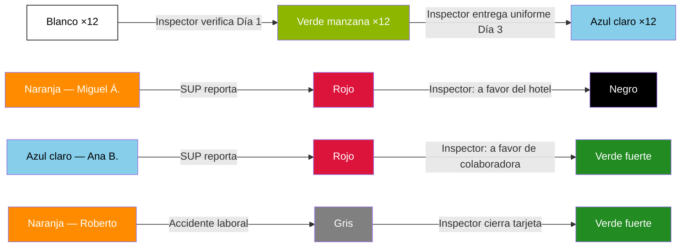

# Simulación completa — Punto de vista de Inspección

> [!abstract] Propósito
> Esta simulación narra una semana operativa completa desde la perspectiva del [[Inspector]], el rol de campo del departamento de [[Inspección/Inspección|Inspección]]. Recorre todas las responsabilidades del Inspector: verificación de llegada en Día 1, entrega de uniforme en Día 3, investigación de reportes con dos desenlaces opuestos (Blacklist y reincorporación), gestión completa de un accidente laboral, uso del Indicador de Lunch Extendido, y la cobertura por indisponibilidad gestionada por el [[Inspección/Coordinador|Coordinador]]. El ciclo se cierra con la supervisión de calidad (QA) y la medición de los 5 KPIs del departamento. Todos los datos son ficticios, pero cada acción, transición y regla respeta fielmente la documentación del vault.

## Personajes de la simulación

| Personaje | Rol | Departamento |
|---|---|---|
| Daniel Ortega | [[Inspector]] (zona Noroeste) | Inspección — Oranje |
| Raúl Méndez | [[Inspección/Coordinador\|Coordinador]] | Inspección — Oranje |
| Operador 1 | [[Operador de QA]] (asignado fijo a Inspección) | QA — Oranje |
| Laura Ibarra | [[Inspector]] (zona Sur) — cobertura temporal | Inspección — Oranje |
| Mariana Vega | [[Supervisor]] | Hotel Costa Esmeralda |
| Carlos Navarro | [[Manager General]] | Hotel Costa Esmeralda |
| Gabriel Herrera | [[Manager de Área]] | Hotel Sierra del Pacífico |
| Teresa Campos | [[Supervisor]] | Hotel Sierra del Pacífico |
| Ana Belén Herrera | Colaboradora ([[Posiciones\|Housekeeper]]) | Asignada a Hotel Costa Esmeralda |
| Sofía Cruz | Colaboradora ([[Posiciones\|Housekeeper]]) | Asignada a Hotel Costa Esmeralda |
| Miguel Ángel Paredes | Colaborador ([[Posiciones\|Houseman]]) | Asignado a Hotel Sierra del Pacífico |
| Roberto Lara | Colaborador ([[Posiciones\|Houseman]]) | Asignado a Hotel Sierra del Pacífico |
| + 10 colaboradores | Varios (HK, HM, LN) | Asignados a Hotel Costa Esmeralda |

---

## Fase 1 — Asignación y contexto

> Referencia: [[Reglas de Inspección]] · [[Zonas]] · [[Semáforo Onboarding]]

### 1.1 — El Inspector de zona Noroeste

Es lunes 21 de julio de 2026, 6:00 AM. Daniel Ortega, [[Inspector]] asignado permanentemente a la zona [[Zonas|Noroeste]] por el [[Inspección/Coordinador|Coordinador]] Raúl Méndez, revisa su agenda para la semana. Tiene dos hoteles activos en su zona:

| Hotel | Status Onboarding | Situación |
|---|---|---|
| Hotel Costa Esmeralda | **Naranja** (desde 11 jul) | Nuevo cliente. Primera semana operativa comienza hoy |
| Hotel Sierra del Pacífico | **Naranja** (veterano) | Hotel activo con colaboradores en status Naranja (Fijo) |

El Hotel Costa Esmeralda fue convertido a cliente activo el 11 de julio. Su primera [[Requisición]] (202607141015A3) fue autorizada el 14 de julio con 13 posiciones: 8 [[Posiciones|Housekeeper]], 3 [[Posiciones|Houseman]] y 2 [[Posiciones|Laundry]], todas con fecha de inicio hoy. Al autorizarse la requisición, Daniel fue asignado automáticamente en la cabecera según la zona del hotel.

> [!info] Semáforo Onboarding
> Hotel Costa Esmeralda en **Naranja** — Acuerdo firmado, hotel cliente activo
> **Fecha:** 2026-07-11 · **Responsable operativo:** Daniel Ortega (Inspector)

> [!warning] Regla de negocio
> Al autorizarse una requisición, el [[Inspector]] se asigna automáticamente en la cabecera según la [[Zonas|zona]] del hotel. — [[Reglas de Inspección]]

> [!warning] Regla de negocio
> **Naranja es el único status del [[Semáforo Onboarding]] que habilita al hotel para generar [[Requisición|requisiciones]].** Antes de este status, el hotel es un prospecto comercial sin acceso operativo. — [[Reglas de Inspección]]

---

## Fase 2 — Verificación de llegada Día 1

> Referencia: [[Reglas de Inspección]] · [[Semáforo del Colaborador]]

### 2.1 — Daniel se presenta en la propiedad

Lunes 21 de julio, 6:45 AM. Daniel se presenta en el Hotel Costa Esmeralda. Los 13 colaboradores asignados por la [[Reclutadora]] deben presentarse entre las 6:30 y las 7:00 para iniciar su primer día. Daniel se posiciona en el punto de entrada del personal para verificar cada llegada: confirma identidad, registra hora de arribo y valida que el colaborador se presente en la ubicación correcta.

### 2.2 — Resultado de la verificación

| # | Colaborador | Posición | Hora de llegada | Resultado |
|---|---|---|---|---|
| 1 | Ana Belén Herrera | Housekeeper | 06:38 | Verificada |
| 2 | Sofía Cruz | Housekeeper | 06:42 | Verificada |
| 3 | Patricia Solís | Housekeeper | 06:35 | Verificada |
| 4 | Diana Robles | Housekeeper | 06:50 | Verificada |
| 5 | Lucía Márquez | Housekeeper | 06:44 | Verificada |
| 6 | Carmen Delgado | Housekeeper | 06:47 | Verificada |
| 7 | Verónica Estrada | Housekeeper | 06:55 | Verificada |
| 8 | Gabriela Pineda | Housekeeper | 06:40 | Verificada |
| 9 | Fernando Ríos | Houseman | 06:36 | Verificado |
| 10 | Héctor Sandoval | Houseman | 06:48 | Verificado |
| 11 | Tomás Aguirre | Houseman | 06:52 | Verificado |
| 12 | Adriana López | Laundry | 06:30 | Verificada |
| 13 | Ernesto Solís | Laundry | — | **No se presentó** |

12 de 13 colaboradores se presentan. Ernesto Solís no aparece. Daniel registra la inasistencia.

> [!info] Semáforo del Colaborador
> **Blanco** → **Verde manzana** — Día 1 verificado (×12 colaboradores)
> **Fecha:** 2026-07-21 · **Responsable:** Daniel Ortega (Inspector) · **Comentario:** "12 de 13 colaboradores verificados en sitio. Ernesto Solís no se presentó."

> [!warning] Regla de negocio
> `Blanco → Verde manzana`: al ser asignado y asistir el Día 1. El [[Inspector]] verifica su llegada en sitio en la propiedad. — [[Semáforo del Colaborador]]

> [!warning] Regla de negocio
> Ernesto Solís permanece en **Blanco**. Si acumula 3 inasistencias, el sistema lo mueve automáticamente a **Negro** (Blacklist). La ruta de 3 inasistencias es automática y **no** pasa por Rojo ni por el Inspector. — [[Reglas de Inspección]] · [[Blacklist]]

> [!tip] QA — Operador 1 observa
> Tasa de verificación Día 1: 12/13 = **92.3%**. Meta: ≥ 95%. Estado: **En riesgo** (85–94%). El Operador 1 registra que el incumplimiento no es atribuible al Inspector (el colaborador simplemente no se presentó), pero la métrica se contabiliza. — [[Métricas y KPIs por Departamento#Inspección|KPI 1]]

---

## Fase 3 — Entrega de uniforme Día 3

> Referencia: [[Reglas de Inspección]] · [[Semáforo del Colaborador]] · [[Deducciones]]

### 3.1 — Tercer día de operación

Miércoles 23 de julio. Los 12 colaboradores que iniciaron el lunes han ponchado 3 días consecutivos. Daniel se presenta en el Hotel Costa Esmeralda con los uniformes preparados.

### 3.2 — Entrega de uniformes

Daniel entrega personalmente el uniforme a cada uno de los 12 colaboradores, verificando que la talla sea correcta y que el colaborador firme el acuse de recepción. Al completar la entrega y registrar el ponche del tercer día, el sistema ejecuta la transición.

> [!info] Semáforo del Colaborador
> **Verde manzana** → **Azul claro** — Día 3, uniforme entregado (×12 colaboradores)
> **Fecha:** 2026-07-23 · **Responsable:** Daniel Ortega (Inspector) · **Comentario:** "Uniformes entregados a 12 colaboradores. Todos poncharon 3 días consecutivos."

> [!warning] Regla de negocio
> `Verde manzana → Azul claro`: cuando el colaborador poncha en la propiedad al tercer día. El [[Inspector]] le entrega su uniforme. — [[Semáforo del Colaborador]]

> [!tip] Acciones automáticas del sistema
> Se genera una [[Deducciones|deducción]] de **$15 USD** por uniforme para cada uno de los 12 colaboradores. Total: $180 USD en deducciones de uniforme.

> [!tip] QA — Operador 1 observa
> Tasa de entrega de uniforme Día 3: 12/12 = **100%**. Meta: ≥ 95%. Estado: **En meta**. — [[Métricas y KPIs por Departamento#Inspección|KPI 2]]

---

## Fase 4 — Reporte del hotel (Rojo → Negro)

> Referencia: [[Reglas de Inspección]] · [[Semáforo del Colaborador]] · [[Blacklist]]

### 4.1 — El Supervisor reporta a un colaborador

Jueves 24 de julio, 9:20 AM. Teresa Campos, [[Supervisor]] del Hotel Sierra del Pacífico, reporta a **Miguel Ángel Paredes** (Houseman, status **Naranja** — Fijo) por comportamiento inadecuado con un huésped durante el servicio de limpieza de la mañana.

Miguel Ángel transita a **Rojo** (Reportado).

> [!info] Semáforo del Colaborador
> **Naranja** → **Rojo** — Reportado por el hotel
> **Fecha:** 2026-07-24 09:20 · **Responsable:** Teresa Campos (Supervisor) · **Comentario:** "Comportamiento inadecuado con huésped en área de habitaciones."

> [!warning] Regla de negocio
> El estado **Rojo** puede ser activado por: [[Manager General]], [[Manager de Área]] o [[Supervisor]]. Al activarse, el [[Inspector]] de la zona investiga el caso. — [[Semáforo del Colaborador]]

### 4.2 — Daniel investiga

Daniel recibe la notificación y se desplaza al Hotel Sierra del Pacífico. Ejecuta su proceso de investigación:

| Paso | Acción | Resultado |
|---|---|---|
| 1 | Entrevista a Teresa Campos (SUP) | Describe el incidente: Miguel Ángel respondió de forma grosera a un huésped que solicitó toallas adicionales |
| 2 | Revisa [[Timesheet]] de Miguel Ángel | Ponches del día correctos. Sin anomalías en registros |
| 3 | Entrevista a testigo (otro colaborador presente) | Confirma la versión del Supervisor: el colaborador levantó la voz frente al huésped |
| 4 | Entrevista a Miguel Ángel Paredes | Reconoce que perdió la compostura pero alega que fue provocado. No presenta justificación válida |

### 4.3 — Resolución: a favor del hotel

La evidencia es clara. Dos testimonios independientes (Supervisor y testigo) confirman el incidente. Miguel Ángel reconoció parcialmente los hechos. Daniel evalúa el caso y decide: **disputa a favor del hotel**.

Daniel ejecuta la transición a Negro (Blacklist manual).

> [!info] Semáforo del Colaborador
> **Rojo** → **Negro** — Blacklist (disputa a favor del hotel)
> **Fecha:** 2026-07-24 14:30 · **Responsable:** Daniel Ortega (Inspector) · **Comentario:** "Investigación completada. Comportamiento inadecuado confirmado por SUP y testigo. Disputa resuelta a favor del hotel."

> [!warning] Regla de negocio — Autoridad autónoma
> El [[Inspector]] tiene **autoridad propia** para decidir el resultado de la investigación, sin necesidad de escalamiento ni validación de ningún otro rol. — [[Reglas de Inspección]]

> [!warning] Regla de negocio — Blacklist manual
> El [[Inspector]] es el **único rol** que puede ejecutar la entrada manual a [[Blacklist]]. — [[Reglas de Inspección]]

> [!warning] Regla de negocio — Permanencia
> **Negro es PERMANENTE.** No existe proceso de rehabilitación ni apelación. Miguel Ángel Paredes queda vetado permanentemente del sistema. — [[Blacklist]]

> [!tip] QA — Operador 1 observa
> Tiempo de resolución del reporte: **mismo día** (9:20 → 14:30 = ~5 horas). Meta: ≤ 3 días. Estado: **En meta**. — [[Métricas y KPIs por Departamento#Inspección|KPI 3]]

---

## Fase 5 — Segundo reporte (Rojo → Verde fuerte)

> Referencia: [[Reglas de Inspección]] · [[Semáforo del Colaborador]]

### 5.1 — Reporte por supuesta inasistencia

Viernes 25 de julio, 8:00 AM. Mariana Vega, [[Supervisor]] del Hotel Costa Esmeralda, reporta a **Ana Belén Herrera** (Housekeeper, status **Azul claro** — Día 5) por supuesta inasistencia del día anterior (jueves 24). Mariana indica que Ana Belén no apareció en la lista visual de personal que revisó esa mañana.

Ana Belén transita a **Rojo** (Reportada).

> [!info] Semáforo del Colaborador
> **Azul claro** → **Rojo** — Reportada por el hotel
> **Fecha:** 2026-07-25 08:00 · **Responsable:** Mariana Vega (Supervisor) · **Comentario:** "Colaboradora no apareció en la lista de personal del jueves 24."

### 5.2 — Daniel investiga

Daniel se encuentra en la zona y acude al Hotel Costa Esmeralda. Ejecuta su investigación:

| Paso | Acción | Resultado |
|---|---|---|
| 1 | Entrevista a Mariana Vega (SUP) | Afirma que no vio a Ana Belén el jueves 24 al pasar lista visual |
| 2 | Revisa [[Timesheet]] de Ana Belén | **Descubre que sí hay ponches registrados** para el jueves 24: entrada 06:42, lunch-out 11:45, lunch-in 12:10, salida 15:02. Jornada completa |
| 3 | Verifica con el [[Schedule]] | Ana Belén estaba programada y cubierta para el jueves 24 |
| 4 | Entrevista a Ana Belén Herrera | Confirma que trabajó normalmente. Estaba asignada a un piso diferente al que el Supervisor revisó |

### 5.3 — Resolución: a favor de la colaboradora

El [[Timesheet]] demuestra que Ana Belén trabajó su jornada completa el jueves 24. El reporte fue producto de un error administrativo: el Supervisor revisó la lista de personal de un piso diferente al que Ana Belén tenía asignado ese día. Daniel decide: **disputa a favor de la colaboradora**.

Daniel ejecuta la transición de Rojo a Verde fuerte (reincorporación).

> [!info] Semáforo del Colaborador
> **Rojo** → **Verde fuerte** — Reincorporación (disputa a favor de la colaboradora)
> **Fecha:** 2026-07-25 11:00 · **Responsable:** Daniel Ortega (Inspector) · **Comentario:** "Timesheet confirma jornada completa el 24 jul. Error administrativo del Supervisor al verificar lista de personal. Colaboradora reincorporada."

> [!warning] Regla de negocio — Autoridad autónoma
> El [[Inspector]] tiene **autoridad propia** para decidir el resultado. En este caso, la evidencia del [[Timesheet]] es concluyente a favor de la colaboradora. — [[Reglas de Inspección]]

> [!warning] Regla de negocio — Rojo vs. 3 inasistencias
> La acumulación de 3 inasistencias **no** pasa por Rojo ni por el Inspector; esa ruta va directo a **Negro** de forma automática por sistema. Los reportes del hotel (Rojo) son un camino diferente que siempre requiere investigación del Inspector. — [[Reglas de Inspección]]

> [!tip] QA — Operador 1 observa
> Segundo reporte resuelto en **mismo día** (8:00 → 11:00 = 3 horas). Tiempo promedio acumulado de resolución: (~5h + ~3h) / 2 = **~4 horas**. Meta: ≤ 3 días. Estado: **En meta**. — [[Métricas y KPIs por Departamento#Inspección|KPI 3]]

---

## Fase 6 — Accidente Laboral

> Referencia: [[Flujo de Accidente Laboral]] · [[Accidente Laboral]] · [[Reglas de Inspección]] · [[Semáforo del Colaborador]]

### 6.1 — El accidente (Escenario A)

Sábado 26 de julio, 10:15 AM. **Roberto Lara** (Houseman, status **Naranja** — Fijo), asignado al Hotel Sierra del Pacífico, sufre una caída mientras mueve equipo de limpieza pesado en el área de lavandería. El piso estaba mojado y desnivelado.

Roberto abre la app desde su teléfono y genera un reporte de accidente (**Escenario A**: el colaborador reporta desde la app).

> [!tip] Acciones automáticas del sistema — [[Flujo de Accidente Laboral]]
> 1. Se genera la **tarjeta de Accidente Laboral** con número automático
> 2. Roberto transita a **Gris** (Accidentado)
> 3. La señal llega **simultáneamente** a Teresa Campos (Supervisor) y a Daniel Ortega (Inspector zona Noroeste)

> [!info] Semáforo del Colaborador
> **Naranja** → **Gris** — Accidentado
> **Fecha:** 2026-07-26 10:15 · **Responsable:** Roberto Lara (reporte del colaborador) · **Comentario:** "Caída en área de lavandería. Piso mojado."

### 6.2 — Captura presencial del Supervisor

Teresa Campos acude al lugar del accidente y captura la información presencial en la tarjeta:

| Campo (SUP) | Valor |
|---|---|
| Ubicación exacta | Área de lavandería, zona de carga |
| Circunstancias | Caída al mover equipo pesado, piso mojado y desnivelado |
| Testigos | Otro colaborador presente en el área |
| Atención inmediata | Hielo aplicado, inmovilización de muñeca derecha |

### 6.3 — Seguimiento médico del Inspector

Daniel recibe la notificación a las 10:20 AM y se desplaza al Hotel Sierra del Pacífico. Evalúa la situación con Teresa y decide trasladar a Roberto al centro médico más cercano. Daniel complementa la tarjeta de accidente con la información médica:

| Campo (Inspector) | Valor |
|---|---|
| Traslado al centro médico | Centro Médico Noroeste, llegada 11:30 AM |
| Diagnóstico | Fractura leve de muñeca derecha |
| Días de incapacidad | 5 días (del 26 al 30 de julio) |
| Observaciones médicas | Férula colocada. Reposo absoluto. Revisión de seguimiento programada para el 31 de julio |

### 6.4 — Protección durante estado Gris

Domingo 27 de julio. Roberto obviamente no se presenta a trabajar. Esta inasistencia **no cuenta** para la regla de 3 inasistencias → Blacklist, porque Roberto está protegido en estado **Gris**.

> [!warning] Regla de negocio — Protección en Gris
> Mientras el colaborador está en estado **Gris** (Accidentado), las inasistencias **no cuentan** para la regla de 3 inasistencias → Negro. El Inspector gestiona la salida de ese estado al cerrar la tarjeta. — [[Semáforo del Colaborador]] · [[Reglas de Inspección]]

### 6.5 — Cierre de tarjeta y alta

Jueves 31 de julio. Roberto acude a su revisión médica de seguimiento. El médico confirma evolución favorable y otorga el **alta médica**. Daniel recibe la documentación, verifica que la información esté completa y **cierra la tarjeta de accidente** en el sistema.

> [!info] Semáforo del Colaborador
> **Gris** → **Verde fuerte** — Alta médica, tarjeta de accidente cerrada
> **Fecha:** 2026-07-31 · **Responsable:** Daniel Ortega (Inspector) · **Comentario:** "Alta médica confirmada. Tarjeta cerrada. Colaborador disponible para reasignación."

Roberto queda en status **Verde fuerte** (Disponible) en el [[Pool de Colaboradores]], listo para ser reasignado a una nueva posición.

> [!warning] Regla de negocio — Responsable final del cierre
> El [[Inspector]] es **siempre** el responsable final del cierre de la tarjeta de accidente. Esto es una regla sin excepción documentada. — [[Reglas de Inspección]] · [[Flujo de Accidente Laboral]]

> [!warning] Regla de negocio — Requisitos para cerrar Gris
> `Gris → Verde fuerte` requiere: **alta médica** + **cierre de tarjeta por el Inspector**. Ambas condiciones son obligatorias. — [[Semáforo del Colaborador]]

> [!tip] QA — Operador 1 observa
> Tiempo de cierre del accidente: **5 días** (26 jul → 31 jul). Meta: ≤ 7 días. Estado: **En meta**. — [[Métricas y KPIs por Departamento#Inspección|KPI 4]]

---

## Fase 7 — Indicador de Lunch Extendido

> Referencia: [[Timesheet]] · [[Reglas de Inspección]]

### 7.1 — Revisión rutinaria de Timesheets

Viernes 25 de julio, 4:00 PM. Como parte de su supervisión rutinaria, Daniel revisa los [[Timesheet|Timesheets]] de sus hoteles. En el Hotel Costa Esmeralda, detecta que **Sofía Cruz** (Housekeeper, status Azul claro) ha tenido lunch extendido en 3 de los 5 días de la semana:

| Día | Lunch-out | Lunch-in | Tiempo de lunch | Indicador |
|---|---|---|---|---|
| Lunes 21 | 11:30 | 12:05 | 35 min | Extendido |
| Martes 22 | 11:45 | 12:27 | 42 min | Extendido |
| Miércoles 23 | 12:00 | 12:30 | 30 min | Normal |
| Jueves 24 | 11:50 | 12:28 | 38 min | Extendido |
| Viernes 25 | 12:00 | 12:30 | 30 min | Normal |

El Indicador de Lunch Extendido se activa automáticamente cuando el tiempo de lunch excede los 30 minutos. Sofía tiene el indicador activo en 3 de 5 jornadas.

### 7.2 — Acción del Inspector

Daniel toma nota para seguimiento preventivo. En su próxima visita al hotel, podría conversar con Sofía sobre la gestión de sus tiempos de lunch. No es una acción disciplinaria; el indicador es una herramienta de supervisión interna de Oranje.

> [!warning] Regla de negocio — Visibilidad restringida
> El Indicador de Lunch Extendido es visible **solo** para: [[Inspector]], [[Inspección/Coordinador|Coordinador]] y [[Manager de Reclutamiento]]. **No es visible** para [[Manager General]], [[Manager de Área]] ni [[Supervisor]] del hotel. — [[Reglas de Inspección]] · [[Timesheet]]

> [!warning] Regla de negocio — No punitivo
> El Indicador de Lunch Extendido **no es punitivo de forma automática**. Es una herramienta de supervisión interna de Oranje. — [[Reglas de Inspección]]

> [!warning] Regla de negocio — Deducción de lunch
> Lunch ≥ 30 min: se deduce el tiempo real tomado. Lunch < 30 min: se deducen 30 min (mínimo obligatorio). Sin ponche de lunch: auto-deducción de 30 min. — [[Timesheet]]

---

## Fase 8 — Indisponibilidad y reasignación

> Referencia: [[Reglas de Inspección]] · [[Inspección/Coordinador|Coordinador]] · [[Zonas]]

### 8.1 — El Inspector se ausenta

Lunes 28 de julio, 7:00 AM. Daniel Ortega notifica al [[Inspección/Coordinador|Coordinador]] Raúl Méndez que tiene una emergencia personal y no podrá presentarse a trabajar hoy.

### 8.2 — El Coordinador reasigna

Raúl Méndez evalúa la situación de cobertura. La zona Noroeste no puede quedarse sin Inspector, especialmente con dos hoteles activos en plena operación. Decide reasignar temporalmente a **Laura Ibarra**, [[Inspector]] de zona Sur, para cubrir la zona Noroeste durante la ausencia de Daniel.

Laura se presenta en los hoteles de la zona Noroeste. No ocurren incidencias mayores durante el día — realiza una visita rutinaria de supervisión al Hotel Costa Esmeralda y al Hotel Sierra del Pacífico.

### 8.3 — Regreso del Inspector titular

Martes 29 de julio. Daniel regresa a su operación normal. La asignación permanente de Daniel a zona Noroeste **no cambió** durante su ausencia. Laura Ibarra regresa a su zona Sur. Raúl Méndez registra la reasignación temporal en el sistema.

> [!warning] Regla de negocio — Reasignación temporal
> Si el [[Inspector]] asignado a una zona no está disponible (enfermedad, emergencia u otra causa), el [[Inspección/Coordinador|Coordinador]] reasigna temporalmente otro Inspector para garantizar cobertura operativa. — [[Reglas de Inspección]]

> [!warning] Regla de negocio — Asignación permanente intacta
> La reasignación temporal **no modifica** la asignación permanente de zona. Es cobertura hasta que el Inspector titular retome. — [[Reglas de Inspección]]

> [!tip] QA — Operador 1 observa
> Cobertura de zonas durante la ausencia: **6/6** (Laura cubrió Noroeste). Meta: 6/6 (100%). Estado: **En meta**. Si no se hubiera cubierto la zona: 5/6 = 83% → **En riesgo**. — [[Métricas y KPIs por Departamento#Inspección|KPI 5]]

---

## Fase 9 — Supervisión QA: cierre del ciclo

> Referencia: [[Métricas y KPIs por Departamento#Inspección|Métricas de Inspección]] · [[Indicador de Calidad]] · [[Reglas de QA]]

El [[Operador de QA]] (Operador 1), asignado de forma fija al departamento de [[Inspección/Inspección|Inspección]], ha observado todo el ciclo sin ejecutar ninguna acción operativa. Su rol es exclusivamente de observación, medición y retroalimentación.

### Resumen de KPIs medidos (semana del 21–31 julio 2026)

| # | KPI | Resultado en esta simulación | Meta | Estado |
|---|---|---|---|---|
| 1 | **Tasa de verificación Día 1** | 12/13 = 92.3% | ≥ 95% | ⚠ En riesgo (85–94%) |
| 2 | **Tasa de entrega de uniforme Día 3** | 12/12 = 100% | ≥ 95% | En meta |
| 3 | **Tiempo promedio de resolución de reportes (Rojo)** | (~5h + ~3h) / 2 = ~4 horas | ≤ 3 días | En meta |
| 4 | **Tiempo promedio de cierre de accidente (Gris → Verde fuerte)** | 5 días (26 jul → 31 jul) | ≤ 7 días | En meta |
| 5 | **Cobertura de zonas (6 zonas con Inspector activo)** | 6/6 = 100% (reasignación temporal cubrió la ausencia) | 6/6 (100%) | En meta |

### Observación formal del Operador 1

El KPI 1 (Tasa de verificación Día 1) está **en riesgo**. Un colaborador no se presentó el Día 1 y la verificación no pudo completarse al 100%. Aunque la inasistencia no es atribuible al Inspector (el colaborador simplemente no llegó), la métrica se contabiliza. Si el patrón se repite en las próximas semanas, el Operador 1 emitirá una observación formal al departamento.

El [[Indicador de Calidad]] del departamento de Inspección se mantiene en **Verde** (Calidad óptima). Un solo KPI en riesgo no justifica transición a Amarillo.

> [!warning] Regla de negocio
> QA no ejecuta la operación de Inspección; solo observa, mide y retroalimenta. Si el [[Indicador de Calidad]] del departamento alcanza **Rojo** sin mejora tras notificación, el [[Manager de QA]] escala a dirección. — [[Reglas de QA]]

---

## Resumen de transiciones del Semáforo del Colaborador

| Fecha | Colaborador(es) | Transición | Acción | Responsable |
|---|---|---|---|---|
| 21 jul 2026 | 12 colaboradores nuevos | Blanco → **Verde manzana** | Verificación de llegada Día 1 | Daniel Ortega (Inspector) |
| 23 jul 2026 | 12 colaboradores | Verde manzana → **Azul claro** | Entrega de uniforme Día 3 | Daniel Ortega (Inspector) |
| 24 jul 2026 | Miguel Ángel Paredes | Naranja → **Rojo** | Reporte del Supervisor | Teresa Campos (SUP) |
| 24 jul 2026 | Miguel Ángel Paredes | Rojo → **Negro** | Disputa a favor del hotel (Blacklist manual) | Daniel Ortega (Inspector) |
| 25 jul 2026 | Ana Belén Herrera | Azul claro → **Rojo** | Reporte del Supervisor | Mariana Vega (SUP) |
| 25 jul 2026 | Ana Belén Herrera | Rojo → **Verde fuerte** | Disputa a favor de la colaboradora | Daniel Ortega (Inspector) |
| 26 jul 2026 | Roberto Lara | Naranja → **Gris** | Accidente laboral (Escenario A) | Roberto Lara (colaborador) |
| 31 jul 2026 | Roberto Lara | Gris → **Verde fuerte** | Alta médica + cierre de tarjeta | Daniel Ortega (Inspector) |

---

## Módulos y conceptos referenciados

| Módulo | Referencia |
|---|---|
| Inspección | [[Inspección/Inspección\|Inspección]] · [[Reglas de Inspección]] |
| Roles de Inspección | [[Inspector]] · [[Inspección/Coordinador\|Coordinador]] |
| Semáforo del Colaborador | [[Semáforo del Colaborador]] |
| Accidente Laboral | [[Accidente Laboral]] · [[Flujo de Accidente Laboral]] |
| Blacklist | [[Blacklist]] |
| Operación diaria | [[Timesheet]] · [[Schedule]] |
| Requisiciones | [[Requisición]] · [[Flujo de Requisición]] |
| Hotel | [[Hotel/Hotel\|Hotel]] · [[Reglas del Hotel]] |
| Roles del hotel | [[Manager General]] · [[Manager de Área]] · [[Supervisor]] |
| Calidad | [[Operador de QA]] · [[Manager de QA]] · [[Indicador de Calidad]] · [[Métricas y KPIs por Departamento]] · [[Reglas de QA]] |
| Onboarding | [[Semáforo Onboarding]] |
| Catálogos | [[Zonas]] · [[Posiciones]] |
| Pool y reclutamiento | [[Pool de Colaboradores]] · [[Reclutadora]] · [[Manager de Reclutamiento]] |
| Contabilidad | [[Deducciones]] |
| Reglas generales | [[Reglas de Negocio]] · [[Reglas del Colaborador]] |
| Ventas (continuidad) | [[Business Developer]] · [[Business Developer Coordinator]] |

---

## Simulaciones relacionadas

- [[Simulación - Punto de Vista de Ventas]] — Narra cómo el Hotel Costa Esmeralda llegó a ser cliente activo, con los mismos personajes (Daniel Ortega, Mariana Vega, Carlos Navarro) desde la perspectiva comercial.
- [[Simulación - Punto de Vista del Hotel]] — Muestra el ciclo completo del hotel incluyendo la operación diaria que el Inspector supervisa.
- [[Simulación - Punto de Vista de Reclutamiento]] — Detalla el proceso de asignación de colaboradores que el Inspector luego verifica en Día 1 y Día 3.
- [[Simulación - Ciclo de Vida del Colaborador]] — Recorre los estados del colaborador que el Inspector monitorea: reportes, accidentes, Blacklist y reincorporación.
