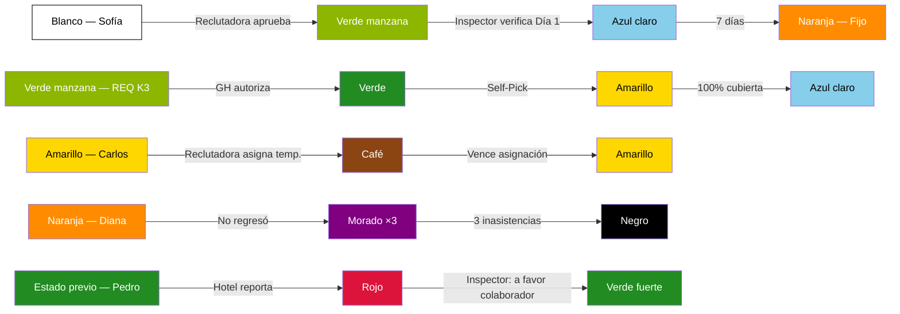

# Simulación completa — Punto de vista de Reclutamiento

> [!abstract] Propósito
> Esta simulación narra una semana operativa completa desde la perspectiva del departamento de [[Reclutamiento/Reclutamiento|Reclutamiento]]. Recorre todas las responsabilidades del equipo: captación de candidatos, consulta de Blacklist, self-pick de requisiciones, asignación al Pool, progresión del colaborador, cobertura parcial con escalación por timeout, auto-asignación por sistema, asignación temporal (Café), gestión de incidencias (inasistencias y reportes), y entrada al sistema de pago. El ciclo se cierra con la supervisión de calidad (QA) y la medición de los KPIs del departamento. Todos los datos son ficticios, pero cada acción, transición y regla respeta fielmente la documentación del vault.

## Personajes de la simulación

| Personaje            | Rol                                                                  | Departamento                     |
| -------------------- | -------------------------------------------------------------------- | -------------------------------- |
| Daniela Ríos         | [[Reclutamiento/Reclutadora\|Reclutadora]]                           | Reclutamiento — Oranje (Grupo A) |
| Valeria Soto         | [[Reclutamiento/Reclutadora\|Reclutadora]]                           | Reclutamiento — Oranje (Grupo A) |
| Lucía Méndez         | [[Reclutamiento/Líder de Grupo de Reclutadoras\|Líder de Grupo]]     | Reclutamiento — Oranje (Grupo A) |
| Fernando Ortiz       | [[Reclutamiento/Manager de Reclutamiento\|Manager de Reclutamiento]] | Reclutamiento — Oranje           |
| Operador 5           | [[Operador de QA]] (asignado fijo a Reclutamiento)                   | QA — Oranje                      |
| Marco Duarte         | [[Hotel/Supervisor\|Supervisor]]                                     | Hotel Coral Bay · Zona Sur       |
| Andrea Fuentes       | [[Hotel/Manager de Área\|Manager de Área]]                           | Hotel Coral Bay · Zona Sur       |
| Roberto Lara         | [[Hotel/Manager General\|Manager General]]                           | Hotel Coral Bay · Zona Sur       |
| Patricia Nava        | [[Hotel/Supervisor\|Supervisor]]                                     | Hotel Sierra Alta · Zona Centro  |
| Carmen López         | [[Hotel/Manager de Área\|Manager de Área]]                           | Hotel Sierra Alta · Zona Centro  |
| Javier Torres        | [[Inspección/Inspector\|Inspector]]                                  | Zona Sur                         |
| Elena Rojas          | [[Inspección/Inspector\|Inspector]]                                  | Zona Centro                      |
| Sofía Cruz           | Candidata nueva                                                      | —                                |
| Miguel Ángel Paredes | Candidato nuevo                                                      | —                                |
| Luis Gerardo Vega    | Candidato en [[Core/Módulos/Blacklist\|Blacklist]]                   | —                                |
| Ana Belén Herrera    | Colaboradora existente (Verde fuerte)                                | Zona Sur                         |
| Carlos Rivera        | Colaborador existente (Amarillo)                                     | Zona Centro                      |
| Diana Morales        | Colaboradora existente (Naranja, fija)                               | Zona Sur                         |
| Pedro Jiménez        | Colaborador existente (incidencia posterior)                         | Zona Sur                         |

---

## Estado inicial del sistema — Lunes 19 de mayo, 08:00

> [!info] Convenciones de la simulación
> - Los nombres de personas y hoteles son ficticios.
> - Las fechas están basadas en la semana del **lunes 19 de mayo al domingo 25 de mayo de 2026**.
> - Los números de requisición siguen el formato documentado en [[Core/Módulos/Requisicion/Flujo de Requisición|Flujo de Requisición]].
> - Cada transición de semáforo cita la regla correspondiente.

### Pool de Colaboradores

| Estado en [[Core/Módulos/Semáforos/Semáforo del Colaborador\|Semáforo del Colaborador]] | Cantidad | Ejemplo                    |
| --------------------------------------------------------------------------------------- | -------- | -------------------------- |
| Blanco (Pre-asignación)                                                                 | 0        | —                          |
| Verde fuerte (Disponible)                                                               | 12       | Ana Belén Herrera + 11 más |
| Amarillo (Disponible voluntario)                                                        | 3        | Carlos Rivera + 2 más      |
| Naranja (Fijo)                                                                          | 8        | Diana Morales + 7 más      |
| Rosa (Stand-by)                                                                         | 2        | —                          |
| Café (Asignación temporal)                                                              | 1        | —                          |

### KPIs de la semana anterior

Todos dentro de meta según [[QA/Métricas y KPIs por Departamento|Métricas y KPIs por Departamento]].

| KPI                              | Meta  | Resultado semana anterior |
| -------------------------------- | ----- | ------------------------- |
| Cobertura total de requisiciones | ≥ 85% | 90%                       |
| Tiempo promedio de toma          | ≤ 8h  | 4h                        |
| Tasa de auto-asignación          | ≤ 5%  | 0%                        |
| Tasa de escalación               | ≤ 10% | 5%                        |
| Consulta de Blacklist            | 100%  | 100%                      |
| Tasa de ingreso al Pool          | ≥ 60% | 75%                       |

### Bandeja de requisiciones

Vacía. No hay requisiciones pendientes al inicio de la semana.

---

## Fase 1 — Reclutamiento continuo (caso feliz)

> Referencia: [[Reclutamiento/Flujo de Reclutamiento|Flujo de Reclutamiento]] · [[Reclutamiento/Reglas de Reclutamiento|Reglas de Reclutamiento]] · [[Core/Módulos/Blacklist|Blacklist]]

**Protagonistas:** Daniela Ríos (Reclutadora) y Sofía Cruz (candidata nueva).

El [[Reclutamiento/Flujo de Reclutamiento|Flujo de Reclutamiento]] es continuo: siempre está activo, haya o no requisiciones abiertas.

### 1.1 — Lunes 19 mayo, 09:00 — Entrevista inicial (Fase 1 del flujo)

Daniela recibe a Sofía Cruz como candidata. Antes de iniciar cualquier proceso:

1. Daniela **consulta la [[Core/Módulos/Blacklist|Blacklist]]** → Sofía **no aparece** (resultado negativo). - ESTO LO HACE AUTOMATICAMENTE DESPUES DE LA FASE 1 (ENTREVISTA) EN EL SISTEMA

> [!warning] Regla de negocio
> [[Reclutamiento/Reglas de Reclutamiento|Reglas de Reclutamiento]] — "La Reclutadora debe consultar la Blacklist antes de reclutar a cualquier candidato."

2. Daniela procede con la entrevista inicial y captura los datos de la Fase 1:

| Campo           | Valor              |
| --------------- | ------------------ |
| Nombre completo | Sofía Cruz Mendoza |
| Edad            | 24 años            |
| Género          | Femenino           |
| Domicilio       | Zona Sur           |
| Teléfono        | (555) 012-3456     |

> [!warning] Regla de negocio
> [[Reclutamiento/Flujo de Reclutamiento|Flujo de Reclutamiento]] — Fase 1: Entrevista inicial. Responsable: Reclutadora.

### 1.2 — Lunes 19 mayo, 09:30 — Alta en la app (Fase 2 del flujo)

Sofía descarga la app y completa sus datos:

| Campo                | Valor           | Catálogo                                                                    |
| -------------------- | --------------- | --------------------------------------------------------------------------- |
| SSN                  | XXX-XX-1234     | —                                                                           |
| ITIN                 | —               | —                                                                           |
| Posición             | Housekeeper     | [[Core/Catálogos/Posiciones\|Posiciones]]                                   |
| Nivel de inglés      | Intermedio      | [[Core/Catálogos/Niveles de Inglés\|Niveles de Inglés]]                     |
| Nivel de experiencia | 2 años          | —                                                                           |
| Tipo de transporte   | Auto propio     | —                                                                           |
| Modalidad            | Tiempo completo | [[Core/Catálogos/Modalidades de Contratación\|Modalidades de Contratación]] |

> [!warning] Regla de negocio
> [[Reclutamiento/Flujo de Reclutamiento|Flujo de Reclutamiento]] — Fase 2: Alta en la app. Responsable: el propio Colaborador.

### 1.3 — Lunes 19 mayo, 10:00 — Datos de emergencia (Fase 3 del flujo)

Sofía completa desde la app:

| Campo | Valor |
|---|---|
| Contacto de emergencia | María Cruz (madre), (555) 098-7654 |
| Tipo de sangre | O+ |
| Alergias o condiciones | Ninguna |

> [!warning] Regla de negocio
> [[Colaborador/Reglas del Colaborador|Reglas del Colaborador]] — Fase 3: Datos de emergencia. Responsable: el propio Colaborador desde la app.

### 1.4 — Lunes 19 mayo, 10:15 — Validación y aprobación (Fase 4 del flujo)

Daniela revisa toda la información capturada en las tres fases. Todo es correcto.

- Daniela **aprueba** a Sofía Cruz.
- Habilita el acceso de Sofía a los paneles del sistema.
- **Sofía Cruz ingresa al [[Core/Módulos/Pool de Colaboradores|Pool de Colaboradores]].**

> [!warning] Regla de negocio
> [[Reclutamiento/Flujo de Reclutamiento|Flujo de Reclutamiento]] — Fase 4: Validación, aprobación y habilitación. Responsable: Reclutadora.

> [!info] Semáforo del Colaborador
> **—** → **Blanco** — Aprobada e ingresa al Pool
> **Fecha:** 2026-05-19 · **Responsable:** Daniela Ríos (Reclutadora) · **Comentario:** "Sofía Cruz aprueba las 4 fases del Flujo de Reclutamiento. Blacklist negativa confirmada."

> [!warning] Regla de negocio
> [[Core/Módulos/Semáforos/Semáforo del Colaborador|Semáforo del Colaborador]] — "Al ser aprobado e ingresar al Pool, el colaborador entra en estado Blanco."

> [!tip] QA — Operador 5 observa
> Sofía Cruz ingresa al Pool. La consulta de Blacklist fue realizada antes de iniciar el proceso. Tasa de ingreso al Pool: en seguimiento. Meta: ≥ 60% (aprobados / entrevistados). — [[QA/Métricas y KPIs por Departamento|KPI: Tasa de ingreso al Pool]]

---

## Fase 2 — Candidato en Blacklist

> Referencia: [[Core/Módulos/Blacklist|Blacklist]] · [[Reclutamiento/Reglas de Reclutamiento|Reglas de Reclutamiento]]

**Protagonistas:** Daniela Ríos (Reclutadora) y Luis Gerardo Vega (candidato vetado).

### 2.1 — Lunes 19 mayo, 11:00 — Consulta de Blacklist (resultado positivo)

Luis Gerardo Vega se presenta como candidato. Daniela inicia el protocolo estándar:

1. **Consulta la [[Core/Módulos/Blacklist|Blacklist]]** → Luis Gerardo **aparece en estado Negro**. - ESTO LO HACE EL SISTEMA AUTOMATICO EN FASE 1
   - Motivo registrado: 3 inasistencias (Blacklist automático por sistema).

> [!warning] Resultado
> Luis Gerardo Vega está en la Blacklist. El proceso se detiene. No es posible reclutarlo.

- Luis Gerardo no aparece en búsquedas activas de la [[Core/Módulos/Pool de Colaboradores|Pool de Colaboradores]].
- Su historial se conserva para consulta interna.

> [!warning] Regla de negocio
> [[Core/Módulos/Blacklist|Blacklist]] — "3 inasistencias → Blacklist automático por sistema."

> [!warning] Regla de negocio
> [[Core/Módulos/Blacklist|Blacklist]] — "Negro es PERMANENTE. No existe proceso de rehabilitación ni apelación."

> [!warning] Regla de negocio
> [[Reclutamiento/Reglas de Reclutamiento|Reglas de Reclutamiento]] — "La Reclutadora debe consultar la Blacklist antes de reclutar."

**No hay transición de semáforo. El candidato no entra al sistema.**

---

## Fase 3 — Self-Pick de requisición (cobertura 100%)

> Referencia: [[Core/Módulos/Requisicion/Flujo de Requisición|Flujo de Requisición]] · [[Reclutamiento/Self-Pick de Requisiciones|Self-Pick de Requisiciones]] · [[Core/Módulos/Semáforos/Semáforo de Requisición|Semáforo de Requisición]] · [[Core/Módulos/Semáforos/Semáforo de Urgencia de Requisición|Semáforo de Urgencia de Requisición]]

**Protagonistas:** Daniela Ríos (Reclutadora), Andrea Fuentes (GH Hotel Coral Bay), Marco Duarte (SUP).

### 3.1 — Lunes 19 mayo, 14:00 — Creación de requisición por el hotel

Marco Duarte (Supervisor) crea una requisición en el sistema:

| Campo | Valor |
|---|---|
| Número de requisición | `202605191400K3` |
| Hotel | Coral Bay |
| Zona | Sur |
| Estado | Verde manzana (En elaboración) |

Posición solicitada:

| Posición    | Modalidad       | Cantidad | Fecha de inicio      | Preferencia de idioma | Tipo Contrato |
| ----------- | --------------- | -------- | -------------------- | --------------------- | ------------- |
| Housekeeper | Tiempo completo | 4        | Miércoles 21 de mayo | Ingles - Intermedio   | Fijo          |

| Posición    | Modalidad       | Cantidad | Fecha de inicio      | Fecha finalizacion | Preferencia de idioma | Tipo Contrato |
| ----------- | --------------- | -------- | -------------------- | ------------------ | --------------------- | ------------- |
| Housekeeper | Tiempo Completo | 4        | Miércoles 21 de mayo | Jueves 22 de mayo  | Ingles - Intermedio   | Temporal      |
> [!warning] Regla de negocio
> [[Core/Módulos/Requisicion/Flujo de Requisición|Flujo de Requisición]] — "GM, GH o SUP crea la requisición con al menos una posición."

> [!info] Semáforo de Requisición
> **—** → **Verde manzana** — En elaboración
> **Fecha:** 2026-05-19 14:00 · **Responsable:** Marco Duarte (Supervisor)

> [!info] Semáforo de Posiciones de la Requisición
> **—** → **Dorado** — En preparación (Housekeeper x4)
> **Fecha:** 2026-05-19 14:00 · **Responsable:** Sistema

### 3.2 — Lunes 19 mayo, 14:30 — Autorización

Andrea Fuentes (Manager de Área) revisa y **autoriza** la requisición.

El sistema calcula la urgencia automáticamente:
- Fecha de autorización: 19 mayo, 14:30
- Fecha de inicio de la posición: 21 mayo
- Diferencia: ≈ 42 horas → **Rojo** (Urgente, < 72h)

El Inspector de la zona se asigna automáticamente: **Javier Torres** (Zona Sur).

> [!warning] Regla de negocio
> [[Core/Módulos/Requisicion/Flujo de Requisición|Flujo de Requisición]] — "Solo GM o GH pueden autorizar; el SUP no puede."

> [!warning] Regla de negocio
> [[Core/Módulos/Semáforos/Semáforo de Urgencia de Requisición|Semáforo de Urgencia de Requisición]] — "< 72 horas = Rojo (Urgente)."

> [!warning] Regla de negocio
> [[Core/Módulos/Requisicion/Flujo de Requisición|Flujo de Requisición]] — "Al autorizar, el Inspector de la zona del hotel se asigna automáticamente."

> [!info] Semáforo de Requisición
> **Verde manzana** → **Verde** — Autorizada
> **Fecha:** 2026-05-19 14:30 · **Responsable:** Andrea Fuentes (Manager de Área)

> [!info] Semáforo de Posiciones de la Requisición
> **Dorado** → **Naranja** — Autorizada (Housekeeper x4)
> **Fecha:** 2026-05-19 14:30 · **Responsable:** Sistema · **Comentario:** "Urgencia: Rojo (< 72h)"

### 3.3 — Lunes 19 mayo, 14:35 — Self-Pick

La requisición aparece en la bandeja compartida "Autorizadas", visible a todo el departamento de Reclutamiento. Está priorizada en la parte superior por su urgencia Roja.

Daniela Ríos la ve y **la toma** (primera en confirmar).

> [!warning] Regla de negocio
> [[Reclutamiento/Self-Pick de Requisiciones|Self-Pick de Requisiciones]] — "Self-Pick colaborativo (RR-15): tomar una requisición NO la bloquea para los demás. Si otra Reclutadora la toma, se **une** como reclutadora participante; varias pueden trabajarla a la vez con avance compartido. El lock de concurrencia baja a nivel de posición/slot (no se asigna el mismo colaborador a la misma posición dos veces). Cada toma/unión/asignación queda en el **Historial de la requisición** (RR-16)."

> [!info] Semáforo de Requisición
> **Verde** → **Amarillo** — En proceso
> **Fecha:** 2026-05-19 14:35 · **Responsable:** Daniela Ríos (Reclutadora)

### 3.4 — Lunes 19 mayo, 14:40 — Búsqueda en Pool y asignación

Daniela consulta el [[Core/Módulos/Schedule|Schedule]] del Hotel Coral Bay y busca en la [[Core/Módulos/Pool de Colaboradores|Pool de Colaboradores]] con los siguientes filtros:

| Filtro | Valor |
|---|---|
| Posición | Housekeeper |
| Zona | Sur |
| Idioma | Intermedio o superior |
| Disponibilidad | Verde fuerte o Blanco |

Resultados del match:

| # | Colaborador | Estado actual | Zona | Idioma |
|---|---|---|---|---|
| 1 | Ana Belén Herrera | Verde fuerte | Sur | Intermedio |
| 2 | Sofía Cruz | Blanco | Sur | Intermedio |
| 3 | Laura Estrada | Verde fuerte | Sur | Avanzado |
| 4 | Fernanda Ríos | Verde fuerte | Sur | Intermedio |

Daniela asigna a las 4 colaboradoras al Hotel Coral Bay y las registra en el [[Core/Módulos/Schedule|Schedule]].

> [!warning] Regla de negocio
> [[Reclutamiento/Reclutadora|Reclutadora]] — "Asigna al colaborador al hotel y lo registra en su Schedule."

> [!info] Semáforo de Posiciones de la Requisición
> **Naranja** → **Verde** — 100% cubierta (Housekeeper x4)
> **Fecha:** 2026-05-19 14:40 · **Responsable:** Daniela Ríos (Reclutadora)

> [!info] Semáforo de Requisición
> **Amarillo** → **Azul claro** — Cubierta totalmente
> **Fecha:** 2026-05-19 14:40 · **Responsable:** Sistema · **Comentario:** "Todas las posiciones llegaron a Verde."

> [!warning] Regla de negocio
> [[Core/Módulos/Semáforos/Semáforo de Posiciones de la Requisición|Semáforo de Posiciones de la Requisición]] — "Verde: 100% cubierta. Todos los colaboradores asignados confirmados."

> [!warning] Regla de negocio
> [[Core/Módulos/Semáforos/Semáforo de Requisición|Semáforo de Requisición]] — "Azul claro: Cubierta totalmente. Solo si TODAS las posiciones llegan a Verde."

> [!tip] QA — Operador 5 observa
> REQ 202605191400K3 cubierta al 100% en menos de 1 hora desde el self-pick. Tiempo de toma: ~5 minutos desde que apareció en bandeja. Contribuye positivamente al KPI de tiempo promedio de toma (meta: ≤ 8h). — [[QA/Métricas y KPIs por Departamento|KPI: Tiempo promedio de toma]]

---

## Fase 4 — Progresión del colaborador e Inspección

> Referencia: [[Core/Módulos/Semáforos/Semáforo del Colaborador|Semáforo del Colaborador]] · [[Core/Módulos/Timesheet|Timesheet]] · [[Core/Módulos/Reglas de Negocio|Reglas de Negocio]]

**Protagonistas:** Sofía Cruz (colaboradora nueva), Javier Torres (Inspector Zona Sur).

Se narra la progresión de Sofía Cruz tras ser asignada al Hotel Coral Bay.

### 4.1 — Miércoles 21 mayo — Día 1: Verificación de llegada

Sofía Cruz se presenta en el Hotel Coral Bay a las 06:45.

**Javier Torres** (Inspector Zona Sur) se presenta en el hotel y verifica la llegada de Sofía y las demás colaboradoras nuevas asignadas.

> [!info] Semáforo del Colaborador
> **Blanco** → **Verde manzana** — Día 1 verificado
> **Fecha:** 2026-05-21 · **Responsable:** Javier Torres (Inspector) · **Comentario:** "Sofía Cruz verificada en sitio. Primer día en Hotel Coral Bay."

> [!warning] Regla de negocio
> [[Core/Módulos/Semáforos/Semáforo del Colaborador|Semáforo del Colaborador]] — "Blanco → Verde manzana: al ser asignado y asistir el Día 1. El Inspector verifica su llegada en sitio."

Sofía poncha por primera vez vía QR generado por Andrea Fuentes (GH):

| Evento | Hora |
|---|---|
| Entrada | 07:00 |
| Salida Lunch | 12:00 |
| Entrada Lunch | 12:28 |
| Salida Break | 15:00 |
| Entrada Break | 15:15 |
| Salida | 15:30 |

Cálculo del día:
- Horas brutas: 8h 30min
- Lunch real: 28 min → deducción mínima de **30 min**
- Break: 15 min
- **Horas netas: 7h 45min**

> [!warning] Regla de negocio
> [[Core/Módulos/Timesheet|Timesheet]] — "6 eventos de ponchado por jornada."

> [!warning] Regla de negocio
> [[Core/Módulos/Reglas de Negocio|Reglas de Negocio]] — "Deducción de lunch: mínimo 30 minutos siempre, incluso si se toma menos."

### 4.2 — Viernes 23 mayo — Día 3: Entrega de uniforme

Sofía poncha su tercer día consecutivo en el Hotel Coral Bay.

Javier Torres se presenta nuevamente y **entrega el uniforme** a Sofía Cruz.

> [!info] Semáforo del Colaborador
> **Verde manzana** → **Azul claro** — Día 3, uniforme entregado
> **Fecha:** 2026-05-23 · **Responsable:** Javier Torres (Inspector) · **Comentario:** "Sofía Cruz ponchó 3 días consecutivos. Uniforme entregado."

> [!warning] Regla de negocio
> [[Core/Módulos/Semáforos/Semáforo del Colaborador|Semáforo del Colaborador]] — "Verde manzana → Azul claro: cuando poncha en la propiedad al tercer día. El Inspector le entrega su uniforme."

### 4.3 — Miércoles 28 mayo — Día 7: Fijo

Sofía completa 7 días en el Hotel Coral Bay. El sistema ejecuta la transición automáticamente.

> [!info] Semáforo del Colaborador
> **Azul claro** → **Naranja** — 7 días completados (Fijo)
> **Fecha:** 2026-05-28 · **Responsable:** Sistema · **Comentario:** "Transición automática. Sofía Cruz se convierte en colaboradora fija del Hotel Coral Bay."

> [!warning] Regla de negocio
> [[Core/Módulos/Semáforos/Semáforo del Colaborador|Semáforo del Colaborador]] — "Azul claro → Naranja: al completar 7 días. Transición automática por sistema."

**Resumen de progresión de Sofía Cruz:**

```
— → Blanco → Verde manzana → Azul claro → Naranja
     (Pool)    (Día 1)         (Día 3)      (Día 7)
```

---

## Fase 5 — Cobertura parcial y escalación por timeout

> Referencia: [[Core/Módulos/Requisicion/Flujo de Requisición|Flujo de Requisición]] · [[Reclutamiento/Self-Pick de Requisiciones|Self-Pick de Requisiciones]] · [[Core/Módulos/Semáforos/Semáforo de Requisición|Semáforo de Requisición]] · [[Reclutamiento/Reglas de Reclutamiento|Reglas de Reclutamiento]]

**Protagonistas:** Valeria Soto (Reclutadora), Lucía Méndez (Líder de Grupo), Patricia Nava (SUP Hotel Sierra Alta), Carmen López (GH).

### 5.1 — Martes 20 mayo, 10:00 — Creación de requisición con múltiples posiciones

Patricia Nava (Supervisor) crea una requisición para el Hotel Sierra Alta (Zona Centro):

| Campo | Valor |
|---|---|
| Número de requisición | `202605201000M7` |
| Hotel | Sierra Alta |
| Zona | Centro |

Posiciones solicitadas:

| Posición | Modalidad | Cantidad | Fecha de inicio |
|---|---|---|---|
| Housekeeper | Tiempo completo | 6 | Viernes 23 mayo |
| Houseman | Tiempo completo | 2 | Viernes 23 mayo |
| Chef | Tiempo completo | 1 | Sábado 24 mayo |

### 5.2 — Martes 20 mayo, 10:30 — Autorización

Carmen López (Manager de Área) autoriza la requisición.

Cálculo de urgencia por posición:
- Housekeeper y Houseman: 20 mayo 10:30 → 23 mayo = ≈ 62h → **Rojo** (< 72h)
- Chef: 20 mayo 10:30 → 24 mayo = ≈ 86h → **Amarillo** (72–120h)

Inspector asignado automáticamente: **Elena Rojas** (Zona Centro).

> [!info] Semáforo de Requisición
> **Verde manzana** → **Verde** — Autorizada
> **Fecha:** 2026-05-20 10:30 · **Responsable:** Carmen López (Manager de Área)

> [!info] Semáforo de Posiciones de la Requisición
> **Dorado** → **Naranja** — Autorizadas (Housekeeper x6, Houseman x2, Chef x1)
> **Fecha:** 2026-05-20 10:30 · **Responsable:** Sistema · **Comentario:** "Urgencia HK/HM: Rojo. Urgencia Chef: Amarillo."

### 5.3 — Martes 20 mayo, 10:35 — Self-Pick por Valeria

Valeria Soto toma la requisición de la bandeja compartida.

> [!info] Semáforo de Requisición
> **Verde** → **Amarillo** — En proceso
> **Fecha:** 2026-05-20 10:35 · **Responsable:** Valeria Soto (Reclutadora)

### 5.4 — Martes 20 mayo, 11:00 — Búsqueda en Pool (match parcial)

Valeria busca en la [[Core/Módulos/Pool de Colaboradores|Pool de Colaboradores]] filtrando por Zona Centro:

| Posición    | Requeridos | Encontrados en Pool | Asignados | Cobertura |
| ----------- | ---------- | ------------------- | --------- | --------- |
| Housekeeper | 6          | 4                   | 4         | 67%       |
| Houseman    | 2          | 2                   | 2         | 100%      |
| Chef        | 1          | 0                   | 0         | 0%        |

Valeria asigna a los 6 colaboradores encontrados y **busca activamente fuera del sistema** (redes sociales, grupos de WhatsApp) para cubrir las 2 posiciones de Housekeeper y 1 de Chef faltantes.

> [!warning] Regla de negocio
> [[Reclutamiento/Reglas de Reclutamiento|Reglas de Reclutamiento]] — "Si no hay match en Pool → busca activamente fuera del sistema (redes, grupos externos)."

> [!info] Semáforo de Posiciones de la Requisición
> **Naranja** → **Rojo** — Housekeeper x6 (> 25% faltante: 4/6 = 67%)
> **Fecha:** 2026-05-20 11:00 · **Responsable:** Sistema

> [!info] Semáforo de Posiciones de la Requisición
> **Naranja** → **Verde** — Houseman x2 (100%: 2/2)
> **Fecha:** 2026-05-20 11:00 · **Responsable:** Valeria Soto (Reclutadora)

> [!info] Semáforo de Posiciones de la Requisición
> **Naranja** → **Rojo** — Chef x1 (> 25% faltante: 0/1 = 0%)
> **Fecha:** 2026-05-20 11:00 · **Responsable:** Sistema

> [!tip] QA — Operador 5 observa
> REQ 202605201000M7: cobertura parcial detectada. Housekeeper al 67%, Chef al 0%. Valeria activa búsqueda externa. El Operador 5 registra que la requisición está en riesgo de no cumplir el KPI de cobertura total (meta: ≥ 85%). — [[QA/Métricas y KPIs por Departamento|KPI: Cobertura total de requisiciones]]

### 5.5 — Miércoles 21 mayo, 10:35 — Escalación por timeout

Han pasado **24 horas** sin cubrir las posiciones pendientes. La urgencia de esas posiciones es **Rojo** (< 72h), por lo que el plazo de escalación es de **24 horas**.

El sistema escala a **Lucía Méndez** (Líder de Grupo).

> [!warning] Escalación activada
> Timeout de 24h sin cubrir posiciones con urgencia Roja.

> [!warning] Regla de negocio
> [[Reclutamiento/Self-Pick de Requisiciones|Self-Pick de Requisiciones]] — Tabla de escalación:
> - Rojo (< 72h): 24h sin cubrir → escala al Líder de Grupo.
> - Amarillo (72–120h): 48h sin cubrir.
> - Verde fuerte (> 120h): 72h sin cubrir.

La requisición permanece en **Amarillo** (En proceso) durante toda la escalación.

### 5.6 — Miércoles 21 mayo – Viernes 23 mayo — Lucía asume la búsqueda

Lucía Méndez asume la búsqueda. Logra reclutar 1 Housekeeper adicional a través de un grupo externo (Miguel Ángel Paredes, que pasa por las 4 fases del [[Reclutamiento/Flujo de Reclutamiento|Flujo de Reclutamiento]] y entra al Pool en Blanco antes de ser asignado).

Estado actualizado de posiciones al cierre del viernes 23:

| Posición | Asignados / Requeridos | Cobertura | Estado |
|---|---|---|---|
| Housekeeper | 5 / 6 | 83% | Amarillo (≤ 25% faltante) |
| Houseman | 2 / 2 | 100% | Verde |
| Chef | 0 / 1 | 0% | Rojo (> 25% faltante) |

**La requisición cierra en estado Rojo** (Cubierta parcialmente) porque al menos una posición (Chef) no llegó a Verde.

> [!warning] Regla de negocio
> [[Core/Módulos/Semáforos/Semáforo de Requisición|Semáforo de Requisición]] — "Rojo: Cubierta parcialmente. La requisición solo cierra en Azul claro si TODAS las posiciones llegan a Verde."

> [!info] Semáforo de Requisición
> **Amarillo** → **Rojo** — Cubierta parcialmente
> **Fecha:** 2026-05-23 · **Responsable:** Sistema · **Comentario:** "Chef (0/1) no cubierto. Al menos una posición no llegó a Verde."

> [!info] Semáforo de Posiciones de la Requisición
> **Rojo** → **Amarillo** — Housekeeper x6 (5/6 = 83%)
> **Fecha:** 2026-05-23 · **Responsable:** Lucía Méndez (Líder de Grupo)

---

## Fase 6 — Auto-asignación por sistema

> Referencia: [[Reclutamiento/Self-Pick de Requisiciones|Self-Pick de Requisiciones]] · [[Reclutamiento/Reglas de Reclutamiento|Reglas de Reclutamiento]]

### 6.1 — Martes 20 mayo, 16:00 — Requisición sin tomar

Hotel Coral Bay crea otra requisición:

| Campo | Valor |
|---|---|
| Número de requisición | `202605201600P2` |
| Posición | Houseman x2 |
| Fecha de inicio | Lunes 26 mayo |

Andrea Fuentes (GH) la autoriza a las 16:00.

Urgencia: 20 mayo 16:00 → 26 mayo = ≈ 152h → **Verde fuerte** (Normal, > 120h).

La requisición queda en la bandeja compartida. Ninguna Reclutadora la toma — todas están enfocadas en las requisiciones con urgencia Roja.

> [!info] Semáforo de Requisición
> **—** → **Verde manzana** → **Verde** — Autorizada
> **Fecha:** 2026-05-20 16:00 · **Responsable:** Andrea Fuentes (Manager de Área)

### 6.2 — Miércoles 21 mayo, 16:00 — Auto-asignación

Han pasado exactamente **24 horas** desde la autorización sin que nadie tome la requisición.

El sistema la asigna automáticamente a la Reclutadora con **menor carga de requisiciones activas**:
- Valeria Soto: 1 requisición activa
- Daniela Ríos: 2 requisiciones activas
- → Se asigna a **Valeria Soto**.

> [!warning] Regla de negocio
> [[Reclutamiento/Self-Pick de Requisiciones|Self-Pick de Requisiciones]] — "Si una requisición lleva más de 24 horas sin ser tomada, el sistema la asigna automáticamente a la Reclutadora con menor carga."

> [!warning] Regla de negocio
> [[Reclutamiento/Reglas de Reclutamiento|Reglas de Reclutamiento]] — "El Manager de Reclutamiento no recibe notificación; el proceso es transparente."

> [!info] Semáforo de Requisición
> **Verde** → **Amarillo** — En proceso (auto-asignada)
> **Fecha:** 2026-05-21 16:00 · **Responsable:** Sistema · **Comentario:** "Auto-asignada a Valeria Soto por menor carga. 24h sin self-pick."

Valeria cubre la requisición con 2 colaboradores del Pool en Verde fuerte. La requisición cierra en **Azul claro**.

> [!tip] QA — Operador 5 observa
> REQ 202605201600P2: auto-asignada por sistema. Esta requisición alimenta el KPI de tasa de auto-asignación (meta: ≤ 5%). Con 1 de 3 requisiciones auto-asignadas = 33% — valor crítico. El Operador 5 registra la observación para el cierre del ciclo. — [[QA/Métricas y KPIs por Departamento|KPI: Tasa de auto-asignación]]

---

## Fase 7 — Asignación temporal (Café)

> Referencia: [[Core/Módulos/Semáforos/Semáforo del Colaborador|Semáforo del Colaborador]] · [[Core/Módulos/Schedule|Schedule]] · [[Core/Módulos/Timesheet|Timesheet]] · [[Colaborador/Reglas del Colaborador|Reglas del Colaborador]]

**Protagonistas:** Daniela Ríos, Carlos Rivera (colaborador en Amarillo), Diana Morales (colaboradora en Naranja).

### 7.1 — Jueves 22 mayo, 07:30 — Inasistencia de Diana Morales

Diana Morales (Housekeeper fija en Hotel Coral Bay, estado Naranja) no se presenta a trabajar. El sistema la marca como **Morado** (No regresó).

> [!warning] Regla de negocio
> [[Core/Módulos/Semáforos/Semáforo del Colaborador|Semáforo del Colaborador]] — "Morado: el sistema lo marca cuando el colaborador no asiste sin justificación."

El Hotel Coral Bay necesita cubrir esa posición temporalmente.

### 7.2 — Jueves 22 mayo, 08:00 — Búsqueda de reemplazo temporal

Daniela busca en la Pool colaboradores disponibles para asignación temporal:
- Carlos Rivera está en estado **Amarillo** (Disponible voluntario).
  - Carlos activó este estado él mismo desde la app durante su periodo de descanso del Hotel Sierra Alta.

> [!warning] Regla de negocio
> [[Core/Módulos/Semáforos/Semáforo del Colaborador|Semáforo del Colaborador]] — "Amarillo: lo activa el propio colaborador desde la app. Es el único estado de autoservicio, sin aprobación de nadie."

### 7.3 — Jueves 22 mayo, 08:15 — Asignación temporal

Daniela asigna a Carlos Rivera **temporalmente** al Hotel Coral Bay por **3 días** (jueves 22, viernes 23 y sábado 24).

> [!info] Semáforo del Colaborador
> **Amarillo** → **Café** — Asignación temporal, 3 días
> **Fecha:** 2026-05-22 08:15 · **Responsable:** Daniela Ríos (Reclutadora) · **Comentario:** "Reemplazo temporal de Diana Morales (inasistencia). Hotel Coral Bay. Duración: 3 días."

> [!warning] Regla de negocio
> [[Core/Módulos/Semáforos/Semáforo del Colaborador|Semáforo del Colaborador]] — "Amarillo → Café: la Reclutadora lo asigna temporalmente con duración definida en días."

Efectos de la asignación:
- Se genera [[Core/Módulos/Schedule|Schedule]] para Carlos en Hotel Coral Bay.
- El Schedule genera [[Core/Módulos/Timesheet|Timesheet]].
- Carlos **puede ponchar**.

> [!warning] Regla de negocio
> [[Colaborador/Reglas del Colaborador|Reglas del Colaborador]] — "Sin asignación activa no hay Schedule; sin Schedule no hay Timesheet; sin Timesheet no es posible ponchar."

### 7.4 — Domingo 25 mayo — Fin de asignación temporal

Vencen los 3 días asignados. Carlos Rivera **no** ha terminado su periodo de descanso del Hotel Sierra Alta.

> [!info] Semáforo del Colaborador
> **Café** → **Amarillo** — Vence asignación temporal
> **Fecha:** 2026-05-25 · **Responsable:** Sistema · **Comentario:** "Carlos Rivera regresa a Amarillo porque sigue en periodo de descanso del Hotel Sierra Alta."

> [!warning] Regla de negocio
> [[Core/Módulos/Semáforos/Semáforo del Colaborador|Semáforo del Colaborador]] — "Al vencer los días asignados: regresa a Amarillo si sigue en periodo de descanso, o a Verde fuerte si ya no."

---

## Fase 8 — Incidencias: no regresó y reportado

> Referencia: [[Core/Módulos/Blacklist|Blacklist]] · [[Core/Módulos/Semáforos/Semáforo del Colaborador|Semáforo del Colaborador]] · [[Reclutamiento/Manager de Reclutamiento|Manager de Reclutamiento]] · [[Inspección/Inspector|Inspector]]

### Caso 1: Diana Morales — 3 inasistencias → Blacklist

**Jueves 22 mayo** — Diana no se presentó (1.ª inasistencia). Sistema la marca **Morado**.

**Viernes 23 mayo** — Diana no se presenta de nuevo (2.ª inasistencia). Se mantiene en **Morado**.

**Lunes 26 mayo** — Diana no se presenta por tercera vez (3.ª inasistencia).

> [!warning] Blacklist automático
> 3 inasistencias acumuladas → el sistema ejecuta la transición a **Negro** (Blacklist) de forma automática.

> [!info] Semáforo del Colaborador
> **Naranja** → **Morado** ×3 → **Negro** — Blacklist automático
> **Fecha:** 2026-05-22 → 2026-05-26 · **Responsable:** Sistema · **Comentario:** "3 inasistencias acumuladas sin justificación. Blacklist ejecutado automáticamente."

> [!warning] Regla de negocio
> [[Core/Módulos/Blacklist|Blacklist]] — "3 inasistencias → Blacklist automático por sistema."

> [!warning] Regla de negocio
> [[Core/Módulos/Blacklist|Blacklist]] — "Negro es PERMANENTE. No existe proceso de rehabilitación ni apelación."

> [!warning] Regla de negocio
> [[Core/Módulos/Semáforos/Semáforo del Colaborador|Semáforo del Colaborador]] — "Negro: colaborador bloqueado. No aparece en búsquedas activas. Historial conservado."

Fernando Ortiz (Manager de Reclutamiento) **revisa el caso de Blacklist** como parte de su función de supervisión.

> [!warning] Regla de negocio
> [[Reclutamiento/Manager de Reclutamiento|Manager de Reclutamiento]] — "Revisar casos de Blacklist: responsabilidad del Manager de Reclutamiento."

### Caso 2: Pedro Jiménez — Reportado por el hotel

**Viernes 23 mayo** — Andrea Fuentes (GH del Hotel Coral Bay) **reporta** a Pedro Jiménez por conducta inapropiada.

> [!info] Semáforo del Colaborador
> **[estado previo]** → **Rojo** — Reportado por el hotel
> **Fecha:** 2026-05-23 · **Responsable:** Andrea Fuentes (Manager de Área) · **Comentario:** "Reporte por conducta inapropiada."

> [!warning] Regla de negocio
> [[Core/Módulos/Semáforos/Semáforo del Colaborador|Semáforo del Colaborador]] — "Rojo: lo pone el hotel (GM, GH o SUP). El Inspector investiga y resuelve."

**Investigación del Inspector:**

Javier Torres (Inspector Zona Sur) investiga el caso. Entrevista a Pedro, al Supervisor del hotel y revisa los registros.

**Resultado:** la disputa se resuelve **a favor del colaborador**. No hubo conducta inapropiada, fue un malentendido.

> [!info] Semáforo del Colaborador
> **Rojo** → **Verde fuerte** — Reincorporado (disputa a favor del colaborador)
> **Fecha:** 2026-05-26 · **Responsable:** Javier Torres (Inspector) · **Comentario:** "Investigación completada. Sin conducta inapropiada. Malentendido resuelto a favor del colaborador."

> [!warning] Regla de negocio
> [[Core/Módulos/Semáforos/Semáforo del Colaborador|Semáforo del Colaborador]] — "Disputa resuelta a favor del colaborador → regresa a Verde fuerte."

> [!warning] Regla de negocio
> [[Inspección/Inspector|Inspector]] — "El Inspector tiene autoridad propia para resolver la disputa, sin validación del Manager de Reclutamiento."

> [!tip] QA — Operador 5 observa
> Dos incidencias esta semana: Diana Morales (Blacklist por 3 inasistencias, ruta automática) y Pedro Jiménez (reporte resuelto por Inspector en favor del colaborador). El Operador 5 registra ambos casos para la revisión de cierre. La tasa de consulta de Blacklist sigue en 100% (2 de 2 candidatos consultados). — [[QA/Métricas y KPIs por Departamento|KPI: Consulta de Blacklist]]

---

## Fase 9 — Entrada al sistema de pago

> Referencia: [[Contabilidad/Consolidado Semanal del Colaborador|Consolidado Semanal del Colaborador]] · [[Contabilidad/Flujo de Nómina|Flujo de Nómina]] · [[Core/Módulos/Contrato|Contrato]] · [[Contabilidad/Deducciones|Deducciones]]

Se narra cómo la semana laboral de Sofía Cruz y Carlos Rivera llega al sistema de pago.

### 9.1 — Domingo 25 mayo — Cierre de semana

El sistema genera automáticamente el [[Contabilidad/Consolidado Semanal del Colaborador|Consolidado Semanal]] para cada colaborador que tuvo actividad durante la semana.

#### Sofía Cruz (1 hotel)

| Campo | Valor |
|---|---|
| Hotel | Coral Bay |
| Días trabajados | 5 (miércoles 21 – domingo 25) |
| Horas brutas | 40h |
| Deducción lunch | 2.5h (30 min × 5 jornadas) |
| Horas netas | 37.5h |
| Pay rate | Según [[Core/Módulos/Contrato\|Contrato]] del Hotel Coral Bay |

> [!note] Nota
> Sofía ingresó a media semana (miércoles 21). El sistema prorratea automáticamente: los días previos al alta (lunes 19 y martes 20) se marcan en Gris en el [[Core/Módulos/Semáforos/Indicador de Cumplimiento del Timesheet|Indicador de Cumplimiento del Timesheet]].

> [!warning] Regla de negocio
> [[Core/Módulos/Reglas de Negocio|Reglas de Negocio]] — "Ingreso a media semana: el sistema prorratea automáticamente los días restantes del ciclo; los días previos al alta se marcan en Gris."

#### Carlos Rivera (2 hoteles)

Carlos trabajó en 2 hoteles durante la semana:

| Hotel | Días | Horas netas | Pay rate |
|---|---|---|---|
| Sierra Alta (antes de descanso) | 2 | 15h | Según contrato Sierra Alta |
| Coral Bay (asignación temporal) | 3 | 22.5h | Según contrato Coral Bay |

El overtime se calcula **por hotel**, no de forma global:
- Sierra Alta: 15h (no excede 40h → sin overtime)
- Coral Bay: 22.5h (no excede 40h → sin overtime)

> [!warning] Regla de negocio
> [[Contabilidad/Consolidado Semanal del Colaborador|Consolidado Semanal del Colaborador]] — "El overtime se calcula por hotel según política de cada contrato."

### 9.2 — Lunes 26 mayo — Pre-Payroll

El sistema genera el Pre-Payroll aplicando:
- Pay rate del [[Core/Módulos/Contrato|Contrato]] de cada hotel.
- [[Contabilidad/Deducciones|Deducciones]] activas del colaborador (uniforme, comida, retención del 16%).

> [!warning] Regla de negocio
> [[Contabilidad/Flujo de Nómina|Flujo de Nómina]] — Paso 2: "Cálculo del Pre-Payroll: aplica pay rate, deducciones activas, overtime autorizado."

### 9.3 — Martes 27 mayo — Validación por Contabilidad

La [[Contadora]] revisa y el [[Manager de Contabilidad]] aprueba el Pre-Payroll.

> [!warning] Regla de negocio
> [[Contabilidad/Flujo de Nómina|Flujo de Nómina]] — Paso 3: "Validación del Pre-Payroll por Contabilidad. Requiere aprobación."

### 9.4 — Miércoles 28 mayo — Pago ejecutado

Se libera la nómina y se ejecuta el pago.

> [!warning] Regla de negocio
> [[Contabilidad/Flujo de Nómina|Flujo de Nómina]] — Paso 7: "Autorización final y ejecución del pago."

---

## Fase 10 — Supervisión QA: cierre del ciclo

> Referencia: [[QA/Métricas y KPIs por Departamento|Métricas de Reclutamiento]] · [[Indicador de Calidad]] · [[Reglas de QA]]

El [[Operador de QA]] (Operador 5), asignado de forma fija al departamento de [[Reclutamiento/Reclutamiento|Reclutamiento]], ha observado todo el ciclo sin ejecutar ninguna acción operativa. Su rol es exclusivamente de observación, medición y retroalimentación.

### Resumen de KPIs medidos (semana del 19–25 mayo 2026)

| #   | KPI                                                          | Resultado en esta simulación | Meta  | Estado          |
| --- | ------------------------------------------------------------ | ---------------------------- | ----- | --------------- |
| 1   | **Cobertura total de requisiciones** (Azul claro / cerradas) | 2 de 3 = 67%                 | ≥ 85% | Crítico (< 70%) |
| 2   | **Tiempo promedio de toma de requisición**                   | ≈ 3h promedio                | ≤ 8h  | En meta         |
| 3   | **Tasa de auto-asignación por timeout**                      | 1 de 3 = 33%                 | ≤ 5%  | Crítico (> 15%) |
| 4   | **Tasa de escalación por timeout al Líder**                  | 1 de 3 = 33%                 | ≤ 10% | Crítico (> 20%) |
| 5   | **Cumplimiento de consulta de Blacklist**                    | 2 de 2 = 100%                | 100%  | En meta         |
| 6   | **Tasa de ingreso al Pool** (aprobados / entrevistados)      | 2 de 3 = 67%                 | ≥ 60% | En meta         |

### Observación formal del Operador 5

Los KPIs 1, 3 y 4 están fuera de meta intencionalmente. La simulación incluye escenarios adversos (cobertura parcial, auto-asignación, escalación) para demostrar cómo operan estos mecanismos. En una semana operativa normal, estos indicadores deberían estar dentro de meta.

El [[Indicador de Calidad]] del departamento de Reclutamiento se mantiene bajo observación. Los KPIs 2, 5 y 6 están en meta. Los KPIs 1, 3 y 4 están en zona crítica por la concentración de escenarios adversos en la semana simulada. Si el patrón se repite en las próximas semanas, el Operador 5 emitirá una observación formal al departamento.

> [!warning] Regla de negocio
> QA no ejecuta la operación de Reclutamiento; solo observa, mide y retroalimenta. Si el [[Indicador de Calidad]] del departamento alcanza **Rojo** sin mejora tras notificación, el [[Manager de QA]] escala a dirección. — [[Reglas de QA]]

---

## Resumen consolidado de transiciones de semáforo

| Entidad            | Semáforo    | Transición                  | Día             | Regla fuente                                                                         |
| ------------------ | ----------- | --------------------------- | --------------- | ------------------------------------------------------------------------------------ |
| Sofía Cruz         | Colaborador | — → Blanco                  | Lun 19          | [[Reclutamiento/Flujo de Reclutamiento\|Flujo de Reclutamiento]]                     |
| Sofía Cruz         | Colaborador | Blanco → Verde manzana      | Mié 21          | [[Core/Módulos/Semáforos/Semáforo del Colaborador\|Semáforo del Colaborador]]        |
| Sofía Cruz         | Colaborador | Verde manzana → Azul claro  | Vie 23          | [[Core/Módulos/Semáforos/Semáforo del Colaborador\|Semáforo del Colaborador]]        |
| Sofía Cruz         | Colaborador | Azul claro → Naranja        | Mié 28          | [[Core/Módulos/Semáforos/Semáforo del Colaborador\|Semáforo del Colaborador]]        |
| REQ 202605191400K3 | Requisición | Vm → V → Am → Ac            | Lun 19          | [[Core/Módulos/Semáforos/Semáforo de Requisición\|Semáforo de Requisición]]          |
| REQ 202605191400K3 | Urgencia    | Rojo                        | Lun 19          | [[Core/Módulos/Semáforos/Semáforo de Urgencia de Requisición\|Semáforo de Urgencia]] |
| REQ 202605201000M7 | Requisición | Vm → V → Am → Rojo          | Mar 20 – Vie 23 | [[Core/Módulos/Semáforos/Semáforo de Requisición\|Semáforo de Requisición]]          |
| REQ 202605201600P2 | Requisición | V → Am (auto) → Ac          | Mar – Mié       | [[Reclutamiento/Self-Pick de Requisiciones\|Self-Pick]]                              |
| Carlos Rivera      | Colaborador | Am → Café → Am              | Jue 22 – Dom 25 | [[Core/Módulos/Semáforos/Semáforo del Colaborador\|Semáforo del Colaborador]]        |
| Diana Morales      | Colaborador | Na → Mo ×3 → Negro          | Jue 22 – Lun 26 | [[Core/Módulos/Blacklist\|Blacklist]]                                                |
| Pedro Jiménez      | Colaborador | [previo] → Rojo → Vf        | Vie 23 – Lun 26 | [[Core/Módulos/Semáforos/Semáforo del Colaborador\|Semáforo del Colaborador]]        |
| Luis G. Vega       | Blacklist   | Consulta: Negro (bloqueado) | Lun 19          | [[Core/Módulos/Blacklist\|Blacklist]]                                                |

**Abreviaturas:** Vm = Verde manzana, V = Verde, Am = Amarillo, Ac = Azul claro, Na = Naranja, Mo = Morado, Vf = Verde fuerte.



---

## Módulos y conceptos referenciados

| Módulo | Referencia |
|---|---|
| Reclutamiento | [[Reclutamiento/Reclutamiento\|Reclutamiento]] · [[Reclutamiento/Reglas de Reclutamiento\|Reglas de Reclutamiento]] |
| Roles de Reclutamiento | [[Reclutamiento/Reclutadora\|Reclutadora]] · [[Reclutamiento/Líder de Grupo de Reclutadoras\|Líder de Grupo de Reclutadoras]] · [[Reclutamiento/Manager de Reclutamiento\|Manager de Reclutamiento]] |
| Requisiciones | [[Core/Módulos/Requisicion/Flujo de Requisición\|Flujo de Requisición]] · [[Reclutamiento/Self-Pick de Requisiciones\|Self-Pick de Requisiciones]] |
| Semáforo del Colaborador | [[Core/Módulos/Semáforos/Semáforo del Colaborador\|Semáforo del Colaborador]] |
| Semáforos de Requisición | [[Core/Módulos/Semáforos/Semáforo de Requisición\|Semáforo de Requisición]] · [[Core/Módulos/Semáforos/Semáforo de Urgencia de Requisición\|Semáforo de Urgencia de Requisición]] · [[Core/Módulos/Semáforos/Semáforo de Posiciones de la Requisición\|Semáforo de Posiciones de la Requisición]] |
| Pool y asignación | [[Core/Módulos/Pool de Colaboradores\|Pool de Colaboradores]] · [[Core/Módulos/Schedule\|Schedule]] · [[Core/Módulos/Timesheet\|Timesheet]] |
| Blacklist | [[Core/Módulos/Blacklist\|Blacklist]] |
| Inspección | [[Inspección/Inspector\|Inspector]] |
| Hotel | [[Hotel/Supervisor\|Supervisor]] · [[Hotel/Manager de Área\|Manager de Área]] · [[Hotel/Manager General\|Manager General]] |
| Contabilidad | [[Contabilidad/Consolidado Semanal del Colaborador\|Consolidado Semanal del Colaborador]] · [[Contabilidad/Flujo de Nómina\|Flujo de Nómina]] · [[Core/Módulos/Contrato\|Contrato]] · [[Contabilidad/Deducciones\|Deducciones]] |
| Calidad | [[Operador de QA]] · [[Indicador de Calidad]] · [[QA/Métricas y KPIs por Departamento\|Métricas y KPIs por Departamento]] · [[Reglas de QA]] |
| Catálogos | [[Core/Catálogos/Posiciones\|Posiciones]] · [[Core/Catálogos/Niveles de Inglés\|Niveles de Inglés]] · [[Core/Catálogos/Modalidades de Contratación\|Modalidades de Contratación]] |
| Reglas generales | [[Core/Módulos/Reglas de Negocio\|Reglas de Negocio]] · [[Colaborador/Reglas del Colaborador\|Reglas del Colaborador]] |

---

## Simulaciones relacionadas

- [[Simulación - Punto de Vista del Hotel]] — Muestra el ciclo completo del hotel como cliente, incluyendo la creación de requisiciones que Reclutamiento atiende.
- [[Simulación - Punto de Vista de Ventas]] — Narra cómo los hoteles llegan a status Naranja, habilitando las requisiciones que inician el flujo de reclutamiento.
- [[Simulación - Punto de Vista de Inspección]] — Detalla la verificación de campo (Día 1, Día 3) que el Inspector realiza sobre los colaboradores que Reclutamiento asigna.
- [[Simulación - Ciclo de Vida del Colaborador]] — Recorre todos los estados del colaborador desde su ingreso al Pool hasta Blacklist, cruzando con los procesos de asignación aquí narrados.
- [[Simulación - Punto de Vista de QA]] — Narra el ciclo de supervisión de calidad que el Operador 5 aplica sobre las métricas de Reclutamiento documentadas en esta simulación.
- [[Simulación - Punto de Vista de Contabilidad]] — Detalla el procesamiento del Consolidado Semanal, Pre-Payroll y Nómina que se origina con los colaboradores aquí asignados.
