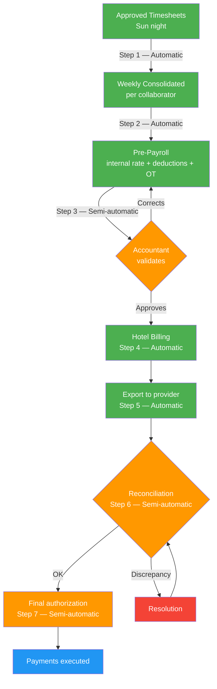

# Complete Simulation — Accounting Point of View

> [!abstract] Purpose
> This simulation narrates a complete weekly payroll cycle within the Oranje system, from the perspective of the [[Accountant|Accountant]] and the [[Accounting Manager|Accounting Manager]]. It walks through the 7 steps of the [[Accounting/Payroll Flow|Payroll Flow]] — from the automatic generation of the [[Collaborator Weekly Summary|Collaborator Weekly Consolidated]] to the final payment authorization — and includes scenarios of partial overtime, multi-hotel, internal rate, the three types of [[Deductions|Deductions]], [[Hotel Invoicing|split invoice by month crossover]], deactivation of 16% withholding and [[Vacation|vacation calculation]]. All data is fictional, but every action, calculation and rule faithfully respects the vault documentation.

## Simulation characters

| Character | Role | Department |
|---|---|---|
| Patricia Solano | [[Accountant|Accountant]] (protagonist) | Accounting — Oranje |
| Irene | [[Accounting Manager|Accounting Manager]] | Accounting — Oranje |
| María López | [[Posiciones\|Housekeeper]] | Collaborator — Hotel Costa Esmeralda |
| Juan Hernández | [[Posiciones\|Houseman]] | Collaborator — Hotel Costa Esmeralda |
| Elena Cruz | [[Posiciones\|Housekeeper]] | Collaborator — Hotel Costa Esmeralda + Hotel Playa del Sol |
| Roberto Fuentes | [[Posiciones\|Housekeeper]] | Collaborator — Hotel Costa Esmeralda |
| Ana Castillo | [[Posiciones\|Laundry]] | Collaborator — Hotel Costa Esmeralda |
| Carmen Delgado | veteran [[Posiciones\|Housekeeper]] | Collaborator — 52+ weeks of seniority |
| Daniel Ortega | [[Inspection/Inspector\|Inspector]] (Noroeste zone) | Inspection — Oranje |

---

## Phase 0 — Context and initial conditions

> Reference: [[Accountant|Accountant]] · [[Accounting Manager|Accounting Manager]] · [[Accounting/Payroll Flow|Payroll Flow]] · [[Core/Modules/Contrato|Contract]]

### 0.1 — Situation

It is Monday, July 21, 2026. The **Hotel Costa Esmeralda** was converted to an active client (status **Orange** in the [[Onboarding Status Light|Onboarding Status Light]]) on July 11 — as narrated in the [[Simulation - Sales Point of View|Sales Point of View Simulation]]. The first [[Requisition|Requisition]] was filled by Recruitment, and today the first collaborators report to work.

Patricia Solano, Oranje's [[Accountant|Accountant]], is responsible for executing the entire weekly financial operation: validation of the Pre-Payroll, reconciliation with the check provider, management of deductions and vacation calculation. Irene, [[Accounting Manager|Accounting Manager]], supervises Patricia's work and is the one who approves the invoices and authorizes the release of the payroll. Together they are the two human actors in the [[Accounting/Payroll Flow|Payroll Flow]].

### 0.2 — Contractual terms of the Hotel Costa Esmeralda

| Field                   | Value                                             |
| ----------------------- | ------------------------------------------------- |
| Pay rate (Housekeeper)  | $12.50/hr                                         |
| Pay rate (Houseman)     | $11.00/hr                                         |
| Pay rate (Laundry)      | $11.50/hr                                         |
| Bill rate (Housekeeper) | $18.25/hr                                         |
| Bill rate (Houseman)    | $16.50/hr                                         |
| Bill rate (Laundry)     | $17.00/hr                                         |
| Overtime                | 1.5x after 40 gross hrs per week per hotel        |
| Holidays                | 2x bill rate on federal holidays                  |
| Week start              | Monday                                            |
| Week end                | Sunday                                            |
| Deducts meal            | Yes ($3 USD/day worked)                           |
| Split invoice by month  | Yes                                              |

> [!warning] Business rule
> Overtime is calculated **per hotel**, not globally. If a collaborator works at two hotels, each hotel has its own independent threshold of 40 gross weekly hours. — [[Collaborator Weekly Summary#Cálculo]]

### 0.3 — Collaborators and their conditions

| Collaborator    | Position | Hotel(s)                        | Pay rate              | Accounting scenario                        |
| --------------- | -------- | ------------------------------- | --------------------- | ------------------------------------------ |
| María López     | HK       | Costa Esmeralda                 | $12.50                | Standard + uniform deduction               |
| Juan Hernández  | HM       | Costa Esmeralda                 | $11.00                | Partial overtime (5 OT, hotel approves 3)  |
| Elena Cruz      | HK       | Costa Esmeralda + Playa del Sol | $12.50 / $13.00       | Multi-hotel, check to hotel with more hours |
| Roberto Fuentes | HK       | Costa Esmeralda                 | $14.00 (internal rate) | Internal rate + 16% Withholding (no SSN)   |
| Ana Castillo    | LN       | Costa Esmeralda                 | $11.50                | Meal deduction                             |

> [!tip] Internal rate — Roberto Fuentes
> Roberto has an internal agreement with Oranje due to previous experience: his real pay rate is **$14.00/hr**, higher than the hotel's contractual rate ($12.50/hr). This internal rate is visible **only** to Accounting. The [[Hotel Invoicing|Hotel Billing]] always uses the bill rate from the [[Core/Modules/Contrato|Contract]] ($18.25/hr). The difference is absorbed by Oranje. — [[Collaborator Weekly Summary#Rate interno]]

### 0.4 — Note about QA

> [!info] Accounting and QA
> The Accounting department **does not have** an assigned [[QA Operator|QA Operator]] nor defined KPIs in the system. The 5 QA operators cover Inspection, Hotel, Collaborator, Sales and Recruitment. — [[Metrics and KPIs by Department|Metrics and KPIs by Department]]

---

## Phase 1 — The work week (Mon Jul 21 – Sun Jul 27, 2026)

> Reference: [[Timesheet]] · [[Core/Modules/Schedule|Schedule]] · [[Inspection/Inspector|Inspector]] · [[Deductions#Uniforme]]

### 1.1 — Operational summary of the week

The 5 collaborators assigned to the Hotel Costa Esmeralda report on Monday, July 21 (Day 1). Daniel Ortega, [[Inspection/Inspector|Inspector]] of the Noroeste zone, verifies their arrival at the property — transition White → Apple Green in the [[Collaborator Status Light|Collaborator Status Light]].

On Wednesday, July 23 (Day 3), Daniel hands out uniforms to the 5 collaborators and records each delivery in the system. This triggers the [[Deductions#Uniforme|uniform deduction]] ($15 USD per person) that will be applied to the next [[Collaborator Weekly Summary|Weekly Consolidated]].

> [!warning] Business rule
> The uniform deduction is automatically applied to the next [[Collaborator Weekly Summary|Weekly Consolidated]] after the delivery is recorded by the [[Inspection/Inspector|Inspector]]. — [[Deductions#Uniforme]]

Elena Cruz works at Costa Esmeralda from Monday to Wednesday (3 days). On Thursday, her [[Recruiter|Recruiter]] temporarily assigns her ([[Collaborator Status Light|Brown]]) to the **Hotel Playa del Sol** (HK pay rate: $13.00/hr, HK bill rate: $17.50/hr), where she works Thursday and Friday.

Juan Hernández works extended shifts of 9 gross hours per day (1 extra hour daily), accumulating 45 gross hours in the week — 5 hours above the overtime threshold.

### 1.2 — Hours recorded per collaborator

| Collaborator | Hotel | Days | Gross hrs/day | Total gross hrs | Lunch (30 min × days) | Net hrs |
|---|---|---|---|---|---|---|
| María López | Costa Esmeralda | 5 | 8.0 | 40.0 | 2.5 | 37.5 |
| Juan Hernández | Costa Esmeralda | 5 | 9.0 | 45.0 | 2.5 | 37.5 + 5.0 OT |
| Elena Cruz | Costa Esmeralda | 3 | 8.0 | 24.0 | 1.5 | 22.5 |
| Elena Cruz | Playa del Sol | 2 | 8.0 | 16.0 | 1.0 | 15.0 |
| Roberto Fuentes | Costa Esmeralda | 5 | 8.0 | 40.0 | 2.5 | 37.5 |
| Ana Castillo | Costa Esmeralda | 5 | 8.0 | 40.0 | 2.5 | 37.5 |

> [!info] Overtime of Juan Hernández
> Juan accumulated 45 gross hrs at Costa Esmeralda. The threshold is 40 gross hrs → 5 hrs of overtime. The hotel authorizes **only 3 of the 5 hours**. The 2 unauthorized hours remain recorded but are neither paid nor billed. — [[Collaborator Weekly Summary#Overtime autorizado parcialmente]]

---

## Phase 2 — Automatic generation of the Weekly Consolidated

> Reference: [[Collaborator Weekly Summary|Collaborator Weekly Consolidated]] · [[Accounting/Payroll Flow|Payroll Flow]] step 1

Sunday, July 27, at the close of the week. The system automatically generates each collaborator's [[Collaborator Weekly Summary|Weekly Consolidated]], grouping their [[Timesheet|Timesheets]] by hotel and applying the corresponding pay rate.

> [!success] **Step 1 of the Payroll Flow** — Automatic. Requires no human intervention.

### 2.1 — Consolidated: María López (standard)

| Field | Value |
|---|---|
| Collaborator | María López |
| Week | Week 30 — July 21 to 27, 2026 |

| Hotel | Position | Net hrs | Pay rate | Regular subtotal | OT hrs | OT rate | OT subtotal |
|---|---|---|---|---|---|---|---|
| Costa Esmeralda | HK | 37.5 | $12.50 | $468.75 | 0 | — | $0.00 |

| **Total to pay** | **$468.75** |
|---|---|

### 2.2 — Consolidated: Juan Hernández (partial overtime)

| Field | Value |
|---|---|
| Collaborator | Juan Hernández |
| Week | Week 30 — July 21 to 27, 2026 |

| Hotel | Position | Net hrs | Pay rate | Regular subtotal | Authorized OT hrs | OT rate | OT subtotal |
|---|---|---|---|---|---|---|---|
| Costa Esmeralda | HM | 37.5 | $11.00 | $412.50 | 3 | $16.50 | $49.50 |

| **Total to pay** | **$462.00** |
|---|---|

> [!warning] Business rule
> The hotel authorized only 3 of the 5 overtime hours. The [[Accounting Manager|Accounting Manager]] adjusts the payable OT hours according to what was authorized. The 2 remaining hours remain recorded but are neither paid to the collaborator nor billed to the hotel. — [[Collaborator Weekly Summary#Overtime autorizado parcialmente]]

### 2.3 — Consolidated: Elena Cruz (multi-hotel)

| Field | Value |
|---|---|
| Collaborator | Elena Cruz |
| Week | Week 30 — July 21 to 27, 2026 |

| Hotel | Position | Net hrs | Pay rate | Regular subtotal | OT hrs | OT rate | OT subtotal |
|---|---|---|---|---|---|---|---|
| Costa Esmeralda | HK | 22.5 | $12.50 | $281.25 | 0 | — | $0.00 |
| Playa del Sol | HK | 15.0 | $13.00 | $195.00 | 0 | — | $0.00 |

| **Total to pay** | **$476.25** |
|---|---|

> [!info] Check assignment
> Elena worked at two hotels. The check is assigned to the **Hotel Costa Esmeralda** (22.5 hrs > 15.0 hrs) — the hotel where she accumulated the greater number of hours. — [[Collaborator Weekly Summary#Asignación del cheque]]

### 2.4 — Consolidated: Roberto Fuentes (internal rate)

| Field | Value |
|---|---|
| Collaborator | Roberto Fuentes |
| Week | Week 30 — July 21 to 27, 2026 |

| Hotel | Position | Net hrs | Pay rate | Regular subtotal | OT hrs | OT rate | OT subtotal |
|---|---|---|---|---|---|---|---|
| Costa Esmeralda | HK | 37.5 | **$14.00*** | $525.00 | 0 | — | $0.00 |

\* Internal rate — higher than the contractual rate ($12.50). Visible only to Accounting ([[Accounting Manager|Accounting Manager]] and [[Accountant|Accountant]]).

| **Total to pay** | **$525.00** |
|---|---|

### 2.5 — Consolidated: Ana Castillo (standard)

| Field | Value |
|---|---|
| Collaborator | Ana Castillo |
| Week | Week 30 — July 21 to 27, 2026 |

| Hotel | Position | Net hrs | Pay rate | Regular subtotal | OT hrs | OT rate | OT subtotal |
|---|---|---|---|---|---|---|---|
| Costa Esmeralda | LN | 37.5 | $11.50 | $431.25 | 0 | — | $0.00 |

| **Total to pay** | **$431.25** |
|---|---|

> [!important] Visibility
> The [[Collaborator Weekly Summary|Weekly Consolidated]] is for the exclusive use of the Accounting department. The hotel and the collaborator **do not have access** to this document. — [[Collaborator Weekly Summary#Visibilidad]]

---

## Phase 3 — Automatic calculation of the Pre-Payroll

> Reference: [[Accounting/Payroll Flow|Payroll Flow]] step 2 · [[Deductions|Deductions]]

Monday, July 28 in the morning. The system generates the Pre-Payroll from the Consolidated: it applies the internal rate where applicable, the active [[Deductions|Deductions]] of each collaborator and the authorized overtime.

> [!success] **Step 2 of the Payroll Flow** — Automatic. Requires no human intervention.

### 3.1 — Applied deductions

| Collaborator | Uniform | Meal | 16% Withholding | Total deductions |
|---|---|---|---|---|
| María López | $15.00 | $15.00 | — | $30.00 |
| Juan Hernández | $15.00 | $15.00 | — | $30.00 |
| Elena Cruz | $15.00 | $9.00 | — | $24.00 |
| Roberto Fuentes | $15.00 | $15.00 | $84.00 | $114.00 |
| Ana Castillo | $15.00 | $15.00 | — | $30.00 |

> [!warning] Deduction Rules
> - **Uniform** ($15/person): the [[Inspection/Inspector|Inspector]] recorded the delivery on July 23 (Day 3). It is applied to this week's Consolidated. — [[Deductions#Uniforme]]
> - **Meal** ($3/day worked): configured in the Costa Esmeralda [[Core/Modules/Contrato|Contract]]. It is applied only on days with a recorded [[Timesheet]]. Elena worked 3 days at Costa Esmeralda ($9) and 2 at Playa del Sol (where it is **not** configured). — [[Deductions#Comida]]
> - **16% Withholding** ($84.00): Roberto Fuentes has no registered SSN/TaxID. 16% × $525.00 = $84.00. Automatically active until the [[Accountant|Accountant]] deactivates it upon receiving documents. — [[Deductions#Retención 16%]]

### 3.2 — Complete Pre-Payroll

| # | Collaborator | Hotel(s) | Position | Reg hrs | OT hrs | Rate | OT rate | Reg gross | OT gross | **Total gross** | Deductions | **Net** |
|---|---|---|---|---|---|---|---|---|---|---|---|---|
| 1 | María López | CE | HK | 37.5 | 0 | $12.50 | — | $468.75 | $0.00 | **$468.75** | $30.00 | **$438.75** |
| 2 | Juan Hernández | CE | HM | 37.5 | 3 | $11.00 | $16.50 | $412.50 | $49.50 | **$462.00** | $30.00 | **$432.00** |
| 3 | Elena Cruz | CE + PdS | HK | 22.5 + 15.0 | 0 | $12.50 / $13.00 | — | $281.25 + $195.00 | $0.00 | **$476.25** | $24.00 | **$452.25** |
| 4 | Roberto Fuentes | CE | HK | 37.5 | 0 | $14.00* | — | $525.00 | $0.00 | **$525.00** | $114.00 | **$411.00** |
| 5 | Ana Castillo | CE | LN | 37.5 | 0 | $11.50 | — | $431.25 | $0.00 | **$431.25** | $30.00 | **$401.25** |

\* Internal rate. CE = Costa Esmeralda, PdS = Playa del Sol.

| **Total payroll** | **$2,363.25** | **Total deductions** | **$228.00** | **Total net** | **$2,135.25** |
|---|---|---|---|---|---|

---

## Phase 4 — Human validation by Accounting

> Reference: [[Accounting/Payroll Flow|Payroll Flow]] step 3 · [[Accountant|Accountant]]

Monday, July 28, mid-morning. Patricia Solano opens the Pre-Payroll generated by the system and begins line-by-line validation.

> [!warning] **Step 3 of the Payroll Flow** — Semi-automated. Requires Accounting approval.

### 4.1 — Validation checklist

For each line of the Pre-Payroll, Patricia verifies:

- [ ] Correct collaborator ID
- [ ] Name/surnames match the ID
- [ ] Correct hours according to the approved [[Timesheet]]
- [ ] Correct rate (internal or contractual as applicable)
- [ ] Discounts applied correctly
- [ ] Correct positions if there are multiple
- [ ] Correct hotel if working at multiple

### 4.2 — Discrepancy detected

Patricia reviews line 4 (Roberto Fuentes) and detects an error: the system applied the contractual rate ($12.50/hr) instead of the internal rate ($14.00/hr).

| Field | Value in Pre-Payroll | Correct value |
|---|---|---|
| Roberto Fuentes' rate | $12.50/hr (contractual) | $14.00/hr (internal rate) |
| Regular gross | $468.75 | $525.00 |
| 16% Withholding | $75.00 | $84.00 |
| Total deductions | $105.00 | $114.00 |
| Net | $363.75 | $411.00 |

Patricia corrects the rate in the system. The Pre-Payroll is automatically recalculated for the affected line.

> [!warning] Business rule
> When an internal rate exists, the system must use it to calculate the collaborator's payment instead of the contractual rate. The internal rate is **not reflected** in the [[Hotel Invoicing|Hotel Billing]]. — [[Collaborator Weekly Summary#Rate interno]]

### 4.3 — Approval

Patricia confirms that the remaining 5 lines are correct: IDs match names, hours match the approved [[Timesheet|Timesheets]], deductions applied correctly, positions and hotels correct.

**Patricia approves the Pre-Payroll.**

---

## Phase 5 — Automatic generation of the Hotel Billing

> Reference: [[Hotel Invoicing|Hotel Billing]] · [[Accounting/Payroll Flow|Payroll Flow]] step 4 · [[Core/Modules/Contrato|Contract]]

Monday, July 28. After the approval of the Pre-Payroll, the system automatically generates the invoices for each hotel.

> [!success] **Step 4 of the Payroll Flow** — Automatic. Requires no human intervention.

### 5.1 — Invoice to the Hotel Costa Esmeralda

| Field | Value |
|---|---|
| Hotel | Hotel Costa Esmeralda |
| Period | July 21 to 27, 2026 |
| Folio | ORJ-2026-S30-CE001 |

| Collaborator | Position | Regular hrs | Bill rate | Regular subtotal | Auth. OT hrs | OT rate | OT subtotal | **Line total** |
|---|---|---|---|---|---|---|---|---|
| María López | HK | 37.5 | $18.25 | $684.38 | 0 | — | $0.00 | **$684.38** |
| Juan Hernández | HM | 37.5 | $16.50 | $618.75 | 3 | $24.75 | $74.25 | **$693.00** |
| Elena Cruz | HK | 22.5 | $18.25 | $410.63 | 0 | — | $0.00 | **$410.63** |
| Roberto Fuentes | HK | 37.5 | $18.25 | $684.38 | 0 | — | $0.00 | **$684.38** |
| Ana Castillo | LN | 37.5 | $17.00 | $637.50 | 0 | — | $0.00 | **$637.50** |

| | Amount |
|---|---|
| Services subtotal | $3,109.89 |
| Meal credit (5 collaborators × days worked × $3) | −$69.00 |
| **Total to charge** | **$3,040.89** |

> [!warning] Invoice Rules
> - The Invoice uses exclusively the **bill rate** from the [[Core/Modules/Contrato|Contract]]. Roberto Fuentes' internal rate ($14.00) **never** appears on the Invoice — $18.25 is used. — [[Hotel Invoicing|Hotel Billing]]
> - Only the overtime **authorized** by the hotel is billed (Juan's 3 hours). The 2 unauthorized hours are not included. — [[Hotel Invoicing#Overtime autorizado]]
> - The meal deduction ($3/day) is credited to the hotel. 5 collaborators × days with [[Timesheet]]: (5+5+3+5+5) = 23 days × $3 = $69.00. — [[Deductions#Comida]]

### 5.2 — Invoice to the Hotel Playa del Sol

| Field | Value |
|---|---|
| Hotel | Hotel Playa del Sol |
| Period | July 24 to 25, 2026 |
| Folio | ORJ-2026-S30-PS001 |

| Collaborator | Position | Regular hrs | Bill rate | Regular subtotal | OT hrs | OT rate | OT subtotal | **Line total** |
|---|---|---|---|---|---|---|---|---|
| Elena Cruz | HK | 15.0 | $17.50 | $262.50 | 0 | — | $0.00 | **$262.50** |

| | Amount |
|---|---|
| Services subtotal | $262.50 |
| Credits | $0.00 |
| **Total to charge** | **$262.50** |

> [!info] Hotel Playa del Sol does not have the meal deduction configured in its [[Core/Modules/Contrato|Contract]].

### 5.3 — Invoice approval

Patricia reviews both invoices, verifies that the bill rates match the contracts, that only the authorized overtime is included, and that the meal credits are correct. She sends the validation to Irene.

**Irene approves the invoices.**

---

## Phase 6 — Export to the check provider

> Reference: [[Accounting/Payroll Flow|Payroll Flow]] step 5

Monday, July 28, afternoon. The system generates the export file with the payment data for the external check provider.

> [!success] **Step 5 of the Payroll Flow** — Automatic. Requires no human intervention.

| Collaborator | Net amount | Check delivery hotel |
|---|---|---|
| María López | $438.75 | Costa Esmeralda |
| Juan Hernández | $432.00 | Costa Esmeralda |
| Elena Cruz | $452.25 | Costa Esmeralda (more hours) |
| Roberto Fuentes | $411.00 | Costa Esmeralda |
| Ana Castillo | $401.25 | Costa Esmeralda |
| **Total exported** | **$2,135.25** | |

---

## Phase 7 — Reconciliation

> Reference: [[Accounting/Payroll Flow|Payroll Flow]] step 6 · [[Accountant|Accountant]]

Tuesday, July 29 in the morning. The check provider returns the confirmation of the 5 generated checks. Patricia starts the reconciliation: she compares what was sent against what was returned.

> [!warning] **Step 6 of the Payroll Flow** — Semi-automated. Requires Accounting validation.

### 7.1 — Discrepancy detected

| Collaborator | Amount sent | Provider amount | Difference |
|---|---|---|---|
| María López | $438.75 | $438.75 | $0.00 ✓ |
| Juan Hernández | $432.00 | $432.00 | $0.00 ✓ |
| Elena Cruz | $452.25 | $452.25 | $0.00 ✓ |
| Roberto Fuentes | $411.00 | $411.50 | **+$0.50** ✗ |
| Ana Castillo | $401.25 | $401.25 | $0.00 ✓ |

Patricia identifies a discrepancy of $0.50 in Roberto Fuentes' check. She investigates: the provider rounded an intermediate calculation differently. Patricia requests a correction from the provider. The corrected check ($411.00) is confirmed.

### 7.2 — Reconciliation approved

Patricia validates that the 5 checks match the amounts of the approved Pre-Payroll.

**Patricia approves the reconciliation.**

---

## Phase 8 — Final authorization and release of payments

> Reference: [[Accounting/Payroll Flow|Payroll Flow]] step 7 · [[Accounting Manager|Accounting Manager]]

Tuesday, July 29, noon. Irene authorizes the release of the weekly payroll.

> [!warning] **Step 7 of the Payroll Flow** — Semi-automated. Requires authorization from the [[Accounting Manager|Accounting Manager]].

| Field | Value |
|---|---|
| Authorization date | July 29, 2026, 12:15 PM |
| Authorized by | Irene — [[Accounting Manager|Accounting Manager]] |
| Total payroll released | $2,135.25 (5 checks) |
| Status | Payments executed |

> [!tip] System log
> The system records the date, time and responsible person of the final authorization. This record is the audit traceability of the weekly payment cycle.

The collaborators will receive their checks at the assigned hotel (all at Costa Esmeralda for this week).

---

## Phase 9 — Split invoice by month crossover

> Reference: [[Hotel Invoicing#Factura partida por cruce de mes]] · [[Core/Modules/Contrato|Contract]]

### 9.1 — Context: week of July 28 to August 3

The following work week (Week 31) crosses two calendar months:
- **July:** Monday 28, Tuesday 29, Wednesday 30, Thursday 31 (4 working days)
- **August:** Friday 1 (1 working day) + Saturday 2 and Sunday 3 (rest)

The Hotel Costa Esmeralda [[Core/Modules/Contrato|Contract]] has "Split invoice by month: Yes" configured. This forces the system to generate **two separate invoices** when the week crosses the monthly boundary.

### 9.2 — Example: María López in the split week

**Invoice 1 — July portion (July 28–31)**

| Collaborator | Position | Regular hrs | Bill rate | Subtotal |
|---|---|---|---|---|
| María López | HK | 30.0 | $18.25 | $547.50 |

**Invoice 2 — August portion (August 1)**

| Collaborator | Position | Regular hrs | Bill rate | Subtotal |
|---|---|---|---|---|
| María López | HK | 7.5 | $18.25 | $136.88 |

> [!warning] Business rule
> When a week spans two calendar months and the [[Core/Modules/Contrato|Contract]] has "Split invoice by month: Yes", the system generates two separate invoices: one for the days of the ending month and another for the days of the new month. — [[Hotel Invoicing#Factura partida por cruce de mes]]

The system generates the two complete invoices (with all collaborators) automatically. Patricia validates and approves them as part of the normal cycle of the [[Accounting/Payroll Flow|Payroll Flow]].

---

## Phase 10 — Deactivation of 16% withholding

> Reference: [[Deductions#Retención 16%]] · [[Accountant|Accountant]]

### 10.1 — Roberto Fuentes submits documents

Monday, August 4, 2026. Roberto Fuentes submits his SSN to the Human Resources department. The information is updated in his system profile (field "Has SSN/TaxID: yes").

### 10.2 — Manual deactivation

Patricia Solano receives the notification that Roberto now has a registered SSN. She accesses the [[Deductions|Deductions]] module and **manually deactivates** the 16% withholding for Roberto Fuentes.

| Field | Value |
|---|---|
| Collaborator | Roberto Fuentes |
| Deduction | 16% Withholding |
| Previous status | Active |
| New status | Deactivated |
| Deactivation date | August 4, 2026 |
| Responsible | Patricia Solano — [[Accountant|Accountant]] |

### 10.3 — Accumulated withheld amount

The system shows the history of accumulated withholdings:

| Week | Gross amount | 16% Withholding |
|---|---|---|
| Week 30 (Jul 21–27) | $525.00 | $84.00 |
| Week 31 (Jul 28 – Aug 3) | $525.00 | $84.00 |
| **Total accumulated** | | **$168.00** |

> [!important] Refund
> The 16% withholding is **refundable**. Upon deactivation, the system allows generating the refund of the accumulated withheld amount ($168.00). Patricia can schedule the refund in the next payroll cycle or split it according to Oranje's internal policy. — [[Deductions#Retención 16%]]

Starting in week 32, Roberto's check will no longer include the 16% withholding.

---

## Phase 11 — Vacation calculation

> Reference: [[Vacation|Vacation]] · [[Accountant|Accountant]] · [[Collaborator Weekly Summary|Collaborator Weekly Consolidated]]

### 11.1 — Context

July 2027 — one year later. Carmen Delgado, veteran [[Posiciones|Housekeeper]], requests the calculation of her vacation. Carmen has worked 52 complete weeks at two hotels:

| Hotel | Position | Weeks | Pay rate |
|---|---|---|---|
| Costa Esmeralda | HK | 35 | $12.50 |
| Playa del Sol | HK | 17 | $13.00 |

### 11.2 — Calculation

Patricia selects Carmen Delgado and the 52-week period in the system. The calculation runs automatically.

**Formula:** Average hours = Σ net hours paid ÷ weeks worked (per hotel)

| Hotel | Total net hrs (52 wks) | Weeks | Average hrs/week | Pay rate | Weekly value |
|---|---|---|---|---|---|
| Costa Esmeralda | 1,295.0 | 35 | 37.0 | $12.50 | $462.50 |
| Playa del Sol | 612.0 | 17 | 36.0 | $13.00 | $468.00 |
| **Total** | **1,907.0** | **52** | | | **$930.50** |

### 11.3 — Breakdown presented by the system

| Breakdown | Average hrs/wk | Rate | Value |
|---|---|---|---|
| Per hotel — Costa Esmeralda (HK) | 37.0 | $12.50 | $462.50 |
| Per hotel — Playa del Sol (HK) | 36.0 | $13.00 | $468.00 |
| **Vacation pay (weekly equivalent)** | | | **$930.50** |

> [!warning] Business rule
> When the collaborator worked with different rates, the system separates the weeks/hours by rate, calculates the average for each rate independently and presents the breakdown by hotel, position and rate. — [[Vacation#Complejidad por múltiples rates]]

> [!info] If Carmen had less than 52 weeks of seniority, the system would average over the available weeks. — [[Vacation#Fórmula]]

---

## Summary of the executed Payroll Flow

| Step | Description | Automation | Date | Responsible |
|---|---|---|---|---|
| 1 | Generation of the [[Collaborator Weekly Summary\|Weekly Consolidated]] | Automatic | Jul 27 (Sun night) | System |
| 2 | Pre-Payroll calculation | Automatic | Jul 28 (Mon AM) | System |
| 3 | Pre-Payroll validation | Semi-automatic | Jul 28 (Mon morning) | Patricia Solano |
| 4 | Generation of [[Hotel Invoicing\|Hotel Billing]] | Automatic | Jul 28 (Mon) | System |
| 5 | Export to check provider | Automatic | Jul 28 (Mon afternoon) | System |
| 6 | Reconciliation | Semi-automatic | Jul 29 (Tue AM) | Patricia Solano |
| 7 | Final authorization and payment | Semi-automatic | Jul 29 (Tue noon) | Patricia Solano |

---

## Accounting scenarios covered

| # | Scenario | Collaborator | Phase | Main module |
|---|---|---|---|---|
| 1 | Standard case (regular hours, no OT) | María López | 2–8 | [[Collaborator Weekly Summary|Collaborator Weekly Consolidated]] |
| 2 | Partially authorized overtime (5 OT, hotel approves 3) | Juan Hernández | 2–8 | [[Collaborator Weekly Summary|Collaborator Weekly Consolidated]] |
| 3 | Multi-hotel with check to hotel with more hours | Elena Cruz | 2–8 | [[Collaborator Weekly Summary|Collaborator Weekly Consolidated]] |
| 4 | Internal rate (higher than contractual) | Roberto Fuentes | 2–5 | [[Collaborator Weekly Summary|Collaborator Weekly Consolidated]] |
| 5 | 16% Withholding (no SSN) + deactivation + refund | Roberto Fuentes | 3, 10 | [[Deductions|Deductions]] |
| 6 | Uniform deduction (Day 3) | All | 3 | [[Deductions|Deductions]] |
| 7 | Meal deduction + credit to the hotel | All (Costa Esmeralda) | 3, 5 | [[Deductions|Deductions]] · [[Hotel Invoicing|Hotel Billing]] |
| 8 | Split invoice by month crossover | All (Costa Esmeralda) | 9 | [[Hotel Invoicing|Hotel Billing]] |
| 9 | Multi-hotel vacation calculation | Carmen Delgado | 11 | [[Vacation|Vacation]] |
| 10 | Pre-Payroll discrepancy (incorrect rate) | Roberto Fuentes | 4 | [[Accountant|Accountant]] |
| 11 | Reconciliation discrepancy (provider) | Roberto Fuentes | 7 | [[Accountant|Accountant]] |

---

## Modules and concepts referenced

| Module | Reference |
|---|---|
| Accounting | [[Accounting Manager|Accounting Manager]] · [[Accountant|Accountant]] · [[Accounting/Payroll Flow\|Payroll Flow]] |
| Consolidated and payment | [[Collaborator Weekly Summary|Collaborator Weekly Consolidated]] · [[Deductions|Deductions]] |
| Billing | [[Hotel Invoicing|Hotel Billing]] |
| Vacation | [[Vacation|Vacation]] |
| Core | [[Core/Modules/Contrato\|Contract]] · [[Timesheet]] · [[Core/Modules/Schedule\|Schedule]] |
| Status Lights | [[Collaborator Status Light|Collaborator Status Light]] · [[Onboarding Status Light|Onboarding Status Light]] |
| Catalogs | [[Posiciones|Positions]] · [[Zones|Zones]] |
| Inspection | [[Inspection/Inspector\|Inspector]] |
| Recruitment | [[Recruiter|Recruiter]] |
| Quality | [[QA Operator|QA Operator]] · [[Metrics and KPIs by Department|Metrics and KPIs by Department]] |

---

## Related simulations

- [[Simulation - Sales Point of View|Sales Point of View Simulation]] — Narrates the commercial cycle of the Hotel Costa Esmeralda from prospecting to conversion to active client. The contractual terms (pay rate, bill rate, overtime) negotiated in that simulation are the ones used here to calculate payments and invoices.
- [[Simulation - Inspection Point of View|Inspection Point of View Simulation]] — Covers the field operation of Inspector Daniel Ortega, including the uniform delivery on Day 3 that triggers the uniform deduction processed in this simulation.
- [[Simulation - Hotel Point of View|Hotel Point of View Simulation]] — Shows the weekly billing from the hotel's perspective, complementing the internal Accounting view presented here.
- [[Simulation - Recruitment Point of View|Recruitment Point of View Simulation]] — Includes the week close with generation of the Consolidated and Pre-Payroll for the recruited collaborators, connecting with the payroll flow detailed here.
- [[Simulation - Collaborator Life Cycle|Collaborator Life Cycle Simulation]] — Walks through the 12 states of the collaborator status light and includes examples of check calculation with deductions, overtime and internal rate that align with the scenarios of this simulation.
