# Complete simulation — Collaborator Life Cycle

> [!abstract] Purpose
> This simulation walks through the 12 states of the [[Collaborator Status Light|Collaborator Status Light]] through the complete story of a fictional collaborator: Carlos Méndez. Unlike the other simulations that follow a department during an operational week, this one narrates the longitudinal life cycle of a collaborator: from his recruitment by Recruitment, through his onboarding at a hotel, daily operation, payment, stand-by, temporary assignment, absence, workplace accident, hotel report, and delivery of tax documents, up to his vacation. The cycle closes with quality supervision (QA) and the measurement of the Collaborator module's KPIs. All data is fictional, but each action, transition, and rule faithfully respects the vault's documentation.

## Characters of the simulation

| Character                       | Role                                              | Department                   |
| ------------------------------- | ------------------------------------------------- | ---------------------------- |
| Carlos Méndez                   | Collaborator ([[Posiciones\|Housekeeper]])        | —                            |
| Operator 3                      | [[QA Operator\|QA Operator]] (fixed assignment to Collaborator) | QA — Oranje                  |
| (Recruiter)                     | [[Recruiter\|Recruiter]]                        | Reclutamiento — Oranje       |
| (Inspector zone Centro)         | [[Inspector]]                                     | Inspección — Oranje          |
| (Inspector zone Este)           | [[Inspector]]                                     | Inspección — Oranje          |
| (Supervisor Hotel Riviera)      | [[Supervisor]]                                    | Hotel Riviera · Zona Centro  |
| (Area Manager Hotel Riviera)    | [[Area Manager\|Area Manager]]                 | Hotel Riviera · Zona Centro  |
| (Supervisor Hotel Costa Azul)   | [[Supervisor]]                                    | Hotel Costa Azul · Zona Este |
| [[Accountant\|Accountant]]       | [[Accountant\|Accountant]]                         | Contabilidad — Oranje        |
| [[Accounting Manager\|Accounting Manager]] | [[Accounting Manager\|Accounting Manager]]   | Contabilidad — Oranje        |
| María Méndez                    | Emergency contact (mother)                        | —                            |
| María González                  | Witness (shift coworker)                          | Hotel Riviera                |

### Collaborator profile

| Field                  | Value                |
| ---------------------- | -------------------- |
| Name                   | Carlos Méndez        |
| Age                    | 28 years             |
| Gender                 | Male                 |
| Address                | Zona Centro          |
| Phone                  | (555) 123-4567       |
| Position               | Housekeeper          |
| English level          | Intermediate         |
| Experience             | 2 years              |
| Transport              | Own vehicle          |
| Modality               | Full time            |
| SSN/TaxID              | Has none at start    |
| Blood type             | O+                   |
| Allergies              | None                 |
| Emergency contact      | María Méndez (mother) |

---

## Phase 1 — Entry into the system

> Reference: [[Recruitment Flow|Recruitment Flow]] · [[Recruitment Rules|Recruitment Rules]] · [[Blacklist]] · [[Deductions|Deductions]]

### 1.1 — Initial interview

The [[Recruiter|Recruiter]] contacts Carlos after identifying him as a viable candidate. During the initial interview, she captures the basic data: name, age, gender, address, and phone. This stage corresponds to the start of the [[Recruitment Flow|Recruitment Flow]].

### 1.2 — Registration in the app

Carlos completes his profile directly from the Oranje app. He records the following data:

- SSN: has none
- ITIN: has none
- Position: [[Posiciones|Housekeeper]]
- English level: [[English Levels|Intermediate]]
- Experience level: 2 years
- Transport type: own vehicle
- Modality: [[Employment Types|Full time]]

### 1.3 — Emergency data

Carlos completes the emergency and health data section:

- Emergency contact: María Méndez (mother)
- Emergency phone: 313xxxxxxxxxx
- Blood type: O+
- Allergies: none

### 1.4 — Validation and approval

The [[Recruiter|Recruiter]] reviews Carlos's profile, approves it, and enables his access to the system panels. Before proceeding, she consults the [[Blacklist]] — Carlos does not appear registered. ----------

Carlos enters the [[Collaborator Pool|Collaborator Pool]].

> [!info] Collaborator Status Light
> → **White** — Pre-assignment
> **Responsible:** Recruiter · **Comment:** "Candidate approved, enters the Pool."

> [!warning] Business rule
> The [[Recruiter|Recruiter]] must consult the [[Blacklist]] before recruiting any candidate. — [[Recruitment Rules|Recruitment Rules]]

> [!info] System
> Since Carlos has no SSN or TaxID, the system automatically activates the **16% withholding** on his check. — [[Deductions|Deductions]]

> [!tip] QA — Operator 3 observes
> Data completeness: Carlos completed the 3 capture phases (interview, app registration, emergency data). Contributes positively to the **Data completeness** KPI (target: ≥ 95%). — [[Metrics and KPIs by Department#Colaborador|KPI 5]]

---

## Phase 2 — First assignment and hotel onboarding

> Reference: [[Requisition Flow|Requisition Flow]] · [[Requisition Self-Pick|Requisition Self-Pick]] · [[Collaborator Status Light|Collaborator Status Light]] · [[Schedule]] · [[Timesheet]]

### 2.1 — The Requisition

The [[Supervisor]] of Hotel Riviera (zone Centro) creates a [[Requisition|Requisition]] requesting 2 Housekeepers, full time, starting next Monday with intermediate English. The [[Area Manager|Area Manager]] authorizes it.

The system calculates the urgency: more than 120 hours before the start = Green (Normal). The positions are reflected in the week's [[Schedule]]. The [[Inspector]] of zone Centro is automatically assigned to the requisition.

### 2.2 — Match and assignment

The [[Recruiter|Recruiter]] takes the requisition from the shared inbox ([[Requisition Self-Pick|Self-Pick]]). She searches the [[Collaborator Pool|Collaborator Pool]]: Housekeeper, Intermediate, zone Centro, Full time. She finds Carlos (White). She assigns him to Hotel Riviera and registers him in the [[Schedule]].

### 2.3 — Day 1 — Apple Green

Carlos arrives at Hotel Riviera. The [[Inspector]] verifies his arrival on site.

> [!info] Collaborator Status Light
> **White** → **Apple Green** — Day 1 verified
> **Responsible:** Inspector (zone Centro) · **Comment:** "Carlos verified on site at Hotel Riviera."

The [[Timesheet]] is created from the [[Schedule]]. Carlos clocks his first Clock-In via QR generated by the [[Area Manager|Area Manager]].

### 2.4 — Day 3 — Light Blue

Carlos clocks in at the property on the third day. The [[Inspector]] hands him his uniform.

> [!info] Collaborator Status Light
> **Apple Green** → **Light Blue** — Day 3, uniform delivered
> **Responsible:** Inspector (zone Centro) · **Comment:** "Carlos clocks in Day 3. Uniform delivered."

> [!info] System
> A [[Deductions|deduction]] of **$15 USD** is generated for the uniform, which will be applied in the next [[Collaborator Weekly Summary|Weekly Consolidated]].

### 2.5 — Day 7+ — Orange

Carlos completes 7 consecutive days. The system transitions him automatically.

> [!info] Collaborator Status Light
> **Light Blue** → **Orange** — Permanent
> **Responsible:** System · **Comment:** "Carlos completed 7 days. He is now a permanent collaborator at Hotel Riviera."

---

## Phase 3 — Daily operation

> Reference: [[Timesheet]] · [[Collaborator Rules|Collaborator Rules]] · [[Inspection Rules|Inspection Rules]]

A typical day for Carlos at Hotel Riviera. He clocks in via QR generated by the [[Area Manager|Area Manager]].

### 3.1 — Clock record

| Clock         | Time     | Event               |
| ------------- | -------- | ------------------- |
| Clock-In      | 7:00 AM  | Start of shift      |
| Lunch Out     | 12:00 PM | Goes out to eat     |
| Lunch In      | 12:30 PM | Returns from eating |
| Break Out     | 3:00 PM  | Goes out on break   |
| Break In      | 3:15 PM  | Returns from break  |
| Clock-Out     | 5:00 PM  | End of shift        |

### 3.2 — Hours calculation

| Concept | Calculation | Result |
|---|---|---|
| Gross hours | 5:00 PM − 7:00 AM | 10h 00min |
| Actual lunch | 12:35 PM − 12:00 PM | 35 min |
| Lunch deduction | Actual lunch (35 min) ≥ 30 min → actual time is deducted | 35 min |
| Actual break | 3:15 PM − 3:00 PM | 15 min |
| **Net hours** | 10h 00min − 35min − 15min | **9h 10min** |

> [!warning] Business rule
> Carlos's lunch (35 min) exceeds 30 minutes. The system activates the **Extended Lunch Indicator**, visible only to [[Inspector]], [[Coordinator|Coordinator]], and [[Recruitment Manager|Recruitment Manager]]. The hotel **does not have access** to this indicator. It is not automatically punitive.

> [!tip] QA — Operator 3 observes
> Carlos's lunch (35 min) activates the Extended Lunch Indicator. It feeds the **Extended Lunch Rate** KPI (target: ≤ 10%). An isolated shift does not represent an alert, but Operator 3 records the trend. — [[Metrics and KPIs by Department#Colaborador|KPI 4]]

### 3.3 — Alternative scenario — 25-minute lunch

If Carlos had taken only 25 minutes of lunch:

| Concept            | Calculation                                                       | Result       |
| ------------------ | ---------------------------------------------------------------- | ------------ |
| Actual lunch       | 25 min                                                           | 25 min       |
| Lunch deduction    | Actual lunch (25 min) < 30 min → the **minimum of 30 min** is deducted | 30 min       |
| **Net hours**      | 10h 00min − 30min − 15min                                        | **9h 15min** |
|                    |                                                                  |              |

> [!warning] Business rule
> The lunch deduction applies to everyone without exception:
> - Lunch < 30 min → 30 min are deducted (mandatory minimum)
> - Lunch ≥ 30 min → the actual time taken is deducted
> - No lunch clock → auto-deduction of 30 min
>
> After 6 continuous hours of work, the collaborator must take his lunch. — [[Collaborator Rules|Collaborator Rules]]

---

## Phase 4 — First payment week

> Reference: [[Collaborator Weekly Summary|Collaborator Weekly Consolidated]] · [[Deductions|Deductions]] · [[Payroll Flow|Payroll Flow]] · [[Contrato|Contract]]

At the close of the week, the system automatically generates Carlos's [[Collaborator Weekly Summary|Weekly Consolidated]]. Since he worked only at Hotel Riviera, the consolidated contains a single [[Timesheet]].

### 4.1 — Detail of the week

| Day | Gross hours | Lunch | Break | Net hours |
|---|---|---|---|---|
| Monday | 10h 00min | 35 min | 15 min | 9h 10min |
| Tuesday | 8h 00min | 30 min | 15 min | 7h 15min |
| Wednesday | 8h 00min | 30 min | 15 min | 7h 15min |
| Thursday | 8h 00min | 30 min | 15 min | 7h 15min |
| Friday | 8h 00min | 30 min | 15 min | 7h 15min |
| **Total** | **42h 00min** | — | — | **38h 10min** |

The 42 gross hours exceed the 40-hour weekly threshold → **2 hours of overtime** at Hotel Riviera.

### 4.2 — Payment calculation

Carlos's pay rate at Hotel Riviera: **$14.00/hr**.

| Concept | Calculation | Amount |
|---|---|---|
| Regular hours (net − adjusted OT) | 36h 10min × $14.00 | $506.33 |
| Overtime | 2h 00min × $21.00 (1.5×) | $42.00 |
| **Gross subtotal** | | **$548.33** |

### 4.3 — Deductions applied

| Deduction | Amount | Condition |
|---|---|---|
| Uniform | $15.00 | Delivered on Day 3 by the [[Inspector]] |
| Meal | $15.00 | $3.00 × 5 days worked (configured in the [[Contrato|Contract]]) |
| 16% withholding | $87.73 | 16% of $548.33 (without SSN/TaxID) |
| **Total deductions** | **$117.73** | |

### 4.4 — Final check

| Concept | Amount |
|---|---|
| Gross subtotal | $548.33 |
| Total deductions | −$117.73 |
| **Net check** | **$430.60** |

> [!info] System
> The [[Collaborator Weekly Summary|Weekly Consolidated]] is for the exclusive use of Accounting. Carlos does not have access to this document. The [[Accountant|Accountant]] reviews and the [[Accounting Manager|Accounting Manager]] approves before releasing the payment. — [[Payroll Flow|Payroll Flow]]

---

## Phase 5 — Stand-by and voluntary availability

> Reference: [[Collaborator Status Light|Collaborator Status Light]] · [[Collaborator Rules|Collaborator Rules]] · [[Collaborator Pool|Collaborator Pool]]

### 5.1 — Pink — Stand-by

Weeks later, Hotel Riviera enters low season. The [[Supervisor]] puts Carlos in **Pink (Stand-by)** state.

Carlos no longer has a [[Schedule]] or [[Timesheet]].

> [!info] Collaborator Status Light
> **Orange** → **Pink** — Stand-by by hotel
> **Responsible:** Supervisor Hotel Riviera · **Comment:** "Low season. Carlos goes to stand-by."

> [!warning] Business rule
> In Pink state the collaborator **cannot clock in**. The chain is: Active assignment → [[Schedule]] → [[Timesheet]] → Clocking. Without an active assignment, there is no Schedule; without a Schedule, there is no Timesheet; without a Timesheet, he cannot clock in. — [[Collaborator Rules|Collaborator Rules]]

> [!tip] QA — Operator 3 observes
> Carlos transitions from Orange (active) to Pink (Stand-by). He leaves the count of deployable collaborators. It affects the **Pool Health** KPI (target: ≥ 60%). — [[Metrics and KPIs by Department#Colaborador|KPI 3]]

### 5.2 — Yellow — Voluntarily available

Carlos decides he wants to keep working. From the app, he activates the **Yellow (Voluntarily available)** state on his own. It requires no one's approval.

> [!info] Collaborator Status Light
> **Pink** → **Yellow** — Carlos declares himself available
> **Responsible:** Carlos Méndez (collaborator) · **Comment:** "Carlos activates availability from the app."

> [!info] System
> Yellow is the **only state** that the collaborator can activate by himself. It is a declaration of availability, not an assignment. Carlos still has no [[Schedule]] or [[Timesheet]] and **cannot clock in** until he is assigned (→ Brown).

### 5.3 — Brown — Temporary assignment

The [[Recruiter|Recruiter]] detects that Hotel Playa Sol (zone Sur) needs coverage for 3 days. She searches the [[Collaborator Pool|Collaborator Pool]], finds Carlos in Yellow. She assigns him temporarily and defines the duration: **3 days**.

> [!info] Collaborator Status Light
> **Yellow** → **Brown** — Temporary assignment
> **Responsible:** Recruiter · **Comment:** "Carlos temporarily assigned to Hotel Playa Sol for 3 days."

Carlos's [[Schedule]] and [[Timesheet]] are generated at Hotel Playa Sol. He can now clock in.

### 5.4 — Return

When the 3 days expire, the system automatically closes the Brown state. Since Carlos is still on rest period from Hotel Riviera (Pink), he returns to **Yellow**.

> [!info] Collaborator Status Light
> **Brown** → **Yellow** — Temporary assignment expires
> **Responsible:** System · **Comment:** "3 days completed at Hotel Playa Sol. Carlos returns to available."

> [!info] System
> The complete path for a collaborator on rest to be able to work is: **Pink → Yellow → Brown**. If the rest period had ended, Carlos would return to **Strong Green** instead of Yellow.

---

## Phase 6 — Work in multiple hotels

> Reference: [[Collaborator Weekly Summary|Collaborator Weekly Consolidated]] · [[Contrato|Contract]] · [[Hotel Invoicing|Hotel Billing]]

### 6.1 — Context

Weeks later, Carlos has already returned from rest and is **Orange** (permanent) at Hotel Riviera. Hotel Playa Sol needs extra coverage and the [[Recruiter|Recruiter]] assigns him temporarily (**Brown**) to cover 2 additional days that week.

### 6.2 — Hours by hotel

| Hotel | Type | Days | Gross hours | Net hours | OT (gross > 40) |
|---|---|---|---|---|---|
| Hotel Riviera | Permanent | 5 | 42h | 38h 10min | 2h OT |
| Hotel Playa Sol | Temporary | 2 | 16h | 14h 30min | 0h OT |

> [!warning] Business rule
> Overtime is calculated **per hotel**, not globally across hotels. Hotel Riviera has 42h gross (2h OT). Hotel Playa Sol has 16h gross (no OT, below 40h). — [[Collaborator Weekly Summary|Collaborator Weekly Consolidated]]

### 6.3 — Internal rate vs. contractual

Carlos, due to his experience and performance, has an **internal rate** of $15.00/hr agreed with Oranje, although Hotel Riviera's [[Contrato|Contract]] sets a pay rate of $14.00/hr.

- The system uses **$15.00/hr** to calculate Carlos's payment.
- The [[Hotel Invoicing|Hotel Billing]] always uses the **contractual bill rate**, not the internal rate.
- Oranje absorbs the difference.

> [!info] System
> The internal rate is only visible to Accounting ([[Accounting Manager|Accounting Manager]] and [[Accountant|Accountant]]). Neither Carlos nor the hotel knows about this difference.

### 6.4 — Check assignment

Since Carlos worked more hours at Hotel Riviera (42h gross vs. 16h gross), the check is assigned to **Hotel Riviera** for the purposes of printing and delivery.

---

## Phase 7 — First absence

> Reference: [[Collaborator Status Light|Collaborator Status Light]] · [[Blacklist]] · [[Collaborator Rules|Collaborator Rules]]

One day, Carlos does not show up at Hotel Riviera without justification. The system automatically marks him as **Purple (Did not return)**.

> [!info] Collaborator Status Light
> **Orange** → **Purple** — First absence
> **Responsible:** System · **Comment:** "Carlos did not show up without justification. 1st absence. 2 remain before automatic Blacklist."

It is his **first absence**. He has 2 remaining before the automatic Blacklist.

> [!warning] Business rule
> Each absence is recorded individually. Upon accumulating **3 absences**, the system applies automatic [[Blacklist]] (Black state). It requires no manual action from any role. — [[Collaborator Rules|Collaborator Rules]]

The next day, Carlos returns and continues working normally.

> [!info] Collaborator Status Light
> **Purple** → **Orange** — Carlos returns the next day
> **Responsible:** System · **Comment:** "Carlos present. Returns to Orange state."

> [!tip] QA — Operator 3 observes
> The transition to Purple is counted in the **Absence Rate** KPI (target: ≤ 5%). An isolated absence does not generate an alert, but Operator 3 records the event. — [[Metrics and KPIs by Department#Colaborador|KPI 1]]

---

## Phase 8 — Workplace accident

> Reference: [[Workplace Accident Flow|Workplace Accident Flow]] · [[Workplace Accident|Workplace Accident]] · [[Collaborator Status Light|Collaborator Status Light]] · [[Inspection Rules|Inspection Rules]]

### 8.1 — The accident

Carlos injures himself while cleaning a room at Hotel Riviera: he slips on a wet floor. He reports from the app (Scenario A of the [[Workplace Accident Flow|Workplace Accident Flow]]).

### 8.2 — Card generation

The [[Workplace Accident|Workplace Accident]] card is generated with an automatic report number. Carlos immediately transitions to **Gray — Injured**.

> [!info] Collaborator Status Light
> **Orange** → **Gray** — Injured
> **Responsible:** Carlos Méndez (collaborator's report) · **Comment:** "Slipped on wet floor during cleaning. Room 307, floor 3."

The signal arrives simultaneously to the [[Supervisor|SUP]] and the [[Inspector]] of zone Centro.

### 8.3 — On-site capture (SUP)

The [[Supervisor|SUP]] goes to the place and captures:

| Field | Detail |
|---|---|
| Location | Room 307, floor 3 |
| Circumstances | Slipped on wet floor during cleaning |
| Witnesses | María González (shift coworker) |
| Immediate care | Ice and bandage on site |

### 8.4 — Medical follow-up (Inspector)

The [[Inspector]] complements the card:

| Field | Detail |
|---|---|
| Transfer | Local clinic zone Centro |
| Diagnosis | Grade 2 ankle sprain |
| Days of incapacity | 10 days |
| Observations | Absolute rest, anti-inflammatories |

> [!warning] Business rule
> While Carlos is in **Gray** state, his absences **do not count** toward the 3 → Black rule. He is protected from [[Blacklist]]. The previous absence (Phase 7) still counts, but those that occur during Gray do not accumulate. — [[Collaborator Rules|Collaborator Rules]]

### 8.5 — Medical discharge and reinstatement

After 10 days, Carlos receives medical discharge. The [[Inspector]] closes the accident card.

> [!info] Collaborator Status Light
> **Gray** → **Strong Green** — Medical discharge, card closed
> **Responsible:** Inspector (zone Centro) · **Comment:** "Medical discharge confirmed. Accident card closed. Carlos available for reassignment."

Carlos becomes available for a new assignment.

---

## Phase 9 — Hotel report

> Reference: [[Collaborator Status Light|Collaborator Status Light]] · [[Inspection Rules|Inspection Rules]] · [[Blacklist]]

### 9.1 — New assignment

After recovering, Carlos is assigned to Hotel Costa Azul (zone Este) through a new [[Requisition|Requisition]]. He completes his progression and reaches **Orange (Permanent)**.

> [!info] Collaborator Status Light
> **Strong Green** → **Orange** — New assignment completed (7 days)
> **Responsible:** System · **Comment:** "Carlos completes progression at Hotel Costa Azul."

### 9.2 — The report

The [[Supervisor]] of Hotel Costa Azul reports Carlos for a guest complaint.

> [!info] Collaborator Status Light
> **Orange** → **Red** — Reported by the hotel
> **Responsible:** Supervisor Hotel Costa Azul · **Comment:** "Guest complaint. Inspector zone Este investigates."

### 9.3 — Investigation

The [[Inspector]] of zone Este investigates the case. He interviews Carlos, the Supervisor, and gathers evidence. The Inspector has **his own authority** to decide the outcome, without needing escalation to the [[Recruitment Manager|Recruitment Manager]].

### 9.4 — Scenario A — Resolution in Carlos's favor

The [[Inspector]] determines that the complaint was not justified.

> [!info] Collaborator Status Light
> **Red** → **Strong Green** — Reinstatement (dispute in the collaborator's favor)
> **Responsible:** Inspector (zone Este) · **Comment:** "Investigation completed. Complaint not justified. Carlos reinstated."

> [!success] Result
> Carlos is reinstated. Dispute resolved in the collaborator's favor.

### 9.5 — Scenario B — Resolution in the hotel's favor (hypothetical)

If the [[Inspector]] had determined that the offense was serious:

> [!danger] Alternative scenario
> Hypothetical transition: **Red → Black (Blacklist)**. In this hypothetical scenario, Carlos would have been banned **permanently**. The Black state has no rehabilitation or appeal. The record is kept but the collaborator does not appear in active searches. The 3rd absence would also have led him to the same destination via another path. — [[Blacklist]]

> [!tip] QA — Operator 3 observes
> In Scenario A, Carlos is reinstated — without impact on Blacklist KPIs. In hypothetical Scenario B, the transition to Black would feed the **Blacklist Rate** KPI (target: ≤ 2%). — [[Metrics and KPIs by Department#Colaborador|KPI 2]]

---

## Phase 10 — Delivery of tax documents

> Reference: [[Deductions|Deductions]]

Carlos obtains his SSN and delivers it through the corresponding process.

The [[Accountant|Accountant]] manually deactivates the **16% withholding** in the system.

> [!info] System
> The 16% withholding is **refundable**. The accumulated amount withheld during all previous weeks can be returned to Carlos. — [[Deductions|Deductions]]

From this moment on, Carlos's checks no longer include the 16% withholding.

---

## Phase 11 — Vacation

> Reference: [[Vacation|Vacation]] · [[Collaborator Status Light|Collaborator Status Light]]

Hotel Costa Azul schedules vacation for Carlos. It puts him in **Pink**.

> [!info] Collaborator Status Light
> **Orange** → **Pink** — Stand-by for vacation
> **Responsible:** Supervisor Hotel Costa Azul · **Comment:** "Vacation scheduled by the hotel."

### 11.1 — Vacation payment calculation

The [[Accountant|Accountant]] requests the calculation from the system. The formula is:

```
Average hours = Sum of net hours paid (last 52 weeks) / 52
```

Since Carlos worked at multiple hotels with different rates, the system separates by hotel:

| Hotel | Weeks worked | Average hours/week | Rate |
|---|---|---|---|
| Hotel Riviera | 30 | 37.5 hrs | $15.00/hr |
| Hotel Playa Sol | 3 | 36.0 hrs | $13.00/hr |
| Hotel Costa Azul | 19 | 37.0 hrs | $14.50/hr |

> [!info] System
> If the collaborator has less than 52 weeks of seniority, the average is taken over the available weeks. — [[Vacation|Vacation]]

---

## Phase 12 — QA supervision: closing the cycle

> Reference: [[Metrics and KPIs by Department#Colaborador|Collaborator Metrics]] · [[Quality Indicator|Quality Indicator]] · [[QA Rules|QA Rules]]

The [[QA Operator|QA Operator]] (Operator 3), assigned in a fixed manner to the [[Collaborator|Collaborator]] module, has observed Carlos Méndez's entire life cycle without executing any operational action. His role is exclusively observation, measurement, and feedback.

> [!warning] Business rule
> Collaborator is not a traditional department. The assigned QA Operator monitors aggregate pool metrics and the workforce life cycle, not the performance of an internal team. — [[Metrics and KPIs by Department#Colaborador]]

### Summary of KPIs observed during Carlos Méndez's cycle

| # | KPI | Relevant event in this simulation | Target | Impact |
|---|---|---|---|---|
| 1 | **Absence Rate** | 1 transition to Purple (Phase 7) | ≤ 5% | Contributes to the denominator |
| 2 | **Blacklist Rate** | 0 (hypothetical Scenario B in Phase 9 does not materialize) | ≤ 2% | No impact |
| 3 | **Pool Health** | Carlos goes to Pink (Phase 5), then returns via Yellow/Brown | ≥ 60% | Temporary fluctuation |
| 4 | **Extended Lunch Rate** | 1 shift with lunch > 30 min (Phase 3) | ≤ 10% | Contributes to the denominator |
| 5 | **Data completeness** | Carlos completed the 3 capture phases (Phase 1) | ≥ 95% | Contributes positively |

### Operator 3's observation

Carlos Méndez's cycle is representative of a standard collaborator: he completed his onboarding without incidents, had an isolated absence, suffered an accident with recovery within target, and was reinstated after an unfounded report. Individual events do not generate alerts — the KPIs are evaluated in aggregate at the level of the entire pool.

> [!warning] Business rule
> QA does not execute the operation of the Collaborator module; it only observes, measures, and provides feedback. If the module's [[Quality Indicator|Quality Indicator]] reaches **Red** without improvement after notification, the [[QA Manager|QA Manager]] escalates to management. — [[QA Rules|QA Rules]]

### The 12 Status Light states traversed by Carlos

| # | State | Color | Phase | Event |
|---|---|---|---|---|
| 1 | White | Pre-assignment | 1 | Entry into the Pool after approval |
| 2 | Apple Green | Day 1-2 | 2 | Inspector verifies arrival at the hotel |
| 3 | Light Blue | Day 3+ | 2 | Clocks in Day 3, receives uniform |
| 4 | Orange | Permanent | 2 | Completes 7 days |
| 5 | Pink | Stand-by | 5 | Hotel sends him to rest |
| 6 | Yellow | Voluntarily available | 5 | Carlos declares himself available |
| 7 | Brown | Temporary assignment | 5 | Recruiter assigns him temporarily |
| 8 | Strong Green | Available | 8 | Medical discharge, reinstated |
| 9 | Purple | Did not return | 7 | Absence without justification |
| 10 | Red | Reported | 9 | Hotel reports him |
| 11 | Gray | Injured | 8 | Workplace accident reported |
| 12 | Black | Blacklist | 9 | (Alternative scenario) |

```mermaid
graph LR
    BL[White] -->|Recruiter approves| VM[Apple Green]
    VM -->|Inspector verifies Day 1| AC[Light Blue]
    AC -->|7 days| NA[Orange — Permanent]
    NA -->|Hotel: Stand-by| Rosa
    Rosa -->|Carlos declares himself available| Am[Yellow]
    Am -->|Recruiter assigns temp.| Cafe[Brown]
    Cafe -->|Assignment expires| Am2[Yellow]
    NA2[Orange] -->|Does not show up| Mo[Purple]
    Mo -->|Returns the next day| NA3[Orange]
    NA4[Orange] -->|Workplace accident| Gris
    Gris -->|Medical discharge + Inspector closes card| VF[Strong Green]
    VF -->|New assignment + 7 days| NA5[Orange]
    NA5 -->|Hotel reports| Rojo
    Rojo -->|Inspector: in collaborator's favor| VF2[Strong Green]

    style BL fill:#FFFFFF,stroke:#000,color:#000
    style VM fill:#8DB600,color:#fff
    style AC fill:#87CEEB,color:#000
    style NA fill:#FF8C00,color:#fff
    style NA2 fill:#FF8C00,color:#fff
    style NA3 fill:#FF8C00,color:#fff
    style NA4 fill:#FF8C00,color:#fff
    style NA5 fill:#FF8C00,color:#fff
    style Rosa fill:#FF69B4,color:#fff
    style Am fill:#FFD700,color:#000
    style Am2 fill:#FFD700,color:#000
    style Cafe fill:#8B4513,color:#fff
    style Mo fill:#800080,color:#fff
    style Gris fill:#808080,color:#fff
    style VF fill:#228B22,color:#fff
    style VF2 fill:#228B22,color:#fff
    style Rojo fill:#DC143C,color:#fff
```



---

## Referenced modules and concepts

| Category | Reference |
|---|---|
| Collaborator | [[Collaborator\|Collaborator]] · [[Collaborator Rules\|Collaborator Rules]] · [[Collaborator Status Light\|Collaborator Status Light]] |
| Recruitment | [[Recruiter\|Recruiter]] · [[Recruitment Flow\|Recruitment Flow]] · [[Recruitment Rules\|Recruitment Rules]] · [[Requisition Self-Pick\|Requisition Self-Pick]] · [[Recruitment Manager\|Recruitment Manager]] |
| Requisitions | [[Requisition\|Requisition]] · [[Requisition Flow\|Requisition Flow]] |
| Pool and assignment | [[Collaborator Pool\|Collaborator Pool]] · [[Schedule]] · [[Timesheet]] |
| Inspection | [[Inspector]] · [[Coordinator\|Coordinator]] |
| Hotel | [[Supervisor]] · [[Area Manager\|Area Manager]] · [[General Manager\|General Manager]] |
| Workplace Accident | [[Workplace Accident\|Workplace Accident]] · [[Workplace Accident Flow\|Workplace Accident Flow]] |
| Blacklist | [[Blacklist]] |
| Accounting | [[Collaborator Weekly Summary\|Collaborator Weekly Consolidated]] · [[Payroll Flow\|Payroll Flow]] · [[Contrato\|Contract]] · [[Deductions\|Deductions]] · [[Hotel Invoicing\|Hotel Billing]] · [[Vacation\|Vacation]] · [[Accountant\|Accountant]] · [[Accounting Manager\|Accounting Manager]] |
| Quality | [[QA Operator\|QA Operator]] · [[Quality Indicator\|Quality Indicator]] · [[Metrics and KPIs by Department\|Metrics and KPIs by Department]] · [[QA Rules\|QA Rules]] |
| Catalogs | [[Posiciones\|Positions]] · [[English Levels\|English Levels]] · [[Employment Types\|Hiring Modalities]] |
| General rules | [[Business Rules\|Business Rules]] |

---

## Related simulations

- [[Simulation - Hotel Point of View|Simulation - Hotel Point of View]] — Narrates the cycle of the hotel where the collaborator operates, including requisitions, billing, and Stand-by.
- [[Simulation - Recruitment Point of View|Simulation - Recruitment Point of View]] — Details the recruitment and assignment-to-Pool process that the collaborator goes through before being assigned to a hotel.
- [[Simulation - Inspection Point of View|Simulation - Inspection Point of View]] — Shows how the Inspector verifies, investigates reports, and manages accidents that directly affect the collaborator.
- [[Simulation - Sales Point of View|Simulation - Sales Point of View]] — Covers the commercial process that converts the hotel into an active client, enabling the assignment of collaborators.
- [[Simulation - QA Point of View|Simulation - QA Point of View]] — Narrates how Operator 3 monitors the Collaborator module's KPIs and escalates when it detects adverse trends in the pool.
- [[Simulation - Accounting Point of View|Simulation - Accounting Point of View]] — Details the payroll flow that processes the collaborator's payment, from the Weekly Consolidated to the execution of the check.
