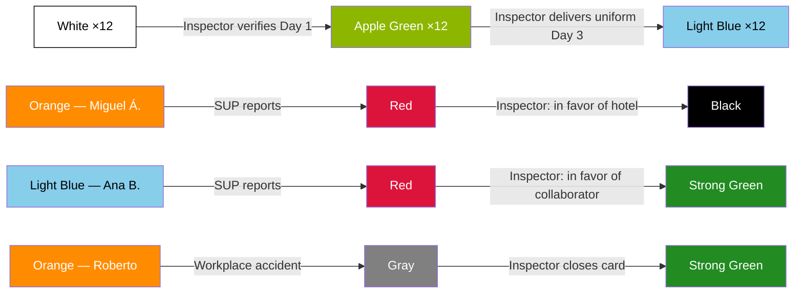

# Complete simulation — Inspection point of view

> [!abstract] Purpose
> This simulation narrates a complete operational week from the perspective of the [[Inspector|Inspector]], the field role of the [[Inspection/Inspection|Inspection]] department. It covers all of the Inspector's responsibilities: arrival verification on Day 1, uniform delivery on Day 3, investigation of reports with two opposite outcomes (Blacklist and reinstatement), full management of a workplace accident, use of the Extended Lunch Indicator, and coverage for unavailability managed by the [[Inspection/Coordinator|Coordinator]]. The cycle closes with quality supervision (QA) and the measurement of the department's 5 KPIs. All data are fictitious, but every action, transition and rule faithfully respects the vault documentation.

## Simulation characters

| Character | Role | Department |
|---|---|---|
| Daniel Ortega | [[Inspector|Inspector]] (Noroeste zone) | Inspection — Oranje |
| Raúl Méndez | [[Inspection/Coordinator\|Coordinator]] | Inspection — Oranje |
| Operator 1 | [[QA Operator|QA Operator]] (permanently assigned to Inspection) | QA — Oranje |
| Laura Ibarra | [[Inspector|Inspector]] (Sur zone) — temporary coverage | Inspection — Oranje |
| Mariana Vega | [[Supervisor|Supervisor]] | Hotel Costa Esmeralda |
| Carlos Navarro | [[General Manager|General Manager]] | Hotel Costa Esmeralda |
| Gabriel Herrera | [[Area Manager|Area Manager]] | Hotel Sierra del Pacífico |
| Teresa Campos | [[Supervisor|Supervisor]] | Hotel Sierra del Pacífico |
| Ana Belén Herrera | Collaborator ([[Posiciones\|Housekeeper]]) | Assigned to Hotel Costa Esmeralda |
| Sofía Cruz | Collaborator ([[Posiciones\|Housekeeper]]) | Assigned to Hotel Costa Esmeralda |
| Miguel Ángel Paredes | Collaborator ([[Posiciones\|Houseman]]) | Assigned to Hotel Sierra del Pacífico |
| Roberto Lara | Collaborator ([[Posiciones\|Houseman]]) | Assigned to Hotel Sierra del Pacífico |
| + 10 collaborators | Various (HK, HM, LN) | Assigned to Hotel Costa Esmeralda |

---

## Phase 1 — Assignment and context

> Reference: [[Inspection Rules|Inspection Rules]] · [[Zones|Zones]] · [[Onboarding Status Light|Onboarding Status Light]]

### 1.1 — The Noroeste zone Inspector

It is Monday, July 21, 2026, 6:00 AM. Daniel Ortega, [[Inspector|Inspector]] permanently assigned to the [[Zones|Noroeste]] zone by [[Inspection/Coordinator|Coordinator]] Raúl Méndez, reviews his agenda for the week. He has two active hotels in his zone:

| Hotel | Onboarding Status | Situation |
|---|---|---|
| Hotel Costa Esmeralda | **Orange** (since Jul 11) | New client. First operational week begins today |
| Hotel Sierra del Pacífico | **Orange** (veteran) | Active hotel with collaborators in Orange status (Permanent) |

Hotel Costa Esmeralda was converted to an active client on July 11. Its first [[Requisition|Requisition]] (202607141015A3) was authorized on July 14 with 13 positions: 8 [[Posiciones|Housekeeper]], 3 [[Posiciones|Houseman]] and 2 [[Posiciones|Laundry]], all with a start date of today. When the requisition was authorized, Daniel was automatically assigned to the header according to the hotel's zone.

> [!info] Onboarding Status Light
> Hotel Costa Esmeralda in **Orange** — Agreement signed, active client hotel
> **Date:** 2026-07-11 · **Operational responsible:** Daniel Ortega (Inspector)

> [!warning] Business rule
> When a requisition is authorized, the [[Inspector|Inspector]] is automatically assigned to the header according to the hotel's [[Zones|zone]]. — [[Inspection Rules|Inspection Rules]]

> [!warning] Business rule
> **Orange is the only status of the [[Onboarding Status Light|Onboarding Status Light]] that enables the hotel to generate [[Requisition|requisitions]].** Before this status, the hotel is a commercial prospect with no operational access. — [[Inspection Rules|Inspection Rules]]

---

## Phase 2 — Day 1 arrival verification

> Reference: [[Inspection Rules|Inspection Rules]] · [[Collaborator Status Light|Collaborator Status Light]]

### 2.1 — Daniel shows up at the property

Monday, July 21, 6:45 AM. Daniel shows up at Hotel Costa Esmeralda. The 13 collaborators assigned by the [[Recruiter|Recruiter]] must show up between 6:30 and 7:00 to begin their first day. Daniel positions himself at the staff entry point to verify each arrival: he confirms identity, records arrival time and validates that the collaborator shows up at the correct location.

### 2.2 — Verification result

| # | Collaborator | Position | Arrival time | Result |
|---|---|---|---|---|
| 1 | Ana Belén Herrera | Housekeeper | 06:38 | Verified |
| 2 | Sofía Cruz | Housekeeper | 06:42 | Verified |
| 3 | Patricia Solís | Housekeeper | 06:35 | Verified |
| 4 | Diana Robles | Housekeeper | 06:50 | Verified |
| 5 | Lucía Márquez | Housekeeper | 06:44 | Verified |
| 6 | Carmen Delgado | Housekeeper | 06:47 | Verified |
| 7 | Verónica Estrada | Housekeeper | 06:55 | Verified |
| 8 | Gabriela Pineda | Housekeeper | 06:40 | Verified |
| 9 | Fernando Ríos | Houseman | 06:36 | Verified |
| 10 | Héctor Sandoval | Houseman | 06:48 | Verified |
| 11 | Tomás Aguirre | Houseman | 06:52 | Verified |
| 12 | Adriana López | Laundry | 06:30 | Verified |
| 13 | Ernesto Solís | Laundry | — | **Did not show up** |

12 of 13 collaborators show up. Ernesto Solís does not appear. Daniel records the absence.

> [!info] Collaborator Status Light
> **White** → **Apple Green** — Day 1 verified (×12 collaborators)
> **Date:** 2026-07-21 · **Responsible:** Daniel Ortega (Inspector) · **Comment:** "12 of 13 collaborators verified on site. Ernesto Solís did not show up."

> [!warning] Business rule
> `White → Apple Green`: upon being assigned and attending Day 1. The [[Inspector|Inspector]] verifies their arrival on site at the property. — [[Collaborator Status Light|Collaborator Status Light]]

> [!warning] Business rule
> Ernesto Solís remains in **White**. If he accumulates 3 absences, the system automatically moves him to **Black** (Blacklist). The 3-absences route is automatic and does **not** go through Red or the Inspector. — [[Inspection Rules|Inspection Rules]] · [[Blacklist|Blacklist]]

> [!tip] QA — Operator 1 observes
> Day 1 verification rate: 12/13 = **92.3%**. Target: ≥ 95%. Status: **At risk** (85–94%). Operator 1 records that the failure is not attributable to the Inspector (the collaborator simply did not show up), but the metric is counted. — [[Metrics and KPIs by Department#Inspección|KPI 1]]

---

## Phase 3 — Day 3 uniform delivery

> Reference: [[Inspection Rules|Inspection Rules]] · [[Collaborator Status Light|Collaborator Status Light]] · [[Deductions|Deductions]]

### 3.1 — Third day of operation

Wednesday, July 23. The 12 collaborators who started on Monday have clocked in 3 consecutive days. Daniel shows up at Hotel Costa Esmeralda with the uniforms prepared.

### 3.2 — Uniform delivery

Daniel personally delivers the uniform to each of the 12 collaborators, verifying that the size is correct and that the collaborator signs the acknowledgment of receipt. Upon completing the delivery and recording the third-day clock-in, the system executes the transition.

> [!info] Collaborator Status Light
> **Apple Green** → **Light Blue** — Day 3, uniform delivered (×12 collaborators)
> **Date:** 2026-07-23 · **Responsible:** Daniel Ortega (Inspector) · **Comment:** "Uniforms delivered to 12 collaborators. All clocked in 3 consecutive days."

> [!warning] Business rule
> `Apple Green → Light Blue`: when the collaborator clocks in at the property on the third day. The [[Inspector|Inspector]] delivers their uniform. — [[Collaborator Status Light|Collaborator Status Light]]

> [!tip] Automatic system actions
> A [[Deductions|deduction]] of **$15 USD** per uniform is generated for each of the 12 collaborators. Total: $180 USD in uniform deductions.

> [!tip] QA — Operator 1 observes
> Day 3 uniform delivery rate: 12/12 = **100%**. Target: ≥ 95%. Status: **On target**. — [[Metrics and KPIs by Department#Inspección|KPI 2]]

---

## Phase 4 — Hotel report (Red → Black)

> Reference: [[Inspection Rules|Inspection Rules]] · [[Collaborator Status Light|Collaborator Status Light]] · [[Blacklist|Blacklist]]

### 4.1 — The Supervisor reports a collaborator

Thursday, July 24, 9:20 AM. Teresa Campos, [[Supervisor|Supervisor]] of Hotel Sierra del Pacífico, reports **Miguel Ángel Paredes** (Houseman, **Orange** status — Permanent) for inappropriate behavior with a guest during the morning cleaning service.

Miguel Ángel transitions to **Red** (Reported).

> [!info] Collaborator Status Light
> **Orange** → **Red** — Reported by the hotel
> **Date:** 2026-07-24 09:20 · **Responsible:** Teresa Campos (Supervisor) · **Comment:** "Inappropriate behavior with a guest in the rooms area."

> [!warning] Business rule
> The **Red** status can be activated by: [[General Manager|General Manager]], [[Area Manager|Area Manager]] or [[Supervisor|Supervisor]]. Upon activation, the zone's [[Inspector|Inspector]] investigates the case. — [[Collaborator Status Light|Collaborator Status Light]]

### 4.2 — Daniel investigates

Daniel receives the notification and travels to Hotel Sierra del Pacífico. He executes his investigation process:

| Step | Action | Result |
|---|---|---|
| 1 | Interviews Teresa Campos (SUP) | Describes the incident: Miguel Ángel responded rudely to a guest who requested additional towels |
| 2 | Reviews Miguel Ángel's [[Timesheet|Timesheet]] | The day's clock-ins are correct. No anomalies in records |
| 3 | Interviews a witness (another collaborator present) | Confirms the Supervisor's version: the collaborator raised his voice in front of the guest |
| 4 | Interviews Miguel Ángel Paredes | Acknowledges that he lost his composure but claims he was provoked. Presents no valid justification |

### 4.3 — Resolution: in favor of the hotel

The evidence is clear. Two independent testimonies (Supervisor and witness) confirm the incident. Miguel Ángel partially acknowledged the facts. Daniel evaluates the case and decides: **dispute in favor of the hotel**.

Daniel executes the transition to Black (manual Blacklist).

> [!info] Collaborator Status Light
> **Red** → **Black** — Blacklist (dispute in favor of the hotel)
> **Date:** 2026-07-24 14:30 · **Responsible:** Daniel Ortega (Inspector) · **Comment:** "Investigation completed. Inappropriate behavior confirmed by SUP and witness. Dispute resolved in favor of the hotel."

> [!warning] Business rule — Autonomous authority
> The [[Inspector|Inspector]] has **his own authority** to decide the result of the investigation, with no need for escalation or validation by any other role. — [[Inspection Rules|Inspection Rules]]

> [!warning] Business rule — Manual blacklisting
> The [[Inspector|Inspector]] is the **only role** that can execute manual entry into the [[Blacklist|Blacklist]]. — [[Inspection Rules|Inspection Rules]]

> [!warning] Business rule — Permanence
> **Black is PERMANENT.** There is no rehabilitation or appeal process. Miguel Ángel Paredes is permanently banned from the system. — [[Blacklist|Blacklist]]

> [!tip] QA — Operator 1 observes
> Report resolution time: **same day** (9:20 → 14:30 = ~5 hours). Target: ≤ 3 days. Status: **On target**. — [[Metrics and KPIs by Department#Inspección|KPI 3]]

---

## Phase 5 — Second report (Red → Strong Green)

> Reference: [[Inspection Rules|Inspection Rules]] · [[Collaborator Status Light|Collaborator Status Light]]

### 5.1 — Report for alleged absence

Friday, July 25, 8:00 AM. Mariana Vega, [[Supervisor|Supervisor]] of Hotel Costa Esmeralda, reports **Ana Belén Herrera** (Housekeeper, **Light Blue** status — Day 5) for an alleged absence the previous day (Thursday 24). Mariana indicates that Ana Belén did not appear on the visual staff list she reviewed that morning.

Ana Belén transitions to **Red** (Reported).

> [!info] Collaborator Status Light
> **Light Blue** → **Red** — Reported by the hotel
> **Date:** 2026-07-25 08:00 · **Responsible:** Mariana Vega (Supervisor) · **Comment:** "Collaborator did not appear on the staff list for Thursday 24."

### 5.2 — Daniel investigates

Daniel is in the zone and goes to Hotel Costa Esmeralda. He executes his investigation:

| Step | Action | Result |
|---|---|---|
| 1 | Interviews Mariana Vega (SUP) | States she did not see Ana Belén on Thursday 24 when doing the visual roll call |
| 2 | Reviews Ana Belén's [[Timesheet|Timesheet]] | **Discovers that there are indeed recorded clock-ins** for Thursday 24: entry 06:42, lunch-out 11:45, lunch-in 12:10, exit 15:02. Full shift |
| 3 | Verifies with the [[Schedule|Schedule]] | Ana Belén was scheduled and covered for Thursday 24 |
| 4 | Interviews Ana Belén Herrera | Confirms she worked normally. She was assigned to a different floor than the one the Supervisor reviewed |

### 5.3 — Resolution: in favor of the collaborator

The [[Timesheet|Timesheet]] proves that Ana Belén worked her full shift on Thursday 24. The report was the product of an administrative error: the Supervisor reviewed the staff list of a different floor than the one Ana Belén was assigned to that day. Daniel decides: **dispute in favor of the collaborator**.

Daniel executes the transition from Red to Strong Green (reinstatement).

> [!info] Collaborator Status Light
> **Red** → **Strong Green** — Reinstatement (dispute in favor of the collaborator)
> **Date:** 2026-07-25 11:00 · **Responsible:** Daniel Ortega (Inspector) · **Comment:** "Timesheet confirms full shift on Jul 24. Administrative error by the Supervisor when verifying the staff list. Collaborator reinstated."

> [!warning] Business rule — Autonomous authority
> The [[Inspector|Inspector]] has **his own authority** to decide the result. In this case, the [[Timesheet|Timesheet]] evidence is conclusive in favor of the collaborator. — [[Inspection Rules|Inspection Rules]]

> [!warning] Business rule — Red vs. 3 absences
> The accumulation of 3 absences does **not** go through Red or the Inspector; that route goes directly to **Black** automatically by the system. Hotel reports (Red) are a different path that always requires investigation by the Inspector. — [[Inspection Rules|Inspection Rules]]

> [!tip] QA — Operator 1 observes
> Second report resolved in **same day** (8:00 → 11:00 = 3 hours). Cumulative average resolution time: (~5h + ~3h) / 2 = **~4 hours**. Target: ≤ 3 days. Status: **On target**. — [[Metrics and KPIs by Department#Inspección|KPI 3]]

---

## Phase 6 — Workplace Accident

> Reference: [[Workplace Accident Flow|Workplace Accident Flow]] · [[Workplace Accident|Workplace Accident]] · [[Inspection Rules|Inspection Rules]] · [[Collaborator Status Light|Collaborator Status Light]]

### 6.1 — The accident (Scenario A)

Saturday, July 26, 10:15 AM. **Roberto Lara** (Houseman, **Orange** status — Permanent), assigned to Hotel Sierra del Pacífico, suffers a fall while moving heavy cleaning equipment in the laundry area. The floor was wet and uneven.

Roberto opens the app from his phone and generates an accident report (**Scenario A**: the collaborator reports from the app).

> [!tip] Automatic system actions — [[Workplace Accident Flow|Workplace Accident Flow]]
> 1. The **Workplace Accident card** is generated with an automatic number
> 2. Roberto transitions to **Gray** (Injured)
> 3. The signal arrives **simultaneously** to Teresa Campos (Supervisor) and Daniel Ortega (Inspector, Noroeste zone)

> [!info] Collaborator Status Light
> **Orange** → **Gray** — Injured
> **Date:** 2026-07-26 10:15 · **Responsible:** Roberto Lara (collaborator report) · **Comment:** "Fall in the laundry area. Wet floor."

### 6.2 — In-person capture by the Supervisor

Teresa Campos goes to the accident site and captures the in-person information on the card:

| Field (SUP) | Value |
|---|---|
| Exact location | Laundry area, loading zone |
| Circumstances | Fall while moving heavy equipment, wet and uneven floor |
| Witnesses | Another collaborator present in the area |
| Immediate care | Ice applied, immobilization of right wrist |

### 6.3 — Medical follow-up by the Inspector

Daniel receives the notification at 10:20 AM and travels to Hotel Sierra del Pacífico. He assesses the situation with Teresa and decides to transfer Roberto to the nearest medical center. Daniel complements the accident card with the medical information:

| Field (Inspector) | Value |
|---|---|
| Transfer to medical center | Centro Médico Noroeste, arrival 11:30 AM |
| Diagnosis | Mild fracture of the right wrist |
| Days of disability | 5 days (from July 26 to 30) |
| Medical observations | Splint placed. Absolute rest. Follow-up review scheduled for July 31 |

### 6.4 — Protection during Gray status

Sunday, July 27. Roberto obviously does not show up for work. This absence does **not** count toward the rule of 3 absences → Blacklist, because Roberto is protected in **Gray** status.

> [!warning] Business rule — Protection in Gray
> While the collaborator is in **Gray** status (Injured), absences do **not** count toward the rule of 3 absences → Black. The Inspector manages the exit from that status when closing the card. — [[Collaborator Status Light|Collaborator Status Light]] · [[Inspection Rules|Inspection Rules]]

### 6.5 — Card closure and discharge

Thursday, July 31. Roberto attends his follow-up medical review. The doctor confirms favorable progress and grants the **medical discharge**. Daniel receives the documentation, verifies that the information is complete and **closes the accident card** in the system.

> [!info] Collaborator Status Light
> **Gray** → **Strong Green** — Medical discharge, accident card closed
> **Date:** 2026-07-31 · **Responsible:** Daniel Ortega (Inspector) · **Comment:** "Medical discharge confirmed. Card closed. Collaborator available for reassignment."

Roberto remains in **Strong Green** status (Available) in the [[Collaborator Pool|Collaborator Pool]], ready to be reassigned to a new position.

> [!warning] Business rule — Final party responsible for closing
> The [[Inspector|Inspector]] is **always** the final party responsible for closing the accident card. This is a rule with no documented exception. — [[Inspection Rules|Inspection Rules]] · [[Workplace Accident Flow|Workplace Accident Flow]]

> [!warning] Business rule — Requirements to close Gray
> `Gray → Strong Green` requires: **medical discharge** + **card closure by the Inspector**. Both conditions are mandatory. — [[Collaborator Status Light|Collaborator Status Light]]

> [!tip] QA — Operator 1 observes
> Accident closure time: **5 days** (Jul 26 → Jul 31). Target: ≤ 7 days. Status: **On target**. — [[Metrics and KPIs by Department#Inspección|KPI 4]]

---

## Phase 7 — Extended Lunch Indicator

> Reference: [[Timesheet|Timesheet]] · [[Inspection Rules|Inspection Rules]]

### 7.1 — Routine review of Timesheets

Friday, July 25, 4:00 PM. As part of his routine supervision, Daniel reviews the [[Timesheet|Timesheets]] of his hotels. At Hotel Costa Esmeralda, he detects that **Sofía Cruz** (Housekeeper, Light Blue status) has had an extended lunch on 3 of the 5 days of the week:

| Day | Lunch-out | Lunch-in | Lunch time | Indicator |
|---|---|---|---|---|
| Monday 21 | 11:30 | 12:05 | 35 min | Extended |
| Tuesday 22 | 11:45 | 12:27 | 42 min | Extended |
| Wednesday 23 | 12:00 | 12:30 | 30 min | Normal |
| Thursday 24 | 11:50 | 12:28 | 38 min | Extended |
| Friday 25 | 12:00 | 12:30 | 30 min | Normal |

The Extended Lunch Indicator activates automatically when the lunch time exceeds 30 minutes. Sofía has the indicator active on 3 of 5 shifts.

### 7.2 — Inspector's action

Daniel takes note for preventive follow-up. On his next visit to the hotel, he could talk with Sofía about managing her lunch times. It is not a disciplinary action; the indicator is an internal supervision tool of Oranje.

> [!warning] Business rule — Restricted visibility
> The Extended Lunch Indicator is visible **only** to: [[Inspector|Inspector]], [[Inspection/Coordinator|Coordinator]] and [[Recruitment Manager|Recruitment Manager]]. It is **not visible** to the hotel's [[General Manager|General Manager]], [[Area Manager|Area Manager]] or [[Supervisor|Supervisor]]. — [[Inspection Rules|Inspection Rules]] · [[Timesheet|Timesheet]]

> [!warning] Business rule — Not punitive
> The Extended Lunch Indicator is **not automatically punitive**. It is an internal supervision tool of Oranje. — [[Inspection Rules|Inspection Rules]]

> [!warning] Business rule — Lunch deduction
> Lunch ≥ 30 min: the actual time taken is deducted. Lunch < 30 min: 30 min are deducted (mandatory minimum). No lunch clock-in: auto-deduction of 30 min. — [[Timesheet|Timesheet]]

---

## Phase 8 — Unavailability and reassignment

> Reference: [[Inspection Rules|Inspection Rules]] · [[Inspection/Coordinator|Coordinator]] · [[Zones|Zones]]

### 8.1 — The Inspector is absent

Monday, July 28, 7:00 AM. Daniel Ortega notifies [[Inspection/Coordinator|Coordinator]] Raúl Méndez that he has a personal emergency and will not be able to show up for work today.

### 8.2 — The Coordinator reassigns

Raúl Méndez assesses the coverage situation. The Noroeste zone cannot be left without an Inspector, especially with two active hotels in full operation. He decides to temporarily reassign **Laura Ibarra**, [[Inspector|Inspector]] of the Sur zone, to cover the Noroeste zone during Daniel's absence.

Laura shows up at the hotels of the Noroeste zone. No major incidents occur during the day — she performs a routine supervision visit to Hotel Costa Esmeralda and Hotel Sierra del Pacífico.

### 8.3 — Return of the titular Inspector

Tuesday, July 29. Daniel returns to his normal operation. Daniel's permanent assignment to the Noroeste zone did **not** change during his absence. Laura Ibarra returns to her Sur zone. Raúl Méndez records the temporary reassignment in the system.

> [!warning] Business rule — Temporary reassignment
> If the [[Inspector|Inspector]] assigned to a zone is not available (illness, emergency or other cause), the [[Inspection/Coordinator|Coordinator]] temporarily reassigns another Inspector to guarantee operational coverage. — [[Inspection Rules|Inspection Rules]]

> [!warning] Business rule — Permanent assignment intact
> The temporary reassignment does **not modify** the permanent zone assignment. It is coverage until the titular Inspector returns. — [[Inspection Rules|Inspection Rules]]

> [!tip] QA — Operator 1 observes
> Zone coverage during the absence: **6/6** (Laura covered Noroeste). Target: 6/6 (100%). Status: **On target**. If the zone had not been covered: 5/6 = 83% → **At risk**. — [[Metrics and KPIs by Department#Inspección|KPI 5]]

---

## Phase 9 — QA supervision: closing the cycle

> Reference: [[Metrics and KPIs by Department#Inspección|Inspection Metrics]] · [[Quality Indicator|Quality Indicator]] · [[QA Rules|QA Rules]]

The [[QA Operator|QA Operator]] (Operator 1), permanently assigned to the [[Inspection/Inspection|Inspection]] department, has observed the entire cycle without executing any operational action. Their role is exclusively observation, measurement and feedback.

### Summary of measured KPIs (week of July 21–31, 2026)

| # | KPI | Result in this simulation | Target | Status |
|---|---|---|---|---|
| 1 | **Day 1 verification rate** | 12/13 = 92.3% | ≥ 95% | ⚠ At risk (85–94%) |
| 2 | **Day 3 uniform delivery rate** | 12/12 = 100% | ≥ 95% | On target |
| 3 | **Average report resolution time (Red)** | (~5h + ~3h) / 2 = ~4 hours | ≤ 3 days | On target |
| 4 | **Average accident closure time (Gray → Strong Green)** | 5 days (Jul 26 → Jul 31) | ≤ 7 days | On target |
| 5 | **Zone coverage (6 zones with active Inspector)** | 6/6 = 100% (temporary reassignment covered the absence) | 6/6 (100%) | On target |

### Formal observation by Operator 1

KPI 1 (Day 1 verification rate) is **at risk**. A collaborator did not show up on Day 1 and verification could not be completed at 100%. Although the absence is not attributable to the Inspector (the collaborator simply did not arrive), the metric is counted. If the pattern repeats in the coming weeks, Operator 1 will issue a formal observation to the department.

The Inspection department's [[Quality Indicator|Quality Indicator]] remains in **Green** (Optimal quality). A single KPI at risk does not justify a transition to Yellow.

> [!warning] Business rule
> QA does not execute the Inspection operation; it only observes, measures and provides feedback. If the department's [[Quality Indicator|Quality Indicator]] reaches **Red** with no improvement after notification, the [[QA Manager|QA Manager]] escalates to management. — [[QA Rules|QA Rules]]

---

## Summary of Collaborator Status Light transitions

| Date | Collaborator(s) | Transition | Action | Responsible |
|---|---|---|---|---|
| Jul 21 2026 | 12 new collaborators | White → **Apple Green** | Day 1 arrival verification | Daniel Ortega (Inspector) |
| Jul 23 2026 | 12 collaborators | Apple Green → **Light Blue** | Day 3 uniform delivery | Daniel Ortega (Inspector) |
| Jul 24 2026 | Miguel Ángel Paredes | Orange → **Red** | Supervisor's report | Teresa Campos (SUP) |
| Jul 24 2026 | Miguel Ángel Paredes | Red → **Black** | Dispute in favor of the hotel (manual Blacklist) | Daniel Ortega (Inspector) |
| Jul 25 2026 | Ana Belén Herrera | Light Blue → **Red** | Supervisor's report | Mariana Vega (SUP) |
| Jul 25 2026 | Ana Belén Herrera | Red → **Strong Green** | Dispute in favor of the collaborator | Daniel Ortega (Inspector) |
| Jul 26 2026 | Roberto Lara | Orange → **Gray** | Workplace accident (Scenario A) | Roberto Lara (collaborator) |
| Jul 31 2026 | Roberto Lara | Gray → **Strong Green** | Medical discharge + card closure | Daniel Ortega (Inspector) |

---

## Referenced modules and concepts

| Module | Reference |
|---|---|
| Inspection | [[Inspection/Inspection\|Inspection]] · [[Inspection Rules|Inspection Rules]] |
| Inspection roles | [[Inspector|Inspector]] · [[Inspection/Coordinator\|Coordinator]] |
| Collaborator Status Light | [[Collaborator Status Light|Collaborator Status Light]] |
| Workplace Accident | [[Workplace Accident|Workplace Accident]] · [[Workplace Accident Flow|Workplace Accident Flow]] |
| Blacklist | [[Blacklist|Blacklist]] |
| Daily operation | [[Timesheet|Timesheet]] · [[Schedule|Schedule]] |
| Requisitions | [[Requisition|Requisition]] · [[Requisition Flow|Requisition Flow]] |
| Hotel | [[Hotel/Hotel\|Hotel]] · [[Hotel Rules|Hotel Rules]] |
| Hotel roles | [[General Manager|General Manager]] · [[Area Manager|Area Manager]] · [[Supervisor|Supervisor]] |
| Quality | [[QA Operator|QA Operator]] · [[QA Manager|QA Manager]] · [[Quality Indicator|Quality Indicator]] · [[Metrics and KPIs by Department|Metrics and KPIs by Department]] · [[QA Rules|QA Rules]] |
| Onboarding | [[Onboarding Status Light|Onboarding Status Light]] |
| Catalogs | [[Zones|Zones]] · [[Posiciones|Positions]] |
| Pool and recruitment | [[Collaborator Pool|Collaborator Pool]] · [[Recruiter|Recruiter]] · [[Recruitment Manager|Recruitment Manager]] |
| Accounting | [[Deductions|Deductions]] |
| General rules | [[Business Rules|Business Rules]] · [[Collaborator Rules|Collaborator Rules]] |
| Sales (continuity) | [[Business Developer|Business Developer]] · [[Business Developer Coordinator|Business Developer Coordinator]] |

---

## Related simulations

- [[Simulation - Sales Point of View|Sales Point of View Simulation]] — Narrates how Hotel Costa Esmeralda became an active client, with the same characters (Daniel Ortega, Mariana Vega, Carlos Navarro) from the commercial perspective.
- [[Simulation - Hotel Point of View|Hotel Point of View Simulation]] — Shows the hotel's complete cycle including the daily operation that the Inspector supervises.
- [[Simulation - Recruitment Point of View|Recruitment Point of View Simulation]] — Details the collaborator assignment process that the Inspector later verifies on Day 1 and Day 3.
- [[Simulation - Collaborator Life Cycle|Collaborator Life Cycle Simulation]] — Walks through the collaborator states that the Inspector monitors: reports, accidents, Blacklist and reinstatement.
