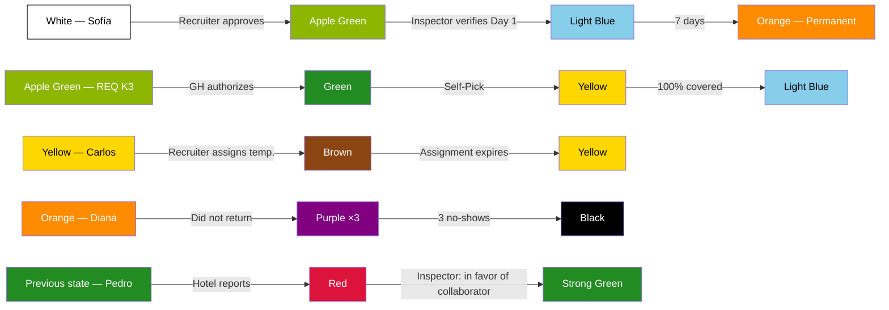

# Complete simulation — Recruitment Point of View

> [!abstract] Purpose
> This simulation narrates a complete operational week from the perspective of the [[Recruitment/Recruitment|Recruitment]] department. It walks through all the team's responsibilities: candidate sourcing, Blacklist lookup, requisition self-pick, Pool assignment, collaborator progression, partial coverage with timeout escalation, system auto-assignment, temporary assignment (Brown), incident management (no-shows and reports), and entry into the payment system. The cycle closes with quality supervision (QA) and the measurement of the department's KPIs. All data is fictitious, but every action, transition, and rule faithfully respects the vault documentation.

## Simulation characters

| Character            | Role                                                                  | Department                       |
| -------------------- | -------------------------------------------------------------------- | -------------------------------- |
| Daniela Ríos         | [[Recruitment/Recruiter\|Recruiter]]                             | Recruitment — Oranje (Group A)   |
| Valeria Soto         | [[Recruitment/Recruiter\|Recruiter]]                             | Recruitment — Oranje (Group A)   |
| Lucía Méndez         | [[Recruitment/Recruiters Group Leader\|Group Leader]]       | Recruitment — Oranje (Group A)   |
| Fernando Ortiz       | [[Recruitment/Recruitment Manager\|Recruitment Manager]]      | Recruitment — Oranje             |
| Operator 5           | [[QA Operator\|QA Operator]] (fixedly assigned to Recruitment)    | QA — Oranje                      |
| Marco Duarte         | [[Hotel/Supervisor\|Supervisor]]                                     | Hotel Coral Bay · South Zone     |
| Andrea Fuentes       | [[Hotel/Area Manager\|Area Manager]]                              | Hotel Coral Bay · South Zone     |
| Roberto Lara         | [[Hotel/General Manager\|General Manager]]                           | Hotel Coral Bay · South Zone     |
| Patricia Nava        | [[Hotel/Supervisor\|Supervisor]]                                     | Hotel Sierra Alta · Center Zone  |
| Carmen López         | [[Hotel/Area Manager\|Area Manager]]                              | Hotel Sierra Alta · Center Zone  |
| Javier Torres        | [[Inspection/Inspector\|Inspector]]                                  | South Zone                       |
| Elena Rojas          | [[Inspection/Inspector\|Inspector]]                                  | Center Zone                      |
| Sofía Cruz           | New candidate                                                        | —                                |
| Miguel Ángel Paredes | New candidate                                                        | —                                |
| Luis Gerardo Vega    | Candidate in [[Core/Modules/Blacklist\|Blacklist]]                  | —                                |
| Ana Belén Herrera    | Existing collaborator (Strong Green)                                 | South Zone                       |
| Carlos Rivera        | Existing collaborator (Yellow)                                       | Center Zone                      |
| Diana Morales        | Existing collaborator (Orange, permanent)                           | South Zone                       |
| Pedro Jiménez        | Existing collaborator (later incident)                              | South Zone                       |

---

## Initial system state — Monday May 19, 08:00

> [!info] Simulation conventions
> - The names of people and hotels are fictitious.
> - The dates are based on the week of **Monday May 19 to Sunday May 25, 2026**.
> - Requisition numbers follow the format documented in [[Core/Modules/Requisition/Requisition Flow|Requisition Flow]].
> - Each status light transition cites the corresponding rule.

### Collaborator Pool

| State in [[Core/Modules/Status Lights/Collaborator Status Light\|Collaborator Status Light]] | Quantity | Example                    |
| --------------------------------------------------------------------------------------- | -------- | -------------------------- |
| White (Pre-assignment)                                                                  | 0        | —                          |
| Strong Green (Available)                                                                 | 12       | Ana Belén Herrera + 11 more |
| Yellow (Voluntarily available)                                                          | 3        | Carlos Rivera + 2 more     |
| Orange (Permanent)                                                                       | 8        | Diana Morales + 7 more     |
| Pink (Stand-by)                                                                         | 2        | —                          |
| Brown (Temporary assignment)                                                            | 1        | —                          |

### Previous week's KPIs

All within target according to [[QA/Metrics and KPIs by Department|Metrics and KPIs by Department]].

| KPI                              | Target | Previous week result      |
| -------------------------------- | ------ | ------------------------- |
| Total requisition coverage       | ≥ 85%  | 90%                       |
| Average pick-up time             | ≤ 8h   | 4h                        |
| Auto-assignment rate             | ≤ 5%   | 0%                        |
| Escalation rate                  | ≤ 10%  | 5%                        |
| Blacklist lookup                 | 100%   | 100%                      |
| Pool entry rate                  | ≥ 60%  | 75%                       |

### Requisition inbox

Empty. There are no pending requisitions at the start of the week.

---

## Phase 1 — Continuous recruitment (happy case)

> Reference: [[Recruitment/Recruitment Flow|Recruitment Flow]] · [[Recruitment/Recruitment Rules|Recruitment Rules]] · [[Core/Modules/Blacklist|Blacklist]]

**Protagonists:** Daniela Ríos (Recruiter) and Sofía Cruz (new candidate).

The [[Recruitment/Recruitment Flow|Recruitment Flow]] is continuous: it is always active, whether or not there are open requisitions.

### 1.1 — Monday May 19, 09:00 — Initial interview (Phase 1 of the flow)

Daniela receives Sofía Cruz as a candidate. Before starting any process:

1. Daniela **looks up the [[Core/Modules/Blacklist|Blacklist]]** → Sofía **does not appear** (negative result). - THE SYSTEM DOES THIS AUTOMATICALLY AFTER PHASE 1 (INTERVIEW)

> [!warning] Business rule
> [[Recruitment/Recruitment Rules|Recruitment Rules]] — "The Recruiter must look up the Blacklist before recruiting any candidate."

2. Daniela proceeds with the initial interview and captures the Phase 1 data:

| Field           | Value              |
| --------------- | ------------------ |
| Full name       | Sofía Cruz Mendoza |
| Age             | 24 years           |
| Gender          | Female             |
| Address         | South Zone         |
| Phone           | (555) 012-3456     |

> [!warning] Business rule
> [[Recruitment/Recruitment Flow|Recruitment Flow]] — Phase 1: Initial interview. Responsible: Recruiter.

### 1.2 — Monday May 19, 09:30 — Registration in the app (Phase 2 of the flow)

Sofía downloads the app and completes her data:

| Field                | Value           | Catalog                                                                     |
| -------------------- | --------------- | --------------------------------------------------------------------------- |
| SSN                  | XXX-XX-1234     | —                                                                           |
| ITIN                 | —               | —                                                                           |
| Position             | Housekeeper     | [[Core/Catalogs/Posiciones\|Positions]]                                    |
| English level        | Intermediate    | [[Core/Catalogs/English Levels\|English Levels]]                        |
| Experience level     | 2 years         | —                                                                           |
| Transport type       | Own car         | —                                                                           |
| Modality             | Full time       | [[Core/Catalogs/Employment Types\|Employment Modalities]]       |

> [!warning] Business rule
> [[Recruitment/Recruitment Flow|Recruitment Flow]] — Phase 2: Registration in the app. Responsible: the Collaborator themselves.

### 1.3 — Monday May 19, 10:00 — Emergency data (Phase 3 of the flow)

Sofía completes from the app:

| Field | Value |
|---|---|
| Emergency contact | María Cruz (mother), (555) 098-7654 |
| Blood type | O+ |
| Allergies or conditions | None |

> [!warning] Business rule
> [[Collaborator/Collaborator Rules|Collaborator Rules]] — Phase 3: Emergency data. Responsible: the Collaborator themselves from the app.

### 1.4 — Monday May 19, 10:15 — Validation and approval (Phase 4 of the flow)

Daniela reviews all the information captured in the three phases. Everything is correct.

- Daniela **approves** Sofía Cruz.
- Enables Sofía's access to the system panels.
- **Sofía Cruz enters the [[Core/Modules/Collaborator Pool|Collaborator Pool]].**

> [!warning] Business rule
> [[Recruitment/Recruitment Flow|Recruitment Flow]] — Phase 4: Validation, approval, and enablement. Responsible: Recruiter.

> [!info] Collaborator Status Light
> **—** → **White** — Approved and enters the Pool
> **Date:** 2026-05-19 · **Responsible:** Daniela Ríos (Recruiter) · **Comment:** "Sofía Cruz passes the 4 phases of the Recruitment Flow. Negative Blacklist confirmed."

> [!warning] Business rule
> [[Core/Modules/Status Lights/Collaborator Status Light|Collaborator Status Light]] — "Upon being approved and entering the Pool, the collaborator enters the White state."

> [!tip] QA — Operator 5 observes
> Sofía Cruz enters the Pool. The Blacklist lookup was performed before starting the process. Pool entry rate: under tracking. Target: ≥ 60% (approved / interviewed). — [[QA/Metrics and KPIs by Department|KPI: Pool entry rate]]

---

## Phase 2 — Candidate in Blacklist

> Reference: [[Core/Modules/Blacklist|Blacklist]] · [[Recruitment/Recruitment Rules|Recruitment Rules]]

**Protagonists:** Daniela Ríos (Recruiter) and Luis Gerardo Vega (banned candidate).

### 2.1 — Monday May 19, 11:00 — Blacklist lookup (positive result)

Luis Gerardo Vega presents himself as a candidate. Daniela starts the standard protocol:

1. **Looks up the [[Core/Modules/Blacklist|Blacklist]]** → Luis Gerardo **appears in Black state**. - THE SYSTEM DOES THIS AUTOMATICALLY IN PHASE 1
   - Recorded reason: 3 no-shows (automatic system Blacklist).

> [!warning] Result
> Luis Gerardo Vega is on the Blacklist. The process stops. It is not possible to recruit him.

- Luis Gerardo does not appear in active searches of the [[Core/Modules/Collaborator Pool|Collaborator Pool]].
- His history is kept for internal consultation.

> [!warning] Business rule
> [[Core/Modules/Blacklist|Blacklist]] — "3 no-shows → automatic system Blacklist."

> [!warning] Business rule
> [[Core/Modules/Blacklist|Blacklist]] — "Black is PERMANENT. There is no rehabilitation or appeal process."

> [!warning] Business rule
> [[Recruitment/Recruitment Rules|Recruitment Rules]] — "The Recruiter must look up the Blacklist before recruiting."

**There is no status light transition. The candidate does not enter the system.**

---

## Phase 3 — Requisition Self-Pick (100% coverage)

> Reference: [[Core/Modules/Requisition/Requisition Flow|Requisition Flow]] · [[Recruitment/Requisition Self-Pick|Requisition Self-Pick]] · [[Core/Modules/Status Lights/Requisition Status Light|Requisition Status Light]] · [[Core/Modules/Status Lights/Requisition Urgency Status Light|Requisition Urgency Status Light]]

**Protagonists:** Daniela Ríos (Recruiter), Andrea Fuentes (GH Hotel Coral Bay), Marco Duarte (SUP).

### 3.1 — Monday May 19, 14:00 — Requisition creation by the hotel

Marco Duarte (Supervisor) creates a requisition in the system:

| Field | Value |
|---|---|
| Requisition number | `202605191400K3` |
| Hotel | Coral Bay |
| Zone | South |
| State | Apple Green (In preparation) |

Requested position:

| Position    | Modality        | Quantity | Start date           | Language preference   | Contract Type |
| ----------- | --------------- | -------- | -------------------- | --------------------- | ------------- |
| Housekeeper | Full time       | 4        | Wednesday May 21     | English - Intermediate | Permanent     |

| Position    | Modality        | Quantity | Start date           | End date           | Language preference   | Contract Type |
| ----------- | --------------- | -------- | -------------------- | ------------------ | --------------------- | ------------- |
| Housekeeper | Full time       | 4        | Wednesday May 21     | Thursday May 22    | English - Intermediate | Temporary     |
> [!warning] Business rule
> [[Core/Modules/Requisition/Requisition Flow|Requisition Flow]] — "GM, GH or SUP creates the requisition with at least one position."

> [!info] Requisition Status Light
> **—** → **Apple Green** — In preparation
> **Date:** 2026-05-19 14:00 · **Responsible:** Marco Duarte (Supervisor)

> [!info] Requisition Positions Status Light
> **—** → **Gold** — In preparation (Housekeeper x4)
> **Date:** 2026-05-19 14:00 · **Responsible:** System

### 3.2 — Monday May 19, 14:30 — Authorization

Andrea Fuentes (Area Manager) reviews and **authorizes** the requisition.

The system calculates the urgency automatically:
- Authorization date: May 19, 14:30
- Position start date: May 21
- Difference: ≈ 42 hours → **Red** (Urgent, < 72h)

The zone Inspector is assigned automatically: **Javier Torres** (South Zone).

> [!warning] Business rule
> [[Core/Modules/Requisition/Requisition Flow|Requisition Flow]] — "Only GM or GH can authorize; the SUP cannot."

> [!warning] Business rule
> [[Core/Modules/Status Lights/Requisition Urgency Status Light|Requisition Urgency Status Light]] — "< 72 hours = Red (Urgent)."

> [!warning] Business rule
> [[Core/Modules/Requisition/Requisition Flow|Requisition Flow]] — "Upon authorizing, the Inspector of the hotel's zone is assigned automatically."

> [!info] Requisition Status Light
> **Apple Green** → **Green** — Authorized
> **Date:** 2026-05-19 14:30 · **Responsible:** Andrea Fuentes (Area Manager)

> [!info] Requisition Positions Status Light
> **Gold** → **Orange** — Authorized (Housekeeper x4)
> **Date:** 2026-05-19 14:30 · **Responsible:** System · **Comment:** "Urgency: Red (< 72h)"

### 3.3 — Monday May 19, 14:35 — Self-Pick

The requisition appears in the shared "Authorized" inbox, visible to the entire Recruitment department. It is prioritized at the top due to its Red urgency.

Daniela Ríos sees it and **picks it up** (first to confirm).

> [!warning] Business rule
> [[Recruitment/Requisition Self-Pick|Requisition Self-Pick]] — "Collaborative Self-Pick (RR-15): picking up a requisition does NOT block it for others. If another Recruiter picks it up, she **joins** as a participating recruiter; several can work on it at the same time with shared progress. The concurrency lock drops to the position/slot level (the same collaborator is not assigned to the same position twice). Each pick-up/join/assignment is recorded in the **requisition History** (RR-16)."

> [!info] Requisition Status Light
> **Green** → **Yellow** — In process
> **Date:** 2026-05-19 14:35 · **Responsible:** Daniela Ríos (Recruiter)

### 3.4 — Monday May 19, 14:40 — Pool search and assignment

Daniela consults the [[Core/Modules/Schedule|Schedule]] of Hotel Coral Bay and searches the [[Core/Modules/Collaborator Pool|Collaborator Pool]] with the following filters:

| Filter | Value |
|---|---|
| Position | Housekeeper |
| Zone | South |
| Language | Intermediate or higher |
| Availability | Strong Green or White |

Match results:

| # | Collaborator | Current state | Zone | Language |
|---|---|---|---|---|
| 1 | Ana Belén Herrera | Strong Green | South | Intermediate |
| 2 | Sofía Cruz | White | South | Intermediate |
| 3 | Laura Estrada | Strong Green | South | Advanced |
| 4 | Fernanda Ríos | Strong Green | South | Intermediate |

Daniela assigns the 4 collaborators to Hotel Coral Bay and registers them in the [[Core/Modules/Schedule|Schedule]].

> [!warning] Business rule
> [[Recruitment/Recruiter|Recruiter]] — "Assigns the collaborator to the hotel and registers them in their Schedule."

> [!info] Requisition Positions Status Light
> **Orange** → **Green** — 100% covered (Housekeeper x4)
> **Date:** 2026-05-19 14:40 · **Responsible:** Daniela Ríos (Recruiter)

> [!info] Requisition Status Light
> **Yellow** → **Light Blue** — Fully covered
> **Date:** 2026-05-19 14:40 · **Responsible:** System · **Comment:** "All positions reached Green."

> [!warning] Business rule
> [[Core/Modules/Status Lights/Requisition Positions Status Light|Requisition Positions Status Light]] — "Green: 100% covered. All assigned collaborators confirmed."

> [!warning] Business rule
> [[Core/Modules/Status Lights/Requisition Status Light|Requisition Status Light]] — "Light Blue: Fully covered. Only if ALL positions reach Green."

> [!tip] QA — Operator 5 observes
> REQ 202605191400K3 covered 100% in less than 1 hour since the self-pick. Pick-up time: ~5 minutes from when it appeared in the inbox. Contributes positively to the average pick-up time KPI (target: ≤ 8h). — [[QA/Metrics and KPIs by Department|KPI: Average pick-up time]]

---

## Phase 4 — Collaborator progression and Inspection

> Reference: [[Core/Modules/Status Lights/Collaborator Status Light|Collaborator Status Light]] · [[Core/Modules/Timesheet|Timesheet]] · [[Core/Modules/Business Rules|Business Rules]]

**Protagonists:** Sofía Cruz (new collaborator), Javier Torres (Inspector South Zone).

The progression of Sofía Cruz is narrated after being assigned to Hotel Coral Bay.

### 4.1 — Wednesday May 21 — Day 1: Arrival verification

Sofía Cruz shows up at Hotel Coral Bay at 06:45.

**Javier Torres** (Inspector South Zone) shows up at the hotel and verifies the arrival of Sofía and the other new assigned collaborators.

> [!info] Collaborator Status Light
> **White** → **Apple Green** — Day 1 verified
> **Date:** 2026-05-21 · **Responsible:** Javier Torres (Inspector) · **Comment:** "Sofía Cruz verified on site. First day at Hotel Coral Bay."

> [!warning] Business rule
> [[Core/Modules/Status Lights/Collaborator Status Light|Collaborator Status Light]] — "White → Apple Green: upon being assigned and attending Day 1. The Inspector verifies their arrival on site."

Sofía clocks in for the first time via QR generated by Andrea Fuentes (GH):

| Event | Time |
|---|---|
| Clock-in | 07:00 |
| Lunch out | 12:00 |
| Lunch in | 12:28 |
| Break out | 15:00 |
| Break in | 15:15 |
| Clock-out | 15:30 |

Day calculation:
- Gross hours: 8h 30min
- Actual lunch: 28 min → minimum deduction of **30 min**
- Break: 15 min
- **Net hours: 7h 45min**

> [!warning] Business rule
> [[Core/Modules/Timesheet|Timesheet]] — "6 clock-in events per shift."

> [!warning] Business rule
> [[Core/Modules/Business Rules|Business Rules]] — "Lunch deduction: minimum 30 minutes always, even if less is taken."

### 4.2 — Friday May 23 — Day 3: Uniform delivery

Sofía clocks in for her third consecutive day at Hotel Coral Bay.

Javier Torres shows up again and **delivers the uniform** to Sofía Cruz.

> [!info] Collaborator Status Light
> **Apple Green** → **Light Blue** — Day 3, uniform delivered
> **Date:** 2026-05-23 · **Responsible:** Javier Torres (Inspector) · **Comment:** "Sofía Cruz clocked in 3 consecutive days. Uniform delivered."

> [!warning] Business rule
> [[Core/Modules/Status Lights/Collaborator Status Light|Collaborator Status Light]] — "Apple Green → Light Blue: when they clock in at the property on the third day. The Inspector delivers their uniform."

### 4.3 — Wednesday May 28 — Day 7: Permanent

Sofía completes 7 days at Hotel Coral Bay. The system executes the transition automatically.

> [!info] Collaborator Status Light
> **Light Blue** → **Orange** — 7 days completed (Permanent)
> **Date:** 2026-05-28 · **Responsible:** System · **Comment:** "Automatic transition. Sofía Cruz becomes a permanent collaborator of Hotel Coral Bay."

> [!warning] Business rule
> [[Core/Modules/Status Lights/Collaborator Status Light|Collaborator Status Light]] — "Light Blue → Orange: upon completing 7 days. Automatic transition by system."

**Summary of Sofía Cruz's progression:**

```
— → White → Apple Green → Light Blue → Orange
     (Pool)    (Day 1)       (Day 3)      (Day 7)
```

---

## Phase 5 — Partial coverage and timeout escalation

> Reference: [[Core/Modules/Requisition/Requisition Flow|Requisition Flow]] · [[Recruitment/Requisition Self-Pick|Requisition Self-Pick]] · [[Core/Modules/Status Lights/Requisition Status Light|Requisition Status Light]] · [[Recruitment/Recruitment Rules|Recruitment Rules]]

**Protagonists:** Valeria Soto (Recruiter), Lucía Méndez (Group Leader), Patricia Nava (SUP Hotel Sierra Alta), Carmen López (GH).

### 5.1 — Tuesday May 20, 10:00 — Requisition creation with multiple positions

Patricia Nava (Supervisor) creates a requisition for Hotel Sierra Alta (Center Zone):

| Field | Value |
|---|---|
| Requisition number | `202605201000M7` |
| Hotel | Sierra Alta |
| Zone | Center |

Requested positions:

| Position | Modality | Quantity | Start date |
|---|---|---|---|
| Housekeeper | Full time | 6 | Friday May 23 |
| Houseman | Full time | 2 | Friday May 23 |
| Chef | Full time | 1 | Saturday May 24 |

### 5.2 — Tuesday May 20, 10:30 — Authorization

Carmen López (Area Manager) authorizes the requisition.

Urgency calculation by position:
- Housekeeper and Houseman: May 20 10:30 → May 23 = ≈ 62h → **Red** (< 72h)
- Chef: May 20 10:30 → May 24 = ≈ 86h → **Yellow** (72–120h)

Inspector assigned automatically: **Elena Rojas** (Center Zone).

> [!info] Requisition Status Light
> **Apple Green** → **Green** — Authorized
> **Date:** 2026-05-20 10:30 · **Responsible:** Carmen López (Area Manager)

> [!info] Requisition Positions Status Light
> **Gold** → **Orange** — Authorized (Housekeeper x6, Houseman x2, Chef x1)
> **Date:** 2026-05-20 10:30 · **Responsible:** System · **Comment:** "HK/HM urgency: Red. Chef urgency: Yellow."

### 5.3 — Tuesday May 20, 10:35 — Self-Pick by Valeria

Valeria Soto picks up the requisition from the shared inbox.

> [!info] Requisition Status Light
> **Green** → **Yellow** — In process
> **Date:** 2026-05-20 10:35 · **Responsible:** Valeria Soto (Recruiter)

### 5.4 — Tuesday May 20, 11:00 — Pool search (partial match)

Valeria searches the [[Core/Modules/Collaborator Pool|Collaborator Pool]] filtering by Center Zone:

| Position    | Required   | Found in Pool       | Assigned  | Coverage  |
| ----------- | ---------- | ------------------- | --------- | --------- |
| Housekeeper | 6          | 4                   | 4         | 67%       |
| Houseman    | 2          | 2                   | 2         | 100%      |
| Chef        | 1          | 0                   | 0         | 0%        |

Valeria assigns the 6 collaborators found and **actively searches outside the system** (social media, WhatsApp groups) to cover the 2 missing Housekeeper positions and 1 Chef.

> [!warning] Business rule
> [[Recruitment/Recruitment Rules|Recruitment Rules]] — "If there is no match in the Pool → actively search outside the system (social media, external groups)."

> [!info] Requisition Positions Status Light
> **Orange** → **Red** — Housekeeper x6 (> 25% missing: 4/6 = 67%)
> **Date:** 2026-05-20 11:00 · **Responsible:** System

> [!info] Requisition Positions Status Light
> **Orange** → **Green** — Houseman x2 (100%: 2/2)
> **Date:** 2026-05-20 11:00 · **Responsible:** Valeria Soto (Recruiter)

> [!info] Requisition Positions Status Light
> **Orange** → **Red** — Chef x1 (> 25% missing: 0/1 = 0%)
> **Date:** 2026-05-20 11:00 · **Responsible:** System

> [!tip] QA — Operator 5 observes
> REQ 202605201000M7: partial coverage detected. Housekeeper at 67%, Chef at 0%. Valeria activates external search. Operator 5 records that the requisition is at risk of not meeting the total coverage KPI (target: ≥ 85%). — [[QA/Metrics and KPIs by Department|KPI: Total requisition coverage]]

### 5.5 — Wednesday May 21, 10:35 — Timeout escalation

**24 hours** have passed without covering the pending positions. The urgency of those positions is **Red** (< 72h), so the escalation deadline is **24 hours**.

The system escalates to **Lucía Méndez** (Group Leader).

> [!warning] Escalation activated
> 24h timeout without covering positions with Red urgency.

> [!warning] Business rule
> [[Recruitment/Requisition Self-Pick|Requisition Self-Pick]] — Escalation table:
> - Red (< 72h): 24h without covering → escalates to the Group Leader.
> - Yellow (72–120h): 48h without covering.
> - Strong Green (> 120h): 72h without covering.

The requisition remains in **Yellow** (In process) throughout the escalation.

### 5.6 — Wednesday May 21 – Friday May 23 — Lucía takes over the search

Lucía Méndez takes over the search. She manages to recruit 1 additional Housekeeper through an external group (Miguel Ángel Paredes, who passes through the 4 phases of the [[Recruitment/Recruitment Flow|Recruitment Flow]] and enters the Pool in White before being assigned).

Updated status of positions at the close of Friday 23:

| Position | Assigned / Required | Coverage | State |
|---|---|---|---|
| Housekeeper | 5 / 6 | 83% | Yellow (≤ 25% missing) |
| Houseman | 2 / 2 | 100% | Green |
| Chef | 0 / 1 | 0% | Red (> 25% missing) |

**The requisition closes in Red state** (Partially covered) because at least one position (Chef) did not reach Green.

> [!warning] Business rule
> [[Core/Modules/Status Lights/Requisition Status Light|Requisition Status Light]] — "Red: Partially covered. The requisition only closes in Light Blue if ALL positions reach Green."

> [!info] Requisition Status Light
> **Yellow** → **Red** — Partially covered
> **Date:** 2026-05-23 · **Responsible:** System · **Comment:** "Chef (0/1) not covered. At least one position did not reach Green."

> [!info] Requisition Positions Status Light
> **Red** → **Yellow** — Housekeeper x6 (5/6 = 83%)
> **Date:** 2026-05-23 · **Responsible:** Lucía Méndez (Group Leader)

---

## Phase 6 — System auto-assignment

> Reference: [[Recruitment/Requisition Self-Pick|Requisition Self-Pick]] · [[Recruitment/Recruitment Rules|Recruitment Rules]]

### 6.1 — Tuesday May 20, 16:00 — Untaken requisition

Hotel Coral Bay creates another requisition:

| Field | Value |
|---|---|
| Requisition number | `202605201600P2` |
| Position | Houseman x2 |
| Start date | Monday May 26 |

Andrea Fuentes (GH) authorizes it at 16:00.

Urgency: May 20 16:00 → May 26 = ≈ 152h → **Strong Green** (Normal, > 120h).

The requisition stays in the shared inbox. No Recruiter picks it up — they are all focused on the requisitions with Red urgency.

> [!info] Requisition Status Light
> **—** → **Apple Green** → **Green** — Authorized
> **Date:** 2026-05-20 16:00 · **Responsible:** Andrea Fuentes (Area Manager)

### 6.2 — Wednesday May 21, 16:00 — Auto-assignment

Exactly **24 hours** have passed since the authorization without anyone picking up the requisition.

The system assigns it automatically to the Recruiter with the **lowest load of active requisitions**:
- Valeria Soto: 1 active requisition
- Daniela Ríos: 2 active requisitions
- → It is assigned to **Valeria Soto**.

> [!warning] Business rule
> [[Recruitment/Requisition Self-Pick|Requisition Self-Pick]] — "If a requisition goes more than 24 hours without being picked up, the system assigns it automatically to the Recruiter with the lowest load."

> [!warning] Business rule
> [[Recruitment/Recruitment Rules|Recruitment Rules]] — "The Recruitment Manager does not receive a notification; the process is transparent."

> [!info] Requisition Status Light
> **Green** → **Yellow** — In process (auto-assigned)
> **Date:** 2026-05-21 16:00 · **Responsible:** System · **Comment:** "Auto-assigned to Valeria Soto due to lowest load. 24h without self-pick."

Valeria covers the requisition with 2 collaborators from the Pool in Strong Green. The requisition closes in **Light Blue**.

> [!tip] QA — Operator 5 observes
> REQ 202605201600P2: auto-assigned by system. This requisition feeds the auto-assignment rate KPI (target: ≤ 5%). With 1 of 3 requisitions auto-assigned = 33% — critical value. Operator 5 records the observation for the cycle close. — [[QA/Metrics and KPIs by Department|KPI: Auto-assignment rate]]

---

## Phase 7 — Temporary assignment (Brown)

> Reference: [[Core/Modules/Status Lights/Collaborator Status Light|Collaborator Status Light]] · [[Core/Modules/Schedule|Schedule]] · [[Core/Modules/Timesheet|Timesheet]] · [[Collaborator/Collaborator Rules|Collaborator Rules]]

**Protagonists:** Daniela Ríos, Carlos Rivera (collaborator in Yellow), Diana Morales (collaborator in Orange).

### 7.1 — Thursday May 22, 07:30 — No-show of Diana Morales

Diana Morales (permanent Housekeeper at Hotel Coral Bay, Orange state) does not show up to work. The system marks her as **Purple** (Did not return).

> [!warning] Business rule
> [[Core/Modules/Status Lights/Collaborator Status Light|Collaborator Status Light]] — "Purple: the system marks it when the collaborator does not attend without justification."

Hotel Coral Bay needs to cover that position temporarily.

### 7.2 — Thursday May 22, 08:00 — Search for temporary replacement

Daniela searches the Pool for collaborators available for temporary assignment:
- Carlos Rivera is in **Yellow** state (Voluntarily available).
  - Carlos activated this state himself from the app during his rest period from Hotel Sierra Alta.

> [!warning] Business rule
> [[Core/Modules/Status Lights/Collaborator Status Light|Collaborator Status Light]] — "Yellow: the collaborator activates it themselves from the app. It is the only self-service state, without anyone's approval."

### 7.3 — Thursday May 22, 08:15 — Temporary assignment

Daniela assigns Carlos Rivera **temporarily** to Hotel Coral Bay for **3 days** (Thursday 22, Friday 23, and Saturday 24).

> [!info] Collaborator Status Light
> **Yellow** → **Brown** — Temporary assignment, 3 days
> **Date:** 2026-05-22 08:15 · **Responsible:** Daniela Ríos (Recruiter) · **Comment:** "Temporary replacement of Diana Morales (no-show). Hotel Coral Bay. Duration: 3 days."

> [!warning] Business rule
> [[Core/Modules/Status Lights/Collaborator Status Light|Collaborator Status Light]] — "Yellow → Brown: the Recruiter assigns them temporarily with a duration defined in days."

Effects of the assignment:
- A [[Core/Modules/Schedule|Schedule]] is generated for Carlos at Hotel Coral Bay.
- The Schedule generates a [[Core/Modules/Timesheet|Timesheet]].
- Carlos **can clock in**.

> [!warning] Business rule
> [[Collaborator/Collaborator Rules|Collaborator Rules]] — "Without an active assignment there is no Schedule; without a Schedule there is no Timesheet; without a Timesheet it is not possible to clock in."

### 7.4 — Sunday May 25 — End of temporary assignment

The 3 assigned days expire. Carlos Rivera has **not** finished his rest period from Hotel Sierra Alta.

> [!info] Collaborator Status Light
> **Brown** → **Yellow** — Temporary assignment expires
> **Date:** 2026-05-25 · **Responsible:** System · **Comment:** "Carlos Rivera returns to Yellow because he is still in the rest period from Hotel Sierra Alta."

> [!warning] Business rule
> [[Core/Modules/Status Lights/Collaborator Status Light|Collaborator Status Light]] — "When the assigned days expire: returns to Yellow if still in the rest period, or to Strong Green if no longer."

---

## Phase 8 — Incidents: did not return and reported

> Reference: [[Core/Modules/Blacklist|Blacklist]] · [[Core/Modules/Status Lights/Collaborator Status Light|Collaborator Status Light]] · [[Recruitment/Recruitment Manager|Recruitment Manager]] · [[Inspection/Inspector|Inspector]]

### Case 1: Diana Morales — 3 no-shows → Blacklist

**Thursday May 22** — Diana did not show up (1st no-show). System marks her **Purple**.

**Friday May 23** — Diana does not show up again (2nd no-show). She remains in **Purple**.

**Monday May 26** — Diana does not show up for the third time (3rd no-show).

> [!warning] Automatic blacklisting
> 3 accumulated no-shows → the system executes the transition to **Black** (Blacklist) automatically.

> [!info] Collaborator Status Light
> **Orange** → **Purple** ×3 → **Black** — Automatic blacklisting
> **Date:** 2026-05-22 → 2026-05-26 · **Responsible:** System · **Comment:** "3 accumulated no-shows without justification. Blacklist executed automatically."

> [!warning] Business rule
> [[Core/Modules/Blacklist|Blacklist]] — "3 no-shows → automatic system Blacklist."

> [!warning] Business rule
> [[Core/Modules/Blacklist|Blacklist]] — "Black is PERMANENT. There is no rehabilitation or appeal process."

> [!warning] Business rule
> [[Core/Modules/Status Lights/Collaborator Status Light|Collaborator Status Light]] — "Black: blocked collaborator. Does not appear in active searches. History kept."

Fernando Ortiz (Recruitment Manager) **reviews the Blacklist case** as part of his supervision function.

> [!warning] Business rule
> [[Recruitment/Recruitment Manager|Recruitment Manager]] — "Review Blacklist cases: responsibility of the Recruitment Manager."

### Case 2: Pedro Jiménez — Reported by the hotel

**Friday May 23** — Andrea Fuentes (GH of Hotel Coral Bay) **reports** Pedro Jiménez for inappropriate conduct.

> [!info] Collaborator Status Light
> **[previous state]** → **Red** — Reported by the hotel
> **Date:** 2026-05-23 · **Responsible:** Andrea Fuentes (Area Manager) · **Comment:** "Report for inappropriate conduct."

> [!warning] Business rule
> [[Core/Modules/Status Lights/Collaborator Status Light|Collaborator Status Light]] — "Red: the hotel sets it (GM, GH or SUP). The Inspector investigates and resolves."

**Inspector's investigation:**

Javier Torres (Inspector South Zone) investigates the case. He interviews Pedro, the hotel Supervisor, and reviews the records.

**Result:** the dispute is resolved **in favor of the collaborator**. There was no inappropriate conduct, it was a misunderstanding.

> [!info] Collaborator Status Light
> **Red** → **Strong Green** — Reincorporated (dispute in favor of the collaborator)
> **Date:** 2026-05-26 · **Responsible:** Javier Torres (Inspector) · **Comment:** "Investigation completed. No inappropriate conduct. Misunderstanding resolved in favor of the collaborator."

> [!warning] Business rule
> [[Core/Modules/Status Lights/Collaborator Status Light|Collaborator Status Light]] — "Dispute resolved in favor of the collaborator → returns to Strong Green."

> [!warning] Business rule
> [[Inspection/Inspector|Inspector]] — "The Inspector has their own authority to resolve the dispute, without validation from the Recruitment Manager."

> [!tip] QA — Operator 5 observes
> Two incidents this week: Diana Morales (Blacklist for 3 no-shows, automatic route) and Pedro Jiménez (report resolved by Inspector in favor of the collaborator). Operator 5 records both cases for the close review. The Blacklist lookup rate remains at 100% (2 of 2 candidates looked up). — [[QA/Metrics and KPIs by Department|KPI: Blacklist lookup]]

---

## Phase 9 — Entry into the payment system

> Reference: [[Accounting/Collaborator Weekly Summary|Collaborator Weekly Consolidated]] · [[Accounting/Payroll Flow|Payroll Flow]] · [[Core/Modules/Contrato|Contract]] · [[Accounting/Deductions|Deductions]]

It narrates how the work week of Sofía Cruz and Carlos Rivera reaches the payment system.

### 9.1 — Sunday May 25 — Week close

The system automatically generates the [[Accounting/Collaborator Weekly Summary|Weekly Consolidated]] for each collaborator who had activity during the week.

#### Sofía Cruz (1 hotel)

| Field | Value |
|---|---|
| Hotel | Coral Bay |
| Days worked | 5 (Wednesday 21 – Sunday 25) |
| Gross hours | 40h |
| Lunch deduction | 2.5h (30 min × 5 shifts) |
| Net hours | 37.5h |
| Pay rate | According to Hotel Coral Bay [[Core/Modules/Contrato\|Contract]] |

> [!note] Note
> Sofía joined mid-week (Wednesday 21). The system prorates automatically: the days prior to registration (Monday 19 and Tuesday 20) are marked in Gray in the [[Core/Modules/Status Lights/Timesheet Compliance Indicator|Timesheet Compliance Indicator]].

> [!warning] Business rule
> [[Core/Modules/Business Rules|Business Rules]] — "Mid-week entry: the system automatically prorates the remaining days of the cycle; the days prior to registration are marked in Gray."

#### Carlos Rivera (2 hotels)

Carlos worked at 2 hotels during the week:

| Hotel | Days | Net hours | Pay rate |
|---|---|---|---|
| Sierra Alta (before rest) | 2 | 15h | According to Sierra Alta contract |
| Coral Bay (temporary assignment) | 3 | 22.5h | According to Coral Bay contract |

Overtime is calculated **per hotel**, not globally:
- Sierra Alta: 15h (does not exceed 40h → no overtime)
- Coral Bay: 22.5h (does not exceed 40h → no overtime)

> [!warning] Business rule
> [[Accounting/Collaborator Weekly Summary|Collaborator Weekly Consolidated]] — "Overtime is calculated per hotel according to each contract's policy."

### 9.2 — Monday May 26 — Pre-Payroll

The system generates the Pre-Payroll applying:
- Pay rate from each hotel's [[Core/Modules/Contrato|Contract]].
- Active [[Accounting/Deductions|Deductions]] of the collaborator (uniform, food, 16% withholding).

> [!warning] Business rule
> [[Accounting/Payroll Flow|Payroll Flow]] — Step 2: "Pre-Payroll calculation: applies pay rate, active deductions, authorized overtime."

### 9.3 — Tuesday May 27 — Validation by Accounting

The [[Accountant|Accountant]] reviews and the [[Accounting Manager|Accounting Manager]] approves the Pre-Payroll.

> [!warning] Business rule
> [[Accounting/Payroll Flow|Payroll Flow]] — Step 3: "Pre-Payroll validation by Accounting. Requires approval."

### 9.4 — Wednesday May 28 — Payment executed

The payroll is released and the payment is executed.

> [!warning] Business rule
> [[Accounting/Payroll Flow|Payroll Flow]] — Step 7: "Final authorization and payment execution."

---

## Phase 10 — QA supervision: cycle close

> Reference: [[QA/Metrics and KPIs by Department|Recruitment Metrics]] · [[Quality Indicator|Quality Indicator]] · [[QA Rules|QA Rules]]

The [[QA Operator|QA Operator]] (Operator 5), fixedly assigned to the [[Recruitment/Recruitment|Recruitment]] department, has observed the entire cycle without executing any operational action. Their role is exclusively observation, measurement, and feedback.

### Summary of measured KPIs (week of May 19–25, 2026)

| #   | KPI                                                          | Result in this simulation    | Target | State           |
| --- | ------------------------------------------------------------ | ---------------------------- | ------ | --------------- |
| 1   | **Total requisition coverage** (Light Blue / closed)         | 2 of 3 = 67%                 | ≥ 85%  | Critical (< 70%) |
| 2   | **Average requisition pick-up time**                         | ≈ 3h average                 | ≤ 8h   | On target       |
| 3   | **Auto-assignment rate by timeout**                          | 1 of 3 = 33%                 | ≤ 5%   | Critical (> 15%) |
| 4   | **Escalation rate by timeout to the Leader**                 | 1 of 3 = 33%                 | ≤ 10%  | Critical (> 20%) |
| 5   | **Blacklist lookup compliance**                              | 2 of 2 = 100%                | 100%   | On target       |
| 6   | **Pool entry rate** (approved / interviewed)                 | 2 of 3 = 67%                 | ≥ 60%  | On target       |

### Formal observation by Operator 5

KPIs 1, 3, and 4 are out of target intentionally. The simulation includes adverse scenarios (partial coverage, auto-assignment, escalation) to demonstrate how these mechanisms operate. In a normal operational week, these indicators should be within target.

The [[Quality Indicator|Quality Indicator]] of the Recruitment department remains under observation. KPIs 2, 5, and 6 are on target. KPIs 1, 3, and 4 are in the critical zone due to the concentration of adverse scenarios in the simulated week. If the pattern repeats in the coming weeks, Operator 5 will issue a formal observation to the department.

> [!warning] Business rule
> QA does not execute the Recruitment operation; it only observes, measures, and provides feedback. If the department's [[Quality Indicator|Quality Indicator]] reaches **Red** without improvement after notification, the [[QA Manager|QA Manager]] escalates to management. — [[QA Rules|QA Rules]]

---

## Consolidated summary of status light transitions

| Entity             | Status Light | Transition                  | Day             | Source rule                                                                          |
| ------------------ | ----------- | --------------------------- | --------------- | ------------------------------------------------------------------------------------ |
| Sofía Cruz         | Collaborator | — → White                  | Mon 19          | [[Recruitment/Recruitment Flow\|Recruitment Flow]]                           |
| Sofía Cruz         | Collaborator | White → Apple Green        | Wed 21          | [[Core/Modules/Status Lights/Collaborator Status Light\|Collaborator Status Light]]       |
| Sofía Cruz         | Collaborator | Apple Green → Light Blue    | Fri 23          | [[Core/Modules/Status Lights/Collaborator Status Light\|Collaborator Status Light]]       |
| Sofía Cruz         | Collaborator | Light Blue → Orange        | Wed 28          | [[Core/Modules/Status Lights/Collaborator Status Light\|Collaborator Status Light]]       |
| REQ 202605191400K3 | Requisition | Vm → V → Am → Ac            | Mon 19          | [[Core/Modules/Status Lights/Requisition Status Light\|Requisition Status Light]]         |
| REQ 202605191400K3 | Urgency     | Red                         | Mon 19          | [[Core/Modules/Status Lights/Requisition Urgency Status Light\|Urgency Status Light]] |
| REQ 202605201000M7 | Requisition | Vm → V → Am → Red           | Tue 20 – Fri 23 | [[Core/Modules/Status Lights/Requisition Status Light\|Requisition Status Light]]         |
| REQ 202605201600P2 | Requisition | V → Am (auto) → Ac          | Tue – Wed       | [[Recruitment/Requisition Self-Pick\|Self-Pick]]                              |
| Carlos Rivera      | Collaborator | Am → Brown → Am            | Thu 22 – Sun 25 | [[Core/Modules/Status Lights/Collaborator Status Light\|Collaborator Status Light]]       |
| Diana Morales      | Collaborator | Na → Mo ×3 → Black         | Thu 22 – Mon 26 | [[Core/Modules/Blacklist\|Blacklist]]                                                |
| Pedro Jiménez      | Collaborator | [previous] → Red → Vf      | Fri 23 – Mon 26 | [[Core/Modules/Status Lights/Collaborator Status Light\|Collaborator Status Light]]       |
| Luis G. Vega       | Blacklist   | Lookup: Black (blocked)     | Mon 19          | [[Core/Modules/Blacklist\|Blacklist]]                                                |

**Abbreviations:** Vm = Apple Green, V = Green, Am = Yellow, Ac = Light Blue, Na = Orange, Mo = Purple, Vf = Strong Green.



---

## Modules and concepts referenced

| Module | Reference |
|---|---|
| Recruitment | [[Recruitment/Recruitment\|Recruitment]] · [[Recruitment/Recruitment Rules\|Recruitment Rules]] |
| Recruitment Roles | [[Recruitment/Recruiter\|Recruiter]] · [[Recruitment/Recruiters Group Leader\|Group Leader of Recruiters]] · [[Recruitment/Recruitment Manager\|Recruitment Manager]] |
| Requisitions | [[Core/Modules/Requisition/Requisition Flow\|Requisition Flow]] · [[Recruitment/Requisition Self-Pick\|Requisition Self-Pick]] |
| Collaborator Status Light | [[Core/Modules/Status Lights/Collaborator Status Light\|Collaborator Status Light]] |
| Requisition Status Lights | [[Core/Modules/Status Lights/Requisition Status Light\|Requisition Status Light]] · [[Core/Modules/Status Lights/Requisition Urgency Status Light\|Requisition Urgency Status Light]] · [[Core/Modules/Status Lights/Requisition Positions Status Light\|Requisition Positions Status Light]] |
| Pool and assignment | [[Core/Modules/Collaborator Pool\|Collaborator Pool]] · [[Core/Modules/Schedule\|Schedule]] · [[Core/Modules/Timesheet\|Timesheet]] |
| Blacklist | [[Core/Modules/Blacklist\|Blacklist]] |
| Inspection | [[Inspection/Inspector\|Inspector]] |
| Hotel | [[Hotel/Supervisor\|Supervisor]] · [[Hotel/Area Manager\|Area Manager]] · [[Hotel/General Manager\|General Manager]] |
| Accounting | [[Accounting/Collaborator Weekly Summary\|Collaborator Weekly Consolidated]] · [[Accounting/Payroll Flow\|Payroll Flow]] · [[Core/Modules/Contrato\|Contract]] · [[Accounting/Deductions\|Deductions]] |
| Quality | [[QA Operator\|QA Operator]] · [[Quality Indicator\|Quality Indicator]] · [[QA/Metrics and KPIs by Department\|Metrics and KPIs by Department]] · [[QA Rules\|QA Rules]] |
| Catalogs | [[Core/Catalogs/Posiciones\|Positions]] · [[Core/Catalogs/English Levels\|English Levels]] · [[Core/Catalogs/Employment Types\|Employment Modalities]] |
| General rules | [[Core/Modules/Business Rules\|Business Rules]] · [[Collaborator/Collaborator Rules\|Collaborator Rules]] |

---

## Related simulations

- [[Simulation - Hotel Point of View|Simulation - Hotel Point of View]] — Shows the complete cycle of the hotel as a client, including the creation of requisitions that Recruitment handles.
- [[Simulation - Sales Point of View|Simulation - Sales Point of View]] — Narrates how hotels reach Orange status, enabling the requisitions that start the recruitment flow.
- [[Simulation - Inspection Point of View|Simulation - Inspection Point of View]] — Details the field verification (Day 1, Day 3) that the Inspector performs on the collaborators that Recruitment assigns.
- [[Simulation - Collaborator Life Cycle|Simulation - Collaborator Life Cycle]] — Walks through all the collaborator's states from entry into the Pool to Blacklist, crossing with the assignment processes narrated here.
- [[Simulation - QA Point of View|Simulation - QA Point of View]] — Narrates the quality supervision cycle that Operator 5 applies to the Recruitment metrics documented in this simulation.
- [[Simulation - Accounting Point of View|Simulation - Accounting Point of View]] — Details the processing of the Weekly Consolidated, Pre-Payroll, and Payroll that originates with the collaborators assigned here.
