# Full Simulation — Associate Lifecycle

> [!abstract] Purpose
> This simulation covers the 12 states of the [[Associate Status Indicator]] through the complete story of a fictional associate: Carlos Méndez. Unlike other simulations that follow a department across an operational week, this one narrates the longitudinal lifecycle of an associate: from their sourcing by Recruitment, through hotel onboarding, daily operations, payroll, stand-by, temporary assignment, absence, workplace accident, hotel report, and tax document delivery, through to vacation pay. The cycle closes with quality supervision (QA) and measurement of the Associate module KPIs. All data is fictional, but every action, transition, and rule faithfully reflects the vault documentation.

## Simulation Characters

| Character | Role | Department |
|---|---|---|
| Carlos Méndez | Associate ([[Positions\|Housekeeper]]) | — |
| Operator 3 | [[QA Operator]] (fixed assignment to Associate) | QA — Oranje |
| (Recruiter) | [[Recruiter]] | Recruitment — Oranje |
| (Inspector, Center Zone) | [[Inspector]] | Inspection — Oranje |
| (Inspector, East Zone) | [[Inspector]] | Inspection — Oranje |
| (Supervisor Hotel Riviera) | [[Supervisor]] | Hotel Riviera · Center Zone |
| (Area Manager Hotel Riviera) | [[Area Manager]] | Hotel Riviera · Center Zone |
| (Supervisor Hotel Costa Azul) | [[Supervisor]] | Hotel Costa Azul · East Zone |
| [[Accountant]] | [[Accountant]] | Accounting — Oranje |
| [[Accounting Manager]] | [[Accounting Manager]] | Accounting — Oranje |
| María Méndez | Emergency contact (mother) | — |
| María González | Witness (shift partner) | Hotel Riviera |

### Associate Profile

| Field | Value |
|---|---|
| Name | Carlos Méndez |
| Age | 28 years old |
| Gender | Male |
| Address | Center Zone |
| Phone | (555) 123-4567 |
| Position | Housekeeper |
| English level | Intermediate |
| Experience | 2 years |
| Transportation | Own vehicle |
| Modality | Full time |
| SSN/TaxID | None at start |
| Blood type | O+ |
| Allergies | None |
| Emergency contact | María Méndez (mother) |

---

## Phase 1 — System Entry

> Reference: [[Recruitment Flow]] · [[Recruitment Rules]] · [[Blacklist]] · [[Deductions]]

### 1.1 — Initial interview

The [[Recruiter]] contacts Carlos after identifying him as a viable candidate. During the initial interview, she captures the basic data: name, age, gender, address, and phone. This stage corresponds to the start of the [[Recruitment Flow]].

### 1.2 — App registration

Carlos completes his profile directly from the Oranje app. He enters the following data:

- SSN: none
- ITIN: none
- Position: [[Positions|Housekeeper]]
- English level: [[English Levels|Intermediate]]
- Experience level: 2 years
- Transportation type: own vehicle
- Modality: [[Employment Modalities|Full time]]

### 1.3 — Emergency data

Carlos completes the emergency and health data section:

- Emergency contact: María Méndez (mother)
- Blood type: O+
- Allergies: none

### 1.4 — Validation and approval

The [[Recruiter]] reviews Carlos's profile, approves him, and enables his access to the system panels. Before proceeding, she checks the [[Blacklist]] — Carlos does not appear.

Carlos enters the [[Associate Pool]].

> [!info] Associate Status Indicator
> → **White** — Pre-assignment
> **Responsible:** Recruiter · **Comment:** "Candidate approved, enters the Pool."

> [!warning] Business Rule
> The [[Recruiter]] must check the [[Blacklist]] before recruiting any candidate. — [[Recruitment Rules]]

> [!info] System
> Since Carlos has no SSN or TaxID, the system automatically activates a **16% withholding** on his paycheck. — [[Deductions]]

> [!tip] QA — Operator 3 observes
> Data completeness: Carlos completed all 3 capture phases (interview, app registration, emergency data). Contributes positively to the **Data completeness** KPI (target: ≥ 95%). — [[Metrics and KPIs by Department#Associate|KPI 5]]

---

## Phase 2 — First Assignment and Hotel Onboarding

> Reference: [[Requisition Flow]] · [[Self-Pick]] · [[Associate Status Indicator]] · [[Schedule]] · [[Timesheet]]

### 2.1 — The Requisition

The [[Supervisor]] of Hotel Riviera (Center Zone) creates a [[Requisition]] requesting 2 Housekeepers, full time, starting next Monday, with intermediate English. The [[Area Manager]] authorizes it.

The system calculates urgency: more than 120 hours before the start date = Green (Normal). The positions are reflected in the week's [[Schedule]]. The Center Zone [[Inspector]] is automatically assigned to the requisition.

### 2.2 — Match and assignment

The [[Recruiter]] picks the requisition from the shared queue ([[Self-Pick|Self-Pick]]). She searches the [[Associate Pool]]: Housekeeper, Intermediate, Center Zone, Full time. She finds Carlos (White). She assigns him to Hotel Riviera and registers him in the [[Schedule]].

### 2.3 — Day 1 — Apple Green

Carlos arrives at Hotel Riviera. The [[Inspector]] verifies his arrival on site.

> [!info] Associate Status Indicator
> **White** → **Apple Green** — Day 1 verified
> **Responsible:** Inspector (Center Zone) · **Comment:** "Carlos verified on site at Hotel Riviera."

The [[Timesheet]] is created from the [[Schedule]]. Carlos clocks in for the first time via QR generated by the [[Area Manager]].

### 2.4 — Day 3 — Light Blue

Carlos clocks in at the property on the third day. The [[Inspector]] delivers his uniform.

> [!info] Associate Status Indicator
> **Apple Green** → **Light Blue** — Day 3, uniform delivered
> **Responsible:** Inspector (Center Zone) · **Comment:** "Carlos clocks in Day 3. Uniform delivered."

> [!info] System
> A [[Deductions|deduction]] of **$15 USD** is generated for the uniform, to be applied in the next [[Weekly Associate Summary|Weekly Summary]].

### 2.5 — Day 7+ — Orange

Carlos completes 7 consecutive days. The system transitions him automatically.

> [!info] Associate Status Indicator
> **Light Blue** → **Orange** — Fixed
> **Responsible:** System · **Comment:** "Carlos completed 7 days. He is now a fixed associate at Hotel Riviera."

---

## Phase 3 — Daily Operations

> Reference: [[Timesheet]] · [[Associate Rules]] · [[Inspection Rules]]

A typical day for Carlos at Hotel Riviera. He clocks in via QR generated by the [[Area Manager]].

### 3.1 — Punch records

| Punch | Time | Event |
|---|---|---|
| Clock In | 7:00 AM | Start of shift |
| Lunch Out | 12:00 PM | Goes to lunch |
| Lunch In | 12:35 PM | Returns from lunch |
| Break Out | 3:00 PM | Goes to break |
| Break In | 3:15 PM | Returns from break |
| Clock Out | 5:00 PM | End of shift |

### 3.2 — Hours calculation

| Concept | Calculation | Result |
|---|---|---|
| Gross hours | 5:00 PM − 7:00 AM | 10h 00min |
| Actual lunch | 12:35 PM − 12:00 PM | 35 min |
| Lunch deduction | Actual lunch (35 min) ≥ 30 min → actual time is deducted | 35 min |
| Actual break | 3:15 PM − 3:00 PM | 15 min |
| **Net hours** | 10h 00min − 35min − 15min | **9h 10min** |

> [!warning] Business Rule
> Carlos's lunch (35 min) exceeds 30 minutes. The system activates the **Extended Lunch Indicator**, visible only to the [[Inspector]], [[Coordinator]], and [[Recruitment Manager]]. The hotel **does not have access** to this indicator. It is not automatically punitive.

> [!tip] QA — Operator 3 observes
> Carlos's lunch (35 min) activates the Extended Lunch Indicator. It feeds the **Extended Lunch Rate** KPI (target: ≤ 10%). An isolated shift does not represent an alert, but Operator 3 records the trend. — [[Metrics and KPIs by Department#Associate|KPI 4]]

### 3.3 — Alternative scenario — 25-minute lunch

If Carlos had taken only 25 minutes for lunch:

| Concept | Calculation | Result |
|---|---|---|
| Actual lunch | 25 min | 25 min |
| Lunch deduction | Actual lunch (25 min) < 30 min → the **minimum of 30 min** is deducted | 30 min |
| **Net hours** | 10h 00min − 30min − 15min | **9h 15min** |

> [!warning] Business Rule
> The lunch deduction applies to everyone without exception:
> - Lunch < 30 min → 30 min are deducted (mandatory minimum)
> - Lunch ≥ 30 min → the actual time taken is deducted
> - No lunch punch → auto-deduction of 30 min
>
> After 6 continuous hours of work, the associate must take their lunch. — [[Associate Rules]]

---

## Phase 4 — First Pay Week

> Reference: [[Weekly Associate Summary]] · [[Deductions]] · [[Payroll Flow]] · [[Contract]]

At the close of the week, the system automatically generates Carlos's [[Weekly Associate Summary|Weekly Summary]]. Since he worked only at Hotel Riviera, the summary contains a single [[Timesheet]].

### 4.1 — Week detail

| Day | Gross hours | Lunch | Break | Net hours |
|---|---|---|---|---|
| Monday | 10h 00min | 35 min | 15 min | 9h 10min |
| Tuesday | 8h 00min | 30 min | 15 min | 7h 15min |
| Wednesday | 8h 00min | 30 min | 15 min | 7h 15min |
| Thursday | 8h 00min | 30 min | 15 min | 7h 15min |
| Friday | 8h 00min | 30 min | 15 min | 7h 15min |
| **Total** | **42h 00min** | — | — | **38h 10min** |

The 42 gross hours exceed the 40-hour weekly threshold → **2 hours of overtime** at Hotel Riviera.

### 4.2 — Pay calculation

Carlos's pay rate at Hotel Riviera: **$14.00/hr**.

| Concept | Calculation | Amount |
|---|---|---|
| Regular hours (net − adjusted OT) | 36h 10min × $14.00 | $506.33 |
| Overtime | 2h 00min × $21.00 (1.5×) | $42.00 |
| **Gross subtotal** | | **$548.33** |

### 4.3 — Applied deductions

| Deduction | Amount | Condition |
|---|---|---|
| Uniform | $15.00 | Delivered on Day 3 by the [[Inspector]] |
| Meals | $15.00 | $3.00 × 5 days worked (configured in the [[Contract]]) |
| 16% withholding | $87.73 | 16% of $548.33 (no SSN/TaxID) |
| **Total deductions** | **$117.73** | |

### 4.4 — Final paycheck

| Concept | Amount |
|---|---|
| Gross subtotal | $548.33 |
| Total deductions | −$117.73 |
| **Net paycheck** | **$430.60** |

> [!info] System
> The [[Weekly Associate Summary|Weekly Summary]] is for Accounting use only. Carlos does not have access to this document. The [[Accountant]] reviews it and the [[Accounting Manager]] approves it before releasing payment. — [[Payroll Flow]]

---

## Phase 5 — Stand-by and Voluntary Availability

> Reference: [[Associate Status Indicator]] · [[Associate Rules]] · [[Associate Pool]]

### 5.1 — Pink — Stand-by

Weeks later, Hotel Riviera enters the low season. The [[Supervisor]] puts Carlos on **Pink (Stand-by)** status.

Carlos no longer has a [[Schedule]] or [[Timesheet]].

> [!info] Associate Status Indicator
> **Orange** → **Pink** — Stand-by by hotel
> **Responsible:** Supervisor Hotel Riviera · **Comment:** "Low season. Carlos moves to stand-by."

> [!warning] Business Rule
> In Pink status the associate **cannot clock in**. The chain is: Active assignment → [[Schedule]] → [[Timesheet]] → Clock in. Without an active assignment there is no Schedule; without a Schedule there is no Timesheet; without a Timesheet, clocking in is not possible. — [[Associate Rules]]

> [!tip] QA — Operator 3 observes
> Carlos transitions from Orange (active) to Pink (Stand-by). He leaves the count of deployable associates. Affects the **Pool Health** KPI (target: ≥ 60%). — [[Metrics and KPIs by Department#Associate|KPI 3]]

### 5.2 — Yellow — Voluntary available

Carlos decides he wants to keep working. From the app, he activates **Yellow (Voluntary available)** status on his own. No one's approval is required.

> [!info] Associate Status Indicator
> **Pink** → **Yellow** — Carlos declares himself available
> **Responsible:** Carlos Méndez (associate) · **Comment:** "Carlos activates availability from the app."

> [!info] System
> Yellow is the **only status** the associate can activate on their own. It is a declaration of availability, not an assignment. Carlos still has no [[Schedule]] or [[Timesheet]] and **cannot clock in** until assigned (→ Brown).

### 5.3 — Brown — Temporary assignment

The [[Recruiter]] detects that Hotel Playa Sol (South Zone) needs coverage for 3 days. She searches the [[Associate Pool]], finds Carlos in Yellow. She assigns him temporarily and sets the duration: **3 days**.

> [!info] Associate Status Indicator
> **Yellow** → **Brown** — Temporary assignment
> **Responsible:** Recruiter · **Comment:** "Carlos temporarily assigned to Hotel Playa Sol for 3 days."

Carlos's [[Schedule]] and [[Timesheet]] at Hotel Playa Sol are generated. He can now clock in.

### 5.4 — Return

After 3 days, the system automatically closes the Brown status. Since Carlos is still in his rest period at Hotel Riviera (Pink), he returns to **Yellow**.

> [!info] Associate Status Indicator
> **Brown** → **Yellow** — Temporary assignment expires
> **Responsible:** System · **Comment:** "3 days completed at Hotel Playa Sol. Carlos returns to available."

> [!info] System
> The complete path for an associate on rest to be able to work is: **Pink → Yellow → Brown**. If the rest period had ended, Carlos would return to **Dark Green** instead of Yellow.

---

## Phase 6 — Working at Multiple Hotels

> Reference: [[Weekly Associate Summary]] · [[Contract]] · [[Hotel Invoice]]

### 6.1 — Context

Weeks later, Carlos has returned from his rest and is **Orange** (fixed) at Hotel Riviera. Hotel Playa Sol needs extra coverage and the [[Recruiter]] assigns him temporarily (**Brown**) to cover 2 additional days that week.

### 6.2 — Hours per hotel

| Hotel | Type | Days | Gross hours | Net hours | OT (gross > 40) |
|---|---|---|---|---|---|
| Hotel Riviera | Fixed | 5 | 42h | 38h 10min | 2h OT |
| Hotel Playa Sol | Temporary | 2 | 16h | 14h 30min | 0h OT |

> [!warning] Business Rule
> Overtime is calculated **per hotel**, not globally across hotels. Hotel Riviera has 42 gross hours (2h OT). Hotel Playa Sol has 16 gross hours (no OT, below 40h). — [[Weekly Associate Summary]]

### 6.3 — Internal rate vs. contractual rate

Carlos, due to his experience and performance, has an **internal rate** of $15.00/hr agreed with Oranje, although the Hotel Riviera [[Contract]] stipulates a pay rate of $14.00/hr.

- The system uses **$15.00/hr** to calculate Carlos's pay.
- The [[Hotel Invoice]] always uses the **contractual bill rate**, not the internal rate.
- The difference is absorbed by Oranje.

> [!info] System
> The internal rate is only visible to Accounting ([[Accounting Manager]] and [[Accountant]]). Neither Carlos nor the hotel are aware of this difference.

### 6.4 — Paycheck assignment

Since Carlos worked more hours at Hotel Riviera (42 gross hours vs. 16 gross hours), the paycheck is assigned to **Hotel Riviera** for printing and delivery purposes.

---

## Phase 7 — First Absence

> Reference: [[Associate Status Indicator]] · [[Blacklist]] · [[Associate Rules]]

One day, Carlos does not show up at Hotel Riviera without justification. The system automatically marks him as **Purple (Did not return)**.

> [!info] Associate Status Indicator
> **Orange** → **Purple** — First absence
> **Responsible:** System · **Comment:** "Carlos did not show up without justification. 1st absence. 2 remain before automatic Blacklist."

This is his **first absence**. He has 2 remaining before automatic Blacklist.

> [!warning] Business Rule
> Each absence is recorded individually. Upon accumulating **3 absences**, the system applies automatic [[Blacklist]] (Black status). No manual action by any role is required. — [[Associate Rules]]

The next day, Carlos returns and continues working normally.

> [!info] Associate Status Indicator
> **Purple** → **Orange** — Carlos returns the next day
> **Responsible:** System · **Comment:** "Carlos present. Returns to Orange status."

> [!tip] QA — Operator 3 observes
> The transition to Purple is counted in the **Absence rate** KPI (target: ≤ 5%). A single absence does not generate an alert, but Operator 3 records the event. — [[Metrics and KPIs by Department#Associate|KPI 1]]

---

## Phase 8 — Workplace Accident

> Reference: [[Work Accident Flow]] · [[Work Accident]] · [[Associate Status Indicator]] · [[Inspection Rules]]

### 8.1 — The accident

Carlos injures himself while cleaning a room at Hotel Riviera: he slips on a wet floor. He reports it from the app (Scenario A of the [[Work Accident Flow]]).

### 8.2 — Card generation

The [[Work Accident]] card is generated with an automatic report number. Carlos immediately transitions to **Gray — Injured**.

> [!info] Associate Status Indicator
> **Orange** → **Gray** — Injured
> **Responsible:** Carlos Méndez (associate report) · **Comment:** "Slipped on wet floor during cleaning. Room 307, 3rd floor."

The signal simultaneously reaches the [[Supervisor|SUP]] and the Center Zone [[Inspector]].

### 8.3 — On-site capture (SUP)

The [[Supervisor|SUP]] goes to the scene and captures:

| Field | Detail |
|---|---|
| Location | Room 307, 3rd floor |
| Circumstances | Slipped on wet floor during cleaning |
| Witnesses | María González (shift partner) |
| Immediate care | Ice and bandage on site |

### 8.4 — Medical follow-up (Inspector)

The [[Inspector]] completes the card:

| Field | Detail |
|---|---|
| Transfer | Local clinic, Center Zone |
| Diagnosis | Grade 2 ankle sprain |
| Days of incapacity | 10 days |
| Notes | Complete rest, anti-inflammatories |

> [!warning] Business Rule
> While Carlos is in **Gray** status, his absences **do not count** toward the 3-absence → Black rule. He is protected from [[Blacklist]]. The prior absence (Phase 7) still counts, but those occurring during Gray do not accumulate. — [[Associate Rules]]

### 8.5 — Medical discharge and reinstatement

After 10 days, Carlos receives medical discharge. The [[Inspector]] closes the accident card.

> [!info] Associate Status Indicator
> **Gray** → **Dark Green** — Medical discharge, card closed
> **Responsible:** Inspector (Center Zone) · **Comment:** "Medical discharge confirmed. Accident card closed. Carlos available for reassignment."

Carlos is available for a new assignment.

---

## Phase 9 — Hotel Report

> Reference: [[Associate Status Indicator]] · [[Inspection Rules]] · [[Blacklist]]

### 9.1 — New assignment

After recovery, Carlos is assigned to Hotel Costa Azul (East Zone) through a new [[Requisition]]. He completes his progression and reaches **Orange (Fixed)**.

> [!info] Associate Status Indicator
> **Dark Green** → **Orange** — New assignment completed (7 days)
> **Responsible:** System · **Comment:** "Carlos completes progression at Hotel Costa Azul."

### 9.2 — The report

The [[Supervisor]] of Hotel Costa Azul reports Carlos due to a guest complaint.

> [!info] Associate Status Indicator
> **Orange** → **Red** — Reported by the hotel
> **Responsible:** Supervisor Hotel Costa Azul · **Comment:** "Guest complaint. East Zone Inspector investigates."

### 9.3 — Investigation

The East Zone [[Inspector]] investigates the case. He interviews Carlos, the Supervisor, and gathers evidence. The Inspector has **autonomous authority** to decide the outcome, without needing to escalate to the [[Recruitment Manager]].

### 9.4 — Scenario A — Resolution in favor of Carlos

The [[Inspector]] determines that the complaint was not justified.

> [!info] Associate Status Indicator
> **Red** → **Dark Green** — Reinstatement (dispute resolved in favor of the associate)
> **Responsible:** Inspector (East Zone) · **Comment:** "Investigation completed. Complaint not justified. Carlos reinstated."

> [!success] Outcome
> Carlos is reinstated. Dispute resolved in favor of the associate.

### 9.5 — Scenario B — Resolution in favor of the hotel (hypothetical)

If the [[Inspector]] had determined the offense was serious:

> [!danger] Alternative scenario
> Hypothetical transition: **Red → Black (Blacklist)**. In this hypothetical scenario, Carlos would have been permanently banned. The Black status has no rehabilitation or appeal. The record is preserved but the associate does not appear in active searches. The 3rd absence would also have led to the same outcome through a different route. — [[Blacklist]]

> [!tip] QA — Operator 3 observes
> In Scenario A, Carlos is reinstated — no impact on Blacklist KPIs. In the hypothetical Scenario B, the transition to Black would feed the **Blacklist Rate** KPI (target: ≤ 2%). — [[Metrics and KPIs by Department#Associate|KPI 2]]

---

## Phase 10 — Tax Document Delivery

> Reference: [[Deductions]]

Carlos obtains his SSN and delivers it through the corresponding process.

The [[Accountant]] manually deactivates the **16% withholding** in the system.

> [!info] System
> The 16% withholding is **refundable**. The accumulated amount withheld during all prior weeks can be returned to Carlos. — [[Deductions]]

From this point on, Carlos's paychecks no longer include the 16% withholding.

---

## Phase 11 — Vacation Pay

> Reference: [[Vacation Pay]] · [[Associate Status Indicator]]

Hotel Costa Azul schedules vacation for Carlos. It puts him on **Pink**.

> [!info] Associate Status Indicator
> **Orange** → **Pink** — Stand-by for vacation
> **Responsible:** Supervisor Hotel Costa Azul · **Comment:** "Vacation scheduled by the hotel."

### 11.1 — Vacation pay calculation

The [[Accountant]] requests the calculation from the system. The formula is:

```
Average hours = Sum of net hours paid (last 52 weeks) / 52
```

Since Carlos worked at multiple hotels with different rates, the system separates by hotel:

| Hotel | Weeks worked | Average hrs/week | Rate |
|---|---|---|---|
| Hotel Riviera | 30 | 37.5 hrs | $15.00/hr |
| Hotel Playa Sol | 3 | 36.0 hrs | $13.00/hr |
| Hotel Costa Azul | 19 | 37.0 hrs | $14.50/hr |

> [!info] System
> If the associate has less than 52 weeks of seniority, the average is calculated over the available weeks. — [[Vacation Pay]]

---

## Phase 12 — QA Supervision: Cycle Close

> Reference: [[Metrics and KPIs by Department#Associate|Associate Metrics]] · [[Quality Indicator]] · [[QA Rules]]

The [[QA Operator]] (Operator 3), with a fixed assignment to the [[Associate]] module, has observed Carlos Méndez's entire lifecycle without executing any operational action. Their role is exclusively observation, measurement, and feedback.

> [!warning] Business Rule
> Associate is not a traditional department. The assigned QA Operator monitors aggregate Pool metrics and the workforce lifecycle, not the performance of an internal team. — [[Metrics and KPIs by Department#Associate]]

### KPI Summary Observed During Carlos Méndez's Cycle

| # | KPI | Relevant event in this simulation | Target | Impact |
|---|---|---|---|---|
| 1 | **Absence rate** | 1 transition to Purple (Phase 7) | ≤ 5% | Contributes to denominator |
| 2 | **Blacklist rate** | 0 (hypothetical Scenario B in Phase 9 did not materialize) | ≤ 2% | No impact |
| 3 | **Pool health** | Carlos moves to Pink (Phase 5), then returns via Yellow/Brown | ≥ 60% | Temporary fluctuation |
| 4 | **Extended lunch rate** | 1 shift with lunch > 30 min (Phase 3) | ≤ 10% | Contributes to denominator |
| 5 | **Data completeness** | Carlos completed all 3 capture phases (Phase 1) | ≥ 95% | Contributes positively |

### Operator 3 Observation

Carlos Méndez's cycle is representative of a standard associate: he completed his onboarding without incidents, had a single isolated absence, suffered an accident with recovery within target, and was reinstated after an unfounded report. Individual events do not generate alerts — KPIs are evaluated in aggregate across the entire pool.

> [!warning] Business Rule
> QA does not execute the Associate module operations; it only observes, measures, and provides feedback. If the [[Quality Indicator]] for the module reaches **Red** without improvement after notification, the [[QA Manager]] escalates to management. — [[QA Rules]]

### The 12 Status Indicator States Covered by Carlos

| # | Status | Color | Phase | Event |
|---|---|---|---|---|
| 1 | White | Pre-assignment | 1 | Enters the Pool after approval |
| 2 | Apple Green | Day 1-2 | 2 | Inspector verifies hotel arrival |
| 3 | Light Blue | Day 3+ | 2 | Clocks in Day 3, receives uniform |
| 4 | Orange | Fixed | 2 | Completes 7 days |
| 5 | Pink | Stand-by | 5 | Hotel sends to rest |
| 6 | Yellow | Voluntary available | 5 | Carlos declares himself available |
| 7 | Brown | Temporary assignment | 5 | Recruiter assigns temporarily |
| 8 | Dark Green | Available | 8 | Medical discharge, reinstated |
| 9 | Purple | Did not return | 7 | Absence without justification |
| 10 | Red | Reported | 9 | Hotel reports him |
| 11 | Gray | Injured | 8 | Workplace accident reported |
| 12 | Black | Blacklist | 9 | (Alternative scenario) |

```mermaid
graph LR
    BL[White] -->|Recruiter approves| VM[Apple Green]
    VM -->|Inspector verifies Day 1| AC[Light Blue]
    AC -->|7 days| NA[Orange — Fixed]
    NA -->|Hotel: Stand-by| Rosa[Pink]
    Rosa -->|Carlos declares available| Am[Yellow]
    Am -->|Recruiter assigns temp.| Cafe[Brown]
    Cafe -->|Assignment expires| Am2[Yellow]
    NA2[Orange] -->|Does not show up| Mo[Purple]
    Mo -->|Returns next day| NA3[Orange]
    NA4[Orange] -->|Workplace accident| Gris[Gray]
    Gris -->|Medical discharge + Inspector closes card| VF[Dark Green]
    VF -->|New assignment + 7 days| NA5[Orange]
    NA5 -->|Hotel reports| Rojo[Red]
    Rojo -->|Inspector: in favor of associate| VF2[Dark Green]

    style BL fill:#FFFFFF,stroke:#000,color:#000
    style VM fill:#8DB600,color:#fff
    style AC fill:#87CEEB,color:#000
    style NA fill:#FF8C00,color:#fff
    style NA2 fill:#FF8C00,color:#fff
    style NA3 fill:#FF8C00,color:#fff
    style NA4 fill:#FF8C00,color:#fff
    style NA5 fill:#FF8C00,color:#fff
    style Rosa fill:#FF69B4,color:#fff
    style Am fill:#FFD700,color:#000
    style Am2 fill:#FFD700,color:#000
    style Cafe fill:#8B4513,color:#fff
    style Mo fill:#800080,color:#fff
    style Gris fill:#808080,color:#fff
    style VF fill:#228B22,color:#fff
    style VF2 fill:#228B22,color:#fff
    style Rojo fill:#DC143C,color:#fff
```



---

## Modules and Referenced Concepts

| Category | Reference |
|---|---|
| Associate | [[Associate]] · [[Associate Rules]] · [[Associate Status Indicator]] |
| Recruitment | [[Recruiter]] · [[Recruitment Flow]] · [[Recruitment Rules]] · [[Self-Pick]] · [[Recruitment Manager]] |
| Requisitions | [[Requisition]] · [[Requisition Flow]] |
| Pool and assignment | [[Associate Pool]] · [[Schedule]] · [[Timesheet]] |
| Inspection | [[Inspector]] · [[Coordinator]] |
| Hotel | [[Supervisor]] · [[Area Manager]] · [[General Manager]] |
| Workplace Accident | [[Work Accident]] · [[Work Accident Flow]] |
| Blacklist | [[Blacklist]] |
| Accounting | [[Weekly Associate Summary]] · [[Payroll Flow]] · [[Contract]] · [[Deductions]] · [[Hotel Invoice]] · [[Vacation Pay]] · [[Accountant]] · [[Accounting Manager]] |
| Quality | [[QA Operator]] · [[Quality Indicator]] · [[Metrics and KPIs by Department]] · [[QA Rules]] |
| Catalogs | [[Positions]] · [[English Levels]] · [[Employment Modalities]] |
| General rules | [[Business Rules]] |

---

## Related Simulations

- [[Simulation - Hotel Perspective]] — Narrates the hotel cycle where the associate operates, including requisitions, billing, and stand-by.
- [[Simulation - Recruitment Perspective]] — Details the recruitment and Pool assignment process the associate goes through before being assigned to a hotel.
- [[Simulation - Inspection Perspective]] — Shows how the Inspector verifies, investigates reports, and manages accidents that directly affect the associate.
- [[Simulation - Sales Point of View]] — Covers the commercial process that converts the hotel into an active client, enabling associate assignments.
- [[Simulation - QA Point of View]] — Narrates how Operator 3 monitors the Associate module KPIs and escalates when adverse trends are detected in the pool.
- [[Simulation - Accounting Point of View]] — Details the payroll flow that processes the associate's pay, from the Weekly Summary through paycheck execution.
