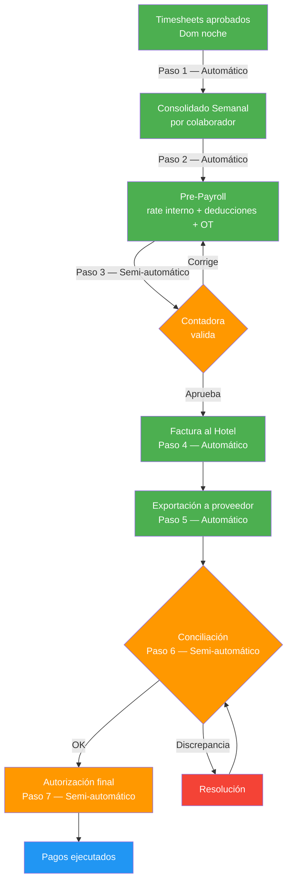

# Simulación completa — Punto de vista de Contabilidad

> [!abstract] Propósito
> Esta simulación narra un ciclo semanal completo de nómina dentro del sistema Oranje, desde la perspectiva de la [[Contadora]] y el [[Manager de Contabilidad]]. Recorre los 7 pasos del [[Contabilidad/Flujo de Nómina|Flujo de Nómina]] — desde la generación automática del [[Consolidado Semanal del Colaborador]] hasta la autorización final del pago — e incluye escenarios de overtime parcial, multi-hotel, rate interno, los tres tipos de [[Deducciones]], [[Facturación al Hotel|factura partida por cruce de mes]], desactivación de retención 16% y [[Vacaciones|cálculo de vacaciones]]. Todos los datos son ficticios, pero cada acción, cálculo y regla respeta fielmente la documentación del vault.

## Personajes de la simulación

| Personaje | Rol | Departamento |
|---|---|---|
| Patricia Solano | [[Contadora]] (protagonista) | Contabilidad — Oranje |
| Irene | [[Manager de Contabilidad]] | Contabilidad — Oranje |
| María López | [[Posiciones\|Housekeeper]] | Colaboradora — Hotel Costa Esmeralda |
| Juan Hernández | [[Posiciones\|Houseman]] | Colaborador — Hotel Costa Esmeralda |
| Elena Cruz | [[Posiciones\|Housekeeper]] | Colaboradora — Hotel Costa Esmeralda + Hotel Playa del Sol |
| Roberto Fuentes | [[Posiciones\|Housekeeper]] | Colaborador — Hotel Costa Esmeralda |
| Ana Castillo | [[Posiciones\|Laundry]] | Colaboradora — Hotel Costa Esmeralda |
| Carmen Delgado | [[Posiciones\|Housekeeper]] veterana | Colaboradora — 52+ semanas de antigüedad |
| Daniel Ortega | [[Inspección/Inspector\|Inspector]] (zona Noroeste) | Inspección — Oranje |

---

## Fase 0 — Contexto y condiciones iniciales

> Referencia: [[Contadora]] · [[Manager de Contabilidad]] · [[Contabilidad/Flujo de Nómina|Flujo de Nómina]] · [[Core/Módulos/Contrato|Contrato]]

### 0.1 — Situación

Es lunes 21 de julio de 2026. El **Hotel Costa Esmeralda** fue convertido a cliente activo (status **Naranja** en el [[Semáforo Onboarding]]) el 11 de julio — como se narra en la [[Simulación - Punto de Vista de Ventas]]. La primera [[Requisición]] fue cubierta por Reclutamiento, y hoy los primeros colaboradores se presentan a trabajar.

Patricia Solano, [[Contadora]] de Oranje, es la responsable de ejecutar toda la operación financiera semanal: validación del Pre-Payroll, conciliación con el proveedor de cheques, gestión de deducciones y cálculo de vacaciones. Irene, [[Manager de Contabilidad]], supervisa el trabajo de Patricia y es quien aprueba las facturas y autoriza la liberación de la nómina. Juntas son los dos actores humanos en el [[Contabilidad/Flujo de Nómina|Flujo de Nómina]].

### 0.2 — Términos contractuales del Hotel Costa Esmeralda

| Campo | Valor |
|---|---|
| Pay rate (Housekeeper) | $12.50/hr |
| Pay rate (Houseman) | $11.00/hr |
| Pay rate (Laundry) | $11.50/hr |
| Bill rate (Housekeeper) | $18.25/hr |
| Bill rate (Houseman) | $16.50/hr |
| Bill rate (Laundry) | $17.00/hr |
| Overtime | 1.5x después de 40 hrs brutas semanales por hotel |
| Festivos | 2x bill rate en días festivos federales |
| Inicio de semana | Lunes |
| Fin de semana | Domingo |
| Deduce comida | Sí ($3 USD/día laborado) |
| Factura partida por mes | Sí |

> [!warning] Regla de negocio
> El overtime se calcula **por hotel**, no de forma global. Si un colaborador trabaja en dos hoteles, cada hotel tiene su umbral de 40 horas brutas semanales independiente. — [[Consolidado Semanal del Colaborador#Cálculo]]

### 0.3 — Colaboradores y sus condiciones

| Colaborador | Posición | Hotel(es) | Pay rate | Escenario contable |
|---|---|---|---|---|
| María López | HK | Costa Esmeralda | $12.50 | Estándar + deducción uniforme |
| Juan Hernández | HM | Costa Esmeralda | $11.00 | Overtime parcial (5 OT, hotel autoriza 3) |
| Elena Cruz | HK | Costa Esmeralda + Playa del Sol | $12.50 / $13.00 | Multi-hotel, cheque al hotel con más horas |
| Roberto Fuentes | HK | Costa Esmeralda | $14.00 (rate interno) | Rate interno + retención 16% (sin SSN) |
| Ana Castillo | LN | Costa Esmeralda | $11.50 | Deducción de comida |

> [!tip] Rate interno — Roberto Fuentes
> Roberto tiene un acuerdo interno con Oranje por experiencia previa: su pay rate real es **$14.00/hr**, mayor al rate contractual del hotel ($12.50/hr). Este rate interno es visible **solo** para Contabilidad. La [[Facturación al Hotel|Factura al Hotel]] siempre usa el bill rate del [[Core/Módulos/Contrato|Contrato]] ($18.25/hr). La diferencia la absorbe Oranje. — [[Consolidado Semanal del Colaborador#Rate interno]]

### 0.4 — Nota sobre QA

> [!info] Contabilidad y QA
> El departamento de Contabilidad **no tiene** [[Operador de QA]] asignado ni KPIs definidos en el sistema. Los 5 operadores de QA cubren Inspección, Hotel, Colaborador, Ventas y Reclutamiento. — [[Métricas y KPIs por Departamento]]

---

## Fase 1 — La semana laboral (Lun 21 – Dom 27 julio 2026)

> Referencia: [[Timesheet]] · [[Core/Módulos/Schedule|Schedule]] · [[Inspección/Inspector|Inspector]] · [[Deducciones#Uniforme]]

### 1.1 — Resumen operativo de la semana

Los 5 colaboradores asignados al Hotel Costa Esmeralda se presentan el lunes 21 de julio (Día 1). Daniel Ortega, [[Inspección/Inspector|Inspector]] de la zona Noroeste, verifica su llegada en la propiedad — transición Blanco → Verde manzana en el [[Semáforo del Colaborador]].

El miércoles 23 de julio (Día 3), Daniel entrega uniformes a los 5 colaboradores y registra cada entrega en el sistema. Esto dispara la [[Deducciones#Uniforme|deducción de uniforme]] ($15 USD por persona) que se aplicará al próximo [[Consolidado Semanal del Colaborador|Consolidado Semanal]].

> [!warning] Regla de negocio
> La deducción de uniforme se aplica automáticamente al siguiente [[Consolidado Semanal del Colaborador|Consolidado Semanal]] tras el registro de entrega por el [[Inspección/Inspector|Inspector]]. — [[Deducciones#Uniforme]]

Elena Cruz trabaja en Costa Esmeralda de lunes a miércoles (3 días). El jueves, su [[Reclutadora]] la asigna temporalmente ([[Semáforo del Colaborador|Café]]) al **Hotel Playa del Sol** (pay rate HK: $13.00/hr, bill rate HK: $17.50/hr), donde trabaja jueves y viernes.

Juan Hernández trabaja jornadas extendidas de 9 horas brutas por día (1 hora extra diaria), acumulando 45 horas brutas en la semana — 5 horas por encima del umbral de overtime.

### 1.2 — Horas registradas por colaborador

| Colaborador | Hotel | Días | Hrs brutas/día | Hrs brutas total | Lunch (30 min × días) | Hrs netas |
|---|---|---|---|---|---|---|
| María López | Costa Esmeralda | 5 | 8.0 | 40.0 | 2.5 | 37.5 |
| Juan Hernández | Costa Esmeralda | 5 | 9.0 | 45.0 | 2.5 | 37.5 + 5.0 OT |
| Elena Cruz | Costa Esmeralda | 3 | 8.0 | 24.0 | 1.5 | 22.5 |
| Elena Cruz | Playa del Sol | 2 | 8.0 | 16.0 | 1.0 | 15.0 |
| Roberto Fuentes | Costa Esmeralda | 5 | 8.0 | 40.0 | 2.5 | 37.5 |
| Ana Castillo | Costa Esmeralda | 5 | 8.0 | 40.0 | 2.5 | 37.5 |

> [!info] Overtime de Juan Hernández
> Juan acumuló 45 hrs brutas en Costa Esmeralda. El umbral es 40 hrs brutas → 5 hrs de overtime. El hotel autoriza **solo 3 de las 5 horas**. Las 2 horas no autorizadas quedan registradas pero no se pagan ni se facturan. — [[Consolidado Semanal del Colaborador#Overtime autorizado parcialmente]]

---

## Fase 2 — Generación automática del Consolidado Semanal

> Referencia: [[Consolidado Semanal del Colaborador]] · [[Contabilidad/Flujo de Nómina|Flujo de Nómina]] paso 1

Domingo 27 de julio, al cierre de la semana. El sistema genera automáticamente el [[Consolidado Semanal del Colaborador|Consolidado Semanal]] de cada colaborador, agrupando sus [[Timesheet|Timesheets]] por hotel y aplicando el pay rate correspondiente.

> [!success] **Paso 1 del Flujo de Nómina** — Automático. No requiere intervención humana.

### 2.1 — Consolidado: María López (estándar)

| Campo | Valor |
|---|---|
| Colaborador | María López |
| Semana | Sem 30 — 21 al 27 de julio 2026 |

| Hotel | Posición | Hrs netas | Pay rate | Subtotal regular | Hrs OT | Tasa OT | Subtotal OT |
|---|---|---|---|---|---|---|---|
| Costa Esmeralda | HK | 37.5 | $12.50 | $468.75 | 0 | — | $0.00 |

| **Total a pagar** | **$468.75** |
|---|---|

### 2.2 — Consolidado: Juan Hernández (overtime parcial)

| Campo | Valor |
|---|---|
| Colaborador | Juan Hernández |
| Semana | Sem 30 — 21 al 27 de julio 2026 |

| Hotel | Posición | Hrs netas | Pay rate | Subtotal regular | Hrs OT autorizadas | Tasa OT | Subtotal OT |
|---|---|---|---|---|---|---|---|
| Costa Esmeralda | HM | 37.5 | $11.00 | $412.50 | 3 | $16.50 | $49.50 |

| **Total a pagar** | **$462.00** |
|---|---|

> [!warning] Regla de negocio
> El hotel autorizó solo 3 de las 5 horas de overtime. El [[Manager de Contabilidad]] ajusta las horas OT pagables según lo autorizado. Las 2 horas restantes quedan registradas pero no se pagan al colaborador ni se facturan al hotel. — [[Consolidado Semanal del Colaborador#Overtime autorizado parcialmente]]

### 2.3 — Consolidado: Elena Cruz (multi-hotel)

| Campo | Valor |
|---|---|
| Colaborador | Elena Cruz |
| Semana | Sem 30 — 21 al 27 de julio 2026 |

| Hotel | Posición | Hrs netas | Pay rate | Subtotal regular | Hrs OT | Tasa OT | Subtotal OT |
|---|---|---|---|---|---|---|---|
| Costa Esmeralda | HK | 22.5 | $12.50 | $281.25 | 0 | — | $0.00 |
| Playa del Sol | HK | 15.0 | $13.00 | $195.00 | 0 | — | $0.00 |

| **Total a pagar** | **$476.25** |
|---|---|

> [!info] Asignación del cheque
> Elena trabajó en dos hoteles. El cheque se asigna al **Hotel Costa Esmeralda** (22.5 hrs > 15.0 hrs) — el hotel donde acumuló mayor cantidad de horas. — [[Consolidado Semanal del Colaborador#Asignación del cheque]]

### 2.4 — Consolidado: Roberto Fuentes (rate interno)

| Campo | Valor |
|---|---|
| Colaborador | Roberto Fuentes |
| Semana | Sem 30 — 21 al 27 de julio 2026 |

| Hotel | Posición | Hrs netas | Pay rate | Subtotal regular | Hrs OT | Tasa OT | Subtotal OT |
|---|---|---|---|---|---|---|---|
| Costa Esmeralda | HK | 37.5 | **$14.00*** | $525.00 | 0 | — | $0.00 |

\* Rate interno — superior al rate contractual ($12.50). Visible solo para Contabilidad ([[Manager de Contabilidad]] y [[Contadora]]).

| **Total a pagar** | **$525.00** |
|---|---|

### 2.5 — Consolidado: Ana Castillo (estándar)

| Campo | Valor |
|---|---|
| Colaborador | Ana Castillo |
| Semana | Sem 30 — 21 al 27 de julio 2026 |

| Hotel | Posición | Hrs netas | Pay rate | Subtotal regular | Hrs OT | Tasa OT | Subtotal OT |
|---|---|---|---|---|---|---|---|
| Costa Esmeralda | LN | 37.5 | $11.50 | $431.25 | 0 | — | $0.00 |

| **Total a pagar** | **$431.25** |
|---|---|

> [!important] Visibilidad
> El [[Consolidado Semanal del Colaborador|Consolidado Semanal]] es de uso exclusivo del departamento de Contabilidad. El hotel y el colaborador **no tienen acceso** a este documento. — [[Consolidado Semanal del Colaborador#Visibilidad]]

---

## Fase 3 — Cálculo automático del Pre-Payroll

> Referencia: [[Contabilidad/Flujo de Nómina|Flujo de Nómina]] paso 2 · [[Deducciones]]

Lunes 28 de julio por la mañana. El sistema genera el Pre-Payroll a partir de los Consolidados: aplica el rate interno donde corresponde, las [[Deducciones]] activas de cada colaborador y el overtime autorizado.

> [!success] **Paso 2 del Flujo de Nómina** — Automático. No requiere intervención humana.

### 3.1 — Deducciones aplicadas

| Colaborador | Uniforme | Comida | Retención 16% | Total deducciones |
|---|---|---|---|---|
| María López | $15.00 | $15.00 | — | $30.00 |
| Juan Hernández | $15.00 | $15.00 | — | $30.00 |
| Elena Cruz | $15.00 | $9.00 | — | $24.00 |
| Roberto Fuentes | $15.00 | $15.00 | $84.00 | $114.00 |
| Ana Castillo | $15.00 | $15.00 | — | $30.00 |

> [!warning] Reglas de Deducciones
> - **Uniforme** ($15/persona): el [[Inspección/Inspector|Inspector]] registró la entrega el 23 de julio (Día 3). Se aplica al Consolidado de esta semana. — [[Deducciones#Uniforme]]
> - **Comida** ($3/día laborado): configurada en el [[Core/Módulos/Contrato|Contrato]] de Costa Esmeralda. Se aplica solo en días con [[Timesheet]] registrado. Elena trabajó 3 días en Costa Esmeralda ($9) y 2 en Playa del Sol (donde **no** está configurada). — [[Deducciones#Comida]]
> - **Retención 16%** ($84.00): Roberto Fuentes no tiene SSN/TaxID registrado. 16% × $525.00 = $84.00. Activa automáticamente hasta que la [[Contadora]] la desactive al recibir documentos. — [[Deducciones#Retención 16%]]

### 3.2 — Pre-Payroll completo

| # | Colaborador | Hotel(es) | Posición | Hrs reg | Hrs OT | Rate | Tasa OT | Bruto reg | Bruto OT | **Bruto total** | Deducciones | **Neto** |
|---|---|---|---|---|---|---|---|---|---|---|---|---|
| 1 | María López | CE | HK | 37.5 | 0 | $12.50 | — | $468.75 | $0.00 | **$468.75** | $30.00 | **$438.75** |
| 2 | Juan Hernández | CE | HM | 37.5 | 3 | $11.00 | $16.50 | $412.50 | $49.50 | **$462.00** | $30.00 | **$432.00** |
| 3 | Elena Cruz | CE + PdS | HK | 22.5 + 15.0 | 0 | $12.50 / $13.00 | — | $281.25 + $195.00 | $0.00 | **$476.25** | $24.00 | **$452.25** |
| 4 | Roberto Fuentes | CE | HK | 37.5 | 0 | $14.00* | — | $525.00 | $0.00 | **$525.00** | $114.00 | **$411.00** |
| 5 | Ana Castillo | CE | LN | 37.5 | 0 | $11.50 | — | $431.25 | $0.00 | **$431.25** | $30.00 | **$401.25** |

\* Rate interno. CE = Costa Esmeralda, PdS = Playa del Sol.

| **Total nómina** | **$2,363.25** | **Total deducciones** | **$228.00** | **Total neto** | **$2,135.25** |
|---|---|---|---|---|---|

---

## Fase 4 — Validación humana por Contabilidad

> Referencia: [[Contabilidad/Flujo de Nómina|Flujo de Nómina]] paso 3 · [[Contadora]]

Lunes 28 de julio, media mañana. Patricia Solano abre el Pre-Payroll generado por el sistema y comienza la validación línea por línea.

> [!warning] **Paso 3 del Flujo de Nómina** — Semi-automatizado. Requiere aprobación de Contabilidad.

### 4.1 — Checklist de validación

Por cada línea del Pre-Payroll, Patricia verifica:

- [ ] ID del colaborador correcto
- [ ] Nombre/apellidos coinciden con el ID
- [ ] Horas correctas según [[Timesheet]] aprobado
- [ ] Rate correcto (interno o contractual según corresponda)
- [ ] Descuentos aplicados correctamente
- [ ] Posiciones correctas si tiene múltiples
- [ ] Hotel correcto si trabaja en múltiples

### 4.2 — Discrepancia detectada

Patricia revisa la línea 4 (Roberto Fuentes) y detecta un error: el sistema aplicó el rate contractual ($12.50/hr) en lugar del rate interno ($14.00/hr).

| Campo | Valor en Pre-Payroll | Valor correcto |
|---|---|---|
| Rate de Roberto Fuentes | $12.50/hr (contractual) | $14.00/hr (rate interno) |
| Bruto regular | $468.75 | $525.00 |
| Retención 16% | $75.00 | $84.00 |
| Total deducciones | $105.00 | $114.00 |
| Neto | $363.75 | $411.00 |

Patricia corrige el rate en el sistema. El Pre-Payroll se recalcula automáticamente para la línea afectada.

> [!warning] Regla de negocio
> Cuando existe un rate interno, el sistema debe usarlo para calcular el pago al colaborador en lugar del rate contractual. El rate interno **no se refleja** en la [[Facturación al Hotel|Factura al Hotel]]. — [[Consolidado Semanal del Colaborador#Rate interno]]

### 4.3 — Aprobación

Patricia confirma que las 5 líneas restantes son correctas: IDs coinciden con nombres, horas coinciden con los [[Timesheet|Timesheets]] aprobados, deducciones aplicadas correctamente, posiciones y hoteles correctos.

**Patricia aprueba el Pre-Payroll.**

---

## Fase 5 — Generación automática de la Factura al Hotel

> Referencia: [[Facturación al Hotel]] · [[Contabilidad/Flujo de Nómina|Flujo de Nómina]] paso 4 · [[Core/Módulos/Contrato|Contrato]]

Lunes 28 de julio. Tras la aprobación del Pre-Payroll, el sistema genera automáticamente las facturas a cada hotel.

> [!success] **Paso 4 del Flujo de Nómina** — Automático. No requiere intervención humana.

### 5.1 — Factura al Hotel Costa Esmeralda

| Campo | Valor |
|---|---|
| Hotel | Hotel Costa Esmeralda |
| Periodo | 21 al 27 de julio 2026 |
| Folio | ORJ-2026-S30-CE001 |

| Colaborador | Posición | Hrs regulares | Bill rate | Subtotal regular | Hrs OT aut. | Tasa OT | Subtotal OT | **Total línea** |
|---|---|---|---|---|---|---|---|---|
| María López | HK | 37.5 | $18.25 | $684.38 | 0 | — | $0.00 | **$684.38** |
| Juan Hernández | HM | 37.5 | $16.50 | $618.75 | 3 | $24.75 | $74.25 | **$693.00** |
| Elena Cruz | HK | 22.5 | $18.25 | $410.63 | 0 | — | $0.00 | **$410.63** |
| Roberto Fuentes | HK | 37.5 | $18.25 | $684.38 | 0 | — | $0.00 | **$684.38** |
| Ana Castillo | LN | 37.5 | $17.00 | $637.50 | 0 | — | $0.00 | **$637.50** |

| | Monto |
|---|---|
| Subtotal servicios | $3,109.89 |
| Acreditación comida (5 colaboradores × días laborados × $3) | −$69.00 |
| **Total a cobrar** | **$3,040.89** |

> [!warning] Reglas de la Factura
> - La Factura usa exclusivamente el **bill rate** del [[Core/Módulos/Contrato|Contrato]]. El rate interno de Roberto Fuentes ($14.00) **nunca** aparece en la Factura — se usa $18.25. — [[Facturación al Hotel]]
> - Solo se factura el overtime **autorizado** por el hotel (3 horas de Juan). Las 2 horas no autorizadas no se incluyen. — [[Facturación al Hotel#Overtime autorizado]]
> - La deducción de comida ($3/día) se acredita al hotel. 5 colaboradores × días con [[Timesheet]]: (5+5+3+5+5) = 23 días × $3 = $69.00. — [[Deducciones#Comida]]

### 5.2 — Factura al Hotel Playa del Sol

| Campo | Valor |
|---|---|
| Hotel | Hotel Playa del Sol |
| Periodo | 24 al 25 de julio 2026 |
| Folio | ORJ-2026-S30-PS001 |

| Colaborador | Posición | Hrs regulares | Bill rate | Subtotal regular | Hrs OT | Tasa OT | Subtotal OT | **Total línea** |
|---|---|---|---|---|---|---|---|---|
| Elena Cruz | HK | 15.0 | $17.50 | $262.50 | 0 | — | $0.00 | **$262.50** |

| | Monto |
|---|---|
| Subtotal servicios | $262.50 |
| Acreditaciones | $0.00 |
| **Total a cobrar** | **$262.50** |

> [!info] Hotel Playa del Sol no tiene configurada la deducción de comida en su [[Core/Módulos/Contrato|Contrato]].

### 5.3 — Aprobación de facturas

Patricia revisa ambas facturas, verifica que los bill rates coinciden con los contratos, que solo el overtime autorizado está incluido, y que las acreditaciones de comida están correctas. Envía la validación a Irene.

**Irene aprueba las facturas.**

---

## Fase 6 — Exportación al proveedor de cheques

> Referencia: [[Contabilidad/Flujo de Nómina|Flujo de Nómina]] paso 5

Lunes 28 de julio, tarde. El sistema genera el archivo de exportación con los datos de pago para el proveedor externo de cheques.

> [!success] **Paso 5 del Flujo de Nómina** — Automático. No requiere intervención humana.

| Colaborador | Monto neto | Hotel de entrega del cheque |
|---|---|---|
| María López | $438.75 | Costa Esmeralda |
| Juan Hernández | $432.00 | Costa Esmeralda |
| Elena Cruz | $452.25 | Costa Esmeralda (más horas) |
| Roberto Fuentes | $411.00 | Costa Esmeralda |
| Ana Castillo | $401.25 | Costa Esmeralda |
| **Total exportado** | **$2,135.25** | |

---

## Fase 7 — Conciliación

> Referencia: [[Contabilidad/Flujo de Nómina|Flujo de Nómina]] paso 6 · [[Contadora]]

Martes 29 de julio por la mañana. El proveedor de cheques devuelve la confirmación de los 5 cheques generados. Patricia inicia la conciliación: compara lo enviado contra lo devuelto.

> [!warning] **Paso 6 del Flujo de Nómina** — Semi-automatizado. Requiere validación de Contabilidad.

### 7.1 — Discrepancia detectada

| Colaborador | Monto enviado | Monto del proveedor | Diferencia |
|---|---|---|---|
| María López | $438.75 | $438.75 | $0.00 ✓ |
| Juan Hernández | $432.00 | $432.00 | $0.00 ✓ |
| Elena Cruz | $452.25 | $452.25 | $0.00 ✓ |
| Roberto Fuentes | $411.00 | $411.50 | **+$0.50** ✗ |
| Ana Castillo | $401.25 | $401.25 | $0.00 ✓ |

Patricia identifica una discrepancia de $0.50 en el cheque de Roberto Fuentes. Investiga: el proveedor redondeó un cálculo intermedio de forma diferente. Patricia solicita corrección al proveedor. El cheque corregido ($411.00) es confirmado.

### 7.2 — Conciliación aprobada

Patricia valida que los 5 cheques coinciden con los montos del Pre-Payroll aprobado.

**Patricia aprueba la conciliación.**

---

## Fase 8 — Autorización final y liberación de pagos

> Referencia: [[Contabilidad/Flujo de Nómina|Flujo de Nómina]] paso 7 · [[Manager de Contabilidad]]

Martes 29 de julio, mediodía. Irene autoriza la liberación de la nómina semanal.

> [!warning] **Paso 7 del Flujo de Nómina** — Semi-automatizado. Requiere autorización del [[Manager de Contabilidad]].

| Campo | Valor |
|---|---|
| Fecha de autorización | 29 julio 2026, 12:15 PM |
| Autorizado por | Irene — [[Manager de Contabilidad]] |
| Total nómina liberada | $2,135.25 (5 cheques) |
| Status | Pagos ejecutados |

> [!tip] Registro del sistema
> El sistema registra la fecha, hora y responsable de la autorización final. Este registro es la trazabilidad de auditoría del ciclo de pago semanal.

Los colaboradores recibirán sus cheques en el hotel asignado (todos en Costa Esmeralda para esta semana).

---

## Fase 9 — Factura partida por cruce de mes

> Referencia: [[Facturación al Hotel#Factura partida por cruce de mes]] · [[Core/Módulos/Contrato|Contrato]]

### 9.1 — Contexto: semana del 28 de julio al 3 de agosto

La siguiente semana laboral (Sem 31) cruza dos meses calendario:
- **Julio:** lunes 28, martes 29, miércoles 30, jueves 31 (4 días laborales)
- **Agosto:** viernes 1 (1 día laboral) + sábado 2 y domingo 3 (descanso)

El [[Core/Módulos/Contrato|Contrato]] del Hotel Costa Esmeralda tiene configurado "Factura partida por mes: Sí". Esto obliga al sistema a generar **dos facturas separadas** cuando la semana cruza la frontera mensual.

### 9.2 — Ejemplo: María López en la semana partida

**Factura 1 — Porción julio (28–31 julio)**

| Colaborador | Posición | Hrs regulares | Bill rate | Subtotal |
|---|---|---|---|---|
| María López | HK | 30.0 | $18.25 | $547.50 |

**Factura 2 — Porción agosto (1 agosto)**

| Colaborador | Posición | Hrs regulares | Bill rate | Subtotal |
|---|---|---|---|---|
| María López | HK | 7.5 | $18.25 | $136.88 |

> [!warning] Regla de negocio
> Cuando una semana abarca dos meses calendario y el [[Core/Módulos/Contrato|Contrato]] tiene "Factura partida por mes: Sí", el sistema genera dos facturas separadas: una por los días del mes que termina y otra por los días del mes nuevo. — [[Facturación al Hotel#Factura partida por cruce de mes]]

El sistema genera las dos facturas completas (con todos los colaboradores) de forma automática. Patricia las valida y aprueba como parte del ciclo normal del [[Contabilidad/Flujo de Nómina|Flujo de Nómina]].

---

## Fase 10 — Desactivación de retención 16%

> Referencia: [[Deducciones#Retención 16%]] · [[Contadora]]

### 10.1 — Roberto Fuentes entrega documentos

Lunes 4 de agosto de 2026. Roberto Fuentes entrega su SSN al departamento de Recursos Humanos. La información se actualiza en su perfil del sistema (campo "Tiene SSN/TaxID: sí").

### 10.2 — Desactivación manual

Patricia Solano recibe la notificación de que Roberto ya tiene SSN registrado. Accede al módulo de [[Deducciones]] y **desactiva manualmente** la retención 16% para Roberto Fuentes.

| Campo | Valor |
|---|---|
| Colaborador | Roberto Fuentes |
| Deducción | Retención 16% |
| Status anterior | Activa |
| Status nuevo | Desactivada |
| Fecha de desactivación | 4 agosto 2026 |
| Responsable | Patricia Solano — [[Contadora]] |

### 10.3 — Monto acumulado retenido

El sistema muestra el historial de retenciones acumuladas:

| Semana | Monto bruto | Retención 16% |
|---|---|---|
| Sem 30 (21–27 jul) | $525.00 | $84.00 |
| Sem 31 (28 jul – 3 ago) | $525.00 | $84.00 |
| **Total acumulado** | | **$168.00** |

> [!important] Reembolso
> La retención 16% es **reembolsable**. Al desactivar, el sistema permite generar el reembolso del monto acumulado retenido ($168.00). Patricia puede programar el reembolso en el siguiente ciclo de nómina o fraccionarlo según la política interna de Oranje. — [[Deducciones#Retención 16%]]

A partir de la semana 32, el cheque de Roberto ya no incluirá la retención 16%.

---

## Fase 11 — Cálculo de vacaciones

> Referencia: [[Vacaciones]] · [[Contadora]] · [[Consolidado Semanal del Colaborador]]

### 11.1 — Contexto

Julio 2027 — un año después. Carmen Delgado, [[Posiciones|Housekeeper]] veterana, solicita el cálculo de sus vacaciones. Carmen ha trabajado 52 semanas completas en dos hoteles:

| Hotel | Posición | Semanas | Pay rate |
|---|---|---|---|
| Costa Esmeralda | HK | 35 | $12.50 |
| Playa del Sol | HK | 17 | $13.00 |

### 11.2 — Cálculo

Patricia selecciona a Carmen Delgado y el periodo de 52 semanas en el sistema. El cálculo se ejecuta automáticamente.

**Fórmula:** Promedio de horas = Σ horas netas pagadas ÷ semanas trabajadas (por hotel)

| Hotel | Total hrs netas (52 sem) | Semanas | Promedio hrs/semana | Pay rate | Valor semanal |
|---|---|---|---|---|---|
| Costa Esmeralda | 1,295.0 | 35 | 37.0 | $12.50 | $462.50 |
| Playa del Sol | 612.0 | 17 | 36.0 | $13.00 | $468.00 |
| **Total** | **1,907.0** | **52** | | | **$930.50** |

### 11.3 — Desglose presentado por el sistema

| Desglose | Promedio hrs/sem | Rate | Valor |
|---|---|---|---|
| Por hotel — Costa Esmeralda (HK) | 37.0 | $12.50 | $462.50 |
| Por hotel — Playa del Sol (HK) | 36.0 | $13.00 | $468.00 |
| **Pago de vacaciones (equivalente semanal)** | | | **$930.50** |

> [!warning] Regla de negocio
> Cuando el colaborador trabajó con distintos rates, el sistema separa las semanas/horas por rate, calcula el promedio por cada rate independientemente y presenta el desglose por hotel, posición y rate. — [[Vacaciones#Complejidad por múltiples rates]]

> [!info] Si Carmen tuviera menos de 52 semanas de antigüedad, el sistema promediar ía sobre las semanas disponibles. — [[Vacaciones#Fórmula]]

---

## Resumen del Flujo de Nómina ejecutado

| Paso | Descripción | Automatización | Fecha | Responsable |
|---|---|---|---|---|
| 1 | Generación del [[Consolidado Semanal del Colaborador\|Consolidado Semanal]] | Automático | 27 jul (dom noche) | Sistema |
| 2 | Cálculo del Pre-Payroll | Automático | 28 jul (lun AM) | Sistema |
| 3 | Validación del Pre-Payroll | Semi-automático | 28 jul (lun mañana) | Patricia Solano |
| 4 | Generación de [[Facturación al Hotel\|Factura al Hotel]] | Automático | 28 jul (lun) | Sistema |
| 5 | Exportación a proveedor de cheques | Automático | 28 jul (lun tarde) | Sistema |
| 6 | Conciliación | Semi-automático | 29 jul (mar AM) | Patricia Solano |
| 7 | Autorización final y pago | Semi-automático | 29 jul (mar mediodía) | Patricia Solano |

---

## Escenarios contables cubiertos

| # | Escenario | Colaborador | Fase | Módulo principal |
|---|---|---|---|---|
| 1 | Caso estándar (horas regulares, sin OT) | María López | 2–8 | [[Consolidado Semanal del Colaborador]] |
| 2 | Overtime autorizado parcialmente (5 OT, hotel aprueba 3) | Juan Hernández | 2–8 | [[Consolidado Semanal del Colaborador]] |
| 3 | Multi-hotel con cheque al hotel de más horas | Elena Cruz | 2–8 | [[Consolidado Semanal del Colaborador]] |
| 4 | Rate interno (mayor al contractual) | Roberto Fuentes | 2–5 | [[Consolidado Semanal del Colaborador]] |
| 5 | Retención 16% (sin SSN) + desactivación + reembolso | Roberto Fuentes | 3, 10 | [[Deducciones]] |
| 6 | Deducción de uniforme (Día 3) | Todos | 3 | [[Deducciones]] |
| 7 | Deducción de comida + acreditación al hotel | Todos (Costa Esmeralda) | 3, 5 | [[Deducciones]] · [[Facturación al Hotel]] |
| 8 | Factura partida por cruce de mes | Todos (Costa Esmeralda) | 9 | [[Facturación al Hotel]] |
| 9 | Cálculo de vacaciones multi-hotel | Carmen Delgado | 11 | [[Vacaciones]] |
| 10 | Discrepancia en Pre-Payroll (rate incorrecto) | Roberto Fuentes | 4 | [[Contadora]] |
| 11 | Discrepancia en conciliación (proveedor) | Roberto Fuentes | 7 | [[Contadora]] |

---

## Módulos y conceptos referenciados

| Módulo | Referencia |
|---|---|
| Contabilidad | [[Manager de Contabilidad]] · [[Contadora]] · [[Contabilidad/Flujo de Nómina\|Flujo de Nómina]] |
| Consolidado y pago | [[Consolidado Semanal del Colaborador]] · [[Deducciones]] |
| Facturación | [[Facturación al Hotel]] |
| Vacaciones | [[Vacaciones]] |
| Core | [[Core/Módulos/Contrato\|Contrato]] · [[Timesheet]] · [[Core/Módulos/Schedule\|Schedule]] |
| Semáforos | [[Semáforo del Colaborador]] · [[Semáforo Onboarding]] |
| Catálogos | [[Posiciones]] · [[Zonas]] |
| Inspección | [[Inspección/Inspector\|Inspector]] |
| Reclutamiento | [[Reclutadora]] |
| Calidad | [[Operador de QA]] · [[Métricas y KPIs por Departamento]] |

---

## Simulaciones relacionadas

- [[Simulación - Punto de Vista de Ventas]] — Narra el ciclo comercial del Hotel Costa Esmeralda desde la prospección hasta la conversión a cliente activo. Los términos contractuales (pay rate, bill rate, overtime) negociados en esa simulación son los que aquí se usan para calcular pagos y facturas.
- [[Simulación - Punto de Vista de Inspección]] — Cubre la operación de campo del Inspector Daniel Ortega, incluyendo la entrega de uniformes en Día 3 que dispara la deducción de uniforme procesada en esta simulación.
- [[Simulación - Punto de Vista del Hotel]] — Muestra la facturación semanal desde la perspectiva del hotel, complementando la vista interna de Contabilidad presentada aquí.
- [[Simulación - Punto de Vista de Reclutamiento]] — Incluye el cierre de semana con generación del Consolidado y Pre-Payroll para los colaboradores reclutados, conectando con el flujo de nómina aquí detallado.
- [[Simulación - Ciclo de Vida del Colaborador]] — Recorre los 12 estados del semáforo del colaborador e incluye ejemplos de cálculo de cheque con deducciones, overtime y rate interno que se alinean con los escenarios de esta simulación.
