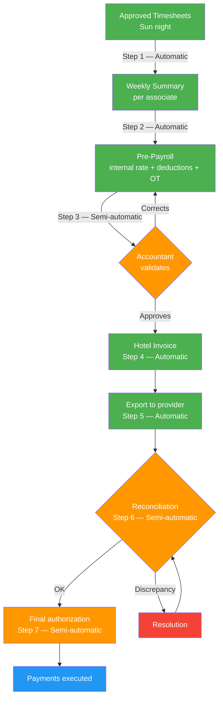

# Full Simulation — Accounting Point of View

> [!abstract] Purpose
> This simulation narrates a complete weekly payroll cycle within the Oranje system, from the perspective of the [[Accountant]] and the [[Accounting Manager]]. It covers the 7 steps of the [[Accounting/Payroll Flow|Payroll Flow]] — from the automatic generation of the [[Weekly Associate Summary]] through to the final payment authorization — and includes scenarios for partial overtime, multi-hotel, internal rate, all three types of [[Deductions]], [[Hotel Invoice|split invoice for month crossover]], 16% withholding deactivation, and [[Vacation Pay|vacation pay calculation]]. All data is fictional, but every action, calculation, and rule faithfully follows the vault documentation.

## Simulation Characters

| Character | Role | Department |
|---|---|---|
| Patricia Solano | [[Accountant]] (protagonist) | Accounting — Oranje |
| Irene | [[Accounting Manager]] | Accounting — Oranje |
| María López | [[Positions\|Housekeeper]] | Associate — Hotel Costa Esmeralda |
| Juan Hernández | [[Positions\|Houseman]] | Associate — Hotel Costa Esmeralda |
| Elena Cruz | [[Positions\|Housekeeper]] | Associate — Hotel Costa Esmeralda + Hotel Playa del Sol |
| Roberto Fuentes | [[Positions\|Housekeeper]] | Associate — Hotel Costa Esmeralda |
| Ana Castillo | [[Positions\|Laundry]] | Associate — Hotel Costa Esmeralda |
| Carmen Delgado | [[Positions\|Housekeeper]] veteran | Associate — 52+ weeks of seniority |
| Daniel Ortega | [[Inspection/Inspector\|Inspector]] (Northwest zone) | Inspection — Oranje |

---

## Phase 0 — Context and Initial Conditions

> Reference: [[Accountant]] · [[Accounting Manager]] · [[Accounting/Payroll Flow|Payroll Flow]] · [[Core/Modules/Contract|Contract]]

### 0.1 — Situation

It is Monday, July 21, 2026. **Hotel Costa Esmeralda** was converted to an active client (**Orange** status on the [[Onboarding Status Indicator]]) on July 11 — as narrated in the [[Simulation - Sales Point of View]]. The first [[Requisition]] was filled by Recruitment, and today the first associates report to work.

Patricia Solano, Oranje's [[Accountant]], is responsible for executing the entire weekly financial operation: Pre-Payroll validation, reconciliation with the check provider, deduction management, and vacation pay calculation. Irene, [[Accounting Manager]], oversees Patricia's work and is the one who approves invoices and authorizes payroll release. Together they are the two human actors in the [[Accounting/Payroll Flow|Payroll Flow]].

### 0.2 — Hotel Costa Esmeralda Contract Terms

| Field | Value |
|---|---|
| Pay rate (Housekeeper) | $12.50/hr |
| Pay rate (Houseman) | $11.00/hr |
| Pay rate (Laundry) | $11.50/hr |
| Bill rate (Housekeeper) | $18.25/hr |
| Bill rate (Houseman) | $16.50/hr |
| Bill rate (Laundry) | $17.00/hr |
| Overtime | 1.5x after 40 gross weekly hours per hotel |
| Holidays | 2x bill rate on federal holidays |
| Week start | Monday |
| Week end | Sunday |
| Meal deduction | Yes ($3 USD/day worked) |
| Split invoice by month | Yes |

> [!warning] Business Rule
> Overtime is calculated **per hotel**, not globally. If an associate works at two hotels, each hotel has its own independent 40 gross weekly hours threshold. — [[Weekly Associate Summary#Calculation]]

### 0.3 — Associates and Their Conditions

| Associate | Position | Hotel(s) | Pay rate | Accounting scenario |
|---|---|---|---|---|
| María López | HK | Costa Esmeralda | $12.50 | Standard + uniform deduction |
| Juan Hernández | HM | Costa Esmeralda | $11.00 | Partial overtime (5 OT, hotel authorizes 3) |
| Elena Cruz | HK | Costa Esmeralda + Playa del Sol | $12.50 / $13.00 | Multi-hotel, check issued to hotel with most hours |
| Roberto Fuentes | HK | Costa Esmeralda | $14.00 (internal rate) | Internal rate + 16% withholding (no SSN) |
| Ana Castillo | LN | Costa Esmeralda | $11.50 | Meal deduction |

> [!tip] Internal rate — Roberto Fuentes
> Roberto has an internal arrangement with Oranje due to prior experience: his actual pay rate is **$14.00/hr**, higher than the hotel's contractual rate ($12.50/hr). This internal rate is visible **only** to Accounting. The [[Hotel Invoice|Hotel Invoice]] always uses the [[Core/Modules/Contract|Contract]] bill rate ($18.25/hr). The difference is absorbed by Oranje. — [[Weekly Associate Summary#Rate interno]]

### 0.4 — Note on QA

> [!info] Accounting and QA
> The Accounting department **does not have** an assigned [[QA Operator]] or defined KPIs in the system. The 5 QA operators cover Inspection, Hotel, Associate, Sales, and Recruitment. — [[Metrics and KPIs by Department]]

---

## Phase 1 — The Work Week (Mon July 21 – Sun July 27, 2026)

> Reference: [[Timesheet]] · [[Core/Modules/Schedule|Schedule]] · [[Inspection/Inspector|Inspector]] · [[Deductions#Uniforme]]

### 1.1 — Operational Summary of the Week

All 5 associates assigned to Hotel Costa Esmeralda report on Monday, July 21 (Day 1). Daniel Ortega, [[Inspection/Inspector|Inspector]] for the Northwest zone, verifies their arrival at the property — White → Apple Green transition on the [[Associate Status Indicator]].

On Wednesday, July 23 (Day 3), Daniel delivers uniforms to all 5 associates and logs each delivery in the system. This triggers the [[Deductions#Uniforme|uniform deduction]] ($15 USD per person) to be applied to the next [[Weekly Associate Summary|Weekly Summary]].

> [!warning] Business Rule
> The uniform deduction is automatically applied to the next [[Weekly Associate Summary|Weekly Summary]] following the delivery registration by the [[Inspection/Inspector|Inspector]]. — [[Deductions#Uniforme]]

Elena Cruz works at Costa Esmeralda Monday through Wednesday (3 days). On Thursday, her [[Recruiter]] temporarily assigns her ([[Associate Status Indicator|Brown]]) to **Hotel Playa del Sol** (HK pay rate: $13.00/hr, HK bill rate: $17.50/hr), where she works Thursday and Friday.

Juan Hernández works extended 9-hour gross shifts per day (1 extra hour daily), accumulating 45 gross hours in the week — 5 hours above the overtime threshold.

### 1.2 — Hours Recorded by Associate

| Associate | Hotel | Days | Gross hrs/day | Total gross hrs | Lunch (30 min × days) | Net hrs |
|---|---|---|---|---|---|---|
| María López | Costa Esmeralda | 5 | 8.0 | 40.0 | 2.5 | 37.5 |
| Juan Hernández | Costa Esmeralda | 5 | 9.0 | 45.0 | 2.5 | 37.5 + 5.0 OT |
| Elena Cruz | Costa Esmeralda | 3 | 8.0 | 24.0 | 1.5 | 22.5 |
| Elena Cruz | Playa del Sol | 2 | 8.0 | 16.0 | 1.0 | 15.0 |
| Roberto Fuentes | Costa Esmeralda | 5 | 8.0 | 40.0 | 2.5 | 37.5 |
| Ana Castillo | Costa Esmeralda | 5 | 8.0 | 40.0 | 2.5 | 37.5 |

> [!info] Juan Hernández Overtime
> Juan accumulated 45 gross hours at Costa Esmeralda. The threshold is 40 gross hours → 5 overtime hours. The hotel authorizes **only 3 of the 5 hours**. The 2 unauthorized hours are recorded but not paid or billed. — [[Weekly Associate Summary#Overtime autorizado parcialmente]]

---

## Phase 2 — Automatic Generation of the Weekly Summary

> Reference: [[Weekly Associate Summary]] · [[Accounting/Payroll Flow|Payroll Flow]] step 1

Sunday, July 27, at the close of the week. The system automatically generates the [[Weekly Associate Summary|Weekly Summary]] for each associate, grouping their [[Timesheet|Timesheets]] by hotel and applying the corresponding pay rate.

> [!success] **Payroll Flow Step 1** — Automatic. No human intervention required.

### 2.1 — Summary: María López (standard)

| Field | Value |
|---|---|
| Associate | María López |
| Week | Week 30 — July 21–27, 2026 |

| Hotel | Position | Net hrs | Pay rate | Regular subtotal | OT hrs | OT rate | OT subtotal |
|---|---|---|---|---|---|---|---|
| Costa Esmeralda | HK | 37.5 | $12.50 | $468.75 | 0 | — | $0.00 |

| **Total payable** | **$468.75** |
|---|---|

### 2.2 — Summary: Juan Hernández (partial overtime)

| Field | Value |
|---|---|
| Associate | Juan Hernández |
| Week | Week 30 — July 21–27, 2026 |

| Hotel | Position | Net hrs | Pay rate | Regular subtotal | Authorized OT hrs | OT rate | OT subtotal |
|---|---|---|---|---|---|---|---|
| Costa Esmeralda | HM | 37.5 | $11.00 | $412.50 | 3 | $16.50 | $49.50 |

| **Total payable** | **$462.00** |
|---|---|

> [!warning] Business Rule
> The hotel authorized only 3 of the 5 overtime hours. The [[Accounting Manager]] adjusts payable OT hours per what was authorized. The remaining 2 hours are recorded but not paid to the associate or billed to the hotel. — [[Weekly Associate Summary#Overtime autorizado parcialmente]]

### 2.3 — Summary: Elena Cruz (multi-hotel)

| Field | Value |
|---|---|
| Associate | Elena Cruz |
| Week | Week 30 — July 21–27, 2026 |

| Hotel | Position | Net hrs | Pay rate | Regular subtotal | OT hrs | OT rate | OT subtotal |
|---|---|---|---|---|---|---|---|
| Costa Esmeralda | HK | 22.5 | $12.50 | $281.25 | 0 | — | $0.00 |
| Playa del Sol | HK | 15.0 | $13.00 | $195.00 | 0 | — | $0.00 |

| **Total payable** | **$476.25** |
|---|---|

> [!info] Check Assignment
> Elena worked at two hotels. The check is assigned to **Hotel Costa Esmeralda** (22.5 hrs > 15.0 hrs) — the hotel where she accumulated the most hours. — [[Weekly Associate Summary#Check Assignment]]

### 2.4 — Summary: Roberto Fuentes (internal rate)

| Field | Value |
|---|---|
| Associate | Roberto Fuentes |
| Week | Week 30 — July 21–27, 2026 |

| Hotel | Position | Net hrs | Pay rate | Regular subtotal | OT hrs | OT rate | OT subtotal |
|---|---|---|---|---|---|---|---|
| Costa Esmeralda | HK | 37.5 | **$14.00*** | $525.00 | 0 | — | $0.00 |

\* Internal rate — higher than the contractual rate ($12.50). Visible only to Accounting ([[Accounting Manager]] and [[Accountant]]).

| **Total payable** | **$525.00** |
|---|---|

### 2.5 — Summary: Ana Castillo (standard)

| Field | Value |
|---|---|
| Associate | Ana Castillo |
| Week | Week 30 — July 21–27, 2026 |

| Hotel | Position | Net hrs | Pay rate | Regular subtotal | OT hrs | OT rate | OT subtotal |
|---|---|---|---|---|---|---|---|
| Costa Esmeralda | LN | 37.5 | $11.50 | $431.25 | 0 | — | $0.00 |

| **Total payable** | **$431.25** |
|---|---|

> [!important] Visibility
> The [[Weekly Associate Summary|Weekly Summary]] is for exclusive use by the Accounting department. The hotel and the associate **do not have access** to this document. — [[Weekly Associate Summary#Visibilidad]]

---

## Phase 3 — Automatic Pre-Payroll Calculation

> Reference: [[Accounting/Payroll Flow|Payroll Flow]] step 2 · [[Deductions]]

Monday, July 28, morning. The system generates the Pre-Payroll from the Summaries: it applies the internal rate where applicable, the active [[Deductions]] for each associate, and the authorized overtime.

> [!success] **Payroll Flow Step 2** — Automatic. No human intervention required.

### 3.1 — Deductions Applied

| Associate | Uniform | Meal | 16% Withholding | Total deductions |
|---|---|---|---|---|
| María López | $15.00 | $15.00 | — | $30.00 |
| Juan Hernández | $15.00 | $15.00 | — | $30.00 |
| Elena Cruz | $15.00 | $9.00 | — | $24.00 |
| Roberto Fuentes | $15.00 | $15.00 | $84.00 | $114.00 |
| Ana Castillo | $15.00 | $15.00 | — | $30.00 |

> [!warning] Deduction Rules
> - **Uniform** ($15/person): the [[Inspection/Inspector|Inspector]] registered delivery on July 23 (Day 3). Applied to this week's Summary. — [[Deductions#Uniforme]]
> - **Meal** ($3/day worked): configured in the Costa Esmeralda [[Core/Modules/Contract|Contract]]. Applied only on days with a recorded [[Timesheet]]. Elena worked 3 days at Costa Esmeralda ($9) and 2 at Playa del Sol (where it is **not** configured). — [[Deductions#Comida]]
> - **16% Withholding** ($84.00): Roberto Fuentes does not have an SSN/TaxID registered. 16% × $525.00 = $84.00. Activates automatically until the [[Accountant]] deactivates it upon receiving documents. — [[Deductions#16% Withholding]]

### 3.2 — Full Pre-Payroll

| # | Associate | Hotel(s) | Position | Reg hrs | OT hrs | Rate | OT rate | Reg gross | OT gross | **Total gross** | Deductions | **Net** |
|---|---|---|---|---|---|---|---|---|---|---|---|---|
| 1 | María López | CE | HK | 37.5 | 0 | $12.50 | — | $468.75 | $0.00 | **$468.75** | $30.00 | **$438.75** |
| 2 | Juan Hernández | CE | HM | 37.5 | 3 | $11.00 | $16.50 | $412.50 | $49.50 | **$462.00** | $30.00 | **$432.00** |
| 3 | Elena Cruz | CE + PdS | HK | 22.5 + 15.0 | 0 | $12.50 / $13.00 | — | $281.25 + $195.00 | $0.00 | **$476.25** | $24.00 | **$452.25** |
| 4 | Roberto Fuentes | CE | HK | 37.5 | 0 | $14.00* | — | $525.00 | $0.00 | **$525.00** | $114.00 | **$411.00** |
| 5 | Ana Castillo | CE | LN | 37.5 | 0 | $11.50 | — | $431.25 | $0.00 | **$431.25** | $30.00 | **$401.25** |

\* Internal rate. CE = Costa Esmeralda, PdS = Playa del Sol.

| **Total payroll** | **$2,363.25** | **Total deductions** | **$228.00** | **Total net** | **$2,135.25** |
|---|---|---|---|---|---|

---

## Phase 4 — Human Validation by Accounting

> Reference: [[Accounting/Payroll Flow|Payroll Flow]] step 3 · [[Accountant]]

Monday, July 28, mid-morning. Patricia Solano opens the system-generated Pre-Payroll and begins line-by-line validation.

> [!warning] **Payroll Flow Step 3** — Semi-automated. Requires Accounting approval.

### 4.1 — Validation Checklist

For each Pre-Payroll line, Patricia verifies:

- [ ] Correct associate ID
- [ ] Name/last name matches the ID
- [ ] Correct hours per approved [[Timesheet]]
- [ ] Correct rate (internal or contractual as applicable)
- [ ] Deductions correctly applied
- [ ] Correct positions if multiple
- [ ] Correct hotel if working at multiple

### 4.2 — Discrepancy Detected

Patricia reviews line 4 (Roberto Fuentes) and detects an error: the system applied the contractual rate ($12.50/hr) instead of the internal rate ($14.00/hr).

| Field | Value in Pre-Payroll | Correct value |
|---|---|---|
| Roberto Fuentes rate | $12.50/hr (contractual) | $14.00/hr (internal rate) |
| Regular gross | $468.75 | $525.00 |
| 16% withholding | $75.00 | $84.00 |
| Total deductions | $105.00 | $114.00 |
| Net | $363.75 | $411.00 |

Patricia corrects the rate in the system. The Pre-Payroll recalculates automatically for the affected line.

> [!warning] Business Rule
> When an internal rate exists, the system must use it to calculate the associate's payment instead of the contractual rate. The internal rate **is not reflected** in the [[Hotel Invoice|Hotel Invoice]]. — [[Weekly Associate Summary#Rate interno]]

### 4.3 — Approval

Patricia confirms that the remaining 5 lines are correct: IDs match names, hours match approved [[Timesheet|Timesheets]], deductions correctly applied, positions and hotels correct.

**Patricia approves the Pre-Payroll.**

---

## Phase 5 — Automatic Hotel Invoice Generation

> Reference: [[Hotel Invoice]] · [[Accounting/Payroll Flow|Payroll Flow]] step 4 · [[Core/Modules/Contract|Contract]]

Monday, July 28. After Pre-Payroll approval, the system automatically generates invoices for each hotel.

> [!success] **Payroll Flow Step 4** — Automatic. No human intervention required.

### 5.1 — Invoice to Hotel Costa Esmeralda

| Field | Value |
|---|---|
| Hotel | Hotel Costa Esmeralda |
| Period | July 21–27, 2026 |
| Folio | ORJ-2026-S30-CE001 |

| Associate | Position | Regular hrs | Bill rate | Regular subtotal | Auth. OT hrs | OT rate | OT subtotal | **Line total** |
|---|---|---|---|---|---|---|---|---|
| María López | HK | 37.5 | $18.25 | $684.38 | 0 | — | $0.00 | **$684.38** |
| Juan Hernández | HM | 37.5 | $16.50 | $618.75 | 3 | $24.75 | $74.25 | **$693.00** |
| Elena Cruz | HK | 22.5 | $18.25 | $410.63 | 0 | — | $0.00 | **$410.63** |
| Roberto Fuentes | HK | 37.5 | $18.25 | $684.38 | 0 | — | $0.00 | **$684.38** |
| Ana Castillo | LN | 37.5 | $17.00 | $637.50 | 0 | — | $0.00 | **$637.50** |

| | Amount |
|---|---|
| Services subtotal | $3,109.89 |
| Meal credit (5 associates × days worked × $3) | −$69.00 |
| **Total due** | **$3,040.89** |

> [!warning] Invoice Rules
> - The Invoice uses exclusively the **bill rate** from the [[Core/Modules/Contract|Contract]]. Roberto Fuentes's internal rate ($14.00) **never** appears on the Invoice — $18.25 is used. — [[Hotel Invoice]]
> - Only the **authorized** overtime is billed (3 hours for Juan). The 2 unauthorized hours are not included. — [[Hotel Invoice#Overtime autorizado]]
> - The meal deduction ($3/day) is credited to the hotel. 5 associates × days with [[Timesheet]]: (5+5+3+5+5) = 23 days × $3 = $69.00. — [[Deductions#Comida]]

### 5.2 — Invoice to Hotel Playa del Sol

| Field | Value |
|---|---|
| Hotel | Hotel Playa del Sol |
| Period | July 24–25, 2026 |
| Folio | ORJ-2026-S30-PS001 |

| Associate | Position | Regular hrs | Bill rate | Regular subtotal | OT hrs | OT rate | OT subtotal | **Line total** |
|---|---|---|---|---|---|---|---|---|
| Elena Cruz | HK | 15.0 | $17.50 | $262.50 | 0 | — | $0.00 | **$262.50** |

| | Amount |
|---|---|
| Services subtotal | $262.50 |
| Credits | $0.00 |
| **Total due** | **$262.50** |

> [!info] Hotel Playa del Sol does not have the meal deduction configured in its [[Core/Modules/Contract|Contract]].

### 5.3 — Invoice Approval

Patricia reviews both invoices, verifies that bill rates match the contracts, that only authorized overtime is included, and that meal credits are correct. She submits the validation to Irene.

**Irene approves the invoices.**

---

## Phase 6 — Export to Check Provider

> Reference: [[Accounting/Payroll Flow|Payroll Flow]] step 5

Monday, July 28, afternoon. The system generates the export file with payment data for the external check provider.

> [!success] **Payroll Flow Step 5** — Automatic. No human intervention required.

| Associate | Net amount | Check delivery hotel |
|---|---|---|
| María López | $438.75 | Costa Esmeralda |
| Juan Hernández | $432.00 | Costa Esmeralda |
| Elena Cruz | $452.25 | Costa Esmeralda (most hours) |
| Roberto Fuentes | $411.00 | Costa Esmeralda |
| Ana Castillo | $401.25 | Costa Esmeralda |
| **Total exported** | **$2,135.25** | |

---

## Phase 7 — Reconciliation

> Reference: [[Accounting/Payroll Flow|Payroll Flow]] step 6 · [[Accountant]]

Tuesday, July 29, morning. The check provider returns confirmation of the 5 checks generated. Patricia initiates the reconciliation: she compares what was sent against what was returned.

> [!warning] **Payroll Flow Step 6** — Semi-automated. Requires Accounting validation.

### 7.1 — Discrepancy Detected

| Associate | Amount sent | Provider amount | Difference |
|---|---|---|---|
| María López | $438.75 | $438.75 | $0.00 ✓ |
| Juan Hernández | $432.00 | $432.00 | $0.00 ✓ |
| Elena Cruz | $452.25 | $452.25 | $0.00 ✓ |
| Roberto Fuentes | $411.00 | $411.50 | **+$0.50** ✗ |
| Ana Castillo | $401.25 | $401.25 | $0.00 ✓ |

Patricia identifies a $0.50 discrepancy in Roberto Fuentes's check. She investigates: the provider rounded an intermediate calculation differently. Patricia requests a correction from the provider. The corrected check ($411.00) is confirmed.

### 7.2 — Reconciliation Approved

Patricia validates that all 5 checks match the approved Pre-Payroll amounts.

**Patricia approves the reconciliation.**

---

## Phase 8 — Final Authorization and Payment Release

> Reference: [[Accounting/Payroll Flow|Payroll Flow]] step 7 · [[Accounting Manager]]

Tuesday, July 29, midday. Irene authorizes the release of the weekly payroll.

> [!warning] **Payroll Flow Step 7** — Semi-automated. Requires [[Accounting Manager]] authorization.

| Field | Value |
|---|---|
| Authorization date | July 29, 2026, 12:15 PM |
| Authorized by | Irene — [[Accounting Manager]] |
| Total payroll released | $2,135.25 (5 checks) |
| Status | Payments executed |

> [!tip] System Record
> The system logs the date, time, and responsible party for the final authorization. This record is the audit trail for the weekly payment cycle.

Associates will receive their checks at the assigned hotel (all at Costa Esmeralda this week).

---

## Phase 9 — Split Invoice for Month Crossover

> Reference: [[Hotel Invoice#Factura partida por cruce de mes]] · [[Core/Modules/Contract|Contract]]

### 9.1 — Context: Week of July 28 – August 3

The next work week (Week 31) crosses two calendar months:
- **July:** Monday July 28, Tuesday July 29, Wednesday July 30, Thursday July 31 (4 work days)
- **August:** Friday August 1 (1 work day) + Saturday August 2 and Sunday August 3 (rest)

The [[Core/Modules/Contract|Contract]] for Hotel Costa Esmeralda has "Split invoice by month: Yes" configured. This requires the system to generate **two separate invoices** when the week crosses the monthly boundary.

### 9.2 — Example: María López in the Split Week

**Invoice 1 — July portion (July 28–31)**

| Associate | Position | Regular hrs | Bill rate | Subtotal |
|---|---|---|---|---|
| María López | HK | 30.0 | $18.25 | $547.50 |

**Invoice 2 — August portion (August 1)**

| Associate | Position | Regular hrs | Bill rate | Subtotal |
|---|---|---|---|---|
| María López | HK | 7.5 | $18.25 | $136.88 |

> [!warning] Business Rule
> When a week spans two calendar months and the [[Core/Modules/Contract|Contract]] has "Split invoice by month: Yes", the system generates two separate invoices: one for the days of the ending month and another for the days of the new month. — [[Hotel Invoice#Factura partida por cruce de mes]]

The system automatically generates both complete invoices (with all associates). Patricia validates and approves them as part of the normal [[Accounting/Payroll Flow|Payroll Flow]] cycle.

---

## Phase 10 — 16% Withholding Deactivation

> Reference: [[Deductions#16% Withholding]] · [[Accountant]]

### 10.1 — Roberto Fuentes Delivers Documents

Monday, August 4, 2026. Roberto Fuentes delivers his SSN to the Human Resources department. The information is updated in his system profile (field "Has SSN/TaxID: yes").

### 10.2 — Manual Deactivation

Patricia Solano receives the notification that Roberto now has a registered SSN. She accesses the [[Deductions]] module and **manually deactivates** the 16% withholding for Roberto Fuentes.

| Field | Value |
|---|---|
| Associate | Roberto Fuentes |
| Deduction | 16% Withholding |
| Previous status | Active |
| New status | Deactivated |
| Deactivation date | August 4, 2026 |
| Responsible | Patricia Solano — [[Accountant]] |

### 10.3 — Cumulative Withheld Amount

The system displays the accumulated withholding history:

| Week | Gross amount | 16% Withholding |
|---|---|---|
| Week 30 (Jul 21–27) | $525.00 | $84.00 |
| Week 31 (Jul 28 – Aug 3) | $525.00 | $84.00 |
| **Total accumulated** | | **$168.00** |

> [!important] Refund
> The 16% withholding is **refundable**. Upon deactivation, the system allows generating a refund for the accumulated withheld amount ($168.00). Patricia can schedule the refund in the next payroll cycle or split it according to Oranje's internal policy. — [[Deductions#16% Withholding]]

Starting from week 32, Roberto's check will no longer include the 16% withholding.

---

## Phase 11 — Vacation Pay Calculation

> Reference: [[Vacation Pay]] · [[Accountant]] · [[Weekly Associate Summary]]

### 11.1 — Context

July 2027 — one year later. Carmen Delgado, a veteran [[Positions|Housekeeper]], requests her vacation pay calculation. Carmen has worked 52 complete weeks at two hotels:

| Hotel | Position | Weeks | Pay rate |
|---|---|---|---|
| Costa Esmeralda | HK | 35 | $12.50 |
| Playa del Sol | HK | 17 | $13.00 |

### 11.2 — Calculation

Patricia selects Carmen Delgado and the 52-week period in the system. The calculation runs automatically.

**Formula:** Average hours = Σ net hours paid ÷ weeks worked (per hotel)

| Hotel | Total net hrs (52 wks) | Weeks | Avg hrs/week | Pay rate | Weekly value |
|---|---|---|---|---|---|
| Costa Esmeralda | 1,295.0 | 35 | 37.0 | $12.50 | $462.50 |
| Playa del Sol | 612.0 | 17 | 36.0 | $13.00 | $468.00 |
| **Total** | **1,907.0** | **52** | | | **$930.50** |

### 11.3 — Breakdown Presented by the System

| Breakdown | Avg hrs/wk | Rate | Value |
|---|---|---|---|
| Per hotel — Costa Esmeralda (HK) | 37.0 | $12.50 | $462.50 |
| Per hotel — Playa del Sol (HK) | 36.0 | $13.00 | $468.00 |
| **Vacation Pay (weekly equivalent)** | | | **$930.50** |

> [!warning] Business Rule
> When the associate worked at different rates, the system separates the weeks/hours by rate, calculates the average for each rate independently, and presents the breakdown by hotel, position, and rate. — [[Vacation Pay#Complexity with Multiple Rates]]

> [!info] If Carmen had fewer than 52 weeks of seniority, the system would average over the available weeks. — [[Vacation Pay#Formula]]

---

## Summary of Payroll Flow Executed

| Step | Description | Automation | Date | Responsible |
|---|---|---|---|---|
| 1 | [[Weekly Associate Summary\|Weekly Summary]] generation | Automatic | Jul 27 (Sun night) | System |
| 2 | Pre-Payroll calculation | Automatic | Jul 28 (Mon AM) | System |
| 3 | Pre-Payroll validation | Semi-automatic | Jul 28 (Mon morning) | Patricia Solano |
| 4 | [[Hotel Invoice\|Hotel Invoice]] generation | Automatic | Jul 28 (Mon) | System |
| 5 | Export to check provider | Automatic | Jul 28 (Mon afternoon) | System |
| 6 | Reconciliation | Semi-automatic | Jul 29 (Tue AM) | Patricia Solano |
| 7 | Final authorization and payment | Semi-automatic | Jul 29 (Tue midday) | Patricia Solano |

---

## Accounting Scenarios Covered

| # | Scenario | Associate | Phase | Main Module |
|---|---|---|---|---|
| 1 | Standard case (regular hours, no OT) | María López | 2–8 | [[Weekly Associate Summary]] |
| 2 | Partially authorized overtime (5 OT, hotel approves 3) | Juan Hernández | 2–8 | [[Weekly Associate Summary]] |
| 3 | Multi-hotel with check at hotel with most hours | Elena Cruz | 2–8 | [[Weekly Associate Summary]] |
| 4 | Internal rate (higher than contractual) | Roberto Fuentes | 2–5 | [[Weekly Associate Summary]] |
| 5 | 16% withholding (no SSN) + deactivation + refund | Roberto Fuentes | 3, 10 | [[Deductions]] |
| 6 | Uniform deduction (Day 3) | All | 3 | [[Deductions]] |
| 7 | Meal deduction + hotel credit | All (Costa Esmeralda) | 3, 5 | [[Deductions]] · [[Hotel Invoice]] |
| 8 | Split invoice for month crossover | All (Costa Esmeralda) | 9 | [[Hotel Invoice]] |
| 9 | Multi-hotel vacation pay calculation | Carmen Delgado | 11 | [[Vacation Pay]] |
| 10 | Pre-Payroll discrepancy (incorrect rate) | Roberto Fuentes | 4 | [[Accountant]] |
| 11 | Reconciliation discrepancy (provider) | Roberto Fuentes | 7 | [[Accountant]] |

---

## Referenced Modules and Concepts

| Module | Reference |
|---|---|
| Accounting | [[Accounting Manager]] · [[Accountant]] · [[Accounting/Payroll Flow\|Payroll Flow]] |
| Summary and payment | [[Weekly Associate Summary]] · [[Deductions]] |
| Billing | [[Hotel Invoice]] |
| Vacation Pay | [[Vacation Pay]] |
| Core | [[Core/Modules/Contract\|Contract]] · [[Timesheet]] · [[Core/Modules/Schedule\|Schedule]] |
| Status Indicators | [[Associate Status Indicator]] · [[Onboarding Status Indicator]] |
| Catalogs | [[Positions]] · [[Zones]] |
| Inspection | [[Inspection/Inspector\|Inspector]] |
| Recruitment | [[Recruiter]] |
| Quality | [[QA Operator]] · [[Metrics and KPIs by Department]] |

---

## Related Simulations

- [[Simulation - Sales Point of View]] — Narrates the commercial cycle of Hotel Costa Esmeralda from prospecting through conversion to active client. The contractual terms (pay rate, bill rate, overtime) negotiated in that simulation are the ones used here to calculate payments and invoices.
- [[Simulation - Inspection Perspective]] — Covers the field operations of Inspector Daniel Ortega, including the Day 3 uniform delivery that triggers the uniform deduction processed in this simulation.
- [[Simulation - Hotel Perspective]] — Shows the weekly billing from the hotel's perspective, complementing the internal Accounting view presented here.
- [[Simulation - Recruitment Perspective]] — Includes the week-end close with Weekly Summary and Pre-Payroll generation for the recruited associates, connecting to the payroll flow detailed here.
- [[Simulation - Associate Lifecycle]] — Traces the 12 states of the associate status indicator and includes check calculation examples with deductions, overtime, and internal rate that align with the scenarios in this simulation.
