```mermaid
graph TD
    subgraph Reclutamiento
        R_V[Verde] -->|3 KPIs Crítico<br>14 ago| R_A[Amarillo]
        R_A -->|Obs. sin atender + deterioro<br>19 ago| R_R[Rojo]
        R_R -->|Escalación a dirección + mejora<br>22 ago| R_A2[Amarillo]
    end

    subgraph Inspección
        I_V[Verde] -->|1 KPI Crítico<br>15 ago| I_A[Amarillo]
        I_A -->|KPI corregido en 5 días<br>20 ago| I_V2[Verde]
    end

    subgraph Hotel
        H_V[Verde — estable]
    end

    subgraph Ventas
        V_V[Verde — estable]
    end

    subgraph Colaborador
        C_V[Verde — vigilancia preventiva]
    end

    style R_V fill:#228B22,color:#fff
    style R_A fill:#FFD700,color:#000
    style R_R fill:#DC143C,color:#fff
    style R_A2 fill:#FFD700,color:#000
    style I_V fill:#228B22,color:#fff
    style I_A fill:#FFD700,color:#000
    style I_V2 fill:#228B22,color:#fff
    style H_V fill:#228B22,color:#fff
    style V_V fill:#228B22,color:#fff
    style C_V fill:#228B22,color:#fff
```

# Simulación completa — Punto de vista de QA

> [!abstract] Propósito
> Esta simulación narra el ciclo completo de supervisión de calidad dentro del sistema Oranje, desde la perspectiva del departamento de QA: el [[Manager de QA]] y los 5 [[Operador de QA|Operadores de QA]]. Recorre todas las etapas del trabajo de QA — monitoreo rutinario, detección de anomalías, emisión de observaciones formales, transiciones del [[Indicador de Calidad]], escalación a dirección y resolución — a lo largo de tres semanas operativas. QA nunca ejecuta la operación de ningún departamento; su función es exclusivamente **observar, medir y retroalimentar**. Todos los datos son ficticios, pero cada acción, transición y regla respeta fielmente la documentación del vault.

## Personajes de la simulación

| Personaje | Rol | Departamento |
|---|---|---|
| Alejandra Duarte | [[Manager de QA]] | QA — Oranje |
| Operador 1 | [[Operador de QA]] (asignado a Inspección) | QA — Oranje |
| Operador 2 | [[Operador de QA]] (asignado a Hotel) | QA — Oranje |
| Operador 3 | [[Operador de QA]] (asignado a Colaborador) | QA — Oranje |
| Operador 4 | [[Operador de QA]] (asignado a Ventas) | QA — Oranje |
| Operador 5 | [[Operador de QA]] (asignado a Reclutamiento) | QA — Oranje |
| Daniel Ortega | [[Inspector]] (zona Noroeste) | Inspección — Oranje |
| Raúl Méndez | [[Inspección/Coordinador\|Coordinador]] | Inspección — Oranje |
| Mariana Vega | [[Hotel/Supervisor\|Supervisor]] | Hotel Costa Esmeralda |
| Sofía Méndez | [[Business Developer]] (BD) | Ventas — Oranje |
| Ricardo Fuentes | [[Business Developer Coordinator]] (BDC) | Ventas — Oranje |
| Daniela Ríos | [[Reclutadora]] | Reclutamiento — Oranje |
| Fernando Ortiz | [[Reclutamiento/Manager de Reclutamiento\|Manager de Reclutamiento]] | Reclutamiento — Oranje |

---

## Fase 1 — Línea base y monitoreo de rutina

> Referencia: [[QA/Métricas y KPIs por Departamento|Métricas y KPIs por Departamento]] · [[QA/Dashboard de QA|Dashboard de QA]] · [[QA/Reglas de QA|Reglas de QA]]

### 1.1 — Apertura semanal del Dashboard global (lunes 4 de agosto de 2026)

Es lunes 4 de agosto de 2026. Alejandra Duarte, [[Manager de QA]], abre el panel global del [[QA/Dashboard de QA|Dashboard de QA]] para iniciar la semana. Revisa las 5 tarjetas resumen — una por cada departamento supervisado — y confirma que todos se encuentran en **Verde** (Calidad óptima).

La gráfica de tendencia del [[Indicador de Calidad]] muestra 4 semanas consecutivas en Verde para los 5 departamentos. La tabla de KPIs en estado Crítico está vacía.

| Departamento | KPIs en Meta | KPIs en Riesgo | KPIs Crítico | Indicador de Calidad |
|---|---|---|---|---|
| Inspección | 5/5 | 0 | 0 | Verde |
| Hotel | 5/5 | 0 | 0 | Verde |
| Colaborador | 5/5 | 0 | 0 | Verde |
| Ventas | 5/5 | 0 | 0 | Verde |
| Reclutamiento | 6/6 | 0 | 0 | Verde |

> [!tip] QA — Dashboard
> Alejandra revisa el panel global: 5 tarjetas resumen, todas en Verde. La gráfica de tendencia muestra 4 semanas consecutivas sin alertas. La tabla de KPIs Críticos está vacía. — [[QA/Dashboard de QA|Dashboard de QA]]

> [!warning] Regla de negocio
> El [[Manager de QA]] tiene acceso al panel global + los 5 paneles por departamento. Cada [[Operador de QA]] solo ve el panel de su departamento asignado. — [[QA/Dashboard de QA|Dashboard de QA]]

### 1.2 — Revisión de cada Operador en su panel

Cada Operador revisa los KPIs de la semana anterior (terminada el 3 de agosto) en su panel individual. El monitoreo de rutina confirma que todos los departamentos operan dentro de parámetros:

**Operador 1 — Inspección:**

| # | KPI | Valor | Meta | Estado |
|---|---|---|---|---|
| 1 | Tasa de verificación Día 1 | 96% | ≥ 95% | En meta |
| 2 | Tasa de entrega de uniforme Día 3 | 100% | ≥ 95% | En meta |
| 3 | Tiempo promedio de resolución de reportes | 1.2 días | ≤ 3 días | En meta |
| 4 | Tiempo promedio de cierre de accidente | 5 días | ≤ 7 días | En meta |
| 5 | Cobertura de zonas | 6/6 (100%) | 6/6 (100%) | En meta |

Operador 1 revisa el mapa de cobertura de zonas: las 6 [[Zonas|zonas]] (Centro, Sur, Este, Oeste, Noroeste, Sureste) tienen [[Inspector]] asignado y activo.

**Operador 2 — Hotel:**

| # | KPI | Valor | Meta | Estado |
|---|---|---|---|---|
| 1 | Autorización oportuna de requisiciones | 92% | ≥ 90% | En meta |
| 2 | Tasa de rechazo de requisiciones | 8% | ≤ 10% | En meta |
| 3 | Cumplimiento de ponchado | 93% | ≥ 90% | En meta |
| 4 | Generación oportuna de QR | 97% | ≥ 95% | En meta |
| 5 | Tasa de Stand-by prolongado | 5% | ≤ 10% | En meta |

Operador 2 revisa el ranking de hoteles por cumplimiento de ponchado. El Hotel Costa Esmeralda aparece en el tercio superior.

**Operador 3 — Colaborador:**

| # | KPI | Valor | Meta | Estado |
|---|---|---|---|---|
| 1 | Tasa de inasistencia | 4% | ≤ 5% | En meta |
| 2 | Tasa de Blacklist | 1.5% | ≤ 2% | En meta |
| 3 | Salud del Pool | 65% | ≥ 60% | En meta |
| 4 | Tasa de Lunch Extendido | 8% | ≤ 10% | En meta |
| 5 | Completitud de datos | 96% | ≥ 95% | En meta |

Operador 3 revisa la gráfica de dona con la distribución del [[Semáforo del Colaborador]]. La mayoría de los colaboradores se concentra en Verde fuerte y Amarillo.

**Operador 4 — Ventas:**

| # | KPI | Valor | Meta | Estado |
|---|---|---|---|---|
| 1 | Tasa de conversión | 28% | ≥ 25% | En meta |
| 2 | Ciclo promedio de onboarding | 38 días | ≤ 45 días | En meta |
| 3 | Tasa de estancamiento | 7% | ≤ 10% | En meta |
| 4 | Tasa de pérdida | 18% | ≤ 20% | En meta |
| 5 | Tasa de reactivación exitosa | 45% | ≥ 40% | En meta |

Operador 4 revisa el funnel del [[Semáforo Onboarding]]. La distribución es saludable: pocos hoteles estancados en etapas intermedias.

**Operador 5 — Reclutamiento:**

| # | KPI | Valor | Meta | Estado |
|---|---|---|---|---|
| 1 | Cobertura total de requisiciones | 88% | ≥ 85% | En meta |
| 2 | Tiempo promedio de toma de requisición | 5h | ≤ 8h | En meta |
| 3 | Tasa de auto-asignación por timeout | 3% | ≤ 5% | En meta |
| 4 | Tasa de escalación por timeout | 8% | ≤ 10% | En meta |
| 5 | Cumplimiento de consulta de Blacklist | 100% | 100% | En meta |
| 6 | Tasa de ingreso al Pool | 65% | ≥ 60% | En meta |

Operador 5 revisa el embudo de reclutamiento y el heatmap de tiempo de toma por urgencia. Sin anomalías visibles.

> [!warning] Regla de negocio
> QA no ejecuta la operación de ningún departamento. Su función es **observar, medir y retroalimentar** para que cada área mantenga su calidad dentro de los estándares definidos. — [[QA/Reglas de QA|Reglas de QA]]

### 1.3 — Primeras señales en Reclutamiento (miércoles 6 de agosto)

Miércoles 6 de agosto. Operador 5 revisa la actividad de la semana en curso y detecta una anomalía:

- **Requisición del Hotel Costa Esmeralda** (reemplazo de 1 Housekeeper que pasó a Stand-by): autorizada el martes 5 de agosto a las 09:00. Ninguna [[Reclutadora]] la tomó del [[Self-Pick de Requisiciones]]. A las 24 horas, el sistema la auto-asignó a Daniela Ríos.
- **Requisición de otro hotel** (2 Housemen): autorizada miércoles 6 de agosto a las 14:00. Tomada a las 22:00 — 8 horas después, justo en el límite.

Operador 5 registra los datos en las líneas de tendencia de su panel. La tasa de auto-asignación de esta semana ya está en 1 de 4 requisiciones (25%), muy por encima de la meta de ≤ 5%. Sin embargo, una sola semana no confirma un patrón.

> [!tip] QA — Operador 5 observa
> Tasa de auto-asignación por timeout esta semana: 1/4 = 25%. Meta: ≤ 5%. Estado puntual: **Crítico** (> 15%). Operador 5 decide esperar confirmación la siguiente semana antes de emitir observación formal — una semana aislada no constituye patrón. — [[QA/Métricas y KPIs por Departamento|KPI 3 de Reclutamiento]]

---

## Fase 2 — Detección de anomalías

> Referencia: [[QA/Métricas y KPIs por Departamento|Métricas y KPIs por Departamento]] · [[Indicador de Calidad]] · [[QA/Reglas de QA|Reglas de QA]]

### 2.1 — Reclutamiento se deteriora (lunes 11 — miércoles 13 de agosto)

La segunda semana confirma el patrón. Tres nuevas requisiciones llegan al sistema:

**Requisición A** — Hotel Costa Esmeralda, 3 Housekeepers, urgencia **Rojo** según el [[Semáforo de Urgencia de Requisición]]:
- Autorizada lunes 11 de agosto a las 08:00.
- Ninguna reclutadora la toma. El sistema la auto-asigna a las 24 horas.
- La reclutadora asignada solo logra cubrir 2 de 3 posiciones antes del viernes.
- La requisición cierra en **Rojo** del [[Semáforo de Requisición]] — cobertura parcial (67%).

**Requisición B** — otro hotel, 2 Housemen, urgencia **Amarillo**:
- Autorizada martes 12 de agosto a las 10:00.
- Tomada a las 19:00 (9 horas — fuera de meta de ≤ 8h).
- Cubierta al 100%. Cierra en **Azul claro**.

**Requisición C** — otro hotel, 1 Laundry, urgencia **Verde fuerte**:
- Autorizada miércoles 13 de agosto.
- No tomada en 24 horas. Auto-asignada por timeout.
- Cubierta eventualmente.

Operador 5 consolida los KPIs de la Semana 2:

| # | KPI | Resultado Semana 2 | Meta | Estado |
|---|---|---|---|---|
| 1 | Cobertura total de requisiciones | 2/3 cerradas completas = 67% | ≥ 85% | **Crítico** (< 70%) |
| 2 | Tiempo promedio de toma de requisición | ~17h | ≤ 8h | **En riesgo** (9–24h) |
| 3 | Tasa de auto-asignación por timeout | 2/3 = 67% | ≤ 5% | **Crítico** (> 15%) |
| 4 | Tasa de escalación por timeout | 1/3 = 33% | ≤ 10% | **Crítico** (> 20%) |
| 5 | Cumplimiento de consulta de Blacklist | 100% | 100% | En meta |
| 6 | Tasa de ingreso al Pool | 60% | ≥ 60% | En meta |

El patrón de la Semana 1 se confirmó. Tres KPIs están en nivel Crítico y uno más en nivel En riesgo.

> [!tip] QA — Operador 5 observa
> Tres KPIs en nivel Crítico (Cobertura, Auto-asignación, Escalación) y uno En riesgo (Tiempo de toma) por segunda semana consecutiva. El patrón se confirma. Operador 5 procede a emitir observación formal al departamento de [[Reclutamiento/Reclutamiento|Reclutamiento]]. — [[QA/Métricas y KPIs por Departamento|Reclutamiento]]

### 2.2 — Operador 5 emite observación formal (jueves 14 de agosto)

Operador 5 prepara y envía una observación formal al departamento de Reclutamiento:

> **Observación Formal QA-REC-2026-08-001**
>
> | Campo | Detalle |
> |---|---|
> | Fecha | 2026-08-14 |
> | Departamento | [[Reclutamiento/Reclutamiento\|Reclutamiento]] |
> | Emite | Operador 5 ([[Operador de QA]]) |
> | KPIs afectados | #1 Cobertura (67%), #3 Auto-asignación (67%), #4 Escalación (33%) |
> | Hallazgo | Fallo persistente en el sistema de [[Self-Pick de Requisiciones]]. Las reclutadoras no están tomando requisiciones de forma proactiva. Las tasas de auto-asignación y escalación superan ampliamente los umbrales por dos semanas consecutivas. |
> | Impacto | La requisición 202608110800A3 del Hotel Costa Esmeralda cerró en Rojo con solo 67% de cobertura. El hotel no recibió el staffing completo solicitado. |
> | Recomendación | Revisar la distribución de carga del equipo de reclutamiento. Evaluar si el equipo está subdimensionado. Reforzar la disciplina del modelo Self-Pick. |

> [!warning] Regla de negocio
> Si **cualquier KPI** alcanza nivel Crítico, el [[Operador de QA]] debe proponer que el [[Indicador de Calidad]] del departamento pase al menos a **Amarillo**. — [[QA/Métricas y KPIs por Departamento|Métricas y KPIs por Departamento]]

### 2.3 — Indicador de Calidad: Reclutamiento pasa a Amarillo

Operador 5 reporta a Alejandra Duarte (Manager de QA) con los datos consolidados y la observación formal emitida. Alejandra revisa:

- 3 KPIs en nivel Crítico y 1 en nivel En riesgo por 2 semanas consecutivas.
- Observación formal emitida y pendiente de respuesta del departamento.

Alejandra valida la propuesta y aprueba la transición.

> [!info] Indicador de Calidad
> Reclutamiento: Verde → **Amarillo** — Calidad en riesgo
> **Fecha:** 2026-08-14 · **Propone:** Operador 5 · **Aprueba:** Alejandra Duarte (Manager de QA) · **Comentario:** "3 KPIs en nivel Crítico por 2 semanas consecutivas: Cobertura (67%), Auto-asignación (67%), Escalación (33%). Tiempo de toma en En riesgo (17h). Observación formal QA-REC-2026-08-001 emitida."

> [!warning] Regla de negocio
> Solo el [[Manager de QA]] puede actualizar formalmente el [[Indicador de Calidad]] de cada departamento. El [[Operador de QA]] propone el cambio; el Manager valida y aprueba. — [[QA/Reglas de QA|Reglas de QA]]

### 2.4 — Inspección muestra un dip (semana del 11 de agosto)

Mientras tanto, Operador 1 detecta un problema en Inspección:

Daniel Ortega, [[Inspector]] titular de la zona Noroeste, estuvo ausente el lunes 11 y martes 12 de agosto por razones personales. El [[Inspección/Coordinador|Coordinador]] Raúl Méndez activó el protocolo de cobertura temporal y asignó a otro Inspector para cubrir la zona. Sin embargo, el Inspector sustituto llegó tarde a la propiedad el lunes 11, cuando un grupo de 6 nuevos colaboradores comenzaba en el Hotel Costa Esmeralda.

Resultado: el Inspector sustituto solo pudo verificar 4 de los 6 colaboradores en su Día 1.

| # | KPI | Resultado Semana 2 | Meta | Estado |
|---|---|---|---|---|
| 1 | Tasa de verificación Día 1 | 4/6 = 67% | ≥ 95% | **Crítico** (< 85%) |
| 2 | Tasa de entrega de uniforme Día 3 | 6/6 = 100% | ≥ 95% | En meta |
| 3 | Tiempo promedio de resolución de reportes | 2 días | ≤ 3 días | En meta |
| 4 | Tiempo promedio de cierre de accidente | 5 días | ≤ 7 días | En meta |
| 5 | Cobertura de zonas | 6/6 (100%) | 6/6 (100%) | En meta |

> [!tip] QA — Operador 1 observa
> Tasa de verificación Día 1 esta semana: 4/6 = 67%. Meta: ≥ 95%. Estado: **Crítico** (< 85%). Causa identificada: Inspector titular ausente, Inspector de cobertura llegó tarde a la propiedad. — [[QA/Métricas y KPIs por Departamento|KPI 1 de Inspección]]

Operador 1 emite una observación al departamento de Inspección señalando el riesgo sistémico: cuando el Inspector titular se ausenta, el protocolo de cobertura no garantiza la verificación oportuna.

Operador 1 propone transición del Indicador de Calidad a Amarillo. Alejandra revisa: 1 KPI en Crítico, causa claramente identificada (no es sistémico, pero sí revela una debilidad en el protocolo de cobertura). Aprueba la transición.

> [!info] Indicador de Calidad
> Inspección: Verde → **Amarillo** — Calidad en riesgo
> **Fecha:** 2026-08-15 · **Propone:** Operador 1 · **Aprueba:** Alejandra Duarte (Manager de QA) · **Comentario:** "KPI 1 (Verificación Día 1) en Crítico: 67%. Inspector titular ausente 2 días, protocolo de cobertura insuficiente."

### 2.5 — Hotel, Ventas y Colaborador se mantienen estables

**Operador 2 — Hotel:** El cumplimiento de ponchado del Hotel Costa Esmeralda baja a 88% esta semana — consecuencia indirecta del staffing incompleto por la requisición fallida de Reclutamiento. Esto ubica el KPI 3 en "En riesgo" (75–89%), pero no en Crítico. Operador 2 registra la nota sin emitir observación formal. Los demás KPIs se mantienen en meta.

**Operador 3 — Colaborador:** La salud del Pool baja a 58% ("En riesgo": 40–59%) porque varios colaboradores pasaron a Stand-by. La tasa de inasistencia sube a 6% ("En riesgo": 6–10%). Operador 3 registra ambas tendencias. Ningún KPI llega a Crítico, así que no emite observación formal aún.

**Operador 4 — Ventas:** Los 5 KPIs se mantienen en meta. Sin observaciones. El funnel del [[Semáforo Onboarding]] muestra flujo saludable.

### 2.6 — Alejandra consolida el reporte semanal (viernes 15 de agosto)

Alejandra revisa el panel global del Dashboard. El panorama ha cambiado:

| Departamento | Indicador de Calidad | KPIs Crítico | Cambio vs semana anterior |
|---|---|---|---|
| Inspección | **Amarillo** | 1 | Era Verde |
| Hotel | Verde | 0 | Sin cambio (1 KPI en Riesgo) |
| Colaborador | Verde | 0 | Sin cambio (2 KPIs en Riesgo) |
| Ventas | Verde | 0 | Sin cambio |
| Reclutamiento | **Amarillo** | 3 | Era Verde |

La gráfica de tendencia ahora muestra una ruptura en la línea de Reclutamiento e Inspección: ambos departamentos caen de Verde a Amarillo. La tabla de KPIs Críticos lista los 4 KPIs afectados (3 de Reclutamiento, 1 de Inspección).

Alejandra comunica a ambos departamentos la expectativa de respuesta a las observaciones emitidas.

---

## Fase 3 — Escalación: Reclutamiento llega a Rojo

> Referencia: [[QA/Reglas de QA|Reglas de QA]] · [[Indicador de Calidad]] · [[Manager de QA]]

### 3.1 — Reclutamiento no responde (lunes 18 de agosto)

Lunes 18 de agosto. Ha pasado una semana desde que Operador 5 emitió la observación formal QA-REC-2026-08-001. Operador 5 revisa el estado:

- La observación **no ha sido atendida**. No hay respuesta formal del departamento de Reclutamiento.
- Los datos de la nueva semana agravan la situación: otra requisición fue auto-asignada por timeout, y una requisición de 5 posiciones para un hotel nuevo cerró en **Rojo** (solo 3 de 5 posiciones cubiertas — 60%).

KPIs acumulados (rolling 2 semanas):

| # | KPI | Resultado rolling | Meta | Estado |
|---|---|---|---|---|
| 1 | Cobertura total | 4/7 = 57% | ≥ 85% | **Crítico** |
| 2 | Tiempo promedio de toma | ~19h | ≤ 8h | **En riesgo** |
| 3 | Tasa de auto-asignación | 4/7 = 57% | ≤ 5% | **Crítico** |
| 4 | Tasa de escalación | 3/7 = 43% | ≤ 10% | **Crítico** |
| 5 | Cumplimiento de consulta de Blacklist | 100% | 100% | En meta |
| 6 | Tasa de ingreso al Pool | 55% | ≥ 60% | **En riesgo** |

> [!warning] Regla de negocio
> Si **2 o más KPIs** están en nivel Crítico, o la situación persiste sin mejora, el [[Operador de QA]] debe proponer escalar el [[Indicador de Calidad]] a **Rojo**. — [[QA/Métricas y KPIs por Departamento|Métricas y KPIs por Departamento]]

### 3.2 — Indicador de Calidad: Reclutamiento pasa a Rojo (martes 19 de agosto)

Operador 5 presenta el caso a Alejandra:

- 3 KPIs en Crítico persistente, 2 adicionales en Riesgo.
- Observación formal emitida hace 5 días sin respuesta.
- Tendencia en las líneas del Dashboard: deterioro sostenido.

Alejandra valida y aprueba la transición a Rojo.

> [!info] Indicador de Calidad
> Reclutamiento: Amarillo → **Rojo** — Calidad crítica
> **Fecha:** 2026-08-19 · **Propone:** Operador 5 · **Aprueba:** Alejandra Duarte (Manager de QA) · **Comentario:** "3 KPIs en nivel Crítico persistente (Cobertura 57%, Auto-asignación 57%, Escalación 43%). Observación formal QA-REC-2026-08-001 sin atender tras 5 días. La situación se deteriora."

### 3.3 — Alejandra escala a Dirección (miércoles 20 de agosto)

Alejandra Duarte prepara un reporte formal de escalación y lo presenta al Director de Operaciones de Oranje.

> [!warning] Regla de negocio
> Departamento en estado **Rojo** sin mejora tras notificación → el [[Manager de QA]] escala el caso a dirección. — [[QA/Reglas de QA|Reglas de QA]]

El reporte incluye:

| Sección | Contenido |
|---|---|
| Tendencia histórica | Gráfica del Dashboard mostrando la caída de Verde → Amarillo → Rojo en 5 días |
| KPIs afectados | 3 en Crítico (#1, #3, #4), 2 en Riesgo (#2, #6) |
| Impacto operativo | Hotel Costa Esmeralda recibió staffing parcial (67%), forzando reducción temporal de estándares de limpieza. Otro hotel recibió 60% de cobertura. |
| Observaciones emitidas | QA-REC-2026-08-001 (2026-08-14) — sin respuesta |
| Acciones correctivas recomendadas | Revisar niveles de staffing del equipo de reclutamiento. Implementar SLAs obligatorios de toma de requisiciones. Redistribuir carga temporalmente. |

El Director de Operaciones convoca una reunión urgente con Fernando Ortiz ([[Reclutamiento/Manager de Reclutamiento|Manager de Reclutamiento]]) y Alejandra Duarte.

Fernando reconoce el problema: una reclutadora dejó el equipo recientemente y no ha sido reemplazada. Las reclutadoras restantes están sobrecargadas y no logran tomar requisiciones dentro de las ventanas esperadas.

Fernando se compromete a acciones correctivas inmediatas:

1. Redistribuir la carga de requisiciones entre las reclutadoras activas.
2. Asignar a la [[Reclutamiento/Líder de Grupo de Reclutadoras|Líder de Grupo]] para co-gestionar la bandeja de [[Self-Pick de Requisiciones]] y tomar requisiciones cuando ninguna reclutadora las tome en 4 horas.
3. Priorizar la contratación de una reclutadora de reemplazo.
4. Responder formalmente a la observación de QA en las próximas 24 horas.

> [!tip] QA — Escalación
> Este es el mecanismo de última instancia de QA: cuando un departamento no responde a las observaciones formales y el [[Indicador de Calidad]] alcanza Rojo, el [[Manager de QA]] escala a dirección para forzar la intervención. QA no ejecuta las acciones correctivas — el departamento las ejecuta, QA verifica que se implementen.

---

## Fase 4 — Resolución de Inspección

> Referencia: [[Inspección/Inspección|Inspección]] · [[Reglas de Inspección]] · [[Indicador de Calidad]]

### 4.1 — Inspección responde rápidamente (lunes 18 de agosto)

Mientras Reclutamiento permanecía sin respuesta, el departamento de Inspección actuó de inmediato tras recibir la observación de QA.

El [[Inspección/Coordinador|Coordinador]] Raúl Méndez:
- Revisó el protocolo de cobertura para ausencias del Inspector titular.
- Estableció una regla operativa adicional: el Inspector sustituto debe presentarse en la propiedad al menos 30 minutos antes de la hora esperada del primer colaborador.
- Daniel Ortega regresó de su ausencia y verificó personalmente un nuevo grupo de 4 colaboradores que llegaron al Hotel Costa Esmeralda el lunes 18 de agosto — **4/4 verificados (100%)**.

### 4.2 — Operador 1 confirma la corrección

Operador 1 mide los KPIs de la Semana 3 para Inspección:

| # | KPI | Resultado Semana 3 | Meta | Estado |
|---|---|---|---|---|
| 1 | Tasa de verificación Día 1 | 4/4 = 100% | ≥ 95% | En meta |
| 2 | Tasa de entrega de uniforme Día 3 | 4/4 = 100% | ≥ 95% | En meta |
| 3 | Tiempo promedio de resolución de reportes | 1.5 días | ≤ 3 días | En meta |
| 4 | Tiempo promedio de cierre de accidente | 4 días | ≤ 7 días | En meta |
| 5 | Cobertura de zonas | 6/6 (100%) | 6/6 (100%) | En meta |

Todos los KPIs están en meta. La observación fue atendida con una acción correctiva concreta (protocolo de cobertura mejorado).

### 4.3 — Indicador de Calidad: Inspección regresa a Verde (miércoles 20 de agosto)

Operador 1 propone el retorno a Verde. Alejandra revisa:
- El KPI que disparó la transición a Amarillo (Verificación Día 1) regresó a meta (100%).
- La observación fue atendida con una mejora de proceso documentada.
- No hay otros KPIs fuera de rango.

Alejandra aprueba.

> [!info] Indicador de Calidad
> Inspección: Amarillo → **Verde** — Calidad óptima
> **Fecha:** 2026-08-20 · **Propone:** Operador 1 · **Aprueba:** Alejandra Duarte (Manager de QA) · **Comentario:** "KPI 1 regresó a meta (100%). Coordinador implementó protocolo de cobertura mejorado. Observación atendida y cerrada."

> [!tip] QA — Ciclo ideal
> Este es el ciclo ideal de QA: **detección → observación → respuesta del departamento → corrección → retorno a Verde**. Tiempo total en Amarillo: 5 días. El departamento de Inspección demostró capacidad de reacción rápida.

---

## Fase 5 — Reclutamiento comienza a mejorar

> Referencia: [[Indicador de Calidad]] · [[QA/Métricas y KPIs por Departamento|Métricas y KPIs por Departamento]]

### 5.1 — Fernando Ortiz implementa cambios (jueves 21 de agosto)

Fernando Ortiz responde formalmente a la observación QA-REC-2026-08-001 y reporta las acciones implementadas:

| Acción | Estado |
|---|---|
| Redistribución de carga de requisiciones | Implementada |
| [[Reclutamiento/Líder de Grupo de Reclutadoras\|Líder de Grupo]] co-gestionando bandeja de Self-Pick | Activa desde miércoles 20 |
| Contratación de reclutadora de reemplazo | En proceso — candidata identificada |
| Respuesta formal a observación QA | Entregada |

Los resultados son inmediatos:
- **Requisición D** (Hotel Costa Esmeralda, 2 Housekeepers para completar la cobertura parcial anterior): autorizada jueves 21 a las 08:00, tomada a las 10:30 (2.5 horas). Ambas posiciones cubiertas al 100%. Cierra en **Azul claro**.
- **Requisición E** (otro hotel, 1 Houseman): autorizada jueves 21 a las 14:00, tomada a las 17:00 (3 horas). Cubierta al 100%.

### 5.2 — Operador 5 mide la mejora (viernes 22 de agosto)

KPIs de la Semana 3 (parcial, jueves-viernes):

| # | KPI | Resultado Semana 3 | Tendencia | Estado |
|---|---|---|---|---|
| 1 | Cobertura total | 2/2 = 100% | Mejoró | En meta |
| 2 | Tiempo promedio de toma | 3h | Mejoró | En meta |
| 3 | Tasa de auto-asignación | 0/2 = 0% | Mejoró | En meta |
| 4 | Tasa de escalación | 0/2 = 0% | Mejoró | En meta |
| 5 | Cumplimiento de consulta de Blacklist | 100% | Estable | En meta |
| 6 | Tasa de ingreso al Pool | 65% | Mejoró | En meta |

Los datos rolling (acumulado multi-semana) aún reflejan el impacto de las semanas anteriores, pero la tendencia semanal es positiva.

### 5.3 — Indicador de Calidad: Reclutamiento baja a Amarillo

Operador 5 propone la transición de Rojo a Amarillo. La justificación:
- El departamento atendió la observación formal con acciones concretas.
- Los KPIs de esta semana muestran mejora significativa.
- Sin embargo, el rolling multi-semana aún está impactado — el retorno a Verde requiere al menos 1 semana adicional de datos estables.

Alejandra aprueba.

> [!info] Indicador de Calidad
> Reclutamiento: Rojo → **Amarillo** — Calidad en riesgo (mejorando)
> **Fecha:** 2026-08-22 · **Propone:** Operador 5 · **Aprueba:** Alejandra Duarte (Manager de QA) · **Comentario:** "Departamento atendió observación formal. Acciones correctivas implementadas. KPIs de la semana en meta. Se requiere al menos 1 semana adicional de datos estables para proponer retorno a Verde."

> [!warning] Regla de negocio
> **Rojo → Amarillo**: cuando el departamento comienza a atender las observaciones y muestra mejora en métricas. — [[Indicador de Calidad]]

---

## Fase 6 — Consolidación final del Manager de QA

> Referencia: [[QA/Dashboard de QA|Dashboard de QA]] · [[Manager de QA]]

### 6.1 — Dashboard global al cierre de la tercera semana (viernes 22 de agosto)

Alejandra revisa el panel global del Dashboard. Estado final del periodo:

| Departamento | Indicador de Calidad | Tendencia | Notas |
|---|---|---|---|
| Inspección | **Verde** | Recuperado | Estuvo en Amarillo 5 días. Corregido. |
| Hotel | **Verde** | Estable | KPI de ponchado se normalizó al mejorar el staffing. |
| Colaborador | **Verde** | Vigilancia | 2 KPIs en "En riesgo" (Salud del Pool 58%, Inasistencia 6%). |
| Ventas | **Verde** | Estable | Todos los KPIs en meta. |
| Reclutamiento | **Amarillo** | Recuperándose | Estuvo en Rojo 3 días. Mejorando tras escalación. |

### 6.2 — Nota preventiva sobre Colaborador

Aunque el departamento de Colaborador se mantiene en Verde, Alejandra detecta que 2 de sus 5 KPIs están en nivel "En riesgo":

| KPI | Valor actual | Umbral "En riesgo" | Meta |
|---|---|---|---|
| Salud del Pool | 58% | 40–59% | ≥ 60% |
| Tasa de inasistencia | 6% | 6–10% | ≤ 5% |

Alejandra instruye a Operador 3 para incrementar la frecuencia de monitoreo sobre estos dos KPIs. Si alguno alcanza nivel Crítico la siguiente semana, debe emitir observación formal de inmediato.

> [!tip] QA — Proactividad
> El [[Manager de QA]] no espera a que los KPIs lleguen a Crítico para actuar. Al detectar 2 KPIs en "En riesgo" en Colaborador, incrementa la frecuencia de monitoreo como medida preventiva. Esto es coherente con el principio de mejora continua de QA.

### 6.3 — Reporte consolidado a dirección

Alejandra prepara el reporte semanal consolidado para el Director de Operaciones:

| Departamento | Resumen ejecutivo |
|---|---|
| **Inspección** | Ciclo completo Verde → Amarillo → Verde en 5 días. KPI de Verificación Día 1 cayó a 67% por ausencia del Inspector titular. Coordinador implementó protocolo de cobertura mejorado. Observación cerrada. |
| **Hotel** | Sin novedades. Operación dentro de parámetros. |
| **Colaborador** | En observación preventiva. 2 KPIs en riesgo (Salud del Pool, Inasistencia). Se incrementó frecuencia de monitoreo. |
| **Ventas** | Sin novedades. Operación dentro de parámetros. |
| **Reclutamiento** | Escalación formal ejecutada (20 agosto). Departamento respondió con acciones correctivas. Indicador bajó de Rojo a Amarillo. Se monitorea consolidación — se espera retorno a Verde si los KPIs se mantienen en meta la próxima semana. |

> [!warning] Regla de negocio
> El [[Manager de QA]] presenta reportes de calidad a la dirección con hallazgos, tendencias y áreas de mejora. — [[QA/Reglas de QA|Reglas de QA]]

---

## Resumen de transiciones del Indicador de Calidad

| Fecha | Departamento | Transición | Propone | Aprueba | Motivo |
|---|---|---|---|---|---|
| 14 ago 2026 | Reclutamiento | Verde → **Amarillo** | Operador 5 | Alejandra Duarte | 3 KPIs en Crítico por 2 semanas |
| 15 ago 2026 | Inspección | Verde → **Amarillo** | Operador 1 | Alejandra Duarte | KPI 1 en Crítico (67%) por ausencia |
| 19 ago 2026 | Reclutamiento | Amarillo → **Rojo** | Operador 5 | Alejandra Duarte | 3 KPIs Crítico persistente, observación sin atender |
| 20 ago 2026 | Inspección | Amarillo → **Verde** | Operador 1 | Alejandra Duarte | KPI corregido, observación atendida |
| 22 ago 2026 | Reclutamiento | Rojo → **Amarillo** | Operador 5 | Alejandra Duarte | Departamento respondió, mejora visible |

---

## KPIs finales por departamento (Semana 3)

### Inspección

| # | KPI | Valor | Meta | Estado |
|---|---|---|---|---|
| 1 | Tasa de verificación Día 1 | 100% | ≥ 95% | En meta |
| 2 | Tasa de entrega de uniforme Día 3 | 100% | ≥ 95% | En meta |
| 3 | Tiempo promedio de resolución de reportes | 1.5 días | ≤ 3 días | En meta |
| 4 | Tiempo promedio de cierre de accidente | 4 días | ≤ 7 días | En meta |
| 5 | Cobertura de zonas | 6/6 (100%) | 6/6 (100%) | En meta |

### Hotel

| # | KPI | Valor | Meta | Estado |
|---|---|---|---|---|
| 1 | Autorización oportuna de requisiciones | 91% | ≥ 90% | En meta |
| 2 | Tasa de rechazo de requisiciones | 9% | ≤ 10% | En meta |
| 3 | Cumplimiento de ponchado | 90% | ≥ 90% | En meta |
| 4 | Generación oportuna de QR | 96% | ≥ 95% | En meta |
| 5 | Tasa de Stand-by prolongado | 7% | ≤ 10% | En meta |

### Colaborador

| # | KPI | Valor | Meta | Estado |
|---|---|---|---|---|
| 1 | Tasa de inasistencia | 6% | ≤ 5% | **En riesgo** |
| 2 | Tasa de Blacklist | 1.8% | ≤ 2% | En meta |
| 3 | Salud del Pool | 58% | ≥ 60% | **En riesgo** |
| 4 | Tasa de Lunch Extendido | 9% | ≤ 10% | En meta |
| 5 | Completitud de datos | 95% | ≥ 95% | En meta |

### Ventas

| # | KPI | Valor | Meta | Estado |
|---|---|---|---|---|
| 1 | Tasa de conversión | 27% | ≥ 25% | En meta |
| 2 | Ciclo promedio de onboarding | 41 días | ≤ 45 días | En meta |
| 3 | Tasa de estancamiento | 8% | ≤ 10% | En meta |
| 4 | Tasa de pérdida | 17% | ≤ 20% | En meta |
| 5 | Tasa de reactivación exitosa | 42% | ≥ 40% | En meta |

### Reclutamiento

| # | KPI | Valor (Semana 3) | Rolling multi-semana | Estado rolling |
|---|---|---|---|---|
| 1 | Cobertura total | 100% | 75% | En riesgo |
| 2 | Tiempo promedio de toma | 3h | 12h | En riesgo |
| 3 | Tasa de auto-asignación | 0% | 33% | Crítico |
| 4 | Tasa de escalación | 0% | 25% | Crítico |
| 5 | Cumplimiento de consulta de Blacklist | 100% | 100% | En meta |
| 6 | Tasa de ingreso al Pool | 65% | 60% | En meta |

---

---

## Módulos y conceptos referenciados

| Módulo | Referencia |
|---|---|
| QA | [[QA/QA\|QA]] · [[QA/Reglas de QA\|Reglas de QA]] |
| Roles de QA | [[Manager de QA]] · [[Operador de QA]] |
| Indicador de Calidad | [[Indicador de Calidad]] |
| Métricas | [[QA/Métricas y KPIs por Departamento\|Métricas y KPIs por Departamento]] |
| Dashboard | [[QA/Dashboard de QA\|Dashboard de QA]] |
| Inspección | [[Inspección/Inspección\|Inspección]] · [[Reglas de Inspección]] · [[Inspector]] · [[Inspección/Coordinador\|Coordinador]] |
| Hotel | [[Hotel/Hotel\|Hotel]] · [[Reglas del Hotel]] · [[Hotel/Supervisor\|Supervisor]] |
| Colaborador | [[Colaborador/Colaborador\|Colaborador]] · [[Pool de Colaboradores]] |
| Ventas | [[Ventas/Ventas\|Ventas]] · [[Reglas de Ventas]] · [[Business Developer]] · [[Business Developer Coordinator]] |
| Reclutamiento | [[Reclutamiento/Reclutamiento\|Reclutamiento]] · [[Reglas de Reclutamiento]] · [[Reclutadora]] · [[Reclutamiento/Manager de Reclutamiento\|Manager de Reclutamiento]] · [[Reclutamiento/Líder de Grupo de Reclutadoras\|Líder de Grupo de Reclutadoras]] |
| Semáforos | [[Semáforo del Colaborador]] · [[Semáforo de Requisición]] · [[Semáforo Onboarding]] · [[Semáforo de Urgencia de Requisición]] · [[Semáforo de Posiciones de la Requisición]] |
| Requisiciones | [[Requisición]] · [[Flujo de Requisición]] · [[Self-Pick de Requisiciones]] |
| Catálogos | [[Zonas]] · [[Posiciones]] |

---

## Simulaciones relacionadas

- [[Simulación - Punto de Vista de Inspección]] — Narra la semana operativa del Inspector Daniel Ortega en la zona Noroeste. En esta simulación de QA, una falla en la cobertura por ausencia de Daniel dispara la transición del Indicador a Amarillo y su rápida corrección.
- [[Simulación - Punto de Vista del Hotel]] — Muestra el ciclo del hotel como cliente. QA monitorea KPIs del departamento Hotel (autorización, ponchado, QR, Stand-by) que en esta simulación se mantienen estables.
- [[Simulación - Punto de Vista de Ventas]] — Detalla el proceso comercial narrado desde Ventas. QA supervisa tasas de conversión, ciclo de onboarding y reactivación, todos en meta durante esta simulación.
- [[Simulación de Reclutamiento]] — Cubre el proceso de staffing. En esta simulación de QA, los fallos persistentes de Reclutamiento (requisiciones sin tomar, auto-asignaciones, cobertura parcial) disparan la crisis que lleva al departamento a Rojo y requiere escalación a dirección.
- [[Simulación - Ciclo de Vida del Colaborador]] — Recorre los estados del colaborador. QA monitorea métricas agregadas del Pool (inasistencia, Blacklist, salud del Pool) que aquí aparecen como señales preventivas bajo vigilancia.
