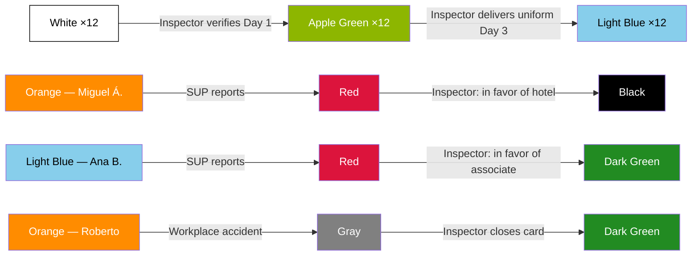

# Full Simulation — Inspection Perspective

> [!abstract] Purpose
> This simulation narrates a complete operational week from the perspective of the [[Inspector]], the field role of the [[Inspection/Inspection|Inspection]] department. It covers all Inspector responsibilities: Day 1 arrival verification, Day 3 uniform delivery, report investigation with two opposing outcomes (Blacklist and reinstatement), complete management of a workplace accident, use of the Extended Lunch Indicator, and coverage during unavailability managed by the [[Inspection/Coordinator|Coordinator]]. The cycle closes with quality supervision (QA) and measurement of the department's 5 KPIs. All data is fictional, but every action, transition, and rule faithfully reflects the vault documentation.

## Simulation Characters

| Character | Role | Department |
|---|---|---|
| Daniel Ortega | [[Inspector]] (Northwest zone) | Inspection — Oranje |
| Raúl Méndez | [[Inspection/Coordinator\|Coordinator]] | Inspection — Oranje |
| Operator 1 | [[QA Operator]] (fixed assignment to Inspection) | QA — Oranje |
| Laura Ibarra | [[Inspector]] (South zone) — temporary coverage | Inspection — Oranje |
| Mariana Vega | [[Supervisor]] | Hotel Costa Esmeralda |
| Carlos Navarro | [[General Manager]] | Hotel Costa Esmeralda |
| Gabriel Herrera | [[Area Manager]] | Hotel Sierra del Pacífico |
| Teresa Campos | [[Supervisor]] | Hotel Sierra del Pacífico |
| Ana Belén Herrera | Associate ([[Positions\|Housekeeper]]) | Assigned to Hotel Costa Esmeralda |
| Sofía Cruz | Associate ([[Positions\|Housekeeper]]) | Assigned to Hotel Costa Esmeralda |
| Miguel Ángel Paredes | Associate ([[Positions\|Houseman]]) | Assigned to Hotel Sierra del Pacífico |
| Roberto Lara | Associate ([[Positions\|Houseman]]) | Assigned to Hotel Sierra del Pacífico |
| + 10 associates | Various (HK, HM, LN) | Assigned to Hotel Costa Esmeralda |

---

## Phase 1 — Assignment and Context

> Reference: [[Inspection Rules]] · [[Zones]] · [[Onboarding Status Indicator]]

### 1.1 — The Northwest zone Inspector

It is Monday July 21, 2026, 6:00 AM. Daniel Ortega, [[Inspector]] permanently assigned to the [[Zones|Northwest]] zone by [[Inspection/Coordinator|Coordinator]] Raúl Méndez, reviews his agenda for the week. He has two active hotels in his zone:

| Hotel | Onboarding Status | Situation |
|---|---|---|
| Hotel Costa Esmeralda | **Orange** (since Jul 11) | New client. First operational week begins today |
| Hotel Sierra del Pacífico | **Orange** (veteran) | Active hotel with associates in Orange (Fixed) status |

Hotel Costa Esmeralda was converted to an active client on July 11. Its first [[Requisition]] (202607141015A3) was authorized on July 14 with 13 positions: 8 [[Positions|Housekeeper]], 3 [[Positions|Houseman]], and 2 [[Positions|Laundry]], all with a start date of today. When the requisition was authorized, Daniel was automatically assigned as the header inspector based on the hotel's zone.

> [!info] Onboarding Status Indicator
> Hotel Costa Esmeralda in **Orange** — Agreement signed, hotel is an active client
> **Date:** 2026-07-11 · **Operational responsible:** Daniel Ortega (Inspector)

> [!warning] Business Rule
> When a requisition is authorized, the [[Inspector]] is automatically assigned as the header based on the [[Zones|zone]] of the hotel. — [[Inspection Rules]]

> [!warning] Business Rule
> **Orange is the only status in the [[Onboarding Status Indicator]] that enables the hotel to generate [[Requisition|requisitions]].** Before this status, the hotel is a commercial prospect with no operational access. — [[Inspection Rules]]

---

## Phase 2 — Day 1 Arrival Verification

> Reference: [[Inspection Rules]] · [[Associate Status Indicator]]

### 2.1 — Daniel arrives at the property

Monday July 21, 6:45 AM. Daniel arrives at Hotel Costa Esmeralda. The 13 associates assigned by the [[Recruiter]] must arrive between 6:30 and 7:00 to begin their first day. Daniel positions himself at the staff entrance to verify each arrival: confirms identity, records arrival time, and validates that the associate is at the correct location.

### 2.2 — Verification results

| # | Associate | Position | Arrival time | Result |
|---|---|---|---|---|
| 1 | Ana Belén Herrera | Housekeeper | 06:38 | Verified |
| 2 | Sofía Cruz | Housekeeper | 06:42 | Verified |
| 3 | Patricia Solís | Housekeeper | 06:35 | Verified |
| 4 | Diana Robles | Housekeeper | 06:50 | Verified |
| 5 | Lucía Márquez | Housekeeper | 06:44 | Verified |
| 6 | Carmen Delgado | Housekeeper | 06:47 | Verified |
| 7 | Verónica Estrada | Housekeeper | 06:55 | Verified |
| 8 | Gabriela Pineda | Housekeeper | 06:40 | Verified |
| 9 | Fernando Ríos | Houseman | 06:36 | Verified |
| 10 | Héctor Sandoval | Houseman | 06:48 | Verified |
| 11 | Tomás Aguirre | Houseman | 06:52 | Verified |
| 12 | Adriana López | Laundry | 06:30 | Verified |
| 13 | Ernesto Solís | Laundry | — | **Did not show up** |

12 of 13 associates arrive. Ernesto Solís does not appear. Daniel records the absence.

> [!info] Associate Status Indicator
> **White** → **Apple Green** — Day 1 verified (×12 associates)
> **Date:** 2026-07-21 · **Responsible:** Daniel Ortega (Inspector) · **Comment:** "12 of 13 associates verified on site. Ernesto Solís did not show up."

> [!warning] Business Rule
> `White → Apple Green`: when assigned and present on Day 1. The [[Inspector]] verifies arrival on site at the property. — [[Associate Status Indicator]]

> [!warning] Business Rule
> Ernesto Solís remains in **White**. If he accumulates 3 absences, the system automatically moves him to **Black** (Blacklist). The 3-absence route is automatic and does **not** go through Red or the Inspector. — [[Inspection Rules]] · [[Blacklist]]

> [!tip] QA — Operator 1 observes
> Day 1 verification rate: 12/13 = **92.3%**. Target: ≥ 95%. Status: **At risk** (85–94%). Operator 1 notes that the non-compliance is not attributable to the Inspector (the associate simply did not show up), but the metric is counted. — [[Metrics and KPIs by Department#Inspection|KPI 1]]

---

## Phase 3 — Day 3 Uniform Delivery

> Reference: [[Inspection Rules]] · [[Associate Status Indicator]] · [[Deductions]]

### 3.1 — Third day of operations

Wednesday July 23. The 12 associates who started on Monday have clocked in for 3 consecutive days. Daniel arrives at Hotel Costa Esmeralda with the prepared uniforms.

### 3.2 — Uniform delivery

Daniel personally delivers the uniform to each of the 12 associates, verifying that the size is correct and that the associate signs the receipt acknowledgment. Upon completing the delivery and recording the third-day punch, the system executes the transition.

> [!info] Associate Status Indicator
> **Apple Green** → **Light Blue** — Day 3, uniform delivered (×12 associates)
> **Date:** 2026-07-23 · **Responsible:** Daniel Ortega (Inspector) · **Comment:** "Uniforms delivered to 12 associates. All clocked in 3 consecutive days."

> [!warning] Business Rule
> `Apple Green → Light Blue`: when the associate clocks in at the property on the third day. The [[Inspector]] delivers their uniform. — [[Associate Status Indicator]]

> [!tip] Automatic system actions
> A [[Deductions|deduction]] of **$15 USD** per uniform is generated for each of the 12 associates. Total: $180 USD in uniform deductions.

> [!tip] QA — Operator 1 observes
> Day 3 uniform delivery rate: 12/12 = **100%**. Target: ≥ 95%. Status: **On target**. — [[Metrics and KPIs by Department#Inspection|KPI 2]]

---

## Phase 4 — Hotel Report (Red → Black)

> Reference: [[Inspection Rules]] · [[Associate Status Indicator]] · [[Blacklist]]

### 4.1 — The Supervisor reports an associate

Thursday July 24, 9:20 AM. Teresa Campos, [[Supervisor]] of Hotel Sierra del Pacífico, reports **Miguel Ángel Paredes** (Houseman, **Orange** status — Fixed) for inappropriate conduct toward a guest during the morning cleaning service.

Miguel Ángel transitions to **Red** (Reported).

> [!info] Associate Status Indicator
> **Orange** → **Red** — Reported by the hotel
> **Date:** 2026-07-24 09:20 · **Responsible:** Teresa Campos (Supervisor) · **Comment:** "Inappropriate conduct toward guest in room area."

> [!warning] Business Rule
> **Red** status can be activated by: [[General Manager]], [[Area Manager]], or [[Supervisor]]. When activated, the zone [[Inspector]] investigates the case. — [[Associate Status Indicator]]

### 4.2 — Daniel investigates

Daniel receives the notification and travels to Hotel Sierra del Pacífico. He executes his investigation process:

| Step | Action | Result |
|---|---|---|
| 1 | Interviews Teresa Campos (SUP) | Describes the incident: Miguel Ángel responded rudely to a guest who requested additional towels |
| 2 | Reviews Miguel Ángel's [[Timesheet]] | Correct punches for the day. No anomalies in records |
| 3 | Interviews witness (another associate present) | Confirms the Supervisor's account: the associate raised his voice in front of the guest |
| 4 | Interviews Miguel Ángel Paredes | Acknowledges losing his composure but claims he was provoked. Does not present valid justification |

### 4.3 — Resolution: in favor of the hotel

The evidence is clear. Two independent testimonies (Supervisor and witness) confirm the incident. Miguel Ángel partially acknowledged the facts. Daniel evaluates the case and decides: **dispute in favor of the hotel**.

Daniel executes the transition to Black (manual Blacklist).

> [!info] Associate Status Indicator
> **Red** → **Black** — Blacklist (dispute in favor of the hotel)
> **Date:** 2026-07-24 14:30 · **Responsible:** Daniel Ortega (Inspector) · **Comment:** "Investigation completed. Inappropriate conduct confirmed by SUP and witness. Dispute resolved in favor of the hotel."

> [!warning] Business Rule — Autonomous authority
> The [[Inspector]] has **autonomous authority** to decide the outcome of the investigation, without needing to escalate or obtain validation from any other role. — [[Inspection Rules]]

> [!warning] Business Rule — Manual Blacklist
> The [[Inspector]] is the **only role** that can execute a manual entry into the [[Blacklist]]. — [[Inspection Rules]]

> [!warning] Business Rule — Permanence
> **Black is PERMANENT.** No rehabilitation or appeal process exists. Miguel Ángel Paredes is permanently banned from the system. — [[Blacklist]]

> [!tip] QA — Operator 1 observes
> Report resolution time: **same day** (9:20 → 14:30 = ~5 hours). Target: ≤ 3 days. Status: **On target**. — [[Metrics and KPIs by Department#Inspection|KPI 3]]

---

## Phase 5 — Second Report (Red → Dark Green)

> Reference: [[Inspection Rules]] · [[Associate Status Indicator]]

### 5.1 — Report for alleged absence

Friday July 25, 8:00 AM. Mariana Vega, [[Supervisor]] of Hotel Costa Esmeralda, reports **Ana Belén Herrera** (Housekeeper, **Light Blue** status — Day 5) for an alleged absence the previous day (Thursday July 24). Mariana states that Ana Belén did not appear on the visual staff list she reviewed that morning.

Ana Belén transitions to **Red** (Reported).

> [!info] Associate Status Indicator
> **Light Blue** → **Red** — Reported by the hotel
> **Date:** 2026-07-25 08:00 · **Responsible:** Mariana Vega (Supervisor) · **Comment:** "Associate did not appear on Thursday July 24 staff list."

### 5.2 — Daniel investigates

Daniel is in the zone and goes to Hotel Costa Esmeralda. He executes his investigation:

| Step | Action | Result |
|---|---|---|
| 1 | Interviews Mariana Vega (SUP) | States she did not see Ana Belén on Thursday July 24 when doing the visual roll call |
| 2 | Reviews Ana Belén's [[Timesheet]] | **Discovers that punches are indeed recorded** for Thursday July 24: clock-in 06:42, lunch-out 11:45, lunch-in 12:10, clock-out 15:02. Full shift |
| 3 | Cross-checks with the [[Schedule]] | Ana Belén was scheduled and covered for Thursday July 24 |
| 4 | Interviews Ana Belén Herrera | Confirms she worked normally. She was assigned to a different floor than the one the Supervisor checked |

### 5.3 — Resolution: in favor of the associate

The [[Timesheet]] proves that Ana Belén worked her full shift on Thursday July 24. The report was the result of an administrative error: the Supervisor checked the staff list for a different floor than the one Ana Belén was assigned to that day. Daniel decides: **dispute in favor of the associate**.

Daniel executes the transition from Red to Dark Green (reinstatement).

> [!info] Associate Status Indicator
> **Red** → **Dark Green** — Reinstatement (dispute in favor of the associate)
> **Date:** 2026-07-25 11:00 · **Responsible:** Daniel Ortega (Inspector) · **Comment:** "Timesheet confirms full shift on Jul 24. Administrative error by Supervisor when checking staff list. Associate reinstated."

> [!warning] Business Rule — Autonomous authority
> The [[Inspector]] has **autonomous authority** to decide the outcome. In this case, the [[Timesheet]] evidence is conclusive in favor of the associate. — [[Inspection Rules]]

> [!warning] Business Rule — Red vs. 3 absences
> Accumulation of 3 absences does **not** go through Red or the Inspector; that route goes directly to **Black** automatically via the system. Hotel reports (Red) are a different path that always requires Inspector investigation. — [[Inspection Rules]]

> [!tip] QA — Operator 1 observes
> Second report resolved **same day** (8:00 → 11:00 = 3 hours). Cumulative average resolution time: (~5h + ~3h) / 2 = **~4 hours**. Target: ≤ 3 days. Status: **On target**. — [[Metrics and KPIs by Department#Inspection|KPI 3]]

---

## Phase 6 — Workplace Accident

> Reference: [[Work Accident Flow]] · [[Work Accident]] · [[Inspection Rules]] · [[Associate Status Indicator]]

### 6.1 — The accident (Scenario A)

Saturday July 26, 10:15 AM. **Roberto Lara** (Houseman, **Orange** status — Fixed), assigned to Hotel Sierra del Pacífico, suffers a fall while moving heavy cleaning equipment in the laundry area. The floor was wet and uneven.

Roberto opens the app from his phone and generates an accident report (**Scenario A**: associate reports from the app).

> [!tip] Automatic system actions — [[Work Accident Flow]]
> 1. A **Workplace Accident card** is generated with an automatic number
> 2. Roberto transitions to **Gray** (Injured)
> 3. The signal reaches Teresa Campos (Supervisor) and Daniel Ortega (Northwest zone Inspector) **simultaneously**

> [!info] Associate Status Indicator
> **Orange** → **Gray** — Injured
> **Date:** 2026-07-26 10:15 · **Responsible:** Roberto Lara (associate report) · **Comment:** "Fall in laundry area. Wet floor."

### 6.2 — On-site capture by the Supervisor

Teresa Campos goes to the accident site and captures the on-site information in the card:

| Field (SUP) | Value |
|---|---|
| Exact location | Laundry area, loading zone |
| Circumstances | Fall while moving heavy equipment, wet and uneven floor |
| Witnesses | Another associate present in the area |
| Immediate care | Ice applied, right wrist immobilized |

### 6.3 — Medical follow-up by the Inspector

Daniel receives the notification at 10:20 AM and travels to Hotel Sierra del Pacífico. He assesses the situation with Teresa and decides to transfer Roberto to the nearest medical center. Daniel completes the accident card with medical information:

| Field (Inspector) | Value |
|---|---|
| Transfer to medical center | Northwest Medical Center, arrival 11:30 AM |
| Diagnosis | Minor fracture of right wrist |
| Days of incapacity | 5 days (July 26–30) |
| Medical notes | Splint applied. Complete rest. Follow-up review scheduled for July 31 |

### 6.4 — Protection during Gray status

Sunday July 27. Roberto obviously does not show up for work. This absence **does not count** toward the 3-absences → Blacklist rule, because Roberto is protected in **Gray** status.

> [!warning] Business Rule — Gray protection
> While the associate is in **Gray** (Injured) status, absences **do not count** toward the 3-absences → Black rule. The Inspector manages the exit from this status by closing the card. — [[Associate Status Indicator]] · [[Inspection Rules]]

### 6.5 — Card closure and medical discharge

Thursday July 31. Roberto goes to his follow-up medical review. The doctor confirms favorable progress and grants **medical discharge**. Daniel receives the documentation, verifies that the information is complete, and **closes the accident card** in the system.

> [!info] Associate Status Indicator
> **Gray** → **Dark Green** — Medical discharge, accident card closed
> **Date:** 2026-07-31 · **Responsible:** Daniel Ortega (Inspector) · **Comment:** "Medical discharge confirmed. Card closed. Associate available for reassignment."

Roberto is now in **Dark Green** (Available) status in the [[Associate Pool]], ready to be reassigned to a new position.

> [!warning] Business Rule — Final responsible for closure
> The [[Inspector]] is **always** the final party responsible for closing the accident card. This is a rule with no documented exception. — [[Inspection Rules]] · [[Work Accident Flow]]

> [!warning] Business Rule — Requirements to close Gray
> `Gray → Dark Green` requires: **medical discharge** + **card closure by the Inspector**. Both conditions are mandatory. — [[Associate Status Indicator]]

> [!tip] QA — Operator 1 observes
> Accident closure time: **5 days** (Jul 26 → Jul 31). Target: ≤ 7 days. Status: **On target**. — [[Metrics and KPIs by Department#Inspection|KPI 4]]

---

## Phase 7 — Extended Lunch Indicator

> Reference: [[Timesheet]] · [[Inspection Rules]]

### 7.1 — Routine Timesheet review

Friday July 25, 4:00 PM. As part of his routine supervision, Daniel reviews the [[Timesheet|Timesheets]] for his hotels. At Hotel Costa Esmeralda, he detects that **Sofía Cruz** (Housekeeper, Light Blue status) has had extended lunch on 3 of the 5 days this week:

| Day | Lunch Out | Lunch In | Lunch time | Indicator |
|---|---|---|---|---|
| Monday Jul 21 | 11:30 | 12:05 | 35 min | Extended |
| Tuesday Jul 22 | 11:45 | 12:27 | 42 min | Extended |
| Wednesday Jul 23 | 12:00 | 12:30 | 30 min | Normal |
| Thursday Jul 24 | 11:50 | 12:28 | 38 min | Extended |
| Friday Jul 25 | 12:00 | 12:30 | 30 min | Normal |

The Extended Lunch Indicator activates automatically when lunch time exceeds 30 minutes. Sofía has the indicator active on 3 of 5 shifts.

### 7.2 — Inspector action

Daniel takes note for preventive follow-up. On his next visit to the hotel, he may speak with Sofía about managing her lunch times. This is not a disciplinary action; the indicator is an internal Oranje supervision tool.

> [!warning] Business Rule — Restricted visibility
> The Extended Lunch Indicator is visible **only** to: [[Inspector]], [[Inspection/Coordinator|Coordinator]], and [[Recruitment Manager]]. **Not visible** to [[General Manager]], [[Area Manager]], or [[Supervisor]] of the hotel. — [[Inspection Rules]] · [[Timesheet]]

> [!warning] Business Rule — Not punitive
> The Extended Lunch Indicator **is not automatically punitive**. It is an internal Oranje supervision tool. — [[Inspection Rules]]

> [!warning] Business Rule — Lunch deduction
> Lunch ≥ 30 min: actual time taken is deducted. Lunch < 30 min: 30 min are deducted (mandatory minimum). No lunch punch: auto-deduction of 30 min. — [[Timesheet]]

---

## Phase 8 — Unavailability and Reassignment

> Reference: [[Inspection Rules]] · [[Inspection/Coordinator|Coordinator]] · [[Zones]]

### 8.1 — The Inspector is unavailable

Monday July 28, 7:00 AM. Daniel Ortega notifies [[Inspection/Coordinator|Coordinator]] Raúl Méndez that he has a personal emergency and will not be able to come to work today.

### 8.2 — The Coordinator reassigns

Raúl Méndez assesses the coverage situation. The Northwest zone cannot be left without an Inspector, especially with two active hotels in full operation. He decides to temporarily reassign **Laura Ibarra**, [[Inspector]] for the South zone, to cover the Northwest zone during Daniel's absence.

Laura arrives at the hotels in the Northwest zone. No major incidents occur during the day — she conducts a routine supervisory visit to Hotel Costa Esmeralda and Hotel Sierra del Pacífico.

### 8.3 — Return of the primary Inspector

Tuesday July 29. Daniel returns to normal operations. Daniel's permanent assignment to the Northwest zone **did not change** during his absence. Laura Ibarra returns to her South zone. Raúl Méndez records the temporary reassignment in the system.

> [!warning] Business Rule — Temporary reassignment
> If the [[Inspector]] assigned to a zone is unavailable (illness, emergency, or other cause), the [[Inspection/Coordinator|Coordinator]] temporarily reassigns another Inspector to guarantee operational coverage. — [[Inspection Rules]]

> [!warning] Business Rule — Permanent assignment unchanged
> The temporary reassignment **does not modify** the permanent zone assignment. It is coverage until the primary Inspector resumes. — [[Inspection Rules]]

> [!tip] QA — Operator 1 observes
> Zone coverage during absence: **6/6** (Laura covered Northwest). Target: 6/6 (100%). Status: **On target**. If the zone had not been covered: 5/6 = 83% → **At risk**. — [[Metrics and KPIs by Department#Inspection|KPI 5]]

---

## Phase 9 — QA Supervision: Cycle Close

> Reference: [[Metrics and KPIs by Department#Inspection|Inspection Metrics]] · [[Quality Indicator]] · [[QA Rules]]

The [[QA Operator]] (Operator 1), permanently assigned to the [[Inspection/Inspection|Inspection]] department, has observed the entire cycle without executing any operational action. Their role is exclusively observation, measurement, and feedback.

### KPI Summary (week of July 21–31, 2026)

| # | KPI | Result in this simulation | Target | Status |
|---|---|---|---|---|
| 1 | **Day 1 verification rate** | 12/13 = 92.3% | ≥ 95% | At risk (85–94%) |
| 2 | **Day 3 uniform delivery rate** | 12/12 = 100% | ≥ 95% | On target |
| 3 | **Average report resolution time (Red)** | (~5h + ~3h) / 2 = ~4 hours | ≤ 3 days | On target |
| 4 | **Average accident closure time (Gray → Dark Green)** | 5 days (Jul 26 → Jul 31) | ≤ 7 days | On target |
| 5 | **Zone coverage (6 zones with active Inspector)** | 6/6 = 100% (temporary reassignment covered the absence) | 6/6 (100%) | On target |

### Formal observation by Operator 1

KPI 1 (Day 1 verification rate) is **at risk**. One associate did not show up on Day 1 and the verification could not be completed at 100%. Although the absence is not attributable to the Inspector (the associate simply did not arrive), the metric is counted. If the pattern repeats in the coming weeks, Operator 1 will issue a formal observation to the department.

The [[Quality Indicator]] for the Inspection department remains **Green** (Optimal quality). A single at-risk KPI does not justify a transition to Yellow.

> [!warning] Business Rule
> QA does not execute Inspection operations; it only observes, measures, and provides feedback. If the [[Quality Indicator]] for the department reaches **Red** without improvement after notification, the [[QA Manager]] escalates to management. — [[QA Rules]]

---

## Associate Status Indicator Transition Summary

| Date | Associate(s) | Transition | Action | Responsible |
|---|---|---|---|---|
| Jul 21, 2026 | 12 new associates | White → **Apple Green** | Day 1 arrival verification | Daniel Ortega (Inspector) |
| Jul 23, 2026 | 12 associates | Apple Green → **Light Blue** | Day 3 uniform delivery | Daniel Ortega (Inspector) |
| Jul 24, 2026 | Miguel Ángel Paredes | Orange → **Red** | Supervisor report | Teresa Campos (SUP) |
| Jul 24, 2026 | Miguel Ángel Paredes | Red → **Black** | Dispute in favor of hotel (manual Blacklist) | Daniel Ortega (Inspector) |
| Jul 25, 2026 | Ana Belén Herrera | Light Blue → **Red** | Supervisor report | Mariana Vega (SUP) |
| Jul 25, 2026 | Ana Belén Herrera | Red → **Dark Green** | Dispute in favor of the associate | Daniel Ortega (Inspector) |
| Jul 26, 2026 | Roberto Lara | Orange → **Gray** | Workplace accident (Scenario A) | Roberto Lara (associate) |
| Jul 31, 2026 | Roberto Lara | Gray → **Dark Green** | Medical discharge + card closure | Daniel Ortega (Inspector) |

---

## Modules and Referenced Concepts

| Module | Reference |
|---|---|
| Inspection | [[Inspection/Inspection\|Inspection]] · [[Inspection Rules]] |
| Inspection roles | [[Inspector]] · [[Inspection/Coordinator\|Coordinator]] |
| Associate Status Indicator | [[Associate Status Indicator]] |
| Workplace Accident | [[Work Accident]] · [[Work Accident Flow]] |
| Blacklist | [[Blacklist]] |
| Daily operations | [[Timesheet]] · [[Schedule]] |
| Requisitions | [[Requisition]] · [[Requisition Flow]] |
| Hotel | [[Hotel/Hotel\|Hotel]] · [[Hotel Rules]] |
| Hotel roles | [[General Manager]] · [[Area Manager]] · [[Supervisor]] |
| Quality | [[QA Operator]] · [[QA Manager]] · [[Quality Indicator]] · [[Metrics and KPIs by Department]] · [[QA Rules]] |
| Onboarding | [[Onboarding Status Indicator]] |
| Catalogs | [[Zones]] · [[Positions]] |
| Pool and recruitment | [[Associate Pool]] · [[Recruiter]] · [[Recruitment Manager]] |
| Accounting | [[Deductions]] |
| General rules | [[Business Rules]] · [[Associate Rules]] |
| Sales (continuity) | [[Business Developer]] · [[Business Developer Coordinator]] |

---

## Related Simulations

- [[Simulation - Sales Perspective]] — Narrates how Hotel Costa Esmeralda became an active client, featuring the same characters (Daniel Ortega, Mariana Vega, Carlos Navarro) from the commercial perspective.
- [[Simulation - Hotel Perspective]] — Shows the complete hotel cycle including the daily operations the Inspector supervises.
- [[Simulation - Recruitment Perspective]] — Details the associate assignment process that the Inspector then verifies on Day 1 and Day 3.
- [[Simulation - Associate Lifecycle]] — Covers the associate states the Inspector monitors: reports, accidents, Blacklist, and reinstatement.
