```mermaid
graph TD
    subgraph Reclutamiento
        R_V[Green] -->|3 KPIs Critical<br>Aug 14| R_A[Yellow]
        R_A -->|Obs. unaddressed + deterioration<br>Aug 19| R_R[Red]
        R_R -->|Escalation to mgmt + improvement<br>Aug 22| R_A2[Yellow]
    end

    subgraph Inspección
        I_V[Green] -->|1 KPI Critical<br>Aug 15| I_A[Yellow]
        I_A -->|KPI corrected in 5 days<br>Aug 20| I_V2[Green]
    end

    subgraph Hotel
        H_V[Green — stable]
    end

    subgraph Ventas
        V_V[Green — stable]
    end

    subgraph Colaborador
        C_V[Green — preventive watch]
    end

    style R_V fill:#228B22,color:#fff
    style R_A fill:#FFD700,color:#000
    style R_R fill:#DC143C,color:#fff
    style R_A2 fill:#FFD700,color:#000
    style I_V fill:#228B22,color:#fff
    style I_A fill:#FFD700,color:#000
    style I_V2 fill:#228B22,color:#fff
    style H_V fill:#228B22,color:#fff
    style V_V fill:#228B22,color:#fff
    style C_V fill:#228B22,color:#fff
```

# Full Simulation — QA Perspective

> [!abstract] Purpose
> This simulation narrates the full quality supervision cycle within the Oranje system, from the perspective of the QA department: the [[QA Manager]] and the 5 [[QA Operator|QA Operators]]. It covers every stage of QA work — routine monitoring, anomaly detection, issuance of formal observations, [[Quality Indicator]] transitions, escalation to management, and resolution — across three operational weeks. QA never executes the operations of any department; its function is exclusively to **observe, measure, and provide feedback**. All data is fictional, but every action, transition, and rule faithfully follows the vault documentation.

## Simulation Characters

| Character | Role | Department |
|---|---|---|
| Alejandra Duarte | [[QA Manager]] | QA — Oranje |
| Operator 1 | [[QA Operator]] (assigned to Inspection) | QA — Oranje |
| Operator 2 | [[QA Operator]] (assigned to Hotel) | QA — Oranje |
| Operator 3 | [[QA Operator]] (assigned to Associate) | QA — Oranje |
| Operator 4 | [[QA Operator]] (assigned to Sales) | QA — Oranje |
| Operator 5 | [[QA Operator]] (assigned to Recruitment) | QA — Oranje |
| Daniel Ortega | [[Inspector]] (Northwest zone) | Inspection — Oranje |
| Raúl Méndez | [[Inspection/Coordinator\|Coordinator]] | Inspection — Oranje |
| Mariana Vega | [[Hotel/Supervisor\|Supervisor]] | Hotel Costa Esmeralda |
| Sofía Méndez | [[Business Developer]] (BD) | Sales — Oranje |
| Ricardo Fuentes | [[Business Developer Coordinator]] (BDC) | Sales — Oranje |
| Daniela Ríos | [[Recruiter]] | Recruitment — Oranje |
| Fernando Ortiz | [[Recruitment/Recruitment Manager\|Recruitment Manager]] | Recruitment — Oranje |

---

## Phase 1 — Baseline and Routine Monitoring

> Reference: [[QA/Metrics and KPIs by Department|Metrics and KPIs by Department]] · [[QA/QA Dashboard|QA Dashboard]] · [[QA/QA Rules|QA Rules]]

### 1.1 — Weekly Dashboard Opening (Monday, August 4, 2026)

It is Monday, August 4, 2026. Alejandra Duarte, [[QA Manager]], opens the global panel of the [[QA/QA Dashboard|QA Dashboard]] to start the week. She reviews the 5 summary cards — one per supervised department — and confirms that all are at **Green** (Optimal quality).

The [[Quality Indicator]] trend chart shows 4 consecutive weeks at Green for all 5 departments. The Critical KPI table is empty.

| Department | KPIs On Target | KPIs At Risk | KPIs Critical | Quality Status Indicator |
|---|---|---|---|---|
| Inspection | 5/5 | 0 | 0 | Green |
| Hotel | 5/5 | 0 | 0 | Green |
| Associate | 5/5 | 0 | 0 | Green |
| Sales | 5/5 | 0 | 0 | Green |
| Recruitment | 6/6 | 0 | 0 | Green |

> [!tip] QA — Dashboard
> Alejandra reviews the global panel: 5 summary cards, all at Green. The trend chart shows 4 consecutive weeks without alerts. The Critical KPIs table is empty. — [[QA/QA Dashboard|QA Dashboard]]

> [!warning] Business Rule
> The [[QA Manager]] has access to the global panel + the 5 department panels. Each [[QA Operator]] only sees the panel for their assigned department. — [[QA/QA Dashboard|QA Dashboard]]

### 1.2 — Each Operator Reviews Their Panel

Each Operator reviews the previous week's KPIs (ended August 3) in their individual panel. Routine monitoring confirms that all departments are operating within parameters:

**Operator 1 — Inspection:**

| # | KPI | Value | Target | Status |
|---|---|---|---|---|
| 1 | Day 1 verification rate | 96% | ≥ 95% | On target |
| 2 | Day 3 uniform delivery rate | 100% | ≥ 95% | On target |
| 3 | Average report resolution time | 1.2 days | ≤ 3 days | On target |
| 4 | Average accident closure time | 5 days | ≤ 7 days | On target |
| 5 | Zone coverage | 6/6 (100%) | 6/6 (100%) | On target |

Operator 1 reviews the zone coverage map: all 6 [[Zones|zones]] (Central, South, East, West, Northwest, Southeast) have an assigned and active [[Inspector]].

**Operator 2 — Hotel:**

| # | KPI | Value | Target | Status |
|---|---|---|---|---|
| 1 | Timely requisition authorization | 92% | ≥ 90% | On target |
| 2 | Requisition rejection rate | 8% | ≤ 10% | On target |
| 3 | Punch compliance | 93% | ≥ 90% | On target |
| 4 | Timely QR generation | 97% | ≥ 95% | On target |
| 5 | Prolonged Stand-by rate | 5% | ≤ 10% | On target |

Operator 2 reviews the hotel ranking by punch compliance. Hotel Costa Esmeralda appears in the top third.

**Operator 3 — Associate:**

| # | KPI | Value | Target | Status |
|---|---|---|---|---|
| 1 | Absenteeism rate | 4% | ≤ 5% | On target |
| 2 | Blacklist rate | 1.5% | ≤ 2% | On target |
| 3 | Pool Health | 65% | ≥ 60% | On target |
| 4 | Extended Lunch rate | 8% | ≤ 10% | On target |
| 5 | Data completeness | 96% | ≥ 95% | On target |

Operator 3 reviews the donut chart showing the distribution of the [[Associate Status Indicator]]. The majority of associates are concentrated in Dark Green and Yellow.

**Operator 4 — Sales:**

| # | KPI | Value | Target | Status |
|---|---|---|---|---|
| 1 | Conversion rate | 28% | ≥ 25% | On target |
| 2 | Average onboarding cycle | 38 days | ≤ 45 days | On target |
| 3 | Stagnation rate | 7% | ≤ 10% | On target |
| 4 | Loss rate | 18% | ≤ 20% | On target |
| 5 | Successful reactivation rate | 45% | ≥ 40% | On target |

Operator 4 reviews the [[Onboarding Status Indicator]] funnel. The distribution is healthy: few hotels stalled at intermediate stages.

**Operator 5 — Recruitment:**

| # | KPI | Value | Target | Status |
|---|---|---|---|---|
| 1 | Total requisition coverage | 88% | ≥ 85% | On target |
| 2 | Average requisition pickup time | 5h | ≤ 8h | On target |
| 3 | Timeout auto-assignment rate | 3% | ≤ 5% | On target |
| 4 | Timeout escalation rate | 8% | ≤ 10% | On target |
| 5 | Blacklist check compliance | 100% | 100% | On target |
| 6 | Pool entry rate | 65% | ≥ 60% | On target |

Operator 5 reviews the recruitment funnel and the pickup-time heatmap by urgency. No visible anomalies.

> [!warning] Business Rule
> QA does not execute the operations of any department. Its function is to **observe, measure, and provide feedback** so that each area maintains its quality within defined standards. — [[QA/QA Rules|QA Rules]]

### 1.3 — First Signals in Recruitment (Wednesday, August 6)

Wednesday, August 6. Operator 5 reviews the current week's activity and detects an anomaly:

- **Hotel Costa Esmeralda Requisition** (replacement for 1 Housekeeper who went to Stand-by): authorized Tuesday, August 5 at 09:00. No [[Recruiter]] picked it up from the [[Requisition Self-Pick]]. After 24 hours, the system auto-assigned it to Daniela Ríos.
- **Another hotel requisition** (2 Housemen): authorized Wednesday, August 6 at 14:00. Picked up at 22:00 — 8 hours later, right at the limit.

Operator 5 records the data in the trend lines of their panel. This week's auto-assignment rate is already 1 out of 4 requisitions (25%), far above the ≤ 5% target. However, a single week does not confirm a pattern.

> [!tip] QA — Operator 5 Observes
> Timeout auto-assignment rate this week: 1/4 = 25%. Target: ≤ 5%. Spot status: **Critical** (> 15%). Operator 5 decides to wait for confirmation next week before issuing a formal observation — one isolated week does not constitute a pattern. — [[QA/Metrics and KPIs by Department|Recruitment KPI 3]]

---

## Phase 2 — Anomaly Detection

> Reference: [[QA/Metrics and KPIs by Department|Metrics and KPIs by Department]] · [[Quality Indicator]] · [[QA/QA Rules|QA Rules]]

### 2.1 — Recruitment Deteriorates (Monday August 11 — Wednesday August 13)

The second week confirms the pattern. Three new requisitions arrive in the system:

**Requisition A** — Hotel Costa Esmeralda, 3 Housekeepers, urgency **Red** per the [[Requisition Urgency Indicator]]:
- Authorized Monday, August 11 at 08:00.
- No recruiter picks it up. The system auto-assigns it after 24 hours.
- The assigned recruiter only manages to cover 2 of 3 positions before Friday.
- The requisition closes at **Red** on the [[Requisition Status Indicator]] — partial coverage (67%).

**Requisition B** — another hotel, 2 Housemen, urgency **Yellow**:
- Authorized Tuesday, August 12 at 10:00.
- Picked up at 19:00 (9 hours — outside the ≤ 8h target).
- Covered 100%. Closes at **Light Blue**.

**Requisition C** — another hotel, 1 Laundry, urgency **Dark Green**:
- Authorized Wednesday, August 13.
- Not picked up in 24 hours. Auto-assigned by timeout.
- Eventually covered.

Operator 5 consolidates the Week 2 KPIs:

| # | KPI | Week 2 Result | Target | Status |
|---|---|---|---|---|
| 1 | Total requisition coverage | 2/3 fully closed = 67% | ≥ 85% | **Critical** (< 70%) |
| 2 | Average requisition pickup time | ~17h | ≤ 8h | **At risk** (9–24h) |
| 3 | Timeout auto-assignment rate | 2/3 = 67% | ≤ 5% | **Critical** (> 15%) |
| 4 | Timeout escalation rate | 1/3 = 33% | ≤ 10% | **Critical** (> 20%) |
| 5 | Blacklist check compliance | 100% | 100% | On target |
| 6 | Pool entry rate | 60% | ≥ 60% | On target |

The Week 1 pattern has been confirmed. Three KPIs are at Critical level and one more is at risk.

> [!tip] QA — Operator 5 Observes
> Three KPIs at Critical level (Coverage, Auto-assignment, Escalation) and one At risk (Pickup time) for the second consecutive week. The pattern is confirmed. Operator 5 proceeds to issue a formal observation to the [[Recruitment/Recruitment|Recruitment]] department. — [[QA/Metrics and KPIs by Department|Recruitment]]

### 2.2 — Operator 5 Issues a Formal Observation (Thursday, August 14)

Operator 5 prepares and sends a formal observation to the Recruitment department:

> **Formal Observation QA-REC-2026-08-001**
>
> | Field | Detail |
> |---|---|
> | Date | 2026-08-14 |
> | Department | [[Recruitment/Recruitment\|Recruitment]] |
> | Issued by | Operator 5 ([[QA Operator]]) |
> | Affected KPIs | #1 Coverage (67%), #3 Auto-assignment (67%), #4 Escalation (33%) |
> | Finding | Persistent failure in the [[Requisition Self-Pick]] system. Recruiters are not proactively picking up requisitions. Auto-assignment and escalation rates far exceed thresholds for two consecutive weeks. |
> | Impact | Requisition 202608110800A3 for Hotel Costa Esmeralda closed at Red with only 67% coverage. The hotel did not receive the full requested staffing. |
> | Recommendation | Review recruitment team workload distribution. Evaluate whether the team is understaffed. Reinforce Self-Pick model discipline. |

> [!warning] Business Rule
> If **any KPI** reaches Critical level, the [[QA Operator]] must propose that the department's [[Quality Indicator]] moves to at least **Yellow**. — [[QA/Metrics and KPIs by Department|Metrics and KPIs by Department]]

### 2.3 — Quality Status Indicator: Recruitment Moves to Yellow

Operator 5 reports to Alejandra Duarte (QA Manager) with the consolidated data and the formal observation issued. Alejandra reviews:

- 3 KPIs at Critical level and 1 at risk for 2 consecutive weeks.
- Formal observation issued and awaiting department response.

Alejandra validates the proposal and approves the transition.

> [!info] Quality Status Indicator
> Recruitment: Green → **Yellow** — Quality at risk
> **Date:** 2026-08-14 · **Proposed by:** Operator 5 · **Approved by:** Alejandra Duarte (QA Manager) · **Comment:** "3 KPIs at Critical level for 2 consecutive weeks: Coverage (67%), Auto-assignment (67%), Escalation (33%). Pickup time At risk (17h). Formal observation QA-REC-2026-08-001 issued."

> [!warning] Business Rule
> Only the [[QA Manager]] can formally update each department's [[Quality Indicator]]. The [[QA Operator]] proposes the change; the Manager validates and approves. — [[QA/QA Rules|QA Rules]]

### 2.4 — Inspection Shows a Dip (Week of August 11)

Meanwhile, Operator 1 detects a problem in Inspection:

Daniel Ortega, lead [[Inspector]] for the Northwest zone, was absent Monday August 11 and Tuesday August 12 for personal reasons. [[Inspection/Coordinator|Coordinator]] Raúl Méndez activated the temporary coverage protocol and assigned another Inspector to cover the zone. However, the substitute Inspector arrived late to the property on Monday August 11, when a group of 6 new associates was starting at Hotel Costa Esmeralda.

Result: the substitute Inspector was only able to verify 4 of the 6 associates on their Day 1.

| # | KPI | Week 2 Result | Target | Status |
|---|---|---|---|---|
| 1 | Day 1 verification rate | 4/6 = 67% | ≥ 95% | **Critical** (< 85%) |
| 2 | Day 3 uniform delivery rate | 6/6 = 100% | ≥ 95% | On target |
| 3 | Average report resolution time | 2 days | ≤ 3 days | On target |
| 4 | Average accident closure time | 5 days | ≤ 7 days | On target |
| 5 | Zone coverage | 6/6 (100%) | 6/6 (100%) | On target |

> [!tip] QA — Operator 1 Observes
> Day 1 verification rate this week: 4/6 = 67%. Target: ≥ 95%. Status: **Critical** (< 85%). Identified cause: lead Inspector absent, coverage Inspector arrived late to the property. — [[QA/Metrics and KPIs by Department|Inspection KPI 1]]

Operator 1 issues an observation to the Inspection department pointing out the systemic risk: when the lead Inspector is absent, the coverage protocol does not guarantee timely verification.

Operator 1 proposes a transition of the Quality Status Indicator to Yellow. Alejandra reviews: 1 KPI at Critical, clearly identified cause (not systemic, but reveals a weakness in the coverage protocol). Approves the transition.

> [!info] Quality Status Indicator
> Inspection: Green → **Yellow** — Quality at risk
> **Date:** 2026-08-15 · **Proposed by:** Operator 1 · **Approved by:** Alejandra Duarte (QA Manager) · **Comment:** "KPI 1 (Day 1 Verification) at Critical: 67%. Lead Inspector absent 2 days, coverage protocol insufficient."

### 2.5 — Hotel, Sales, and Associate Remain Stable

**Operator 2 — Hotel:** Hotel Costa Esmeralda's punch compliance drops to 88% this week — an indirect consequence of incomplete staffing from the failed Recruitment requisition. This places KPI 3 in "At risk" (75–89%), but not Critical. Operator 2 logs the note without issuing a formal observation. All other KPIs remain on target.

**Operator 3 — Associate:** Pool Health drops to 58% ("At risk": 40–59%) because several associates moved to Stand-by. The absenteeism rate rises to 6% ("At risk": 6–10%). Operator 3 logs both trends. No KPI reaches Critical, so no formal observation is issued yet.

**Operator 4 — Sales:** All 5 KPIs remain on target. No observations. The [[Onboarding Status Indicator]] funnel shows healthy flow.

### 2.6 — Alejandra Consolidates the Weekly Report (Friday, August 15)

Alejandra reviews the Dashboard's global panel. The picture has changed:

| Department | Quality Status Indicator | Critical KPIs | Change vs. prior week |
|---|---|---|---|
| Inspection | **Yellow** | 1 | Was Green |
| Hotel | Green | 0 | No change (1 KPI At Risk) |
| Associate | Green | 0 | No change (2 KPIs At Risk) |
| Sales | Green | 0 | No change |
| Recruitment | **Yellow** | 3 | Was Green |

The trend chart now shows a break in the Recruitment and Inspection lines: both departments fall from Green to Yellow. The Critical KPIs table lists the 4 affected KPIs (3 from Recruitment, 1 from Inspection).

Alejandra notifies both departments of the expected response to the observations issued.

---

## Phase 3 — Escalation: Recruitment Reaches Red

> Reference: [[QA/QA Rules|QA Rules]] · [[Quality Indicator]] · [[QA Manager]]

### 3.1 — Recruitment Does Not Respond (Monday, August 18)

Monday, August 18. One week has passed since Operator 5 issued formal observation QA-REC-2026-08-001. Operator 5 reviews the status:

- The observation **has not been addressed**. There is no formal response from the Recruitment department.
- New week data worsens the situation: another requisition was auto-assigned by timeout, and a requisition for 5 positions at a new hotel closed at **Red** (only 3 of 5 positions covered — 60%).

Rolling KPIs (2-week cumulative):

| # | KPI | Rolling Result | Target | Status |
|---|---|---|---|---|
| 1 | Total coverage | 4/7 = 57% | ≥ 85% | **Critical** |
| 2 | Average pickup time | ~19h | ≤ 8h | **At risk** |
| 3 | Auto-assignment rate | 4/7 = 57% | ≤ 5% | **Critical** |
| 4 | Escalation rate | 3/7 = 43% | ≤ 10% | **Critical** |
| 5 | Blacklist check compliance | 100% | 100% | On target |
| 6 | Pool entry rate | 55% | ≥ 60% | **At risk** |

> [!warning] Business Rule
> If **2 or more KPIs** are at Critical level, or the situation persists without improvement, the [[QA Operator]] must propose escalating the [[Quality Indicator]] to **Red**. — [[QA/Metrics and KPIs by Department|Metrics and KPIs by Department]]

### 3.2 — Quality Status Indicator: Recruitment Moves to Red (Tuesday, August 19)

Operator 5 presents the case to Alejandra:

- 3 KPIs in persistent Critical, 2 additional At risk.
- Formal observation issued 5 days ago with no response.
- Dashboard trend lines: sustained deterioration.

Alejandra validates and approves the transition to Red.

> [!info] Quality Status Indicator
> Recruitment: Yellow → **Red** — Critical quality
> **Date:** 2026-08-19 · **Proposed by:** Operator 5 · **Approved by:** Alejandra Duarte (QA Manager) · **Comment:** "3 KPIs in persistent Critical (Coverage 57%, Auto-assignment 57%, Escalation 43%). Formal observation QA-REC-2026-08-001 unaddressed after 5 days. Situation is deteriorating."

### 3.3 — Alejandra Escalates to Management (Wednesday, August 20)

Alejandra Duarte prepares a formal escalation report and presents it to the Oranje Director of Operations.

> [!warning] Business Rule
> Department at **Red** status with no improvement after notification → the [[QA Manager]] escalates the case to management. — [[QA/QA Rules|QA Rules]]

The report includes:

| Section | Content |
|---|---|
| Historical trend | Dashboard chart showing the drop from Green → Yellow → Red over 5 days |
| Affected KPIs | 3 Critical (#1, #3, #4), 2 At risk (#2, #6) |
| Operational impact | Hotel Costa Esmeralda received partial staffing (67%), forcing a temporary reduction in cleaning standards. Another hotel received 60% coverage. |
| Observations issued | QA-REC-2026-08-001 (2026-08-14) — no response |
| Recommended corrective actions | Review recruitment team staffing levels. Implement mandatory SLAs for requisition pickup. Temporarily redistribute workload. |

The Director of Operations calls an urgent meeting with Fernando Ortiz ([[Recruitment/Recruitment Manager|Recruitment Manager]]) and Alejandra Duarte.

Fernando acknowledges the problem: a recruiter recently left the team and has not been replaced. The remaining recruiters are overloaded and unable to pick up requisitions within the expected windows.

Fernando commits to immediate corrective actions:

1. Redistribute the requisition workload among active recruiters.
2. Assign the [[Recruitment/Recruiter Team Lead|Recruiter Team Lead]] to co-manage the [[Requisition Self-Pick]] inbox and pick up requisitions when no recruiter takes them within 4 hours.
3. Prioritize hiring a replacement recruiter.
4. Formally respond to the QA observation within the next 24 hours.

> [!tip] QA — Escalation
> This is QA's last-resort mechanism: when a department does not respond to formal observations and the [[Quality Indicator]] reaches Red, the [[QA Manager]] escalates to management to force intervention. QA does not execute the corrective actions — the department does; QA verifies that they are implemented.

---

## Phase 4 — Inspection Resolution

> Reference: [[Inspection/Inspection|Inspection]] · [[Inspection Rules]] · [[Quality Indicator]]

### 4.1 — Inspection Responds Quickly (Monday, August 18)

While Recruitment remained unresponsive, the Inspection department acted immediately upon receiving the QA observation.

[[Inspection/Coordinator|Coordinator]] Raúl Méndez:
- Reviewed the coverage protocol for lead Inspector absences.
- Established an additional operational rule: the substitute Inspector must arrive at the property at least 30 minutes before the expected arrival time of the first associate.
- Daniel Ortega returned from his absence and personally verified a new group of 4 associates who arrived at Hotel Costa Esmeralda on Monday, August 18 — **4/4 verified (100%)**.

### 4.2 — Operator 1 Confirms the Correction

Operator 1 measures Week 3 KPIs for Inspection:

| # | KPI | Week 3 Result | Target | Status |
|---|---|---|---|---|
| 1 | Day 1 verification rate | 4/4 = 100% | ≥ 95% | On target |
| 2 | Day 3 uniform delivery rate | 4/4 = 100% | ≥ 95% | On target |
| 3 | Average report resolution time | 1.5 days | ≤ 3 days | On target |
| 4 | Average accident closure time | 4 days | ≤ 7 days | On target |
| 5 | Zone coverage | 6/6 (100%) | 6/6 (100%) | On target |

All KPIs are on target. The observation was addressed with a concrete corrective action (improved coverage protocol).

### 4.3 — Quality Status Indicator: Inspection Returns to Green (Wednesday, August 20)

Operator 1 proposes the return to Green. Alejandra reviews:
- The KPI that triggered the transition to Yellow (Day 1 Verification) returned to target (100%).
- The observation was addressed with a documented process improvement.
- No other KPIs are out of range.

Alejandra approves.

> [!info] Quality Status Indicator
> Inspection: Yellow → **Green** — Optimal quality
> **Date:** 2026-08-20 · **Proposed by:** Operator 1 · **Approved by:** Alejandra Duarte (QA Manager) · **Comment:** "KPI 1 returned to target (100%). Coordinator implemented improved coverage protocol. Observation addressed and closed."

> [!tip] QA — Ideal Cycle
> This is the ideal QA cycle: **detection → observation → department response → correction → return to Green**. Total time at Yellow: 5 days. The Inspection department demonstrated a rapid response capability.

---

## Phase 5 — Recruitment Begins to Improve

> Reference: [[Quality Indicator]] · [[QA/Metrics and KPIs by Department|Metrics and KPIs by Department]]

### 5.1 — Fernando Ortiz Implements Changes (Thursday, August 21)

Fernando Ortiz formally responds to observation QA-REC-2026-08-001 and reports the implemented actions:

| Action | Status |
|---|---|
| Requisition workload redistribution | Implemented |
| [[Recruitment/Recruiter Team Lead\|Recruiter Team Lead]] co-managing Self-Pick inbox | Active since Wednesday August 20 |
| Hiring a replacement recruiter | In progress — candidate identified |
| Formal response to QA observation | Delivered |

Results are immediate:
- **Requisition D** (Hotel Costa Esmeralda, 2 Housekeepers to complete the previous partial coverage): authorized Thursday August 21 at 08:00, picked up at 10:30 (2.5 hours). Both positions covered 100%. Closes at **Light Blue**.
- **Requisition E** (another hotel, 1 Houseman): authorized Thursday August 21 at 14:00, picked up at 17:00 (3 hours). Covered 100%.

### 5.2 — Operator 5 Measures the Improvement (Friday, August 22)

Week 3 KPIs (partial, Thursday–Friday):

| # | KPI | Week 3 Result | Trend | Status |
|---|---|---|---|---|
| 1 | Total coverage | 2/2 = 100% | Improved | On target |
| 2 | Average pickup time | 3h | Improved | On target |
| 3 | Auto-assignment rate | 0/2 = 0% | Improved | On target |
| 4 | Escalation rate | 0/2 = 0% | Improved | On target |
| 5 | Blacklist check compliance | 100% | Stable | On target |
| 6 | Pool entry rate | 65% | Improved | On target |

The rolling data (multi-week cumulative) still reflects the impact of prior weeks, but the weekly trend is positive.

### 5.3 — Quality Status Indicator: Recruitment Drops to Yellow

Operator 5 proposes the transition from Red to Yellow. The justification:
- The department addressed the formal observation with concrete actions.
- This week's KPIs show significant improvement.
- However, the multi-week rolling data is still impacted — the return to Green requires at least 1 additional week of stable data.

Alejandra approves.

> [!info] Quality Status Indicator
> Recruitment: Red → **Yellow** — Quality at risk (improving)
> **Date:** 2026-08-22 · **Proposed by:** Operator 5 · **Approved by:** Alejandra Duarte (QA Manager) · **Comment:** "Department addressed formal observation. Corrective actions implemented. This week's KPIs on target. At least 1 additional week of stable data required before proposing return to Green."

> [!warning] Business Rule
> **Red → Yellow**: when the department begins to address observations and shows improvement in metrics. — [[Quality Indicator]]

---

## Phase 6 — QA Manager Final Consolidation

> Reference: [[QA/QA Dashboard|QA Dashboard]] · [[QA Manager]]

### 6.1 — Global Dashboard at the Close of the Third Week (Friday, August 22)

Alejandra reviews the Dashboard's global panel. Final status for the period:

| Department | Quality Status Indicator | Trend | Notes |
|---|---|---|---|
| Inspection | **Green** | Recovered | Was at Yellow for 5 days. Corrected. |
| Hotel | **Green** | Stable | Punch KPI normalized after staffing improved. |
| Associate | **Green** | Watch | 2 KPIs "At risk" (Pool Health 58%, Absenteeism 6%). |
| Sales | **Green** | Stable | All KPIs on target. |
| Recruitment | **Yellow** | Recovering | Was at Red for 3 days. Improving after escalation. |

### 6.2 — Preventive Note on Associate

Although the Associate department remains at Green, Alejandra detects that 2 of its 5 KPIs are at "At risk" level:

| KPI | Current value | "At risk" threshold | Target |
|---|---|---|---|
| Pool Health | 58% | 40–59% | ≥ 60% |
| Absenteeism rate | 6% | 6–10% | ≤ 5% |

Alejandra instructs Operator 3 to increase monitoring frequency for these two KPIs. If either reaches Critical level the following week, a formal observation must be issued immediately.

> [!tip] QA — Proactivity
> The [[QA Manager]] does not wait for KPIs to reach Critical before acting. Upon detecting 2 KPIs "At risk" in Associate, monitoring frequency is increased as a preventive measure. This is consistent with QA's continuous improvement principle.

### 6.3 — Consolidated Report to Management

Alejandra prepares the consolidated weekly report for the Director of Operations:

| Department | Executive Summary |
|---|---|
| **Inspection** | Full cycle Green → Yellow → Green in 5 days. Day 1 Verification KPI dropped to 67% due to lead Inspector absence. Coordinator implemented improved coverage protocol. Observation closed. |
| **Hotel** | No news. Operations within parameters. |
| **Associate** | Under preventive monitoring. 2 KPIs at risk (Pool Health, Absenteeism). Monitoring frequency increased. |
| **Sales** | No news. Operations within parameters. |
| **Recruitment** | Formal escalation executed (August 20). Department responded with corrective actions. Indicator dropped from Red to Yellow. Consolidation being monitored — return to Green expected if KPIs remain on target next week. |

> [!warning] Business Rule
> The [[QA Manager]] presents quality reports to management with findings, trends, and areas for improvement. — [[QA/QA Rules|QA Rules]]

---

## Summary of Quality Status Indicator Transitions

| Date | Department | Transition | Proposed by | Approved by | Reason |
|---|---|---|---|---|---|
| Aug 14, 2026 | Recruitment | Green → **Yellow** | Operator 5 | Alejandra Duarte | 3 KPIs Critical for 2 weeks |
| Aug 15, 2026 | Inspection | Green → **Yellow** | Operator 1 | Alejandra Duarte | KPI 1 Critical (67%) due to absence |
| Aug 19, 2026 | Recruitment | Yellow → **Red** | Operator 5 | Alejandra Duarte | 3 KPIs persistently Critical, observation unaddressed |
| Aug 20, 2026 | Inspection | Yellow → **Green** | Operator 1 | Alejandra Duarte | KPI corrected, observation addressed |
| Aug 22, 2026 | Recruitment | Red → **Yellow** | Operator 5 | Alejandra Duarte | Department responded, improvement visible |

---

## Final KPIs by Department (Week 3)

### Inspection

| # | KPI | Value | Target | Status |
|---|---|---|---|---|
| 1 | Day 1 verification rate | 100% | ≥ 95% | On target |
| 2 | Day 3 uniform delivery rate | 100% | ≥ 95% | On target |
| 3 | Average report resolution time | 1.5 days | ≤ 3 days | On target |
| 4 | Average accident closure time | 4 days | ≤ 7 days | On target |
| 5 | Zone coverage | 6/6 (100%) | 6/6 (100%) | On target |

### Hotel

| # | KPI | Value | Target | Status |
|---|---|---|---|---|
| 1 | Timely requisition authorization | 91% | ≥ 90% | On target |
| 2 | Requisition rejection rate | 9% | ≤ 10% | On target |
| 3 | Punch compliance | 90% | ≥ 90% | On target |
| 4 | Timely QR generation | 96% | ≥ 95% | On target |
| 5 | Prolonged Stand-by rate | 7% | ≤ 10% | On target |

### Associate

| # | KPI | Value | Target | Status |
|---|---|---|---|---|
| 1 | Absenteeism rate | 6% | ≤ 5% | **At risk** |
| 2 | Blacklist rate | 1.8% | ≤ 2% | On target |
| 3 | Pool Health | 58% | ≥ 60% | **At risk** |
| 4 | Extended Lunch rate | 9% | ≤ 10% | On target |
| 5 | Data completeness | 95% | ≥ 95% | On target |

### Sales

| # | KPI | Value | Target | Status |
|---|---|---|---|---|
| 1 | Conversion rate | 27% | ≥ 25% | On target |
| 2 | Average onboarding cycle | 41 days | ≤ 45 days | On target |
| 3 | Stagnation rate | 8% | ≤ 10% | On target |
| 4 | Loss rate | 17% | ≤ 20% | On target |
| 5 | Successful reactivation rate | 42% | ≥ 40% | On target |

### Recruitment

| # | KPI | Value (Week 3) | Multi-week Rolling | Rolling Status |
|---|---|---|---|---|
| 1 | Total coverage | 100% | 75% | At risk |
| 2 | Average pickup time | 3h | 12h | At risk |
| 3 | Auto-assignment rate | 0% | 33% | Critical |
| 4 | Escalation rate | 0% | 25% | Critical |
| 5 | Blacklist check compliance | 100% | 100% | On target |
| 6 | Pool entry rate | 65% | 60% | On target |

---

---

## Referenced Modules and Concepts

| Module | Reference |
|---|---|
| QA | [[QA/QA\|QA]] · [[QA/QA Rules\|QA Rules]] |
| QA Roles | [[QA Manager]] · [[QA Operator]] |
| Quality Status Indicator | [[Quality Indicator]] |
| Metrics | [[QA/Metrics and KPIs by Department\|Metrics and KPIs by Department]] |
| Dashboard | [[QA/QA Dashboard\|QA Dashboard]] |
| Inspection | [[Inspection/Inspection\|Inspection]] · [[Inspection Rules]] · [[Inspector]] · [[Inspection/Coordinator\|Coordinator]] |
| Hotel | [[Hotel/Hotel\|Hotel]] · [[Hotel Rules]] · [[Hotel/Supervisor\|Supervisor]] |
| Associate | [[Associate/Associate\|Associate]] · [[Associate Pool]] |
| Sales | [[Sales/Sales\|Sales]] · [[Sales Rules]] · [[Business Developer]] · [[Business Developer Coordinator]] |
| Recruitment | [[Recruitment/Recruitment\|Recruitment]] · [[Recruitment Rules]] · [[Recruiter]] · [[Recruitment/Recruitment Manager\|Recruitment Manager]] · [[Recruitment/Recruiter Team Lead\|Recruiter Team Lead]] |
| Status Indicators | [[Associate Status Indicator]] · [[Requisition Status Indicator]] · [[Onboarding Status Indicator]] · [[Requisition Urgency Indicator]] · [[Requisition Position Indicator]] |
| Requisitions | [[Requisition]] · [[Requisition Flow]] · [[Requisition Self-Pick]] |
| Catalogs | [[Zones]] · [[Positions]] |

---

## Related Simulations

- [[Simulation - Inspection Perspective]] — Narrates the operational week of Inspector Daniel Ortega in the Northwest zone. In this QA simulation, a coverage failure due to Daniel's absence triggers the Indicator's transition to Yellow and its swift correction.
- [[Simulation - Hotel Perspective]] — Shows the hotel's cycle as a client. QA monitors Hotel department KPIs (authorization, punching, QR, Stand-by) that remain stable throughout this simulation.
- [[Simulation - Sales Perspective]] — Details the commercial process narrated from Sales. QA supervises conversion rates, onboarding cycle, and reactivation, all on target during this simulation.
- [[Simulation - Recruitment Perspective]] — Covers the staffing process. In this QA simulation, Recruitment's persistent failures (unpicked requisitions, auto-assignments, partial coverage) trigger the crisis that brings the department to Red and requires escalation to management.
- [[Simulation - Associate Lifecycle]] — Traces the associate's states. QA monitors aggregate Associate Pool metrics (absenteeism, Blacklist, Pool Health) that appear here as preventive signals under watch.
