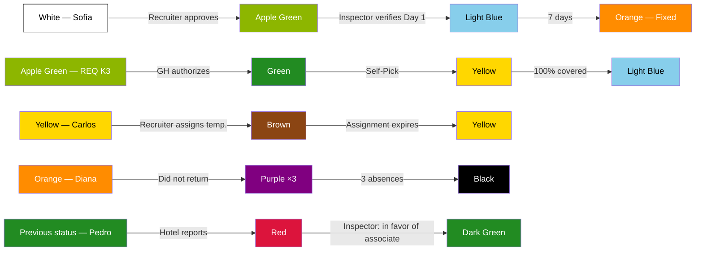

# Full Simulation — Recruitment Perspective

> [!abstract] Purpose
> This simulation narrates a complete operational week from the perspective of the [[Recruitment/Recruitment|Recruitment]] department. It covers all team responsibilities: candidate sourcing, Blacklist lookup, requisition self-pick, Pool assignment, associate progression, partial coverage with timeout escalation, system auto-assignment, temporary assignment (Brown), incident management (absences and reports), and entry into the payroll system. The cycle closes with quality supervision (QA) and measurement of the department's KPIs. All data is fictional, but every action, transition, and rule faithfully reflects the vault documentation.

## Simulation Characters

| Character | Role | Department |
|---|---|---|
| Daniela Ríos | [[Recruitment/Recruiter\|Recruiter]] | Recruitment — Oranje (Group A) |
| Valeria Soto | [[Recruitment/Recruiter\|Recruiter]] | Recruitment — Oranje (Group A) |
| Lucía Méndez | [[Recruitment/Recruiter Team Lead\|Team Lead]] | Recruitment — Oranje (Group A) |
| Fernando Ortiz | [[Recruitment/Recruitment Manager\|Recruitment Manager]] | Recruitment — Oranje |
| Operator 5 | [[QA Operator]] (fixed assignment to Recruitment) | QA — Oranje |
| Marco Duarte | [[Hotel/Supervisor\|Supervisor]] | Hotel Coral Bay · South Zone |
| Andrea Fuentes | [[Hotel/Area Manager\|Area Manager]] | Hotel Coral Bay · South Zone |
| Roberto Lara | [[Hotel/General Manager\|General Manager]] | Hotel Coral Bay · South Zone |
| Patricia Nava | [[Hotel/Supervisor\|Supervisor]] | Hotel Sierra Alta · Center Zone |
| Carmen López | [[Hotel/Area Manager\|Area Manager]] | Hotel Sierra Alta · Center Zone |
| Javier Torres | [[Inspection/Inspector\|Inspector]] | South Zone |
| Elena Rojas | [[Inspection/Inspector\|Inspector]] | Center Zone |
| Sofía Cruz | New candidate | — |
| Miguel Ángel Paredes | New candidate | — |
| Luis Gerardo Vega | Candidate on [[Core/Modules/Blacklist\|Blacklist]] | — |
| Ana Belén Herrera | Existing associate (Dark Green) | South Zone |
| Carlos Rivera | Existing associate (Yellow) | Center Zone |
| Diana Morales | Existing associate (Orange, fixed) | South Zone |
| Pedro Jiménez | Existing associate (subsequent incident) | South Zone |

---

## Initial System State — Monday May 19, 08:00

> [!info] Simulation Conventions
> - Character and hotel names are fictional.
> - Dates are based on the week of **Monday May 19 through Sunday May 25, 2026**.
> - Requisition numbers follow the format documented in [[Core/Modules/Requisition/Requisition Flow|Requisition Flow]].
> - Each status indicator transition cites the corresponding rule.

### Associate Pool

| Status in [[Core/Modules/Status Indicators/Associate Status Indicator\|Associate Status Indicator]] | Count | Example |
|---|---|---|
| White (Pre-assignment) | 0 | — |
| Dark Green (Available) | 12 | Ana Belén Herrera + 11 more |
| Yellow (Voluntary available) | 3 | Carlos Rivera + 2 more |
| Orange (Fixed) | 8 | Diana Morales + 7 more |
| Pink (Stand-by) | 2 | — |
| Brown (Temporary assignment) | 1 | — |

### KPIs from the previous week

All within target according to [[QA/Metrics and KPIs by Department|Metrics and KPIs by Department]].

| KPI | Target | Prior week result |
|---|---|---|
| Total requisition coverage | ≥ 85% | 90% |
| Average time to pick | ≤ 8h | 4h |
| Auto-assignment rate | ≤ 5% | 0% |
| Escalation rate | ≤ 10% | 5% |
| Blacklist lookup | 100% | 100% |
| Pool entry rate | ≥ 60% | 75% |

### Requisition queue

Empty. No pending requisitions at the start of the week.

---

## Phase 1 — Ongoing Recruitment (happy path)

> Reference: [[Recruitment/Recruitment Flow|Recruitment Flow]] · [[Recruitment/Recruitment Rules|Recruitment Rules]] · [[Core/Modules/Blacklist|Blacklist]]

**Main characters:** Daniela Ríos (Recruiter) and Sofía Cruz (new candidate).

The [[Recruitment/Recruitment Flow|Recruitment Flow]] is continuous: it is always active, regardless of whether requisitions are open.

### 1.1 — Monday May 19, 09:00 — Initial interview (Flow Phase 1)

Daniela receives Sofía Cruz as a candidate. Before starting any process:

1. Daniela **looks up the [[Core/Modules/Blacklist|Blacklist]]** → Sofía **does not appear** (negative result).

> [!warning] Business Rule
> [[Recruitment/Recruitment Rules|Recruitment Rules]] — "The Recruiter must check the Blacklist before recruiting any candidate."

2. Daniela proceeds with the initial interview and captures the Phase 1 data:

| Field | Value |
|---|---|
| Full name | Sofía Cruz Mendoza |
| Age | 24 years old |
| Gender | Female |
| Address | South Zone |
| Phone | (555) 012-3456 |

> [!warning] Business Rule
> [[Recruitment/Recruitment Flow|Recruitment Flow]] — Phase 1: Initial interview. Responsible: Recruiter.

### 1.2 — Monday May 19, 09:30 — App registration (Flow Phase 2)

Sofía downloads the app and completes her profile:

| Field | Value | Catalog |
|---|---|---|
| SSN | XXX-XX-1234 | — |
| ITIN | — | — |
| Position | Housekeeper | [[Core/Catalogs/Positions\|Positions]] |
| English level | Intermediate | [[Core/Catalogs/English Levels\|English Levels]] |
| Experience level | 2 years | — |
| Transportation | Own car | — |
| Modality | Full time | [[Core/Catalogs/Employment Types\|Employment Modalities]] |

> [!warning] Business Rule
> [[Recruitment/Recruitment Flow|Recruitment Flow]] — Phase 2: App registration. Responsible: the Associate themselves.

### 1.3 — Monday May 19, 10:00 — Emergency data (Flow Phase 3)

Sofía completes from the app:

| Field | Value |
|---|---|
| Emergency contact | María Cruz (mother), (555) 098-7654 |
| Blood type | O+ |
| Allergies or conditions | None |

> [!warning] Business Rule
> [[Associate/Associate Rules|Associate Rules]] — Phase 3: Emergency data. Responsible: the Associate themselves via the app.

### 1.4 — Monday May 19, 10:15 — Validation and approval (Flow Phase 4)

Daniela reviews all the information captured across the three phases. Everything is correct.

- Daniela **approves** Sofía Cruz.
- Enables Sofía's access to the system panels.
- **Sofía Cruz enters the [[Core/Modules/Associate Pool|Associate Pool]].**

> [!warning] Business Rule
> [[Recruitment/Recruitment Flow|Recruitment Flow]] — Phase 4: Validation, approval, and enablement. Responsible: Recruiter.

> [!info] Associate Status Indicator
> **—** → **White** — Approved and enters the Pool
> **Date:** 2026-05-19 · **Responsible:** Daniela Ríos (Recruiter) · **Comment:** "Sofía Cruz passes all 4 phases of the Recruitment Flow. Blacklist negative confirmed."

> [!warning] Business Rule
> [[Core/Modules/Status Indicators/Associate Status Indicator|Associate Status Indicator]] — "Upon approval and entry into the Pool, the associate enters White status."

> [!tip] QA — Operator 5 observes
> Sofía Cruz enters the Pool. The Blacklist lookup was performed before starting the process. Pool entry rate: being tracked. Target: ≥ 60% (approved / interviewed). — [[QA/Metrics and KPIs by Department|KPI: Pool entry rate]]

---

## Phase 2 — Candidate on Blacklist

> Reference: [[Core/Modules/Blacklist|Blacklist]] · [[Recruitment/Recruitment Rules|Recruitment Rules]]

**Main characters:** Daniela Ríos (Recruiter) and Luis Gerardo Vega (blacklisted candidate).

### 2.1 — Monday May 19, 11:00 — Blacklist lookup (positive result)

Luis Gerardo Vega presents as a candidate. Daniela initiates the standard protocol:

1. **Looks up the [[Core/Modules/Blacklist|Blacklist]]** → Luis Gerardo **appears in Black status**.
   - Recorded reason: 3 absences (automatic Blacklist by system).

> [!warning] Result
> Luis Gerardo Vega is on the Blacklist. The process stops. He cannot be recruited.

- Luis Gerardo does not appear in active searches of the [[Core/Modules/Associate Pool|Associate Pool]].
- His history is preserved for internal review.

> [!warning] Business Rule
> [[Core/Modules/Blacklist|Blacklist]] — "3 absences → automatic Blacklist by system."

> [!warning] Business Rule
> [[Core/Modules/Blacklist|Blacklist]] — "Black is PERMANENT. No rehabilitation or appeal process exists."

> [!warning] Business Rule
> [[Recruitment/Recruitment Rules|Recruitment Rules]] — "The Recruiter must check the Blacklist before recruiting."

**No status indicator transition. The candidate does not enter the system.**

---

## Phase 3 — Requisition Self-Pick (100% coverage)

> Reference: [[Core/Modules/Requisition/Requisition Flow|Requisition Flow]] · [[Requisition Self-Pick|Self-Pick]] · [[Core/Modules/Status Indicators/Requisition Status Indicator|Requisition Status Indicator]] · [[Core/Modules/Status Indicators/Requisition Urgency Indicator|Requisition Urgency Indicator]]

**Main characters:** Daniela Ríos (Recruiter), Andrea Fuentes (GH Hotel Coral Bay), Marco Duarte (SUP).

### 3.1 — Monday May 19, 14:00 — Requisition created by the hotel

Marco Duarte (Supervisor) creates a requisition in the system:

| Field | Value |
|---|---|
| Requisition number | `202605191400K3` |
| Hotel | Coral Bay |
| Zone | South |
| Status | Apple Green (In preparation) |

Requested position:

| Position | Modality | Quantity | Start date | Language preference |
|---|---|---|---|---|
| Housekeeper | Full time | 4 | Wednesday May 21 | Intermediate |

> [!warning] Business Rule
> [[Core/Modules/Requisition/Requisition Flow|Requisition Flow]] — "GM, GH or SUP creates the requisition with at least one position."

> [!info] Requisition Status Indicator
> **—** → **Apple Green** — In preparation
> **Date:** 2026-05-19 14:00 · **Responsible:** Marco Duarte (Supervisor)

> [!info] Requisition Positions Status Indicator
> **—** → **Gold** — In preparation (Housekeeper ×4)
> **Date:** 2026-05-19 14:00 · **Responsible:** System

### 3.2 — Monday May 19, 14:30 — Authorization

Andrea Fuentes (Area Manager) reviews and **authorizes** the requisition.

The system automatically calculates urgency:
- Authorization date: May 19, 14:30
- Position start date: May 21
- Difference: ≈ 42 hours → **Red** (Urgent, < 72h)

The zone inspector is automatically assigned: **Javier Torres** (South Zone).

> [!warning] Business Rule
> [[Core/Modules/Requisition/Requisition Flow|Requisition Flow]] — "Only GM or GH can authorize; SUP cannot."

> [!warning] Business Rule
> [[Core/Modules/Status Indicators/Requisition Urgency Indicator|Requisition Urgency Indicator]] — "< 72 hours = Red (Urgent)."

> [!warning] Business Rule
> [[Core/Modules/Requisition/Requisition Flow|Requisition Flow]] — "Upon authorization, the zone inspector for the hotel is automatically assigned."

> [!info] Requisition Status Indicator
> **Apple Green** → **Green** — Authorized
> **Date:** 2026-05-19 14:30 · **Responsible:** Andrea Fuentes (Area Manager)

> [!info] Requisition Positions Status Indicator
> **Gold** → **Orange** — Authorized (Housekeeper ×4)
> **Date:** 2026-05-19 14:30 · **Responsible:** System · **Comment:** "Urgency: Red (< 72h)"

### 3.3 — Monday May 19, 14:35 — Self-Pick

The requisition appears in the shared "Authorized" queue, visible to the entire Recruitment department. It is prioritized at the top due to its Red urgency.

Daniela Ríos sees it and **picks it up** (first to confirm).

> [!warning] Business Rule
> [[Requisition Self-Pick|Self-Pick]] — "Concurrency: first to confirm wins. If two Recruiters pick the same one simultaneously, the system locks it for the first to confirm."

> [!info] Requisition Status Indicator
> **Green** → **Yellow** — In process
> **Date:** 2026-05-19 14:35 · **Responsible:** Daniela Ríos (Recruiter)

### 3.4 — Monday May 19, 14:40 — Pool search and assignment

Daniela checks the [[Core/Modules/Schedule|Schedule]] for Hotel Coral Bay and searches the [[Core/Modules/Associate Pool|Associate Pool]] with the following filters:

| Filter | Value |
|---|---|
| Position | Housekeeper |
| Zone | South |
| Language | Intermediate or above |
| Availability | Dark Green or White |

Match results:

| # | Associate | Current status | Zone | Language |
|---|---|---|---|---|
| 1 | Ana Belén Herrera | Dark Green | South | Intermediate |
| 2 | Sofía Cruz | White | South | Intermediate |
| 3 | Laura Estrada | Dark Green | South | Advanced |
| 4 | Fernanda Ríos | Dark Green | South | Intermediate |

Daniela assigns all 4 associates to Hotel Coral Bay and registers them in the [[Core/Modules/Schedule|Schedule]].

> [!warning] Business Rule
> [[Recruitment/Recruiter|Recruiter]] — "Assigns the associate to the hotel and registers them in their Schedule."

> [!info] Requisition Positions Status Indicator
> **Orange** → **Green** — 100% covered (Housekeeper ×4)
> **Date:** 2026-05-19 14:40 · **Responsible:** Daniela Ríos (Recruiter)

> [!info] Requisition Status Indicator
> **Yellow** → **Light Blue** — Fully covered
> **Date:** 2026-05-19 14:40 · **Responsible:** System · **Comment:** "All positions reached Green."

> [!warning] Business Rule
> [[Core/Modules/Status Indicators/Requisition Position Indicator|Requisition Position Status Indicator]] — "Green: 100% covered. All assigned associates confirmed."

> [!warning] Business Rule
> [[Core/Modules/Status Indicators/Requisition Status Indicator|Requisition Status Indicator]] — "Light Blue: Fully covered. Only if ALL positions reach Green."

> [!tip] QA — Operator 5 observes
> REQ 202605191400K3 covered 100% in under 1 hour from self-pick. Time to pick: ~5 minutes from when it appeared in the queue. Contributes positively to the average time-to-pick KPI (target: ≤ 8h). — [[QA/Metrics and KPIs by Department|KPI: Average time to pick]]

---

## Phase 4 — Associate Progression and Inspection

> Reference: [[Core/Modules/Status Indicators/Associate Status Indicator|Associate Status Indicator]] · [[Core/Modules/Timesheet|Timesheet]] · [[Core/Modules/Business Rules|Business Rules]]

**Main characters:** Sofía Cruz (new associate), Javier Torres (Inspector, South Zone).

This section narrates Sofía Cruz's progression after being assigned to Hotel Coral Bay.

### 4.1 — Wednesday May 21 — Day 1: Arrival verification

Sofía Cruz arrives at Hotel Coral Bay at 06:45.

**Javier Torres** (Inspector, South Zone) arrives at the hotel and verifies the arrival of Sofía and the other newly assigned associates.

> [!info] Associate Status Indicator
> **White** → **Apple Green** — Day 1 verified
> **Date:** 2026-05-21 · **Responsible:** Javier Torres (Inspector) · **Comment:** "Sofía Cruz verified on site. First day at Hotel Coral Bay."

> [!warning] Business Rule
> [[Core/Modules/Status Indicators/Associate Status Indicator|Associate Status Indicator]] — "White → Apple Green: when assigned and present on Day 1. The Inspector verifies arrival on site."

Sofía clocks in for the first time via QR generated by Andrea Fuentes (GH):

| Event | Time |
|---|---|
| Clock In | 07:00 |
| Lunch Out | 12:00 |
| Lunch In | 12:28 |
| Break Out | 15:00 |
| Break In | 15:15 |
| Clock Out | 15:30 |

Day calculation:
- Gross hours: 8h 30min
- Actual lunch: 28 min → minimum deduction of **30 min**
- Break: 15 min
- **Net hours: 7h 45min**

> [!warning] Business Rule
> [[Core/Modules/Timesheet|Timesheet]] — "6 punch events per shift."

> [!warning] Business Rule
> [[Core/Modules/Business Rules|Business Rules]] — "Lunch deduction: minimum 30 minutes always, even if less is taken."

### 4.2 — Friday May 23 — Day 3: Uniform delivery

Sofía clocks in for her third consecutive day at Hotel Coral Bay.

Javier Torres arrives again and **delivers the uniform** to Sofía Cruz.

> [!info] Associate Status Indicator
> **Apple Green** → **Light Blue** — Day 3, uniform delivered
> **Date:** 2026-05-23 · **Responsible:** Javier Torres (Inspector) · **Comment:** "Sofía Cruz clocked in 3 consecutive days. Uniform delivered."

> [!warning] Business Rule
> [[Core/Modules/Status Indicators/Associate Status Indicator|Associate Status Indicator]] — "Apple Green → Light Blue: when the associate clocks in at the property on the third day. The Inspector delivers the uniform."

### 4.3 — Wednesday May 28 — Day 7: Fixed

Sofía completes 7 days at Hotel Coral Bay. The system executes the transition automatically.

> [!info] Associate Status Indicator
> **Light Blue** → **Orange** — 7 days completed (Fixed)
> **Date:** 2026-05-28 · **Responsible:** System · **Comment:** "Automatic transition. Sofía Cruz becomes a fixed associate at Hotel Coral Bay."

> [!warning] Business Rule
> [[Core/Modules/Status Indicators/Associate Status Indicator|Associate Status Indicator]] — "Light Blue → Orange: upon completing 7 days. Automatic system transition."

**Sofía Cruz progression summary:**

```
— → White → Apple Green → Light Blue → Orange
     (Pool)   (Day 1)        (Day 3)      (Day 7)
```

---

## Phase 5 — Partial Coverage and Timeout Escalation

> Reference: [[Core/Modules/Requisition/Requisition Flow|Requisition Flow]] · [[Requisition Self-Pick|Self-Pick]] · [[Core/Modules/Status Indicators/Requisition Status Indicator|Requisition Status Indicator]] · [[Recruitment/Recruitment Rules|Recruitment Rules]]

**Main characters:** Valeria Soto (Recruiter), Lucía Méndez (Team Lead), Patricia Nava (SUP Hotel Sierra Alta), Carmen López (GH).

### 5.1 — Tuesday May 20, 10:00 — Requisition with multiple positions

Patricia Nava (Supervisor) creates a requisition for Hotel Sierra Alta (Center Zone):

| Field | Value |
|---|---|
| Requisition number | `202605201000M7` |
| Hotel | Sierra Alta |
| Zone | Center |

Requested positions:

| Position | Modality | Quantity | Start date |
|---|---|---|---|
| Housekeeper | Full time | 6 | Friday May 23 |
| Houseman | Full time | 2 | Friday May 23 |
| Chef | Full time | 1 | Saturday May 24 |

### 5.2 — Tuesday May 20, 10:30 — Authorization

Carmen López (Area Manager) authorizes the requisition.

Urgency calculation per position:
- Housekeeper and Houseman: May 20 10:30 → May 23 = ≈ 62h → **Red** (< 72h)
- Chef: May 20 10:30 → May 24 = ≈ 86h → **Yellow** (72–120h)

Inspector automatically assigned: **Elena Rojas** (Center Zone).

> [!info] Requisition Status Indicator
> **Apple Green** → **Green** — Authorized
> **Date:** 2026-05-20 10:30 · **Responsible:** Carmen López (Area Manager)

> [!info] Requisition Positions Status Indicator
> **Gold** → **Orange** — Authorized (Housekeeper ×6, Houseman ×2, Chef ×1)
> **Date:** 2026-05-20 10:30 · **Responsible:** System · **Comment:** "Urgency HK/HM: Red. Urgency Chef: Yellow."

### 5.3 — Tuesday May 20, 10:35 — Self-Pick by Valeria

Valeria Soto picks the requisition from the shared queue.

> [!info] Requisition Status Indicator
> **Green** → **Yellow** — In process
> **Date:** 2026-05-20 10:35 · **Responsible:** Valeria Soto (Recruiter)

### 5.4 — Tuesday May 20, 11:00 — Pool search (partial match)

Valeria searches the [[Core/Modules/Associate Pool|Associate Pool]] filtering by Center Zone:

| Position | Required | Found in Pool | Assigned | Coverage |
|---|---|---|---|---|
| Housekeeper | 6 | 4 | 4 | 67% |
| Houseman | 2 | 2 | 2 | 100% |
| Chef | 1 | 0 | 0 | 0% |

Valeria assigns the 6 found associates and **actively searches outside the system** (social media, WhatsApp groups) to cover the 2 missing Housekeeper and 1 Chef positions.

> [!warning] Business Rule
> [[Recruitment/Recruitment Rules|Recruitment Rules]] — "If no match in Pool → actively search outside the system (social networks, external groups)."

> [!info] Requisition Positions Status Indicator
> **Orange** → **Red** — Housekeeper ×6 (> 25% missing: 4/6 = 67%)
> **Date:** 2026-05-20 11:00 · **Responsible:** System

> [!info] Requisition Positions Status Indicator
> **Orange** → **Green** — Houseman ×2 (100%: 2/2)
> **Date:** 2026-05-20 11:00 · **Responsible:** Valeria Soto (Recruiter)

> [!info] Requisition Positions Status Indicator
> **Orange** → **Red** — Chef ×1 (> 25% missing: 0/1 = 0%)
> **Date:** 2026-05-20 11:00 · **Responsible:** System

> [!tip] QA — Operator 5 observes
> REQ 202605201000M7: partial coverage detected. Housekeeper at 67%, Chef at 0%. Valeria activates external search. Operator 5 notes that the requisition is at risk of not meeting the total coverage KPI (target: ≥ 85%). — [[QA/Metrics and KPIs by Department|KPI: Total requisition coverage]]

### 5.5 — Wednesday May 21, 10:35 — Timeout escalation

**24 hours** have passed without covering the pending positions. The urgency for those positions is **Red** (< 72h), so the escalation window is **24 hours**.

The system escalates to **Lucía Méndez** (Team Lead).

> [!warning] Escalation activated
> 24h timeout without covering Red-urgency positions.

> [!warning] Business Rule
> [[Requisition Self-Pick|Self-Pick]] — Escalation table:
> - Red (< 72h): 24h without coverage → escalates to Team Lead.
> - Yellow (72–120h): 48h without coverage.
> - Dark Green (> 120h): 72h without coverage.

The requisition remains in **Yellow** (In process) throughout the escalation.

### 5.6 — Wednesday May 21 – Friday May 23 — Lucía takes over the search

Lucía Méndez takes over the search. She manages to recruit 1 additional Housekeeper through an external group (Miguel Ángel Paredes, who goes through all 4 phases of the [[Recruitment/Recruitment Flow|Recruitment Flow]] and enters the Pool as White before being assigned).

Updated position status at Friday May 23 close:

| Position | Assigned / Required | Coverage | Status |
|---|---|---|---|
| Housekeeper | 5 / 6 | 83% | Yellow (≤ 25% missing) |
| Houseman | 2 / 2 | 100% | Green |
| Chef | 0 / 1 | 0% | Red (> 25% missing) |

**The requisition closes in Red status** (Partially covered) because at least one position (Chef) did not reach Green.

> [!warning] Business Rule
> [[Core/Modules/Status Indicators/Requisition Status Indicator|Requisition Status Indicator]] — "Red: Partially covered. The requisition only closes in Light Blue if ALL positions reach Green."

> [!info] Requisition Status Indicator
> **Yellow** → **Red** — Partially covered
> **Date:** 2026-05-23 · **Responsible:** System · **Comment:** "Chef (0/1) not covered. At least one position did not reach Green."

> [!info] Requisition Positions Status Indicator
> **Red** → **Yellow** — Housekeeper ×6 (5/6 = 83%)
> **Date:** 2026-05-23 · **Responsible:** Lucía Méndez (Team Lead)

---

## Phase 6 — System Auto-Assignment

> Reference: [[Requisition Self-Pick|Self-Pick]] · [[Recruitment/Recruitment Rules|Recruitment Rules]]

### 6.1 — Tuesday May 20, 16:00 — Unclaimed requisition

Hotel Coral Bay creates another requisition:

| Field | Value |
|---|---|
| Requisition number | `202605201600P2` |
| Position | Houseman ×2 |
| Start date | Monday May 26 |

Andrea Fuentes (GH) authorizes it at 16:00.

Urgency: May 20 16:00 → May 26 = ≈ 152h → **Dark Green** (Normal, > 120h).

The requisition sits in the shared queue. No Recruiter picks it — all are focused on Red-urgency requisitions.

> [!info] Requisition Status Indicator
> **—** → **Apple Green** → **Green** — Authorized
> **Date:** 2026-05-20 16:00 · **Responsible:** Andrea Fuentes (Area Manager)

### 6.2 — Wednesday May 21, 16:00 — Auto-assignment

Exactly **24 hours** have passed since authorization without anyone picking the requisition.

The system automatically assigns it to the Recruiter with the **lowest active requisition load**:
- Valeria Soto: 1 active requisition
- Daniela Ríos: 2 active requisitions
- → Assigned to **Valeria Soto**.

> [!warning] Business Rule
> [[Requisition Self-Pick|Self-Pick]] — "If a requisition has gone more than 24 hours without being picked, the system automatically assigns it to the Recruiter with the lowest workload."

> [!warning] Business Rule
> [[Recruitment/Recruitment Rules|Recruitment Rules]] — "The Recruitment Manager does not receive a notification; the process is transparent."

> [!info] Requisition Status Indicator
> **Green** → **Yellow** — In process (auto-assigned)
> **Date:** 2026-05-21 16:00 · **Responsible:** System · **Comment:** "Auto-assigned to Valeria Soto due to lower workload. 24h without self-pick."

Valeria covers the requisition with 2 Dark Green Pool associates. The requisition closes in **Light Blue**.

> [!tip] QA — Operator 5 observes
> REQ 202605201600P2: auto-assigned by system. This requisition feeds the auto-assignment rate KPI (target: ≤ 5%). With 1 of 3 requisitions auto-assigned = 33% — critical value. Operator 5 notes the observation for the end-of-cycle review. — [[QA/Metrics and KPIs by Department|KPI: Auto-assignment rate]]

---

## Phase 7 — Temporary Assignment (Brown)

> Reference: [[Core/Modules/Status Indicators/Associate Status Indicator|Associate Status Indicator]] · [[Core/Modules/Schedule|Schedule]] · [[Core/Modules/Timesheet|Timesheet]] · [[Associate/Associate Rules|Associate Rules]]

**Main characters:** Daniela Ríos, Carlos Rivera (associate in Yellow), Diana Morales (associate in Orange).

### 7.1 — Thursday May 22, 07:30 — Diana Morales absence

Diana Morales (fixed Housekeeper at Hotel Coral Bay, Orange status) does not show up for work. The system marks her as **Purple** (Did not return).

> [!warning] Business Rule
> [[Core/Modules/Status Indicators/Associate Status Indicator|Associate Status Indicator]] — "Purple: the system marks this when the associate is absent without justification."

Hotel Coral Bay needs to temporarily fill that position.

### 7.2 — Thursday May 22, 08:00 — Search for temporary replacement

Daniela searches the Pool for associates available for temporary assignment:
- Carlos Rivera is in **Yellow** (Voluntary available) status.
  - Carlos activated this status himself via the app during his rest period from Hotel Sierra Alta.

> [!warning] Business Rule
> [[Core/Modules/Status Indicators/Associate Status Indicator|Associate Status Indicator]] — "Yellow: the associate activates it from the app themselves. It is the only self-service status, requiring no one's approval."

### 7.3 — Thursday May 22, 08:15 — Temporary assignment

Daniela assigns Carlos Rivera **temporarily** to Hotel Coral Bay for **3 days** (Thursday 22, Friday 23, and Saturday 24).

> [!info] Associate Status Indicator
> **Yellow** → **Brown** — Temporary assignment, 3 days
> **Date:** 2026-05-22 08:15 · **Responsible:** Daniela Ríos (Recruiter) · **Comment:** "Temporary replacement for Diana Morales (absence). Hotel Coral Bay. Duration: 3 days."

> [!warning] Business Rule
> [[Core/Modules/Status Indicators/Associate Status Indicator|Associate Status Indicator]] — "Yellow → Brown: the Recruiter assigns temporarily with a defined duration in days."

Effects of the assignment:
- A [[Core/Modules/Schedule|Schedule]] is generated for Carlos at Hotel Coral Bay.
- The Schedule generates a [[Core/Modules/Timesheet|Timesheet]].
- Carlos **can clock in**.

> [!warning] Business Rule
> [[Associate/Associate Rules|Associate Rules]] — "Without an active assignment there is no Schedule; without a Schedule there is no Timesheet; without a Timesheet clocking in is not possible."

### 7.4 — Sunday May 25 — Temporary assignment ends

The 3 assigned days expire. Carlos Rivera has **not** finished his rest period from Hotel Sierra Alta.

> [!info] Associate Status Indicator
> **Brown** → **Yellow** — Temporary assignment expires
> **Date:** 2026-05-25 · **Responsible:** System · **Comment:** "Carlos Rivera returns to Yellow because he is still in his rest period from Hotel Sierra Alta."

> [!warning] Business Rule
> [[Core/Modules/Status Indicators/Associate Status Indicator|Associate Status Indicator]] — "When the assigned days expire: returns to Yellow if still in a rest period, or to Dark Green if not."

---

## Phase 8 — Incidents: Did Not Return and Reported

> Reference: [[Core/Modules/Blacklist|Blacklist]] · [[Core/Modules/Status Indicators/Associate Status Indicator|Associate Status Indicator]] · [[Recruitment/Recruitment Manager|Recruitment Manager]] · [[Inspection/Inspector|Inspector]]

### Case 1: Diana Morales — 3 absences → Blacklist

**Thursday May 22** — Diana did not show up (1st absence). System marks her **Purple**.

**Friday May 23** — Diana does not show up again (2nd absence). Remains in **Purple**.

**Monday May 26** — Diana does not show up for the third time (3rd absence).

> [!warning] Automatic Blacklist
> 3 accumulated absences → the system executes the transition to **Black** (Blacklist) automatically.

> [!info] Associate Status Indicator
> **Orange** → **Purple** ×3 → **Black** — Automatic Blacklist
> **Date:** 2026-05-22 → 2026-05-26 · **Responsible:** System · **Comment:** "3 accumulated absences without justification. Blacklist executed automatically."

> [!warning] Business Rule
> [[Core/Modules/Blacklist|Blacklist]] — "3 absences → automatic Blacklist by system."

> [!warning] Business Rule
> [[Core/Modules/Blacklist|Blacklist]] — "Black is PERMANENT. No rehabilitation or appeal process exists."

> [!warning] Business Rule
> [[Core/Modules/Status Indicators/Associate Status Indicator|Associate Status Indicator]] — "Black: associate blocked. Does not appear in active searches. History preserved."

Fernando Ortiz (Recruitment Manager) **reviews the Blacklist case** as part of his supervisory function.

> [!warning] Business Rule
> [[Recruitment/Recruitment Manager|Recruitment Manager]] — "Review Blacklist cases: responsibility of the Recruitment Manager."

### Case 2: Pedro Jiménez — Reported by the hotel

**Friday May 23** — Andrea Fuentes (GH of Hotel Coral Bay) **reports** Pedro Jiménez for inappropriate conduct.

> [!info] Associate Status Indicator
> **[previous status]** → **Red** — Reported by the hotel
> **Date:** 2026-05-23 · **Responsible:** Andrea Fuentes (Area Manager) · **Comment:** "Report for inappropriate conduct."

> [!warning] Business Rule
> [[Core/Modules/Status Indicators/Associate Status Indicator|Associate Status Indicator]] — "Red: set by the hotel (GM, GH or SUP). The Inspector investigates and resolves."

**Inspector investigation:**

Javier Torres (Inspector, South Zone) investigates the case. Interviews Pedro, the hotel Supervisor, and reviews the records.

**Outcome:** the dispute is resolved **in favor of the associate**. There was no inappropriate conduct — it was a misunderstanding.

> [!info] Associate Status Indicator
> **Red** → **Dark Green** — Reinstated (dispute resolved in favor of the associate)
> **Date:** 2026-05-26 · **Responsible:** Javier Torres (Inspector) · **Comment:** "Investigation completed. No inappropriate conduct. Misunderstanding resolved in favor of the associate."

> [!warning] Business Rule
> [[Core/Modules/Status Indicators/Associate Status Indicator|Associate Status Indicator]] — "Dispute resolved in favor of the associate → returns to Dark Green."

> [!warning] Business Rule
> [[Inspection/Inspector|Inspector]] — "The Inspector has autonomous authority to resolve the dispute, without validation from the Recruitment Manager."

> [!tip] QA — Operator 5 observes
> Two incidents this week: Diana Morales (Blacklist for 3 absences, automatic route) and Pedro Jiménez (report resolved by Inspector in favor of the associate). Operator 5 notes both cases for the end-of-cycle review. The Blacklist lookup rate remains at 100% (2 of 2 candidates checked). — [[QA/Metrics and KPIs by Department|KPI: Blacklist lookup]]

---

## Phase 9 — Entry into the Payroll System

> Reference: [[Accounting/Weekly Associate Summary|Weekly Associate Summary]] · [[Accounting/Payroll Flow|Payroll Flow]] · [[Core/Modules/Contract|Contract]] · [[Accounting/Deductions|Deductions]]

This section narrates how Sofía Cruz's and Carlos Rivera's work week enters the payroll system.

### 9.1 — Sunday May 25 — Week close

The system automatically generates the [[Accounting/Weekly Associate Summary|Consolidado Semanal]] for each associate who had activity during the week.

#### Sofía Cruz (1 hotel)

| Field | Value |
|---|---|
| Hotel | Coral Bay |
| Days worked | 5 (Wednesday 21 – Sunday 25) |
| Gross hours | 40h |
| Lunch deduction | 2.5h (30 min × 5 shifts) |
| Net hours | 37.5h |
| Pay rate | Per [[Core/Modules/Contract\|Contract]] of Hotel Coral Bay |

> [!note] Note
> Sofía joined mid-week (Wednesday 21). The system automatically prorates: days prior to enrollment (Monday 19 and Tuesday 20) are marked Gray in the [[Core/Modules/Status Indicators/Timesheet Compliance Indicator|Timesheet Compliance Indicator]].

> [!warning] Business Rule
> [[Core/Modules/Business Rules|Business Rules]] — "Mid-week entry: the system automatically prorates the remaining days of the cycle; days prior to enrollment are marked Gray."

#### Carlos Rivera (2 hotels)

Carlos worked at 2 hotels during the week:

| Hotel | Days | Net hours | Pay rate |
|---|---|---|---|
| Sierra Alta (before rest) | 2 | 15h | Per Sierra Alta contract |
| Coral Bay (temporary assignment) | 3 | 22.5h | Per Coral Bay contract |

Overtime is calculated **per hotel**, not globally:
- Sierra Alta: 15h (does not exceed 40h → no overtime)
- Coral Bay: 22.5h (does not exceed 40h → no overtime)

> [!warning] Business Rule
> [[Accounting/Weekly Associate Summary|Weekly Associate Summary]] — "Overtime is calculated per hotel according to each contract's policy."

### 9.2 — Monday May 26 — Pre-Payroll

The system generates the Pre-Payroll applying:
- Pay rate from each hotel's [[Core/Modules/Contract|Contract]].
- Active [[Accounting/Deductions|Deductions]] for each associate (uniform, meals, 16% withholding).

> [!warning] Business Rule
> [[Accounting/Payroll Flow|Payroll Flow]] — Step 2: "Pre-Payroll calculation: applies pay rate, active deductions, authorized overtime."

### 9.3 — Tuesday May 27 — Accounting validation

The [[Accountant]] reviews and the [[Accounting Manager]] approves the Pre-Payroll.

> [!warning] Business Rule
> [[Accounting/Payroll Flow|Payroll Flow]] — Step 3: "Pre-Payroll validation by Accounting. Requires approval."

### 9.4 — Wednesday May 28 — Payment executed

Payroll is released and payment is executed.

> [!warning] Business Rule
> [[Accounting/Payroll Flow|Payroll Flow]] — Step 7: "Final authorization and payment execution."

---

## Phase 10 — QA Supervision: Cycle Close

> Reference: [[QA/Metrics and KPIs by Department|Recruitment Metrics]] · [[Quality Indicator]] · [[QA Rules]]

The [[QA Operator]] (Operator 5), with a fixed assignment to the [[Recruitment/Recruitment|Recruitment]] department, has observed the entire cycle without executing any operational action. Their role is exclusively observation, measurement, and feedback.

### KPI Summary (week of May 19–25, 2026)

| # | KPI | Result in this simulation | Target | Status |
|---|---|---|---|---|
| 1 | **Total requisition coverage** (Light Blue / closed) | 2 of 3 = 67% | ≥ 85% | Critical (< 70%) |
| 2 | **Average time to pick** | ≈ 3h average | ≤ 8h | On target |
| 3 | **Auto-assignment rate by timeout** | 1 of 3 = 33% | ≤ 5% | Critical (> 15%) |
| 4 | **Escalation rate to Team Lead by timeout** | 1 of 3 = 33% | ≤ 10% | Critical (> 20%) |
| 5 | **Blacklist lookup compliance** | 2 of 2 = 100% | 100% | On target |
| 6 | **Pool entry rate** (approved / interviewed) | 2 of 3 = 67% | ≥ 60% | On target |

### Operator 5 formal observation

KPIs 1, 3, and 4 are intentionally outside target. The simulation includes adverse scenarios (partial coverage, auto-assignment, escalation) to demonstrate how these mechanisms operate. In a normal operational week, these indicators should be within target.

The [[Quality Indicator]] for the Recruitment department remains under observation. KPIs 2, 5, and 6 are on target. KPIs 1, 3, and 4 are in the critical zone due to the concentration of adverse scenarios in the simulated week. If the pattern repeats in the following weeks, Operator 5 will issue a formal observation to the department.

> [!warning] Business Rule
> QA does not execute Recruitment operations; it only observes, measures, and provides feedback. If the [[Quality Indicator]] for the department reaches **Red** without improvement after notification, the [[QA Manager]] escalates to management. — [[QA Rules]]

---

## Consolidated Summary of Status Indicator Transitions

| Entity | Status Indicator | Transition | Day | Source rule |
|---|---|---|---|---|
| Sofía Cruz | Associate | — → White | Mon 19 | [[Recruitment/Recruitment Flow\|Recruitment Flow]] |
| Sofía Cruz | Associate | White → Apple Green | Wed 21 | [[Core/Modules/Status Indicators/Associate Status Indicator\|Associate Status Indicator]] |
| Sofía Cruz | Associate | Apple Green → Light Blue | Fri 23 | [[Core/Modules/Status Indicators/Associate Status Indicator\|Associate Status Indicator]] |
| Sofía Cruz | Associate | Light Blue → Orange | Wed 28 | [[Core/Modules/Status Indicators/Associate Status Indicator\|Associate Status Indicator]] |
| REQ 202605191400K3 | Requisition | AG → G → Y → LB | Mon 19 | [[Core/Modules/Status Indicators/Requisition Status Indicator\|Requisition Status Indicator]] |
| REQ 202605191400K3 | Urgency | Red | Mon 19 | [[Core/Modules/Status Indicators/Requisition Urgency Indicator\|Requisition Urgency Indicator]] |
| REQ 202605201000M7 | Requisition | AG → G → Y → Red | Tue 20 – Fri 23 | [[Core/Modules/Status Indicators/Requisition Status Indicator\|Requisition Status Indicator]] |
| REQ 202605201600P2 | Requisition | G → Y (auto) → LB | Tue – Wed | [[Self-Pick\|Self-Pick]] |
| Carlos Rivera | Associate | Y → Brown → Y | Thu 22 – Sun 25 | [[Core/Modules/Status Indicators/Associate Status Indicator\|Associate Status Indicator]] |
| Diana Morales | Associate | Or → Pu ×3 → Black | Thu 22 – Mon 26 | [[Core/Modules/Blacklist\|Blacklist]] |
| Pedro Jiménez | Associate | [prev] → Red → DG | Fri 23 – Mon 26 | [[Core/Modules/Status Indicators/Associate Status Indicator\|Associate Status Indicator]] |
| Luis G. Vega | Blacklist | Lookup: Black (blocked) | Mon 19 | [[Core/Modules/Blacklist\|Blacklist]] |

**Abbreviations:** AG = Apple Green, G = Green, Y = Yellow, LB = Light Blue, Or = Orange, Pu = Purple, DG = Dark Green.



---

## Modules and Referenced Concepts

| Module | Reference |
|---|---|
| Recruitment | [[Recruitment/Recruitment\|Recruitment]] · [[Recruitment/Recruitment Rules\|Recruitment Rules]] |
| Recruitment roles | [[Recruitment/Recruiter\|Recruiter]] · [[Recruitment/Recruiter Team Lead\|Recruiter Team Lead]] · [[Recruitment/Recruitment Manager\|Recruitment Manager]] |
| Requisitions | [[Core/Modules/Requisition/Requisition Flow\|Requisition Flow]] · [[Self-Pick\|Self-Pick]] |
| Associate Status Indicator | [[Core/Modules/Status Indicators/Associate Status Indicator\|Associate Status Indicator]] |
| Requisition Status Indicators | [[Core/Modules/Status Indicators/Requisition Status Indicator\|Requisition Status Indicator]] · [[Core/Modules/Status Indicators/Requisition Urgency Indicator\|Requisition Urgency Indicator]] · [[Core/Modules/Status Indicators/Requisition Position Indicator\|Requisition Position Status Indicator]] |
| Pool and assignment | [[Core/Modules/Associate Pool\|Associate Pool]] · [[Core/Modules/Schedule\|Schedule]] · [[Core/Modules/Timesheet\|Timesheet]] |
| Blacklist | [[Core/Modules/Blacklist\|Blacklist]] |
| Inspection | [[Inspection/Inspector\|Inspector]] |
| Hotel | [[Hotel/Supervisor\|Supervisor]] · [[Hotel/Area Manager\|Area Manager]] · [[Hotel/General Manager\|General Manager]] |
| Accounting | [[Accounting/Weekly Associate Summary\|Weekly Associate Summary]] · [[Accounting/Payroll Flow\|Payroll Flow]] · [[Core/Modules/Contract\|Contract]] · [[Accounting/Deductions\|Deductions]] |
| Quality | [[QA Operator]] · [[Quality Indicator]] · [[QA/Metrics and KPIs by Department\|Metrics and KPIs by Department]] · [[QA Rules]] |
| Catalogs | [[Core/Catalogs/Positions\|Positions]] · [[Core/Catalogs/English Levels\|English Levels]] · [[Core/Catalogs/Employment Types\|Employment Modalities]] |
| General rules | [[Core/Modules/Business Rules\|Business Rules]] · [[Associate/Associate Rules\|Associate Rules]] |

---

## Related Simulations

- [[Simulation - Hotel Perspective]] — Shows the full hotel lifecycle as a client, including the creation of requisitions that Recruitment attends to.
- [[Simulation - Sales Perspective]] — Narrates how hotels reach Orange status, enabling the requisitions that initiate the recruitment flow.
- [[Simulation - Inspection Perspective]] — Details the field verification (Day 1, Day 3) that the Inspector performs on the associates Recruitment assigns.
- [[Simulation - Associate Lifecycle]] — Covers all associate states from Pool entry through Blacklist, intersecting with the assignment processes narrated here.
- [[Simulation - QA Perspective]] — Narrates the quality supervision cycle that Operator 5 applies to the Recruitment metrics documented in this simulation.
- [[Simulation - Accounting Perspective]] — Details the processing of the Weekly Summary, Pre-Payroll, and Payroll that originates with the associates assigned here.
